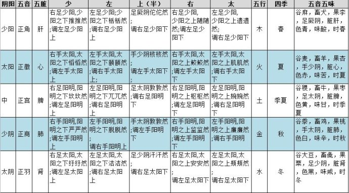
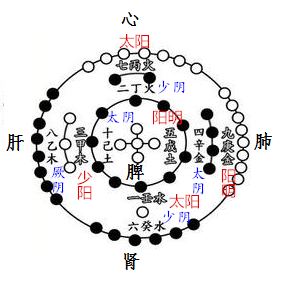
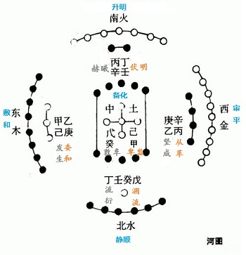
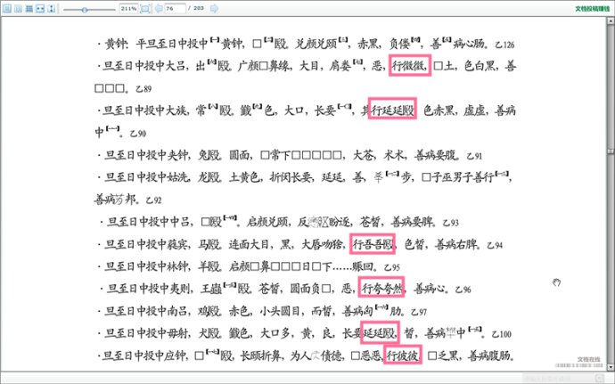

= 二十五音之治以成君子也

http://blog.sina.com.cn/s/blog_727392820102wm17.html[原文地址]

为什么周礼要在冬至日祀庙调五音？因为通过调五音使得自己成为阴阳平和之人，经云“**
阴阳和平之人，其状委委然，随随然，顒顒然，愉愉然，䁢䁢然，豆豆然，众皆曰君子**”。
于是这就形成了一种礼仪，孔子读史书只看道表面的礼仪规范却不明白其背后的道理，所以
去问老子，但是老子没讲，于是孔子带着他自以为的只要“复周礼”就能“成君子，治国安
天下”的空想周游列国，其四处碰壁是必然的。由此造成后世儒家重礼仪但却虚有其表，往
往造出很多翩翩”伪君子”的现象。礼仪背后的道理就载在医家的经典之中。五音调法属于
《黄帝外经》内容中的《五常政大论》，它是治五脏病的根本道理，中医一切治法都源于此，
二十五音治法也是理出于此。

二十五音其是《黄帝内经》中《灵枢。阴阳二十五人》和《灵枢。五音五味》中使用的乐音。
二十五音名称如下：“右徵，少徵， 质徵，上徵，判徵。左角，钛角，上角，大角，判角。
右商，少商，钛商，上商，左商。少宫，上宫，大宫，加宫，左角宫。众羽，桎羽，上羽，
大羽，少羽”。这 二十五个乐音两千年来没有人能参透，因而成为中医界的千古之谜。
《黄帝内经•素问•脉要精微篇》中就已经提到了阴阳五行和五音的关系：“是故声合五音，
色合五行，脉合阴阳。”管子也说：“五声即调，然后作立五行，以正天时，五官以正人位，
人与天调，然后天地之美生”。

五音为什么能治病？看过我置顶文章的就会知道，五音乃五运六气所生，乃五行也，三界内
的法则也，其本质是频率。有研究表明奏二十五音可以诱发出与《灵枢。阴阳二十五人》相
同的经络感传结果，因此根据五音经络传感可以有针刺类似的通气效果。

研究二十五音必须要有正确的术数模型才能拨开迷雾，从而理解岐伯在论述什么。内经凡是
谈论“五”的概念都要用河图五行去理解。所以我们仍旧从河图开始探讨。下表是基于当今
学术研究成果整理的二十五音表

怎么应用？看《五常政大论》中的论述：（请先看前篇《<<20170116-如何正确理解五常政
大论①-五行和五运的关系就是常政.adoc#,如何正确理解五常政大论？>>》否则无法理解下
文）

“敷和之纪”乃甲乙木，“木德周行”。五脏平气也会自病，“其病里急支满”。当闻音出
现“足厥阴佗佗然”则自病矣。其音乃正角。治法“ 调右足少阳下”，足厥阴乙肝病，调
足少阳甲胆，此“病在中，傍取之”也。因此《灵枢》与《五常》都谓“上角与正角同，上
商与正商同，上宫与正宫同，上徵与正徵同，上羽与正羽同”是说肝，心，脾，肺，肾自病，
即足厥阴，手少阴，足太阴，手太阴，足少阴，用“上角，上商，上宫，上徵。上羽”之治
法。

委和之纪是乙庚，金克木，木不及。经云“少角与判商同” 此“判”当为“少”之误。即
当闻音出现“右足少阳之下推推然”“ 右手阳明严严然” 足少阳乃甲木，手阳明乃庚金，
此金克木也，“其病肢废痈肿疮疡，邪伤肝也”，“调左足少阳上”与“调左手阳明下”治
之，此乃“病在下，取之上”。

伏明之纪是丁壬，水克火。经云“少征与少羽同” 即当闻音出现“右手太阳之下慆慆然”“
右足太阳纡纡然”手太阳丙火，足太阳壬水，此水克火也，“其病昏惑悲忘，邪伤心也”，
故而“调左手太阳上”“ 调左足太阳上” 此乃“病在下，取之上”。

其余经文论述大家自己去体会，有了术数模型也可以知道经文中那些地方有传抄错误。可以
看出调和五脏原则是：以阳腑调阴脏，以左调右，以上调下。

出土文物放马滩秦简中保留有珍贵的二十五音诊病记录

五音频率疗法是最上乘治病法，无需喝药，无需针刺，只有科学研究能够明白频率的运用后
才能发挥这种疗法的最大作用。用五味治病，则要根据五音来正五味，金木合并，水火既济
也是“以左调右，以上调下”，需要以草药之性行经脉，以草药之味正五脏，比较复杂。参
见博文《中医经方五味理论之一失传的桐君采药录》。用针刺治病，需要明白经脉流注规律，
依照律历甲己寻甲，乙庚寻乙来定开穴时间，参见博文《针灸探秘1-子午流注纳甲定时开穴
原理》这一切的一切都基于五常之政。
