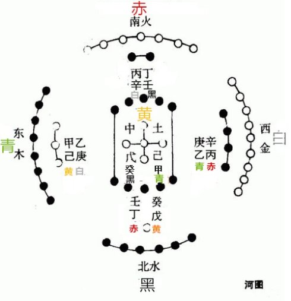

= 灵枢阴阳二十五人年忌法验证仲景断落眉医案

http://blog.sina.com.cn/s/blog_727392820102wm3n.html[原文地址]

**理解此篇必须先读**<<20170117-如何正确理解五常政大论②-二十五音之治以成君子
也.adoc#,如何正确理解五常政大论②-二十五音之治>>及<<20170116-如何正确理解五常政
大论①-五行和五运的关系就是常政.adoc#,如何正确理解五常政大论①>>

著名的仲景断王粲眉落一案。晋代医家皇甫谧在其《针灸甲乙经》序中记述了张仲景诊王仲
宣一事。其文曰:仲景见侍中王仲宣,时年二十余,谓曰:“君有病,四十当眉落,眉落半年而
死。”令服五石汤可免。仲宣嫌其言忤,受汤勿服。居三日,见仲宣,谓曰:“服汤否?”仲宣
曰:“已服。”仲景曰:“色候固非服汤之诊,君何轻命也!”仲宣犹不信。后二十年果眉落,
后一百八十七日而死。终如其言。历代医家都为之慨叹仲圣之才“虽扁鹊仓公无以加也”。
仲景所用之法并不神秘，就是《灵枢阴阳二十五人》之五色预病法。

**《灵枢》云“五形之人二十五变者，众之所以相欺者是也。黄帝曰：得其形，不得其色，
何如？岐伯曰：形胜色，色胜形者”**

此以五行人分五色：木青，火赤，土黄，金白，水黑，各以五行相生克论。对于五行人来讲
要注意这种所谓“形胜色，色胜形”的情况，因为容易生病

[cols="3", options="header"]
|===
| 五行 | 色胜形 | 形胜色
| 木 | 白 | 黄
| 火 | 黑 | 白
| 土 | 青 | 黑
| 金 | 赤 | 青
| 水 | 黄 | 赤
|===

其实这样的推论还是源于五常政大论之理，大家看下图就明白为什么这样定义“**形胜色，
色胜形**”为病了。

之所以木形人见黄色乃病，因为木太过也，木克土，《五常政大论》云“发生之纪，是谓启
敕，土疏泄，苍气达” “脾土受邪，民病飧泄食减，体重烦冤，肠鸣腹支满” “甚而摇落，
反胁痛而吐甚”“邪伤肝也”。

之所以木形人见白色乃病，因为木不及也，金克木，《五常政大论》云“委和之纪，是谓胜
生，生气不政，化气乃扬，长气自平” “其病肢废痈肿疮疡，邪伤肝也”。 所以岐伯曰
“**形色相得者，富贵大乐**”非相得则病也。

根据五常政术数模型我们可以明白其不过五行之理也。经云“**至其胜时年加，感则病行，
失则忧矣。黄帝曰：其形色相胜之时年，加可知乎？岐伯曰：凡年忌,下上之人大忌,常加七
岁、十六岁、二十五岁、三十四岁、四十三岁、五十二岁、六十一岁，皆人之大忌，不可不
自安也，感则病行，失则忧矣。当此之时，无为奸事，是谓年忌**”。

什么是“**其胜时年**”？

就是土旺之年，金旺之年等等。这样共有五个旺年。五行各旺之时见《五行长生》口诀：

[cols="2", options="header"]
|===
| 五行 | 旺
| 木 | 卯
| 火 | 午
| 土 | 未
| 金 | 酉
| 水 | 子
|===

土为“长夏”寄旺在未（坤地）。

为什么“**大忌常加七岁**”？

我们知道禄命中干支距七位之数乃五行相克冲之位，乃名“七煞”也。五行旺之年为大岁，
五行太过有胜即有复也，此道之常也，其第七位乃灾煞之位也。

为何后面各加九岁？

太乙行九宫为一循环也。

我们来看:王仲宣公元177年生人，丁巳之年，王仲宣年纪在20岁左右时的身体状况是“貌寝
体弱”。“寝”字,《辞源》解做“容貌丑恶。“貌寝”与“体弱”联属而言可知其貌不扬，
黑黑瘦瘦，不是风流倜傥之貌，根据五形人描述乃火形人，色黑胜形为火不及。前篇
<<20170116-如何正确理解五常政大论②-二十五音之治以成君子也.adoc#,《如何正确理解
五常政大论②-二十五音之治》>>可知，火行人病在太阳。《阴阳二十五人》云“**手太阳
之上，血气盛则口多须，面多肉以平，血气皆少则面瘦恶色**” 手太阳之上者，循颈，上
颊，而为须。火不及乃伏明之纪也。《五常政大论》云“**伏明之纪，是谓胜长，长气不宣，
藏气反布，收气自政，化令乃衡，寒清数举，暑令乃薄，承化物生，生而不长，成实而稚，
遇化已老，阳气屈伏，蛰虫早藏，其气郁**”可见其种人有“**生而不长，成实而稚**”的
外部特征。仲景是根据二十五人五色，断王死前当眉落。眉毛自落，乃肝虚血少，无以荣养，
或风湿相搏，眉毛渐落，即如树木枯槁，枝叶凋零也。火不及之人如果连生火的肝木都凋零
了，其死不远矣。肝之对应乃秋金也，春肝至秋金乃半年之数，故“眉落后180日死”王仲
宣死于217年2月17日，故眉落在216年秋季，《阴阳二十五人》云“火行之人，……**能春
夏不能秋冬，秋冬感而病生**”也。

我们以阴阳二十五人年忌法推之：水旺在子，仲宣巳年生人，子年其为8岁，加七岁乃15岁，
其后加九岁为年忌关口分别为：24,33,42。王死于41岁，未能闯过42岁关口也。

经云此“**凡年忌,下上之人大忌**,”又云“**人之大忌，不可不自安也，感则病行，失则
忧矣。当此之时，无为奸事，是谓年忌**”，可知年忌是结合二十五音之下上征候来看的，
如果人闻音有下上之证，逢关口年附近应当谨慎保养，可是王仲宣不听医圣之言，因此“**
感则病行，失则忧矣**”。按周礼，冬至调五音之本意就是使得君主能够五脏平和，五志不
乱，对于避免年忌更是有益，可以为君子安邦治国也，儒家不明周礼之本意，徒执着于礼仪，
以为君子，其不谬以千里乎。

王粲18～32岁时一直在荆州刘表麾下。当时的荆州是什么情形呢?据《后汉书刘表传》记载:
刘表于汉献帝初平元年(190)被封为荆州牧,经过数年的平乱治理,特别是建安三年(198)平定
了长沙太守张羡父子的叛乱后,使荆州扩大到“南接五岭,北据汉川,地方数千里,带甲十万
余”。表又用心治理,恩威并施,贼盗咸平,造成了“万里肃清,大小咸悦服之”的平定局面。
此时中原战乱不断,所以“关西、兖、豫学士归者,盖有千数。表安慰赈赡,皆得资全。遂起
立学校,博求儒术……爱民养士,从容自保。”在这些投刘表的千余辈学士中,豫籍的张仲景
也在其中当是可能的。因为南阳距荆州不遥,仲景家族在南阳为望族。望族大户遇战乱逃往
安定地区是合乎情理,也是易于做到的。范行准氏据此及《伤寒论》自序中所指出的著书时
间推测,仲景《伤寒杂病论》一书应是在荆州这样既安定又富学术空气的条件下写成的,是很
有见地的。可以合理推测建安初年至十三年间(约196-208年),张仲景曾在荆州居住、行医和
著述,其时仲宣也正在那里，张仲景当时已经是颇有名气的医生了，王粲与仲景能数次见面
可想也是找仲景治病。

五石散在三国魏晋时期十分流行，从五常政可以看出，五石散治心火不及的心病，其方补充
心火，药性竣猛故而有类似伟哥一般的壮阳之效，心主神明，也能让人神清气爽，因此魏晋
服食成风也。据皇甫谧《解散说》云出自仲景“侯氏黑散”与“紫石英方”，其以矿物药为
主，其中有萤石含有砷，性热有毒，服之对症则疗效卓著，否则为害矣。魏晋时代服散成风，
自然有不少服药不当的例子。据记载刘表在荆州与王粲登山. 见一岗不生百草. 粲日：其必
古塚.其人在世,服生萤石.热不出外.故草木焦灭。表使之掘，果有萤石。故而王璨知服五石
散不当之害。当仲景开五石散于王粲时，王粲的内心如果仅仅因为“其言忤”而几次三番推
脱不服药恐怕难以解释，只有是因为害怕误食五石散的后果才不受汤也。

由此医案可知此辩五行人五色法“预未病”之神奇也，故而**岐伯曰：此先师之秘也，伯高
犹不能明之也。要黄帝“得而明之，金匮藏之，不敢扬之”**。我们可以把六十甲子的年忌
都排列出来做成表格就是度人六十首。中医的一切都可以用干支五行来描述。

另外，我们可用泰山黄泉掌证之（参见伤寒钤法正名①-伤寒棺墓定生死法源自五运遁六气）
公元217年2月17日，丁酉年正月廿四日，男命41岁，起于粮尽，正月在三丘，廿四日到粮尽，
命数绝于此日也。天地都有法度，观太乙之行，尽矣。
