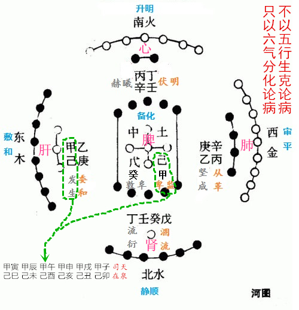
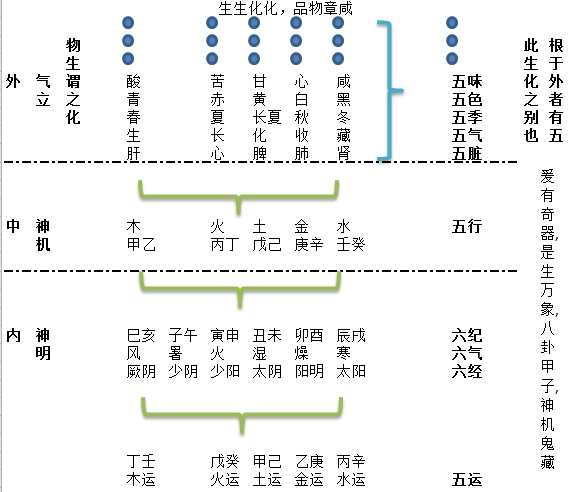
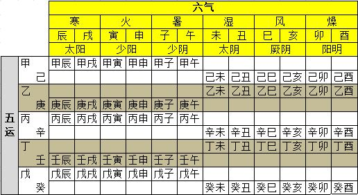

= 不以五行而用六气辩病

http://blog.sina.com.cn/s/blog_727392820102wm6q.html[原文地址]

《至真要大论》云“**治病者，必明六化分治，五味五色所生，五脏所宜，乃可以言盈虚之
作，病生之绪也。**”
 
对于五味五色五脏等等所宜，《五常政大论》前面都都讲了请参考前面博文，但是这些只是
外在的五类“变化”，其根源在于"**气主有所制，岁立有所生**"。又云"**地气制己胜，
天气制胜己。天制色，地制形。各有制，各有胜，各有主，各有成。五类盛衰，各随其气之
所宜也。**"所谓的“气”“岁”是指六气五行，所以要明了疾病怎么产生的还需要明白
“六气”，《五常政大论》讲完五行太过不及后接下来就是讲六气六化。

五行对应六气，其中火多出一位，其原理《外经微言》有论述“岐伯曰：六气之中有暑火之
异也。雷公曰：暑火皆火也，何分乎?岐伯曰；火，不一也。暑外火，火内火也。雷公曰：
等火耳。火与火相合，而相应也。奈何异视之?岐伯曰：内火之动，必得外火之引。外火之
侵，必得内火之召也。似可合以立论，而终不可合。以分门者，内火与外火异也。盖外火，
君火也。内火，相火也。君火即暑，相火即火，暑乃阳火（心火，阳火也。其势急而可
避，），火乃阴火（心包之火，阴火也。其势缓而可亲）。火性不同乌可不区而别乎。六气
分阴阳，分三阴三阳也，三阴三阳中分阳火阴火者，分君相之二火也（君火少阴，相火少
阳）。五行概言火，而不分君相。六气分言火，而各配支干。二火分配，而暑与火各司其权，
各成其病矣。故必宜分言之也”大家可以用“借羊分羊”问题来理解经文的论述。

从前有一个老人，他有3个儿子，养了17只羊。在临终时嘱咐3个儿子说：“我死后，17只羊，
分给老大 ，分给老二 ，分给老三 。”然后就咽气了。三个儿子安葬完老人后，便开始分
羊了。可是分羊时却遇到了困难，因为17这个数，无论以2、3或9去除都不能除尽，怎么办
呢？正在大家冥思苦想的时候，一个老人生前的朋友牵着一只羊来了，看三个儿子愁成那样，
问明原委，想了想，哈哈大笑，胸有成竹地说：“把我的羊借你们，连它一起分吧。”三个
儿子本来觉得不好，可是实在没有办法，只好一试。于是，老大分得9只羊，老二分得6只羊，
老三分得2只羊，老人好友牵着自己的羊哼着小曲就走了。这个多出的“火”就是外来的
“羊”，没有这只“羊”疾病无法分开论述，有了这只“羊”疾病可以分论了。所以《内经》
中论少阴不司气化，少阴心脏不受邪而是由手厥阴心包（相火）受邪，都是源于这个道理。

于是五脏的疾病从五行“木火土金水”的论述变成了用六经来描述归类：厥阴风木，少阴君
火，少阳相火，太阴湿土，阳明燥金和太阳寒水。也就是把五行变化用“三阴三阳”来论述。
古人所谓“阴阳五行”其实是讲三阴三阳和五行，即六经五行,而对此种模型最经典的术数
运用就是六爻纳甲卦，所谓“阴阳五行生八卦”此也,非是空谈。

为什么要以六气论病？因为用五行生克论病会陷入循环中无法分论。《外经微言》"鬼臾区
间曰：五运与六气并讲，人以为异，奈何?岐伯曰：五运非六气，则阴阳难化。六气非五运，
则疾病不成。二者合而不离也，夫寒、暑、湿、燥、风、火，此六气也。金、木、水、火、
土，此五运也。六气分为六、五运分为五，何不可者，讵知六气可分，而五运不可分也。盖
病成于六气，可指为寒、暑、湿、燥、风、火，**__病成于五运，不可指为金、木、水、火、
土__**。以金病必兼水，水病必兼木，木病必兼火，火病必兼土，土病必兼金也。且有金病
而木亦病，木病而土亦病，土病而水亦病，水病而火亦病，火病而金亦病也。故六气可分门
以论症，五运终难拘岁以分门。诚以六气随五运以为转移，五脏因六气为变乱，此分之不可
分也."。六气为本，以少阳，太阳，阳明，少阴，太阴，厥阴为标示。故云“**风行于地，
所谓本也，余气同法。本乎天者，天之气也，本乎地者，地之气也，天地合气，六节分而万
物化生矣**”经文中的金木水火土是指五运即：甲己，乙庚，丙辛，丁壬，戊癸。

所有的疾病都是由于五运所引起的，但是分析病因却不能直接说肝（甲乙木）受邪的原因是
土（甲己运）引起还是金（乙庚运）引起的，因此五运还需细分出六气才能辩病。例如发生
之纪乃甲己，岁木太过（详见博文<<20170116-如何正确理解五常政大论①-五行和五运的关
系就是常政.adoc#,《如何正确理解五常政大论①》>>），甲木克己土脾受邪，而如木受金
克为胜复则肝受邪，此“木病而土亦病”也，木能生火，木病则火衰亦病，如此这样就没办
法清晰的论病因，所以必须要用“六气”-寒、暑、湿、燥、风、火这种分类方式去辨别病
因，不管你是肝病还是脾病都用六气分析。例如发生之纪为甲己分六气而卑监之纪是己甲也
分六气，它们都归纳成六甲和六己如下图所示。

甲和己乃合成土运（不分阴阳），土运之中又分六气之治,六气之中再分司天和在泉(分出阴
阳），甲为岁木太过，己为岁土不及（五行有太过不及之别），由此共为三元之纪。同样是
甲年发生之纪，民病“吐利“，但是可能是不同的六邪影响造成的，你得从六气取分辨病因，
所以中医才有西医无法理解的”同病异治“”异病同治“之法。如果是甲寅岁，岁木太过，
土运太宫。寅申少阳之纪司天，则巳亥厥阴在泉，即上乃甲寅司天，下乃己巳在泉。甲寅距
己巳乃十五日，司天之少阳火气自大寒日起秉令，十五日立春后交地（司天之火气入地也），
因此《五常政大论》云“**少阳司天，__火气下临__**”，“少阳在泉，寒毒不生（因为火
气下临）”。火味乃苦，入地则苦化，立春后苦物乃生。立春寅位乃六气生五行之处也（参
见博文干支历法的奥秘3-历元之谜）。火太过则金从火化，因此经文云“其味辛（金化），
其治苦酸（少阳火苦与厥阴木酸共治一岁），其谷苍丹”又云“**肺气上从，白起，金用革，
木乃眚，火见燔焫，大暑以行，咳嚏鼽衄鼻窒，口疡寒热胕肿。风行于地（厥阴风木在泉），
尘沙飞扬，心痛胃脘痛，厥逆膈不通，其主暴速**”，需要明白这里的“**大暑以行**”也
好“**风行于地，尘沙飞扬**”也好都取象类比的思维，**不是甲寅年的气象预报**，是形
象比喻疾病症状，那些用运气学说来预测气象的是张冠李戴不明所以。后世温病学派讲究从
“卫气营血”来辩病则是失了古圣之真传而妄作也。

必须清晰的认识到要把握万物生化只有**__通过六经来分析五行__**才能完整，这就是为何
六爻纳甲卦能断万事。岐伯曰“**胎孕不育，治之不全，此（六）气之常也，所谓中根也
**“ “**根于中者，命曰神机，神去则机息**“，就是说神机变化源于五行生克。”**根
于外者，命曰气立，气止则化绝**””**根于外者有五。故生化之别，有五气、五味、五色、
五类、五宜也**”。内在神机而外在则显示成“五行”的种种分别变化，这些生化之不同变
化都可以分为五类来归纳分析。因此岐伯云”**__不知年之所加（天干五行），气之同异
（地支六气），不足以言生化__**"。又云“**不知年之所加，不可以为（上）工**”。现
代中医人人羡慕“绝气危生”的下工-西医，实乃不知何谓“上工”也-**不知道如何用六经
来分析五行也**。

把五运以天干表达，六气以地支表达，那么五运分出六气最终必然形成六十甲子，也就意味
着所有的病甚至所有的宇宙变化都可以用六十甲子来描述和推算，可是历来除了扁鹊仲景又
有几人知晓？如果真能明白六气分治之理就一定会明白《伤寒论》六经结构，如果明白五常
政理就一定会明白子午流注针法原理（参见博文针灸探秘1-子午流注纳甲定时开穴原理）,
也一定会明白草药五味五行配法（参见博文中医经方五味理论之二-汤液经法正五味补泻化
即五运六气之用）,而不是抄着王冰的论著因因相承的念诵，或者黏贴复制发成博文毫无洞
见也无法联系中医的实践，这样只能骗骗新学之人以为天人之论，殊为可笑。

故而中医是能够也是必须用干支五行来描述的一门学问，不是无法讲清无法推演的一种玄谈。
西医因为根本还未认识到五运六气，尽管希腊医学有四大元素概念，但是没有形成干支体系，
所以只能用“肝病，脾病，皮肤病”等等来分析病因而看不到真相，所以学中医的人要有理
论自信！中医是有术数推算公式的！

黄帝内经是道家真传，所以很多内容都和道家学术有关，由于其文字古奥不容易理解，大家
可以参考道家其它经文来理解。例如《地母经》就用通俗歌谣形式描述了六十甲子的运气征
候并非后人以为的气候预测，对照运气大论可以加深理解经文。例如甲寅年，岁木太过，少
阳司天，厥阴在泉。《地母经》云：

[verse]
____
甲寅年

　　──诗曰：

太岁甲寅年，早晚不全收。　
春夏遭淹没，调食任秋冬。
虎豹巡村野，人民不自由。
鲁卫多炎热，秦吴麦豆稠。
桑柘前後贵，得半勿早抽。

　　卜曰：

先岁民不泰，耕种枉用工。
桑枯叶难得，又是少天虫。
五谷兵初高，後来亦中庸。
____

《五常政大论》云：

（甲木）发生之纪，是谓启敕，土疏泄，苍气达，阳和布化，阴气乃随，生气淳化，万物以
荣，其化生，其象春，其气美，其政散，其令条舒，其德鸣靡启坼，其变振拉摧拔，其脏肝
脾，其经足厥阴少阳，其动掉眩巅疾，其病怒，其虫毛介，其畜鸡犬，其谷麻稻，其果李桃，
其物中坚外坚，其色青黄白，其味酸甘辛。上征则其气逆，其病吐利。不务其德，则收气复，
称气劲切，甚则肃杀，清气大至，草木凋零，邪伤肝也 。

（寅申）少阳司天，火气下临，肺气上从，白起，金用革，木乃眚，火见燔焫，大暑以行，
咳嚏鼽衄鼻窒，口疡寒热胕肿。风行于地，尘沙飞扬，心痛胃脘痛，厥逆膈不通，其主暴速。

少阳在泉，寒毒不生，其味辛，其治苦酸，其谷苍丹。

少阳司天，羽虫静，毛虫育，倮虫不成，在泉，羽虫育，介虫不育。

帝曰：岁有胎孕不育，治之不全，何气使然？岐伯曰：六气五类，有相胜制也。同者盛之，
异者衰之，此天地之道，生化之常也。（毛虫之类，麟为之长，羽虫之类，凤为之长，倮虫
之类，人为之长，介虫之类，龟为之长，鳞虫之类，龙为之长。毛虫属木，羽虫属火，倮虫
属土，介虫属金，鳞虫属水）
