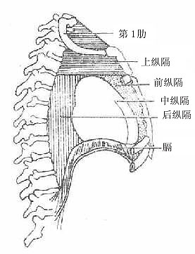
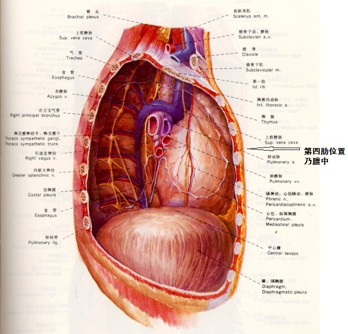
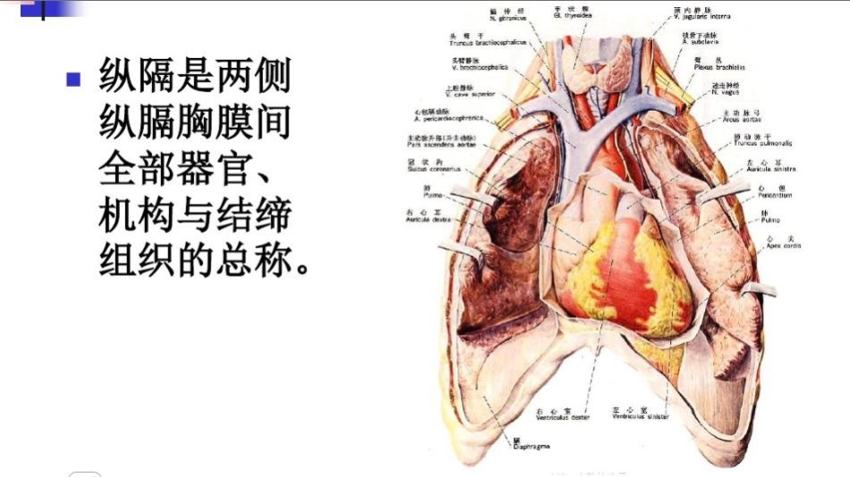
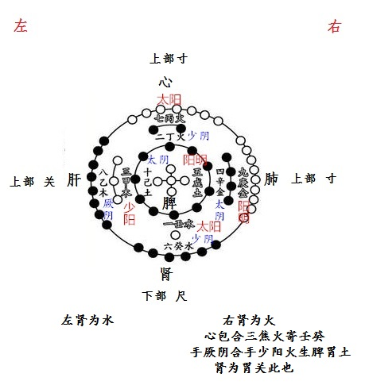

= 心包络与膻中

http://blog.sina.com.cn/s/blog_727392820102wql2.html[原文地址]

理解了前篇的心主即肾中命门与心相交的概念，那么接下来就可以理解心包络和膻中了。心
主与心包络有关系但又不是一个东西，心主是虚脏而《灵枢·邪客》 “包络者， 心主之脉
也 ”，就是说心主有其对应的脏脉，其位居何处？ 《难经》云“**__气会三焦外一筋直两
乳内也__**”，因此__心包络是有物质实体的，并非有人理解的胸腔__，胸腔作为一个腔体
是无法实现生理功能的。此一筋脉的位置-两乳之中，又名膻中，故而《外经》“雷公曰：
请言心主之经。岐伯曰：心主之经即包络之府也，又名膻中。”，于是心主，心包络，膻中
这三个概念的关系如下：

* 心主，肾脏中命门火，与心相交
* 心包络，心主之脉，三焦外一筋直两乳内也（扁鹊即云“三焦”外，则三焦腑为有形明矣，
三焦所合脏-命门为无形之脏）
* 膻中，两乳内的位置

心包络位于现代解剖的胸前纵膈内，古人称为“心膜膈”如下图所示：

《内经》“手少阳三焦之脉，起于小指次指之端，上出次指之间，循手表腕，出臂外两骨之
间，上贯肘，循外上肩，交出足少阳之后，**入缺盆交膻中，散络心包，下膈循属三焦
**(三焦之脉起于小指，但是三焦位于隔下，脏腑与其经脉是不同的位置，不要混淆，参见
博文<<20170504-三焦到底是什么？为何三焦亦向壬中寄.adoc#,《三焦到底是什么？为何三
焦亦向壬中寄》>>）。其支者从膻中上出缺盆，上项系耳后，直上出耳上角，以屈下颊至
。其支者，从耳后入耳中至目内眦（接足太阳膀胱经）”。

《外经》“心包络之脉出于胸中，包络在**心之外**，正在**胸之中（故知包络不是心脏外
油脂）**，是脉出于胸中者，正其脉属于包络之本宫也（包络本宫即膻中）。**__各脏腑脉
出于外，心与包络脉出于中__**(__五脏六腑各有一脉，独肾有两脉，合十二脉，包络脉出
于心主虚脏，位在膻中__），是二经较各脏腑最尊也。**夫肾系交于心包络（通过肾与之合
的三焦经交于膻中连心包络），实与肾相接，盖心主之气与肾宫命门之气同气相合**，故相
亲而不相离也”

《素问·灵兰秘典论》叙述十二官有膻中而无心包络,《灵枢·经脉篇》论述六脏六腑的十二
经脉有心包络而没有膻中。在《内经》这部书里,认为人身内部有十二藏府,同时也存在着十
二经脉,每一个藏或府,都有一条经脉作为它的气血通路与藏或府之间的联络网。除了这十二
经以外的经脉便称为奇经。从论述十二官与十二经的两篇内容来看,其它十一个藏府与经脉
名称均相同,惟膻中与心包络两者相异，而且二者部位都居隔上，因此便有膻中与心包络名
异实同、名异实异的千年争论。现在我们如果理解三者概念那么就能理解《内经》为什么这
么论述了。肾独有二脏，右肾内命门藏气，与心相连而成“心主”，此乃虚脏，此脏之经脉
即“心包络”也，两者通过与肾相合的三焦经相连于膻中，而“膻中者， 心主之 宫城
也”“包络之本宫”也，**膻中在心包膜的两乳中间位置**，故而**__膻中可指为心包
络__**。

心为君，心主为臣相，统管十二官，故曰：为十二官之主。**三焦乃肾中命门之别使**，膻
中为“臣使（心包络）之官” 十二官之一，可知命门有两个使官：三焦和心包络。膻中乃
三焦心包连接之处，形象的比喻就是“命门”借“三焦”之道出使政务，办公点在“膻中”
而成“心主”，“膻中”与君王心脏通过一根“筋”-心包络相连系，实现心肾相交水火既
济，因此手厥阴与手少阳都是相火，心是君火。所谓“君火以明”指心藏神明不执政，“相
火以位”心主代心执政，喜乐由“膻中”表现出来。不明何为“心主”，何为“心”妄谈君
相二火也。所谓“心包代心受邪”实乃肾中元气与外邪做斗争也，人能抵御外邪所伤全凭肾
中原气！

《素问·灵兰秘典》“膻中者， 臣使之官， 喜乐出焉”, 《灵枢· 本神》中有 “喜乐者，
神惮散而不藏。愁忧者，气闭塞而不行。盛怒者，迷惑而不治。恐惧者，神荡惮而不收”。
这个功能是需要心肾相交才能实现的。王冰认为:“ 膻中生气,，以气布阴阳（少阳三焦与
厥阴心包为阴阳，水火为阴阳）,气和志达,则喜乐由生,分布阴阳,故官为臣使也。”《灵枢·海
论》 中， 明确指出“膻中者，为气之海” ，并认为“气海有余者，气满胸中，悗息面赤;
气海不足， 则气少不足以言”。

《灵枢·五昧篇》说:“谷始入于胃,其精微者,先出于胃之两焦,以溉五脏,别出两行营卫之道,其
大气之传而不行者,积于胸中,命曰气海,出于肺,循喉咙,故呼则出,吸则入。”现代急救心肺
复苏的挤压点就是膻中，大量肾上激素也能够使得心肺复苏，中医处处联系人体实际，何来
虚幻阴阳之论？

[cols="6*",options="header"]
|===
2+| 十二脏腑 2+| 所属经脉 | 十二脏腑之使官 | 脏腑合

| 心主，原气，丞相
| 右肾命门 无形之脏 藏水也藏火； 命门与心相交者为“心主”
| 
| 右肾合三焦; 心主合心包；有名而无形。所谓无形乃指心主无脏形，命门也无脏形。内经无脏而有腑从无形而言之，有脏有腑则从有形而言之也
| 非使官也，乃主也。主明则下安，以此养生则寿，殁世不殆，以为天下则大昌。主不明则十二官危，使道（三焦心包）闭塞而不通，形乃大伤，以此养生则殃，以为天下者，其宗大危，戒之戒之
.3+| 壬癸相合 心主为虚脏，心包络为其腑，为火 右肾命门为虚脏，三焦为其腑，为水

| 心包络（癸） | 腑 | 手 | 心主厥阴心包络之经 | 膻中者，包络之本宫，臣使之官，喜乐出焉
| 三焦，原气之别使（壬） | 腑 | 手 | 少阳三焦之经 | 决渎之官，水道出焉
| 肝（乙） | 脏 | 足 | 厥阴肝之经 | 将军之官，谋虑出焉 .2+| 甲乙相合
| 胆（甲） | 腑 | 足 | 太阳胆之经 | 中正之官，决断出焉
| 心，君（丁） | 脏 | 手 | 少阴心之经 | 君主之官也，神明出焉 .2+| 丙丁相合
| 小肠（丙） | 腑 | 手 | 太阳小肠之经 | 受盛之官，化物出焉
| 肺（辛） | 脏 | 手 | 太阴肺之经 | 相傅之官，治节出焉 .2+| 庚辛相合
| 大肠（庚） | 腑 | 手 | 阳明大肠之经 | 传道之官，变化出焉
| 肾（癸） | 脏，左肾 | 足 | 少阴肾之经 | 作强之官，伎巧出焉 .2+| 壬癸相合
| 膀胱（壬） | 腑 | 足 | 太阳膀胱之经 | 州都之官，津液藏焉，气化则能出矣
| 脾（己） | 脏 | 足 | 太阴脾之经 | 仓廪之官，五味出焉 .2+| 戊己相合
| 胃（戊） | 腑 | 足 | 阳明胃之经 | 仓廪之官，五味出焉
2+| 肾有二脏，故脏有六，阴六数也； 腑有七，故阳数七也
|===

上表合于河图如下：

结合上述，大家就可以理解古圣下面的论述

包络配腑篇

天老问于岐伯曰：天有六气，化生地之五行（五行乃六气所生，参见博文<<20170216-不理
解五运，六气，五行的区别联系就无法理解《运气七篇》.adoc#,《不理解五运，六气，五
行的区别联系就无法理解《运气七篇》》>>），地有五行（金木水火土），化生人之五脏
（五脏六腑）。有五脏之阴（乙丁己辛癸，心肝脾肺肾），即宜有五腑之阳矣（甲丙戊庚壬，
胆小肠胃大肠膀胱）何以脏止五，腑有七也（加三焦心包络）?岐伯曰：**心包络，腑也，
性属阴，故与脏气相同（性属厥阴，与右肾命门心主同是火气，即是腑也是脏，十分特殊。
言脏为心主，言腑乃心包络，言气乃命门火）**，所以分配六腑也（**心包络作为六脏乃合
心主虚脏也，配合六腑共十二脏**）。

天老曰：心包络既分配腑矣，是心包络即脏也，何不名脏而必别之为腑耶?岐伯曰：心包络，
非脏也（**因为心主乃脏，心包络乃腑，一物以两名分之，从脏而论故而曰无形**）。天老
曰：非脏列于脏中，毋乃不可乎?岐伯曰：脏称五不称六，是不以脏予包络也（右肾是脏，
心主是虚脏）。腑称六，不称七，是不以腑名包络也（**心包络，非脏非腑又似腑似脏**）。

天老曰：**心包络，非脏非腑**，何以与三焦相合乎?岐伯曰：包络与三焦为表里，二经皆
（属）有名无形（之命门心主。**__内经中无脏而有腑则从无形而言之，有脏有腑从有形而
言之，后世不明前人术数分类理念俱讼纷纷__**），五脏（经脉）有形与形相合，包络无形
（心包络属肾内心主，其并非肾脏，故曰无形），故与无形相合也。

天老曰：三焦为孤脏，既名为脏，岂合于包络乎?岐伯曰：三焦虽亦称脏，然孤而寡合，仍
**是腑非脏也**，舍包络之气（命门火气），实无可依，天然配合，非勉强附会也（**右肾
合三焦，心主合心包，心主在肾内，故而曰：天然配合**。少师曰：命门居水火中，属水乎?属
火乎?岐伯曰：命门，火也。无形有气，居两肾之间，能生水而亦藏于水也。少师曰：藏于
水以生水，何也?岐伯曰：火非水不藏，无水则火沸矣。；水非火不生，无火则水绝矣。**
水与火盖两相生而两相藏也**）。天老曰：善。

雷公曰：肺合大肠，心合小肠，肝合胆，脾合胃，肾合膀胱，此天合也。三焦与心包络相合，
恐非天合矣。岐伯曰：包络非脏而与三焦合者，包络里三焦表也。雷公曰：三焦腑也，何分
表里乎?岐伯曰：三焦之气，本与肾亲，亲肾不合肾者，以肾有水气也（**左肾主水**），
故不合（左）肾而合于包络（右肾命门）耳。

雷公曰：**包络之火气出于肾，三焦取火于肾**，不胜取火于包络乎。岐伯曰：膀胱与肾为
表里，则肾之火气必亲膀胱而疏三焦矣。包络得肾之火气，自成其腑（为心主之腑），代心
宣化，虽腑犹脏也（右肾内有命门也，似腑似脏，以心包络合之代之）。包络无他腑之附，
得三焦之依而更亲，是以三焦乐为表，包络亦自安于里，孤者不孤，自合者永合也（**右肾
合三焦即包络合三焦也**）。雷公曰：善。

应龙问曰：包络腑也，三焦亦自成腑，何以为包络之使乎?岐伯曰：包络即膻中也（**包络
可以指为膻中，因为丞相之官乃在膻中**），为心膜鬲，近于心宫，遮护君主（膻中居于胸
中纵膈，保护心脏，控制呼吸出入），其位最亲，其权最重(五脏经脉俱系膻中：

. 肺之系实通于心。。。下循臑内，行少阴心主之前者，又谒相之门也。心主即心包络。
. 脾之脉虽至于舌，而终未至于心，故其支又行，借胃之气从胃中中脘之外上鬲，而脉通于
膻中之分，上交于手少阴心经。
. **__心通于心主__**（因此心包络非心脏外油脂明矣），心主即膻中包络也，为心君之相
臣，奉心君以司化，其出入之经，较五脏六腑更近，真有心喜亦喜，心忧亦忧之象，呼吸相
通，故三焦奉令不敢后也。
. 肾其系别出而绕于心，又未敢遽朝于心君，注胸之膻中包络而后，肾经之精上奉，化为心
之液矣
. 肝性急，乃不直走于心，反走（心）膜鬲，布于胁肋之间）

应龙曰：包络代心宣化，宜各脏腑皆奉令矣（包络即心主所合也，联通心脏），何独使三焦
乎？岐伯曰：各腑皆有表里，故不听包络之使，惟三焦无脏为表里，故包络可以使之（三焦
乃原气别使）。

应龙曰：三焦何乐为包络使乎?岐伯曰：包络代心出治，腑与脏同（**包络可代指为心主，
是脏也是腑又非脏非腑**），三焦听使于包络，犹听使于心，故包络为里，三焦为表，岂勉
强附会哉。应龙曰：善。

另外提一下，三焦心包寄壬癸还是寄丙丁的争论起于明张景岳，而张氏根本不懂内经真意，
时常乱改经意，其论述贻害无穷。张氏认为相火是君火所生，因此寄丙丁，大家看了上述文
章当可理解三焦心包源于肾中命门之火，自然寄在壬癸无疑。
