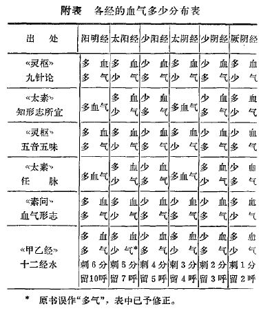

= 十二经气血多少辩

http://blog.sina.com.cn/s/blog_727392820102wzn4.html[原文地址]

人体各经气血多少之说最早见于《内经》,但其中所言有异,至今未能统一。见下表

究属某书某篇记载正确呢,后代注释家对此认识也不统一。

* 张景岳认为以《素问·血气形志篇》为准,然无确凿依据。
* 有的注释家从脏腑功能去论述,但只能阐明个别脏腑的功能与气血多少相吻合,而多数脏腑
则无法解释。如“血气形志篇”说:“厥阴常多血少气”,因肝藏血故多血少气;“阳明常多
血多气”,由于阳明胃收纳水谷,是气血之源,因此,两者可以用脏腑生理功能所阐明但。膀肌
经主卫主水道,何以多血少气;少阴心肾主血主水,何以多气少血;太阴肺脾主气统血,何以多
气少血;而不多气多血呢?
* 也有注释家认为古人从脏腑色泽作为认识气血多少的依据。《灵枢·经水篇》上说:“……
其死可解剖而视之,其脏之坚脆,府之大小,谷之多少……”。从经文看,古人确曾进行过对内
脏形态的观察,但并未记述从脏腑色泽认识气血的多少。若从脏腑色泽作为认识气血多少的
依据,以“血气形志篇”与“五脏生成篇”记述作一对照,即可发现矛盾之处,如肺的色泽是
白的,并主气,为什么不认为是多气少血,反而认为多血少气呢?心的色泽为赤,为什么反而记
述少阴多气少血!所以认为从观察内脏色泽是古人认识各经气血多少的论据尚不够充分。
* 还有从阴阳消长去解释各经气血多少,这更为牵强。
* 至于说是传抄之误,是有可能，但也只属推想之谈，无法证明真伪。

尽管衡量十二经气血多少的依据是什么内经没有明言，但是只要把握古人总是阴阳分类，对
丈而论这个特点，就能使我们整理出正确的气血多少描述。我们来看《太素任脉篇》的行文
结构：

[verse]
夫人之常数，
太阳常多血少气，少阳常多气少血，阳明常多血气，
厥阴常多气少血，少阴常多血少气，太阴常多血气，
此天之常数也

很明显，阴阳相对，气血多少相对，但并非后世推测依据“诸如太阳少阴阴阳表里相合”的
标准。其中有疑问的是太阴，其与阳明一致都是多气血，这也是历来诸家争论最多的地方。
但是我们知道古人行文十分简洁，这个多气血含义可以是多血多气，也可以是多血或多气，
如何分辨？我们看《清浊篇》“黄帝曰：诸阳皆浊，何阳独甚乎？岐伯曰：手太阳独受阳之
浊，诸阴皆清，手太阴独受阴之清，足太阴独受其浊。”结合前篇内容清乃营血浊乃卫气，
这样就明显了，古人言三阴三阳包含手足，因此太阴经气血多少的问题,不能孤立地去看,言
太阴经多血气，应该是多气者当为手太阴肺,此即“手太阴独受阴之清”也，多血者当为足
太阴脾, 此即“足太阴独受其浊”，合而言之乃“太阴常多血气”。

《太阴阳明论》“帝曰：（足太阴）脾病而四肢不用何也？岐伯曰：四肢皆秉气于胃（此气
乃卫气，阳明脉解：四肢者，诸阳之本也，阳（气）盛则四肢实。《终始篇》云“阴者，主
脏。阳者，主腑。阳授气于四肢。阴授气于五脏”）而不得至经，必因于脾乃得禀也（脾藏
营常多血）。今脾病不能为胃行其津液，四肢不得禀水（及）谷气，气日以衰，脉道不利，
筋骨肌肉皆无气以生，故不用焉。”所谓脾行津液，《素问·经脉别论》云“饮（水）入于
胃,游溢精气,上输于脾,脾气散精,上归于肺,通调水道（三焦者，决渎之官，水道出焉）,下
输膀胱(膀胱者，州都之官，津液藏焉，气化则能出矣),水精四布,五经并行”。所谓“消渴
病”者手脚溃烂，乃脾气不散水精也，“四肢不得禀水（及）谷气，脉道不利，筋骨肌肉皆
无气以生，故不用焉”

类似“太阳常多血少气”，是指足太阳膀胱，而手太阳小肠却多气。而其他手足经气血多少
是一致的。

为何岐伯云“四末者，气之大络”，四末为何重要，这牵涉到人体造血的真相，也是营卫注
阴注阳的真相。
