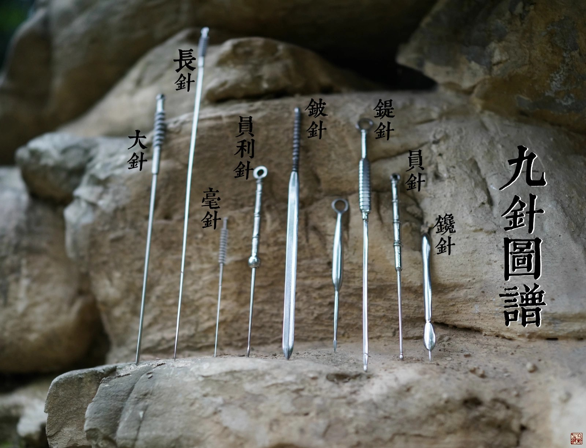
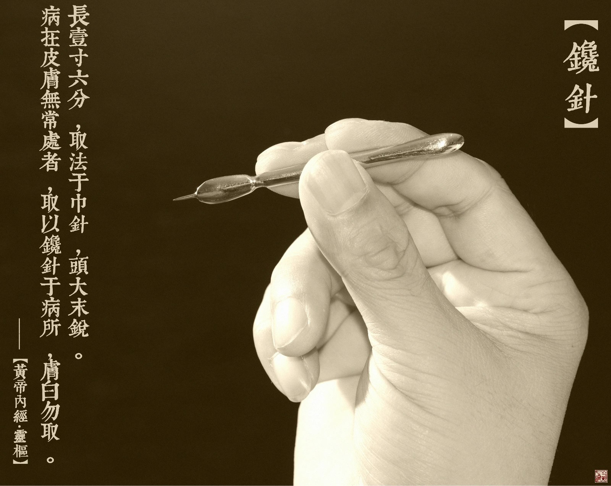
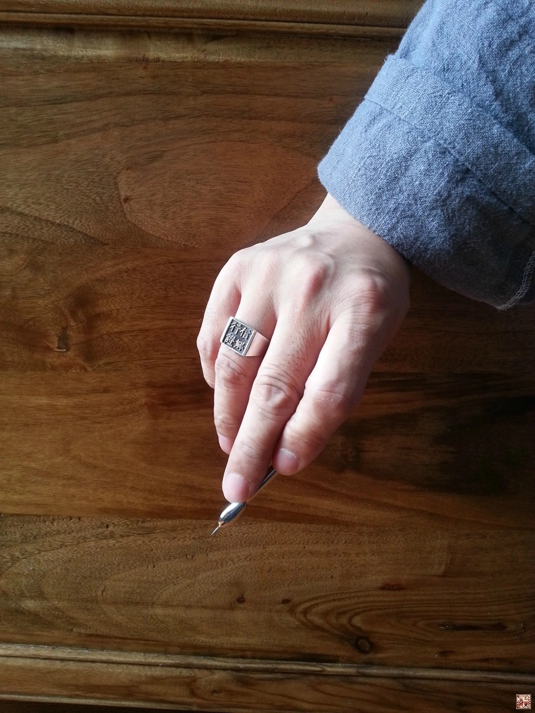
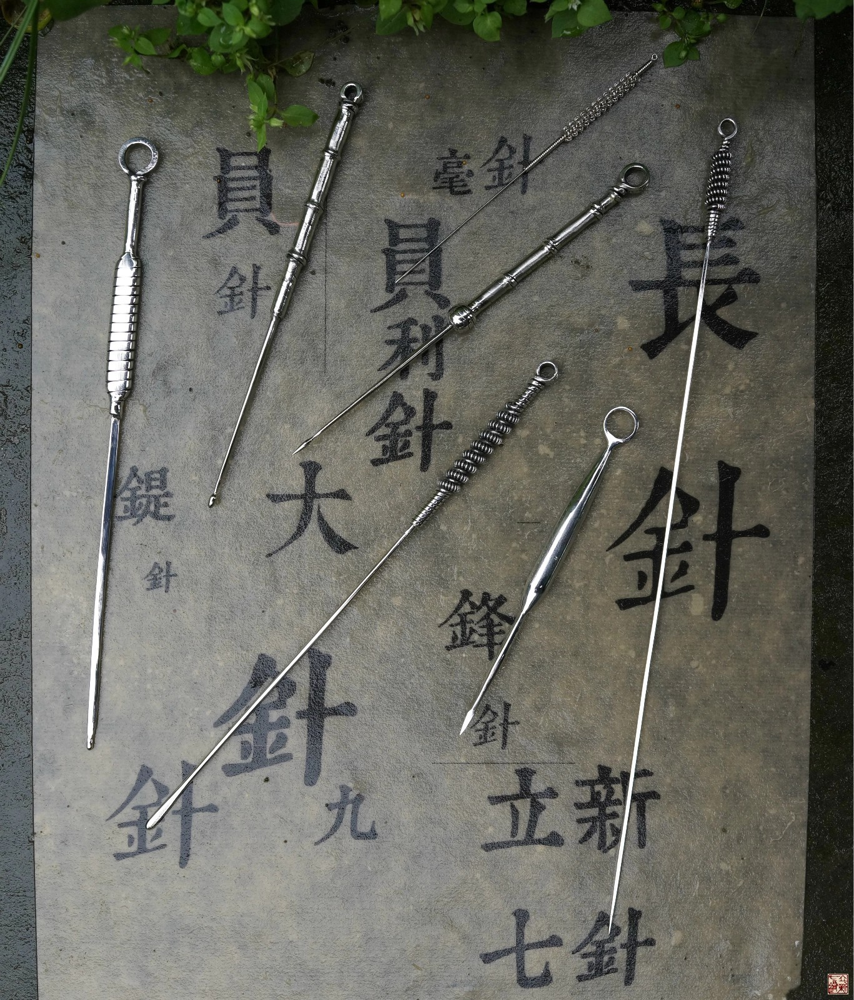
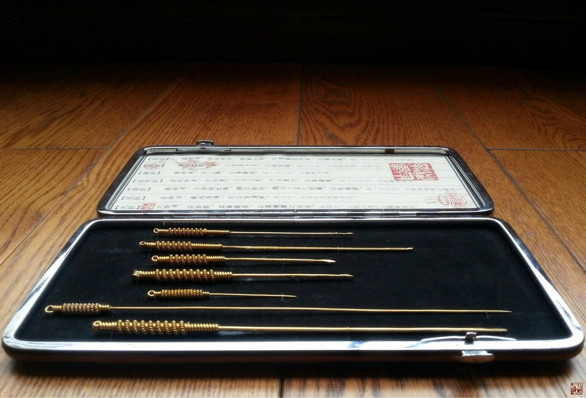

= 什么是九针（二）
冰台
2013-10-30 00:00

九针，包括了镵针、员针、鍉针、锋针、铍针、员利针、毫针、长针、大针这九种针具。其
中，有两支针我首先要重点说一下，一个是铍针，一个是镵针，因为这关系到为什么我后面
推出的是“立新七针”而不是立新八针更不是立新九针。

我们都知道，铍针是主治痈疮大脓的，现代人由于生活质量环境习俗等等都跟古人有很大的
变化，身上长痈疮的人很少了，加上西医在外科方面的治疗也非常不错，所以中医铍针几乎
没有运用的机会，因此铍针被我排除了研究范围。另一个是镵针，镵针主治“病在皮肤无常
处者，取以镵针于病所，肤白勿取”，这句话的意思就是镵针是用于皮肤浅刺的，专门扎皮
肤反应点异常之处，如果正常的皮肤，就不要扎，说穿了，也就是现在所谓的皮肤反应点疗
法，两千年前老祖宗们早已明白告诉我们了，结果现在才有某些人睡醒了，突然发明了“反
应点”。

镵针其实也是我临床上最常用的针具之一，疗效非常不错，常常是在皮肤上寻找到异常反应
点，就那么非常浅的轻轻点刺一下，患者刚才还很痛苦的症状立刻荡然无存，不可思议的事
瞬间发生，神奇吧？请记住，并不是所有病痛都是镵针适应症的，所以不可能每个患者用针
在反应点上浅刺一下就都能见效的。但镵针真的是个宝贝，只不过，我是用一次性注射针头
或采血针来代替镵针了，这样既卫生又方便，所以就没有专门制作一支镵针来用。对于古人
来说，一两千年前的古人，针具是没有专业生产厂家提供，也没有商店可以购买，而且几乎
找不到可以替代九针的产品，所以大多针具都必须自己打造。而我们现在有很多现成的针器
可以代替镵针，特别像我这样宁愿多动脑子也不愿意多动手的懒人，我干嘛还非要去做一支
镵针出来运用？这就是为什么大家平常里只听到我说七针而不是说九针的原因。

我们先来看看《灵枢经》里的一些章节中，关于九针的描写：

《灵枢•九针十二原第一》：“九针之名，各不同形。一曰镵针，长一寸六分；二曰员针，
长一寸六分；三曰鍉针，长三寸半；四曰锋针，长一寸六分；五曰铍针，长四寸，广二分半；
六曰员利针，长一寸六分；七曰毫针，长一寸六分；八曰长针，长七寸；九曰大针，长四寸。
镵针者，头大末锐，去泻阳气；员针者，针如卵形，揩摩分间，不得伤肌肉，以泻分气；鍉
针者，锋如黍粟之锐，主按脉勿陷，以致其气；锋针者，刃三隅以发痼疾；铍针者，末如剑
锋，以取大脓；员利针者，大如氂，且员且锐，中身微大，以取暴气；毫针者，尖如蚊虻喙，
静以徐往，微以久留之而养，以取痛痹；长针者，锋利身薄，可以取远痹；大针者，尖如梃，
其锋微员，以泻机关之水也。九针毕矣。”

《灵枢•官针第七》：“病在皮肤无常处者，取以镵针于病所，肤白勿取。病在分肉间，取
以员针于病所。病在经络痼痹者，取以锋针。病在脉，气少当补之者，取以鍉针于井荥分俞。
病为大脓者，取以铍针。病痹气暴发者，取以员利针。病痹气痛而不去者，取以毫针。病在
中者，取以长针。病水肿不能通关节者，取以大针。病在五脏固居者，取以锋针，泻于井荥
分俞，取以四时。”

《灵枢•九针论第七十八》：“黄帝曰：余闻九针于夫子，众多博大矣，余犹不能寤，敢问
九针焉生？何因而有名？岐伯曰：九针者，天地之大数也，始于一而终于九。故曰：一以法
天，二以法地，三以法人，四以法时，五以法音，六以法律，七以法星，八以法风，九以法
野。黄帝曰：以针应九之数奈何？岐伯曰：夫圣人之起天地之数也，一而九之，故以立九野。
九而九之，九九八十一，以起黄钟数焉，以针应数也。

一者天也，天者阳也。五脏之应天者肺，肺者五脏六腑之盖也，皮者肺之合也，人之阳也。
故为之治针，必以大其头而锐其末，令无得深入而阳气出。

二者地也。人之所以应土者肉也。故为之治针，必筩其身而员其末，令无得伤肉分，伤则气
得竭。

三者人也。人之所以成生者血脉也。故为之治针，必大其身而员其末，令可以按脉勿陷，以
致其气，令邪气独出。

四者时也，时者四时八风之客于经络之中，为痼病者也。故为之治针，必筩其身而锋其末，
令可以泻热出血，而痼病竭。

五者音也，音者冬夏之分，分于子午，阴与阳别，寒与热争，两气相抟，合为痈脓者也。故
为之治针，必令其末如剑锋，可以取大脓。

六者律也，律者调阴阳四时而合十二经脉，虚邪客于经络而为暴痹者也。故为之治针，必令
尖如氂，且员其锐，中身微大，以取暴气。

七者星也，星者人之七窍，邪之所客于经，而为痛痹，舍于经络者也。故为之治针，令尖如
蚊虻喙，静以徐往，微以久留，正气因之，真邪俱往，出针而养者也。

八者风也，风者人之股肱八节也，八正之虚风，八风伤人，内舍于骨解腰脊节腠理之间，为
深痹也。故为之治针，必长其身，锋其末，可以取深邪远痹。

九者野也，野者人之节解皮肤之间也，淫邪流溢于身，如风水之状，而溜不能过于机关大节
者也。故为之治针，令尖如梃，其锋微员，以取大气之不能过于关节者也。

黄帝曰：针之长短有数乎？岐伯曰：一曰鑱针者，取法于巾针，去末寸半，卒锐之，长一寸
六分，主热在头身也。二曰员针，取法于絮针，筩其身而卵其锋，长一寸六分，主治分间气。
三曰鍉针，取法于黍粟之锐，长三寸半，主按脉取气，令邪出。四曰锋针，取法于絮针，筩
其身，锋其末，长一寸六分，主痈热出血。五曰铍针，取法于剑锋，广二分半，长四寸，主
大痈脓，两热争者也。六曰员利针，取法于氂针，微大其末，反小其身，令可深内也，长一
寸六分。主取痈痹者也。七曰毫针，取注于毫毛，长一寸六分，主寒热痛痹在络者也。八曰
长针，取法于綦针，长七寸，主取深邪远痹者也。九曰大针，取法于锋针，其锋微员，长四
寸，主取大气不出关节者也。针形毕矣，此九针大小长短法也。”

通过对以上这几段经文的分析总结，我结合自己治疗颈腰椎骨关节病痛方面多年的临床经验，
合理合情的去运用九针（实际上是八针），结果发现很多时候的疗效，都远远超出我以前的
那些针法和诊治思路创造的疗效。于是激发了我进一步挖掘整理九针的激情，然后我将九针
里其中七种针具，即员针、鍉针、锋针、员利针、毫针、长针、大针，聚合为一个优势针术
组合，配以从生活中感悟出来的“道法自然”气血思路，作为诊治理论指导，因疗效方面常
能收到令患者立刻重获新生之奇效，故冠名为“立新七针”。

虽然名称叫“立新七针”，实际上所有组成成员都还是《黄帝内经》九针里的七种针具，并
没有不一样的名称。虽然这些针具我挖出来了，是我苦思苦想领悟出来的，但我还没无耻到
独自私藏的境界，毕竟是老祖宗留下的东西，所以一定要寻找志同道合的朋友们来共同分享。
我对立新七针的定义是：“依据道法自然的气血理论作为治疗思路，辨证选择不同的针具，
在一定的时间和空间范围内，按顺序针刺经络所过的某些部位，清理或修复经络中失调或瘀
堵的气血，令气血恢复到相对正常的状态，从根本上达到祛除病痛的一种方法或手段。”

我前面说过，实际上我在临床中运用的应该是还包括镵针在内的八种针具，可是我为什么不
取名“立新八针”？其实我不解释你也知道为什么，因为，这个八针，很丑很难听对不对？
也很容易被别有用心的人耻笑为“八婆针”，呵呵，别以为不可能，这几年我见识太多专业
医生无赖无耻的一面了，他穿个马甲很变态的辱骂污蔑你，你根本就拿他没办法。再说了，
从易的角度来讲，数字“八”本身也不适合用于针术的概括上，所以我只能取名七针，也有
点“七剑下天山”的武侠味道，似乎感觉这七支针踏入平静似水的江湖之后，必将掀起惊涛
骇浪。我取名七针，并不代表我的诊治就拘泥于七支针，如果了解我的人就知道，我这个人
在治疗上是法无定法的，思维活跃。

还有什么不好理解的吗？这两年在网上我曾七番八次的提醒过大家，我们学医，应该注重的
是掌握诊治思路，而不要在一些牛角尖上去死做文章。想想吧，我是追求道法自然的人，怎
么可能让数字完全约束我呢？

接下来，我将逐一讲解“立新七针”所囊括的七种针具，她们的形状及其治疗理论，让大家
更加的明白《灵枢经》里的九针到底是什么。
