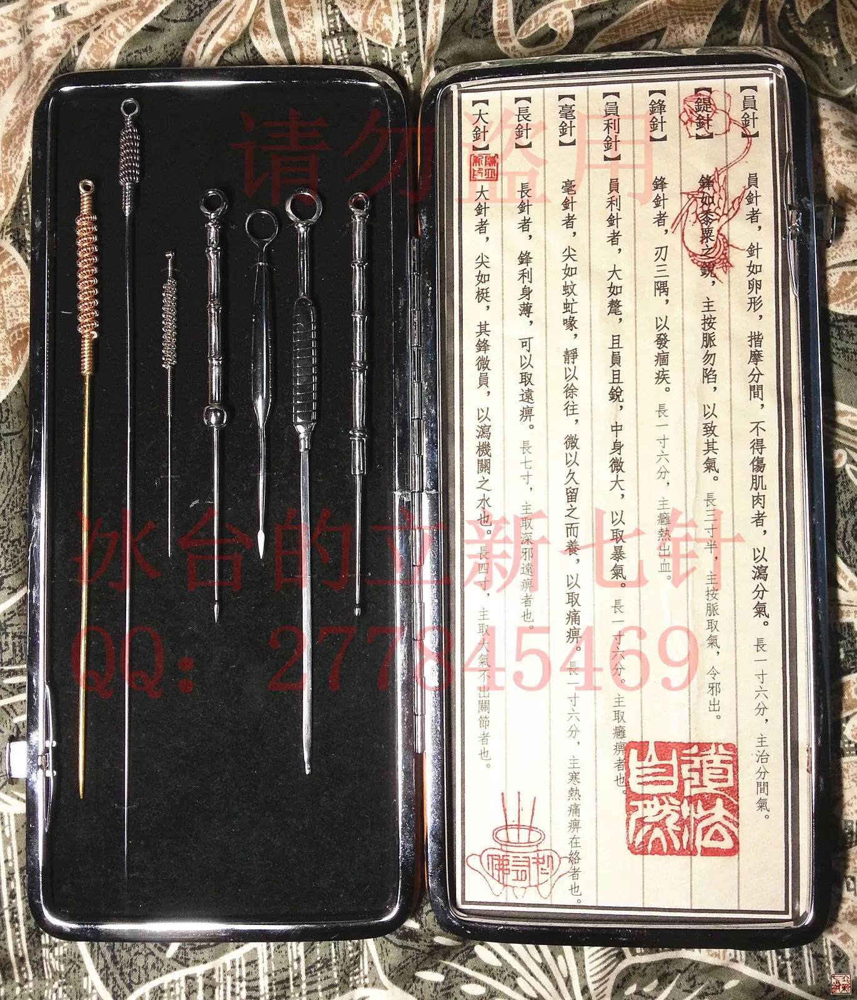

= 什么是九针（三）
冰台
2013-10-31 00:00

*（注解一下，这套针具是我亲自手工制作出来的，做这样一套针具，非常耗费时间和精力，
 贴图是给大家参考，我并不是做这个生意的，所以我没有针具卖，也没有时间做针具卖，
 更没有针具可以赠送，请朋友们理解。）*

*一：员针*

《灵枢•官针第七》：“病在分肉间，取以员针于病所。”

《灵枢•九针论第七十八》：“二曰员针，取法于絮针，筩其身而卵其锋，长一寸六分，主
治分间气。”

《灵枢•九针十二原第一》：“员针者，针如卵形，揩摩分间，不得伤肌肉，以泻分气。”

古人写书，或许是为了显示自己的水平，或许是故意为之，其中真真假假虚虚实实不定。古
人们往往喜欢把一些简单明了的事复杂化，同一件事情非要用很多种不同表达方式来反复阐
述，令人产生翩翩联想，一些没有立场的后人钻进这个陷阱之后就再也没走出来过。古人又
喜欢把一些深奥复杂的事物简单化，很多不同表现方式的事物被他们归纳成一两句话，让一
些立场坚定的后人打死也不相信大道竟然至简。结果我们就看到两种现象，一种是把本来就
长篇大论的内经解读得更加冗繁复杂，穷经皓首之后依然是一无所得。一种是直接的否定老
祖宗的智慧，转身认了别人的祖宗为自己的祖宗。其实如果我们稍微懂得变化思考一下，就
会发现原来老祖宗早已把一切都表达得清清楚楚了，关键的关键，就是你不能完全相信老祖
宗的话，也不能完全不信老祖宗的话，说穿了，我们要践行内经，必须遵循那四个字“信解
行证”。

俺有点啰嗦，旁边欲望强烈的人早已等不及了，唉，现代人咋这么焦躁啊，眼看爱已慢慢开
始转变为恨，也罢，黎叔很生气后果很严重，我还是直接讲针吧。

要研究《黄帝内经》，就不能忽视《灵枢经》，要研究《灵枢经》，就必须首先把九针搞明
白。我常常纳闷，说某大虾研究《灵枢》一辈子了，结果我就没看到他介绍过九针是啥样子，
具体涉及九针的地方他总是一带而过，我只能怀疑他根本就没明白，你说他研究这一辈子不
是瞎折腾是啥嘛？就好比我向你议论某人如何如何等等，结果我和你一样，咱俩谁都不认识
也木有见过这人，那我们聊他半天有多大意义哩？同样道理，要研究九针，首先必须弄明白
九针的具体形状和长短大小粗细等等。我们看《灵枢•九针论第七十八》里关于员针的描写：
“二曰员针，取法于絮针。”这个絮针，也就是缝棉被的针，过去农村都要缝棉被，针比较
粗，长度一般在6、7厘米左右，粗的针身直径大约有1.5毫米左右，这是手工针的尺寸。我
们现在用的棉絮针是机器制造的，有一个标准尺寸，我特意的买了国营企业生产的东风牌棉
絮针来看，针身直径1.04毫米左右，针孔处直径1.34毫米左右。相对于今古两个时代，我们
更应该参考手工制作絮针的尺寸，这样我们就能够大概知道员针的针身粗细了。

接下来是针尖，员针的针尖，形状是锋如卵形。卵，就是鸟蛋，见过鸟蛋的人都知道，椭圆
的形状。筩，在古汉语里是“竹管”的意思。筩其身，怎么理解？如果是用竹管一样的针身，
那就是空心的，可前面又是卵其锋，这员针怎么用竹管前头顶个鸟蛋来形容呢？如是空心的
话，这么细的针做成空心的，我们且不考虑两千年前的工艺制造水平能不能完成这项任务，
我只考虑古人这样做有何意义？难道两千年前的古人真的在玩注射？咱老祖宗不能这么变态
吧？

所以我一直很纳闷，看遍了国内外大师名医们的各种解释，都没有找到能够让我认同的解释，
有人认为员针筩其身就说明员针是空心的，有人甚至认为“筩其身”是翻印出错，前阵子在
新华书店看到有一本五六公分厚的注解《黄帝内经》，作者还认为“卵其锋”与理不符，哪
有针做成圆形的道理呢，他认为疑是谬误。我觉得不该如此，古书里遇到看不明白的地方，
我们应该从不同角度换位思考，不能动不动就怀疑古人印刷刻板出错，否则那才是真的与理
不符，一两千年前哪来那么多盗版啊？而且九针里面，筩其身的只有员针和锋针，我们来看
看《灵枢•九针论第七十八》，在讲到员针的时候，说“故为之治针，必筩其身而员其末，
令无得伤肉分，伤则气得竭。”讲到锋针的时候，说“故为之治针，必筩其身而锋其末，令
可以泻热出血，而痼病竭。”这锋针是刃三隅，也就是由三个刃口边组成的三棱形针尖，那
么针身为什么也要“筩其身”呢？总不能说锋针也是用来注射的吧？那就真的真的是变态了，
哈哈。

好多年以前，我曾经看到过一枚大约是清代或民国时期的三棱针，前面大中间小后有柄，是
象鹅颈形一样的。现在根据“筩”是竹管的意思，由此我想到，小时候在农村，玩过竹管做
的水枪，水枪竹筒一头是竹节隔，在上面钻个小孔，水枪内的竹棍比较小，后面有一个手柄，
在竹棍前头绑一团布，运用活塞原理，前后抽送就可以吸水和射水。我才恍然大悟，原来古
人所说的“筩其身”就是竹管套在外面的意思。那么继续推理一下，我们就明白了，锋针与
员针这两种针，都是跟皮肉分间部位打交道，调理经水的，难怪长度都是一寸六分呢。

员针前面的针头如卵形，卵的形状，是椭圆的，所以我由此分析得出结论，员针的形状，就
是前面椭圆后面细小，如水枪活塞一样的形状了。

那么功用方面呢？有人认为员针是体表按摩棒，这个观点无法令我信服。《灵枢经》又名
《针经》，是讲针术的，何况总共才九支针，古人不可能愚蠢到还要从中分出一两支来做按
摩棒，于情于理都说不过去啊。而且灵枢里写的明明白白，员针是用来揩摩分间，泻分气。
泻在古汉语里有抒发卸除之意，相当于疏通的意思。经络有天人地之分，也就是表层，浅层，
深层的分布。肉间分气，可以理解为位于皮下肉层的经络通道里的气血。从解剖学来看，人
体皮下肌肉的位置，并不是很深的层次，脂肪厚薄不同，但大部分人都在皮下一两厘米以内，
所以古人将员针设计成长一寸六分，这个长度用来疏通肉分是足够了。这样我们就可以想得
通了，员针的作用，就是用来按摩那些因遭受风寒湿侵袭而挛缩僵紧的肌肉软组织的，相当
于一个体内按摩棒。员针并不直接刺激损伤肌肉，是用来进入皮下到包裹肌肉的筋膜之间，
去揉摩，疏导气血，因为这个部位，才是古人所说的肉的分隔，也就是肉分处。分间气充盈
了，肌肉才能够得到正常血气的濡养，才不至于产生僵硬挛缩疼痛等状况。道理？道理就如
同田地里的泥土，必须有水气的濡养才能够让庄稼正常生长，如果缺少了水气的濡养，泥土
就会干涸龟裂。那么这个土地干涸发硬了，你去把泥土搞得死去活来的有啥用？其实这泥土
也是受害者啊！傻子都知道干泥巴要用水来糅合，难道你还不明白这些道理？

当然了，这只是针对局部问题的治疗方法，如果除了局部问题之外周围或远端也有问题，这
一招所起的作用就有限了。所以以后遇到肌肉的疼痛，脑子里第一反应就不要直接哪儿痛搞
哪里，以痛为输并不适合所有情况。具体的思路以后再讲，我这里只是先提醒一下，免得某
些小盆友误解，这样大家就明白，哦，难怪我们有时候疼痛处贴膏药皮肉都贴烂了还是痛，
做按摩，疼痛处皮肉都揉肿了，结果一点效果都没有，反而比原来更痛……

员针是没有针尖的，前边是椭圆形，摩擦力和阻力相对比较小，很方便在分间前后滑行，滑
行过程中必然是被肉体软组织紧紧包裹着，卵形对这些软组织的伤害很小，当然不会“伤肉
分”。而且从物理力学方面来分析，圆的东西才容易产生变动，气流遇到圆的物体，就会产
生旋转的能量，大家如果小时候玩过竹子做的水枪，就知道水枪内的活塞竹竿是什么样子，
前头缠绕一团圆形的布，运用活塞原理抽送，就可以吸水进去，射水出来。所以员针除了在
肉分间来回的揩摩之外，还可以采用抽送的手法，因为抽送过程中，分内的滞留气就会被员
针带动，从而被动的产生循环。气为血帅，气行血行，这一自然现象在人体气血的调理过程
中所产生的功用，也不可小视。这个结论也可以反证我前面说员针形状是如活塞状是对的，
如果你还不相信，如果你是男的，就看看自家胯下那活儿，什么形状？不是梯形不是棱形也
不是扁的也不是方的，对吧？如果你已经成年结婚，你说说你使用这器具的时候是怎么用的？

你别笑得那么邪恶淫荡，一瞧你就不是真正做学问的人。如果要听我说，就端正心态，其实
这道理就是内经里所说的“夫圣人之治病，循法守度，援物比类，化之冥冥。”古人又没有
那么多可以参考的教科书，他们要发明一件针具，都是靠上观天下察地中通人事得来的，你
以为只有化验单影像片分子细胞这些才是科学的啊？

既然是通过按摩肉分间来达到调理气血的目的，那么所治疗的痛症，肯定就是表现一般的肌
肉疼痛，不会是很猛烈的剧痛那种了，也就是肉痹。肉痹，由风寒湿邪气侵于肌肉所致，也
就是临床常见的肌肉硬结、疼痛、麻木、萎缩等症状。再说简单一点，就是用于皮下肉上堆
积瘀堵不通的地方。千百年来，中医从来没有一种针具是伸入体内去起按摩作用的，现在我
根据古人对员针的描述，在临床实践中把这支疗效非常好的“体内按摩棒”，挖掘整理出来
了，依然取名“员针”。

那么员针是如何进针治疗的呢？内经针法有九刺、十二刺、五刺等多种针法，在《灵枢·官
针第七》其中用于治疗肉分的病，采用的是九刺之“分刺”和五刺之“合谷刺”这二种针法。
“分刺者，刺分肉之间也。”说明员针是在肉分之间运行的。“合谷刺者，左右鸡足，针于
分肉之间，以取肌痹。”左右鸡足，鸡足分散的形状，说明要象鸡爪一样朝几个方向揉摩等，
还不明白，你就先去看看鸡爪什么形状吧。而且要“令无得伤肉分，伤则气得竭”，这句话
的意思，就是说手法要轻柔，千万不要用很大力量在里面乱捅乱戳，更不要用锐利的器具去
切断钩破筋膜，如果损坏分肉之间的筋膜对患者来说不是件好事，因为内经认为分间是精气
输注营行的地方，也就是气血的运行通道，如果你把这个通道戳破了，到处都布满孔洞，精
气所过的时候就会乱串，那么精气就会枯竭。这道理就像我们一支队伍在道路上前进，结果
路上到处都是陷阱，这里陷一个下去那里掉几个进去，这样我们队伍走到最后人员就所剩无
几了。

总结来说，员针就是在病变的旁边斜刺进针，到达肌肉筋膜层，然后朝前方和左右几个方向
抽送按摩，治疗肌痹，这就是员针的针法。

员针是主治肌痹的，那什么是肌痹呢？《素问•长刺节论篇第五十五》：“病在肌肤，肌肤
尽痛，名曰肌痹，伤于寒湿。刺大分、小分，多发针而深之，以热为故；无伤筋骨，伤筋骨，
痈发若变；诸分尽热，病已止。”

肌痹，也就是肌肉的疼痛，临床中是最常见的，也是相对比较好治疗的，常见的按摩拔罐膏
药药酒热熨等等方法都很容易收到非常好的功效。前面这段经文中，“刺大分、小分”这句
话，我曾见过很多种翻译意思，感觉大都有点偏离古人的原意，差之毫厘失之千里，经文里
有肉分之说，我认为这个大小分，其实应该是指的不同厚薄处肌肉的筋膜。“多发针而深
之”，有人认为是扎很多支针，而且是长针深刺，这观点也无法令我认同。按古人的诊治理
念，他们不可能把患者扎得像只刺猬一样似的，这一招是现代某些聪明人想出来的办法，古
人哪有这么高级的智慧啊，我总觉得古人的智慧其实非常简单，所以肯定不会是在多个部位
扎很多针。古人有万箭齐发之说，这万箭不是分布很多地方射出来，应该是集中在一起，射
出去才看到很多箭发出来的庞大阵势。再看看“深之”，意思应该是朝肌肉分间去深入，所
以我认为应该是进针之后朝多个方向送针。因为是肌肉病变，只需按摩肌肉的分间，疏通分
间气即可，就不要去刺激筋骨，如果伤了筋骨就会加重病情。

原文“诸分尽热”，从表面理解，意思似乎是所有的肌肉筋膜都发热了，这员针又没有热量，
又怎么做得到呢？其实不难理解，我们都明白，肌肉受寒就会挛缩僵硬，自然就感到发凉发
冷，气血不足润养继而就会产生疼痛，遇热则舒展柔软，病痛自然也就缓解了，临床验证也
果然如此。所以我理解所谓的“诸分尽热”，应该是运用员针按摩分间，使得气血疏通之后，
局部以及前方的肌肉得到气血的濡养，自然很快就变软了，这也应了我前面所理解的朝多个
方向运针按摩揩摩，令分间肌肉变软,这样前后左右气血尽通，分间气血疏通了。有了正常
的气血充盈其中，诸分也就恢复了正常的温度，患者就不会再感到发凉寒冷，这就是“诸分
尽热”的理解，这个“热”，指的是正常的体温，也就是相对受寒发凉而言是“热”，而不
是高出正常体温太多的那种热。
