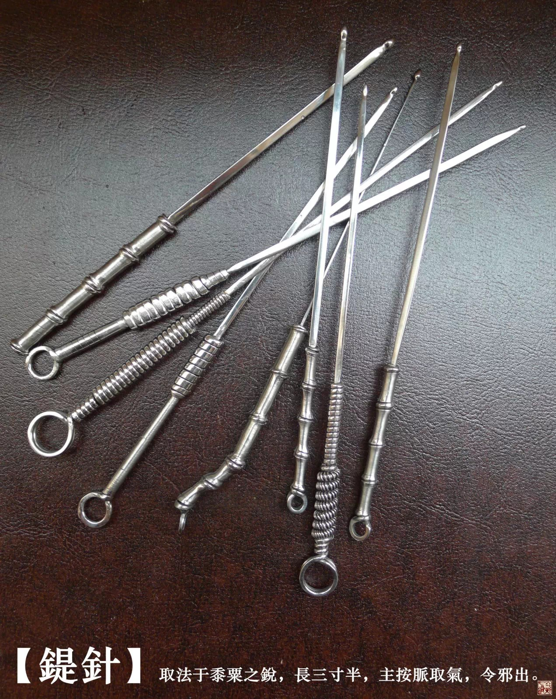
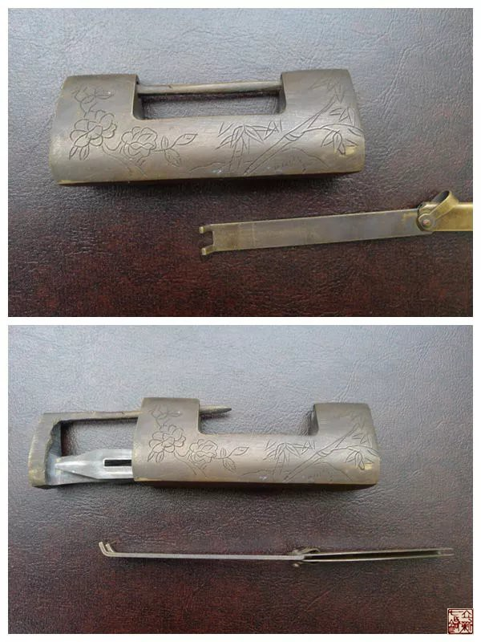

= 什么是九针（四）
冰台
2013-11-1 00:00

*二：鍉针*

《灵枢•官针第七》：“病在脉，气少当补之者，取以鍉针于井荥分俞。”

《灵枢•九针论第七十八》：“人之所以成生者，血脉也，故为之治针，必大其身而员其末，
令可以按脉勿陷，以致其气，令邪气独出。”

《灵枢•九针十二原第一》：“鍉针者，锋如黍粟之锐，主按脉勿陷，以致其气。”

鍉，一直以来，都被研究内经九针的人们读作di，这一点是我跟他们理解最大的不同之处，
我认为“鍉”应该读作chí，具体观点稍后再做解释。我们先看看现行的教科书和主流导向，
都将古九针里的鍉针叫做鍉（音di）针，认为是古代的一个同义字，通“镝”，类似箭头。
这种理解方式根本就与《灵枢经》所描述的鍉针形状“锋如黍粟之锐”不符合，也不通情理，
古代箭是用来杀人或猎杀动物的，箭头的形状是非常尖锐的，怎么可能与这“黍粟之锐”的
鍉针扯上联系？然后这鍉针的“必大其身”又怎么去理解呢？通常的理解认为“大”就是指
针身很粗大，是为了便于拿握，由此就产生了鍉针也是一支体外按摩棒的说法。比如目前国
内市面上销售的根据臆想而复制的所谓“青铜古九针”标本，鍉针就是一根很粗的棍子。又
如山西师怀堂老师所设计发明的新九针，其中鍉（音di）针也就是一支带小圆头的粗柄的体
表外用按摩棒。对于这些针具外形以及解释和理解方式，我一直无法认同。

在内经里，古人将十二经脉比喻成十二经水，十二经水是指我国古代的十二条河流。既然古
人把经脉看做河流，而鍉针是调理经脉之气的，那么这鍉针就一定应该与河流有某些关联才
好理解。我们常说大河，小河，大路，小路，这里的大小之分，就是宽和窄的意思，那么我
有理由认为，鍉针的“大其身”，其实就是针身比较宽一些的意思。话说回来，即使我认可
鍉针是一支按摩棒，那么鍉针的长度“长三寸半”又怎么理解？难道这支体外按摩棒，也非
要做成3.5寸这么长才可以做点穴按摩？1寸1.5寸2寸3寸这些长度就不可以吗？道理何在啊？
呵呵。

我曾经翻遍了能找到的国内外《黄帝内经》各种版本，查阅名医们的各种解释，但都没有看
到能够让我认同的解释，很多的人都认为鍉针就是一支按摩棒。查百度：“鍉针……又称推
针，是通过对经络穴位的皮肤表面进行按压以治疗疾病的一种方法。”晕啊，我认为不该如
此理解，在中国古代，针灸和按摩是分科行医的，针术与按摩相互之间并没有太密切的关联。
《黄帝内经》包括《素问》和《灵枢》，而《灵枢》又叫《针经》，里面用了大量的篇幅文
字讲述九针的形状和功效。既然是讲针的专著，而且九针里其他的针具都是刺入性针具，不
可能到了鍉针这里却成了一支用于体表的按摩棒。退一万步来讲，就算鍉针是用于体表按摩
的推针，那么你用这推针在体表上按摩点穴，别拿个例说事，我只问你在大多数情况下，你
做出来的疗效能不能达到内经所说的那种效若风吹云的境界？如果直接用于体内去疏通经脉
堵塞之处的话，大多数情况下都可以有立竿见影的效果。

鍉，其实是一个多音字，古汉语里的“鍉”除了音di通“镝”之外，还有一个读音是chí，
意思是钥匙。在中国古代的锁，钥匙的形状是一条宽扁的铜片，前面有倒成直角的挡块或凹
型口，插入锁里往前一推，把卡簧推开，锁就打开了，现在年纪大一点的老人们都熟悉这种
钥匙的形状。古代民风淳朴，常常是路不拾遗，即使七十年代我们乡下很多人外出的时候，
家里都是门不闭户的，路人口渴要讨口水喝，径直推门而入，到水缸里舀水喝，喝完出去的
时候再把门掩上，不像现在，厚重的防盗门还给你撬开了偷。所以古人的锁，是用来防君子
不防小人的，最常见的就是门锁了，一般门锁的大小，长度也就在三寸左右，那钥匙的长度
也就一横掌多一点，大约应该是三寸半了。所以我根据观察古代生活中的日用品，才找到答
案，因此，我认为古九针里的鍉针，不应该叫鍉（di）针，应该是叫做鍉（chí）针。“病
在脉，气少当补之者，取以鍉针于井荥分俞。”这里的井荥分俞，是形容词加动词，所出为
井，所溜为荥，并不仅仅代表五输穴的井穴和荥穴，我认为应该泛指气血流淌循行之处，需
要让经脉里被堵的气血流淌过去，所以分俞就是鍉针的针法了，用鍉针来疏通经脉之气，黍
粟一样的针头可以挤开堵塞之处，这就是分俞之意，就像打开一个开关，用钥匙打开锁一样，
我觉得这样理解更符合情理。

所以鍉针的形状就是如同古代钥匙一样，针身微宽，呈扁平长条形状，长就如钥匙一样三寸
半，针尖如黍粟之锐的样子。黍，是我国北方一种粮食作物，黍去皮以后，叫黄米，比小米
稍大。粟就是小米，中国古称粟，粒的直径大约1-2毫米左右。“如黍粟之锐”，也就是针
头如同黄米小米大小，为微圆形。这样一来，鍉针的形状和粗细就推理出来了。

我为什么想到鍉针是一把钥匙？因为鍉针的功用，是“按脉勿陷，以致其气，令邪气独出”。
我们先来分析这个“按”字，一般通常都会理解为按、压等动词，如果这样理解的话，你肯
定就会联想到按摩点压等手法方面去，那你把鍉针理解成一支按摩棒也就不足为奇了。

其实，在古汉语里，“按”除了有按压的意思，还有一层意思是依据或按照，比如“按理、
按章、按期、按说”等等意思。那么这个“按脉”，其实应该是依照经脉循行的路线去使用
鍉针。所谓“按脉勿陷”，这个陷，意思就是不要刺入肌肉里去，不能穿破筋膜层。“以致
其气，令邪气独出”，“致”在这里是获得的意思。也就是说，在经脉里经气受堵的地方，
用鍉针去疏通陷堵之处，重新修复经气通路，以恢复经脉之气的正常循行。既然我们是想要
起到疏通作用，我们不用钥匙一样的鍉针来打开，难道还用如同箭一样的兵器去搞伤害与破
坏？于情于理都说不过去的。

从内经所述经脉的作用和功能来分析，人体经脉的位置，不会是很深的层次，应该就在皮下
肉上这一部位，《灵枢•经脉第十》说“经脉十二者，伏行分肉之间，深而不见。”在分肉
间这个部位里面主要是筋膜成分。经脉是一个与皮肤平行的横向层面，是人体气血循行的路
线，经脉走向有顺逆之分，就像公路上的车，双向车道各走各的，你走另一侧的路就叫逆行。
我为什么会这样理解经脉？这是我在临床观察总结的，我发现很多慢性疼痛患者，检查摸到
他们某些部位的皮肉，经常会有粘连在一起的感觉，皮肤是提不起来的，如果强行提拉患者
会非常痛，这种患者用常规毫针很难彻底治愈。练过传统气功易筋经里揉腹功的人就能明白，
功法的要点是用手带动皮肤将皮下肉上的筋膜层揉开，令精气充盈其中，这样就能起到强身
健体抗击外力的作用。如果你不懂易筋经，那还有一个简单的常识能够让你认识这一观点，
如果某人用拳头打你的腹部，你会本能的鼓肚子不？如果不鼓肚子就会被直接打得震到内脏
里去，非常痛苦，如果你把肚子像气球一样鼓起来，就能够大大缓解外力对脏腑的伤害。那
么这个肚子里是什么东西鼓起来的？不是你的肌肉，不是你的肠子，也不是你的胃，更不是
你的肺，实际上就是皮下肉上这一层筋膜里充盈的气。

我们都知道小孩子天生阳气就很足，经脉也是通畅的，所以他一绷紧身子全身皮肉都充盈了
气，就产生很大力量，很容易的做出铁板桥来，而老年人皮下肉上筋膜层里气虚，就出现皮
肉松弛的现象，你让那种皮肉松弛一抓一大把的人做铁板桥，试试看他能不能做得好？呵呵，
这就是我在以前写的日志《法简效宏》里所要想表达的理念，可惜没几个人看懂了我的用意。
当你明白这些道理之后，你就知道了，筋膜对人来说非常重要，是不可以损伤的。所以为什
么我这几年坚决反对医生们用小针刀钩针之类去切割患者筋膜的行为呢，道理就在这里，因
为我太了解了，那些热门治疗手段可谓伤人于无形。损伤筋膜有害无益，而西医们没有气血
理念，是不明白也打死不相信这些道理的。如果说你非要认为这些手段对患者没有影响，那
么请大家留意观察一下筋膜被割破损坏的那些患者，看看经过医生的几次治疗之后，他们气
色的变化吧，症状或许有一定的缓解，但气色一定是越来越差。而内经针术则非常注重气血，
注重来龙去脉的整体调理，所以患者在病痛逐渐被治愈的同时，气色也会变得越来越好。

经脉之气是否充足，对治疗疾病来说非常重要。我们现在很多人喜欢揉腹，但很多人都是用
很大的力量去搓揉腹内深处的肠器官，以为直接揉肠子就可以帮助排泄大便。结果大多数情
况下效果并不好，有的患者越揉肚子反而感觉越气胀大便不通，道理就在一个“顺”字上。
气顺才能有力，这样才能够正常排泄大便，粪便不是靠你的外力去帮助他排出来，也不能依
靠开塞露之类来滑肠，否则这个患者终究不能自力更生。气不顺你把肠子揉烂了也不行，但
懂得顺水推舟的话，其实只需非常轻的揉就有效果，关键是你要能查出患者哪些地方堵塞导
致的气不足，然后顺应经脉，把气给调和过来。

古人治病，讲究的就是一个“顺”字。大家可以去读一下《灵枢•师传第二十九》里面这一
段话：“夫治民与自治，治彼与治此，治小与治大，治国与治家，未有逆而能治之也，夫惟
顺而已矣，顺者，非独阴阳脉，论气之逆顺也，百姓人民皆欲顺其志也。”理解这段话，你
就能理解治病为什么要顺。而鍉针这样一个扁平的针体，最能顺应经络之经气所在层面。古
人将鍉针设计成长三寸半，用这个长度用来疏通经脉之气是比较合理的，如同钥匙开锁一样，
形容针到病除。在临床上我曾用长短不一的鍉针反复对比过，最后还是感觉三寸半的长度用
起来最顺手。

所以现在我们就知道了，九针里面这个鍉针的作用其实非常重要，她是用来疏通那些因遭受
风寒湿侵袭而气血受到瘀堵，导致肌肤塌陷，经脉之气不足的。要补充这个气，只有打开闭
塞之处，让气能正常通过，这才能够补气，所以我认为鍉针相当于一个经脉的管道疏通器。
鍉针的运用，主要是进入皮下脂肪层与包裹肌肉的筋膜层两者之间的间隙里面，去抽送，从
而疏导气血。由于鍉针没有针尖，前边是如小黄米一样的微圆形，摩擦力和阻力相对比较小，
很方便在分间前后滑行。软组织紧紧包裹着圆形的针头，但对这些软组织并不会造成伤害，
因为鍉针在抽送过程中用的是挤开的方法而不是切割的手段。鍉针的圆形针头能够将塌陷粘
连的筋膜组织挤开，但并没有强行撕裂，紧连着针头的是鍉针那扁而薄的针身，所以筋膜在
还没达到撕裂程度的时候立刻又松弹了回来，张弛有度。这样筋膜就不至于被粗针一直强行
分离撑开，继而产生撕裂与损伤。同时鍉针的形状和针法，也有点类似活塞的作用，经脉里
被瘀阻的血气就会被鍉针的活塞带动，从而被动的产生循环。经脉里正气循行通常了，也就
很自然的将邪气祛除开了。

既然是通过疏通经络来达到调理气血的目的，那么所治疗的病症，就是经络不通，经络瘀堵
导致的病痛。千百年来，中医从来没有这样一种针具，能够具有伸入体内去疏通经脉塌陷堵
塞之处的功能，现在我根据古人对鍉针的描述，在临床实践中把这支体内管道疏通器，发掘
并设计出来了，依然取名“鍉针”。

鍉针的针法，应该是十二刺之“浮刺”。《灵枢·官针第七》：“浮刺者，傍入而浮之，以
治肌急而寒者也。”我据此理解，就用鍉针在病变部位的旁边斜刺进入，在皮下肉上之间抽
送运行，治疗因感受风寒湿邪导致的肌筋膜挛缩塌陷。因为经脉不通，经脉的前方就会缺少
气血，继而肌肉就会急，也就是挛缩，就会产生疼痛。

很多人可能会在鍉针与员针的功用上糊涂，有人甚至认为这几个针的形状都差不多嘛，其实
用大针直接全都能代替了，呵呵，我除了佩服还是只能佩服，你这超高智商啊，连这么绝的
招术都想得出来。那么这两种针之间到底有什么不同呢？其实内经里已经写得很明白了，一
个是顺着经脉前后横向疏通，一个是用于局部上下左右进行揩摩。两种针具的治疗机理不一
样，当然，功效也是无法互相代替的。九针各有所宜，各司其职，古人不可能无凭无故的设
计九支针出来，而且从九针各自的功用介绍来看，根本没有哪一支针是多余的。据说有人认
为只需用两三支针就足可以代替九针治病，故此对九针之说颇感不屑，呵呵，我真不知道到
底是老祖宗脑残还是你脑残。
