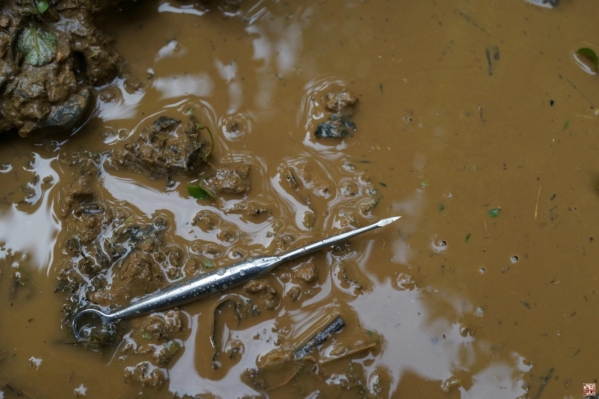
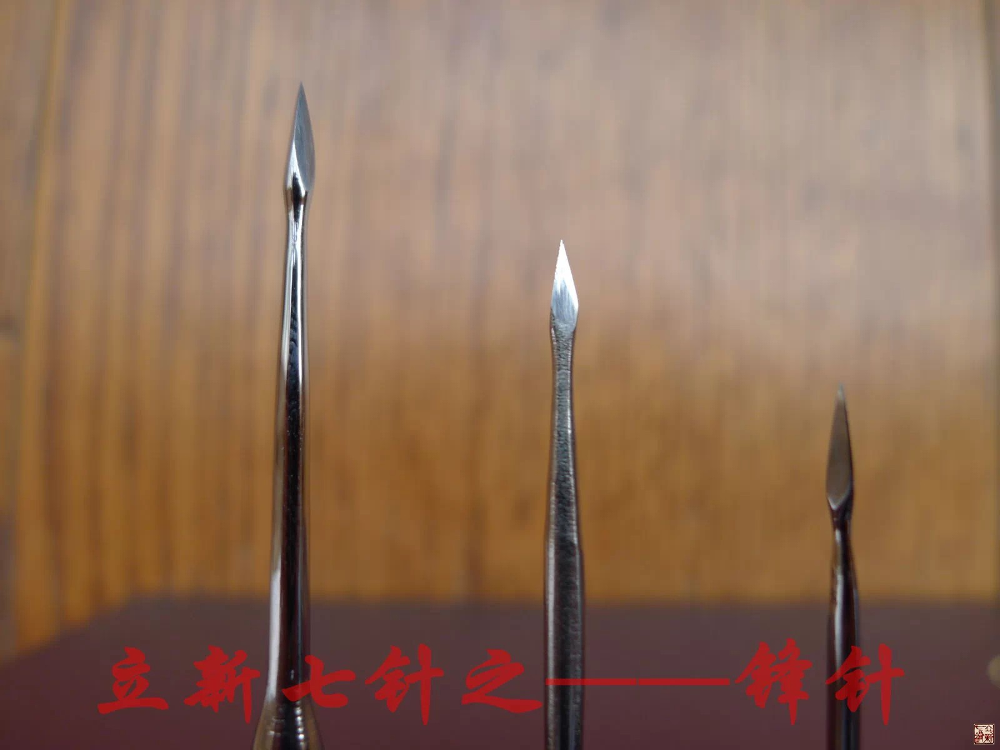
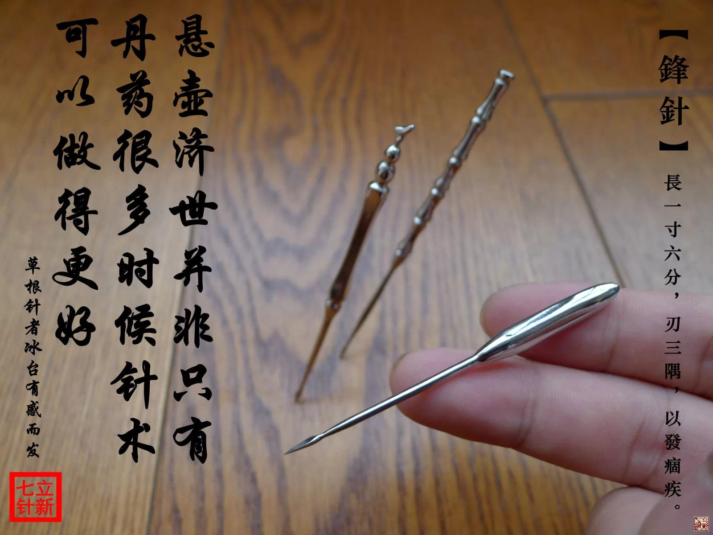
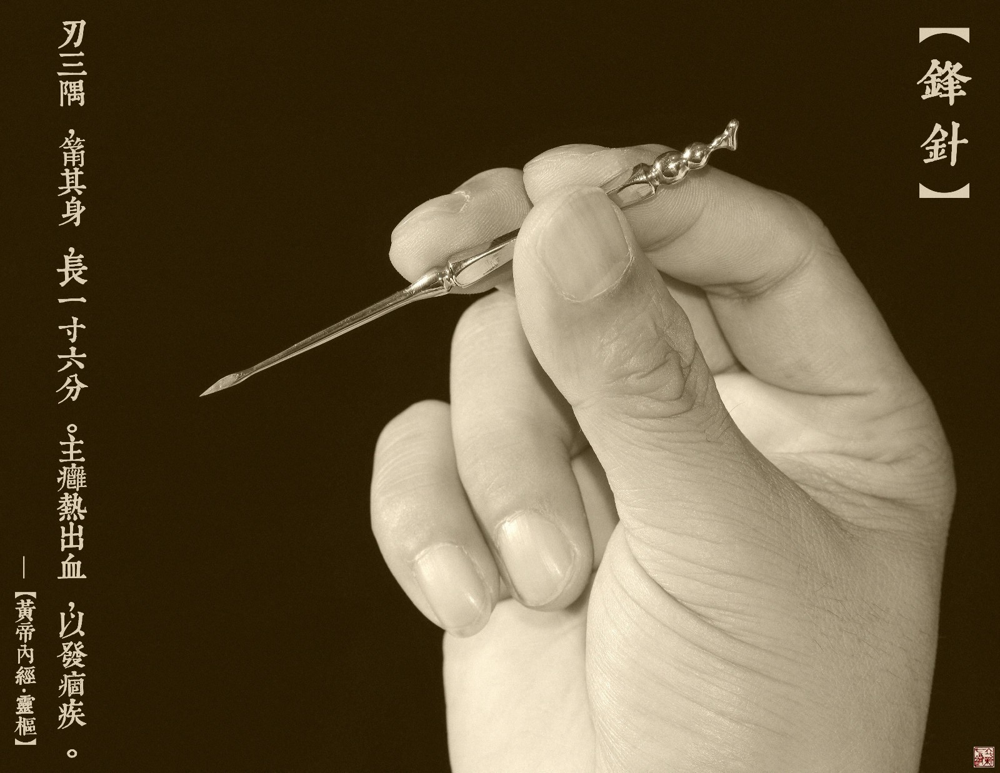

= 什么是九针（五）
冰台
2013-11-2 00:00

*三：锋针*

《灵枢•九针十二原第一》：“四曰锋针，长一寸六分……锋针者，刃三隅以发痼疾。”

《灵枢•官针第七》：“病在经络痼痹者，取以锋针。”

《灵枢•九针论第七十八》：“四曰锋针，取法于絮针，筩其身，锋其末，长一寸六分，主
痈热出血……四时八风之客于经络之中，为瘤病者也。故为之治针，必筩其身而锋其末，令
可以泻热出血，而痼病竭。”

常人的眼中，锋针只是专门用于放血的。其实在《灵枢经》里，锋针除了刺血的本职工作之
外，还肩负着协助九针兄弟作战的任务。如《灵枢•九针论第七十八》所说：“大针，取法
于锋针，其锋微员”。关于大针，我后面还要专门阐述，这里就不多说了。大针为什么要取
法于锋针呢？就是因为大针的形状是“其锋微员”，圆形的针头缺少创伤能力，无法直接刺
入皮肤里去，所以需要锋针兄弟帮忙开孔，然后才能进去完成工作。我常对学生们说，其实
我是把立新七针的七支针看成了七个身怀不同绝技的高手，如果仅靠每一支针去独立作战的
话，或许取胜的概率并不会很大。但如果七个兄弟牵手，联合起来协同作战，各施所长互相
帮助，那么，在绝大多数情况下，七针兄弟都能够做到所向披靡。

锋针也叫三棱针，国内针术界最常见的运用，就是用于瘀络刺血。当然，刺血疗法除了瘀络
刺血之外，还有拍打刺血、穴位刺血、先天刺血法等等，具体的介绍我这里就不多说了，大
家要想了解，网络上搜一搜就可以查看到相关资料。

我喜欢用自制的锋针，我一直很执着的认为，古人所说的“工欲善其事必先利其器”这句话
绝对是真理！我们针者手里的针具，其实就类似武士手里的兵器，必须做到知彼知己针人合
一的境界，如果拿了一件不称手的兵器，很难让你将浑身本事施展出来，心有余而力不足。

九针里的锋针是用于治疗经络痼痹的，“痼痹”即是顽疾。所谓久病必瘀，在治疗一些重病
久病方面，刺血确实是很有必要的。《灵枢•寿夭刚柔第六》说：“久痹不去身者，视其血
络，尽出其血”，意思是说，锋针刺血治病，应该观察血络有无改变，如果发现有血络结聚
现象就要用锋针祛除这些瘀血。直接把瘀血放掉总比用药物去活血化瘀的效果要快得多，而
且不用担忧药物的毒副作用。所以这是调血最好最快的方法，常常能够取得非常神奇的疗效。

《素问•举痛论篇第三十九》：“经脉流行不止，环周不休，寒气入经而稽迟，泣而不行，
客于脉外则血少，客于脉中则气不通，故卒然而痛。”既然经脉是“环周不休”的，如果气
血滞留瘀堵其中某一处，就会造成整个经脉的不通畅，气血就不能完成环周，所以这种情况
下我们必须重视瘀堵之处，刺其血让邪有出路，令气血循环恢复正常，病痛也就痊愈了。其
实说穿了，针术治病，诀窍就是一个“通”字，通了就既是补也是泻，我只需对这个气血不
通的“周”加以修缮和维护，然后调动患者自身的气血去修复他身上的病痛，只要患者的气
血能量还比较正常，这些病痛哪里还有不能好的呢？

瘀络刺血也是我最常用的针术之一，只不过，我所理解的内经锋针的针法，与大家通常所想
象的有所不同。正是由于我的理解方式与别人不同，所以才造就了立新七针的针法出来。我
如果是靠捡别人的或偷盗别人的东西，或炒剩饭去忽悠的话，那些曾付出天价学费来跟我学
习回去的学生，不可能一如既往的尊重和拥护我。学医的人一定要善于思考总结，就拿锋针
来说，大家通常只考虑锋针在什么穴位刺血效果才好，却很少有人去思考过《灵枢经》九针
里的锋针为什么长一寸六分。我们反过来想一下吧，如果仅仅是用于皮肤浅表层的瘀络刺血
的话，其实有半寸长也绰绰有余了啊。

我曾研究过安徽王氏刺血针术，他们的锋针算是扎得比较深的了，有些部位进针深度一寸有
余，但王氏刺血是以国标穴位为主要部位，这与我理解的内经锋针似乎有些差异。有些针灸
门派则更注重寻找畸络刺血，国内有一些刺血名家认为，畸络实际上是血管的结，与筋结是
一个道理，只不过一个是肌肉的结，一个是血管的结，都要治疗使其松散开。这是他们的一
些观点，也许是因为我没啥文化就喜欢胡思乱想，所以我对这些观点并不完全赞同。搞临床
的人都知道，很多患者在病痛或相关部位都会出现一些筋结，现在一些热门针法就喜欢用带
刃口的针或稍粗一点的毫针去扎这些筋结，想让它松开。同样的，很多医生也喜欢用锋针直
接去刺皮肤上暴凸的畸络血管，目的是想通过祛除瘀血以疏通经脉。而现实的状况如何呢？
我们看到多数情况下，扎筋结的疗效并不会太持久，刺瘀络的医生把畸络里的血大量泄掉了，
结果疗效还是不显著，其原因何在？就是因为医生在扎这些结节的时候，并不明白这些结节
到底是怎么回事，心中医理不明，下手必定茫然。

这些结节怎么来的，内经里讲的清清楚楚，但不是我这篇文章要讲的内容，我这里只讲锋针。
在《灵枢•经脉第十》里有这么一段文字：“黄帝曰：诸络脉皆不能经大节之间，必行绝道
而出，入复合于皮中，其会皆见于外。故诸刺络脉者，必刺其结上，甚血者虽无结，急取之
以泻其邪而出其血；留之发为痹也。”我们仔细看这一句：“刺络脉者，必刺其结上”，这
里讲到一个“结”，我看过很多的灵枢注解版本，都解释说“结”就是聚集，指瘀血聚集的
意思，也就是瘀络。张介宾也说这个结，就是“血络粗突倍于常”，意思是血管明显鼓起的
地方。可是，我发现一个问题，如果经文表达的真是如他们所说这个意思，那就表达得有点
重复了。我们看后面有“甚血者”这三个字，甚，古文在这里的意思本来就有“厉害”、
“很多”等意思，这也是说瘀血很多很明显的地方，其实就与张介宾他们理解的“瘀血聚集
的地方”是同一个意思，这显然不符合古人常理的，也有悖九针里面锋针长一寸六分这个尺
寸的用意。

瘀络就是结？结就是瘀络？这个问题我思考了很久，没答案。直到前年夏天的雨水季节，有
一天大雨磅礴，家里楼顶的下水道被盆景掉落的树叶及杂物等堵塞，结果雨水很快就从阳台
倒灌进屋，导致了家里楼下水漫金山，我手忙脚乱不停地用水瓢使劲往外舀水，无奈天上瓢
泼大雨不停的泻下，我忙活半天屋子里还是不停的漫水进来，最后没办法，我只好寻找到下
水道被堵塞的地方，用棍子将它捅开，让水有出路，这才渐渐恢复平静。这一生活现象把我
点醒了，这岂不正是《灵枢•经脉第十》所说的“诸络脉皆不能经大节之间，必行绝道而出，
入复合于皮中，其会皆见于外”吗？大节是什么意思？很多人都理解成大的关节，错！这个
“节”，在《灵枢经》开篇的《九针十二原第一》里就解释过：“所言节者，神气之所游行
出入也，非皮肉筋骨也。”大，我前面说过，你不能单纯的理解成大小的大，气血通路瘀堵
了，络脉过不去，就如下水道堵塞一样，聚集的水流就逐渐变大并倒灌横流。所以“大节”
的意思就是形容神气游行出入的通道被堵塞了。经脉是血气的道路，如果前方给堵了，络脉
过不去，又不能跑到左右的线路去，因为那不是它的线路，更无法进入体内里面去，就只能
往外皮肤薄弱处挤，就形成了我们看到的皮肤上暴凸的畸络。

既然络脉是“行绝道而出，入复合于皮中”，我根据观察自然生活现象，就得出一个结论：
我们看到的畸络，并不一定就是瘀堵处。作为治疗来说，并不一定看到畸络就直接刺，我们
应该寻找到形成畸络的根源，也就是瘀血堆积壅塞之处的那个结，“诸刺络脉者，必刺其结
上”，用锋针刺散这个结。这个结不一定在皮肤表面上，但总归是在分肉之间，所以锋针才
需要有一寸六分的长度。如果你用针直接刺畸络，有可能你刺的这只是一个表象而已，治标
不治本。类似你虽然烧掉野草，但草根还在，必然是春风吹又生。这样扎针，能起多大作用
呢？当你明白了这个道理，你就知道某些医生治疗膝关节积液采取抽水和注射消炎药之类的
“医疗行为”是多么的无知和愚蠢了，银针烧热了去消炎也是一个道理，膏药外敷也是一个
道理，或许有效，那是因为瘀堵的地方正好就是你看到积水的地方，但如果你看到的积水是
由于远处下水道堵了而流淌漫过来的呢？如果你不想办法找到并疏通那个结，这病就很难治
好的，呵呵呵。

所以在立新七针的针术里，锋针除了常规刺血用途，还承担有一个解结的任务，叫做“散结
针法”。锋针的作用是“令可以泻热出血”，这个热，是指经脉中瘀血堆积阻塞久了而产生
的热邪，就像垃圾堆久了中心里面会发热自燃一样道理，这时候要用工具把垃圾堆挑散才能
泻掉这些热量，所以这个“泻热”并不是说一定是患者发热发烧的时候采用锋针刺血。除了
泻热之外，锋针还主治“痼痹”，这跟自然界河沟里水流是一个道理，如果河床里垃圾淤泥
堆积阻塞久了，它就会紧紧依附在河床上，我们只靠水流去冲洗，是很难疏通开的。这时候
我们必须要利用一些锐利的工具先捣散这些淤泥，然后流水才可以带走冲洗干净这些淤泥。
治病也是这个道理，如果病痛久治不愈，大多都是经脉之中形成了“痼痹”，我们必须用锋
针去捣散这个“结”。

看到你拎柄针刀冷笑着朝我飘过来，我就知道你想说什么，你别想趁机抓这个把柄替针刀做
解释，内经锋针的治疗目的与小针刀的意图根本就不是一回事。我们不得不承认，针刀横冲
直撞的或许碰巧能松解开一些“结”，所以有时候也能起到一些效果。但针刀大多数情况下
都是以主动切割刺破筋膜为目的，或刺破肌肉进去以达骨面刺激，由于你的刀刃锋利，所以
这一路过去留下的都是伤害。我常常把这个行为打比喻给学生们听：你路过就路过吧，干嘛
借道而行却非要把路人甲和路人乙都捅一刀呢？人家没犯法也没惹你啊。

内经锋针的这个捣散针法，不是主观搞破坏，只是顺着经脉通道而入，并且只在筋膜层的空
间内进行斜刺或平刺，目的只是分离筋膜层里的“痼结”，并不需要将筋膜横断面割破，更
不会去扎肌肉，因为内经认为伤筋伤肉都是错的，老祖宗的教条很明白：“刺皮无伤肉、刺
肉无伤脉、刺脉无伤筋、刺筋无伤骨、刺骨无伤髓”，你想解决谁就针对谁，别伤害无辜。
锋针“必刺其结上”，在没有结的地方，是不可以用锋针刺的。大家无须担心锋利三棱针的
伤害性，你如果要担心，就必须先弄明白九针各种针具所针对的治疗部位。内经讲的明明白
白，锋针并不是用来扎到肌肉里面去的，即使在筋膜层里穿刺，也只是针对筋膜层里的痼痹，
这些痼痹用毫针或其他圆钝的针具是无法松散开的，必须用锋针才能起到应有的作用，锋针
的作用就是破血、散血。所以用锋针做“散结针法”是正当的，也是安全的。

从临床实践中总结的经验来看，解结比较好用的针具还是锋针，三个棱可以将痼结充分的刺
散。

您看累了吧？

呵呵，后面还有很多呢，先歇歇，推荐您听一首我很喜欢的歌——《白狐》：

[verse]
我是一介书生寒窗苦读
十年等待  十年孤独
灯红酒绿中听我一声古筝轻诉
花开花谢处看我一纸泼墨狂舞
我是一介书生独醉江湖
十年寒窗  十年苦读
金榜题名时功名利禄光宗耀祖
洞房花烛后阴阳相隔人鬼殊途
我爱你时你是一只千年修行的狐
失去你时你已烟消云散万劫不复
能不能为我再跳一支舞
你是我千百年前放生的白狐
你看花花世界  花花世界
恩恩怨怨都化做虚无~
能不能为我再跳一支舞
只为你永别时的那一次回眸
你听仙乐飘飘  仙乐飘飘
今生今世却只能虚度……

呵呵，别误会，这歌词不是我写的，如果想听这首歌的，可以在网上找来听一下。
