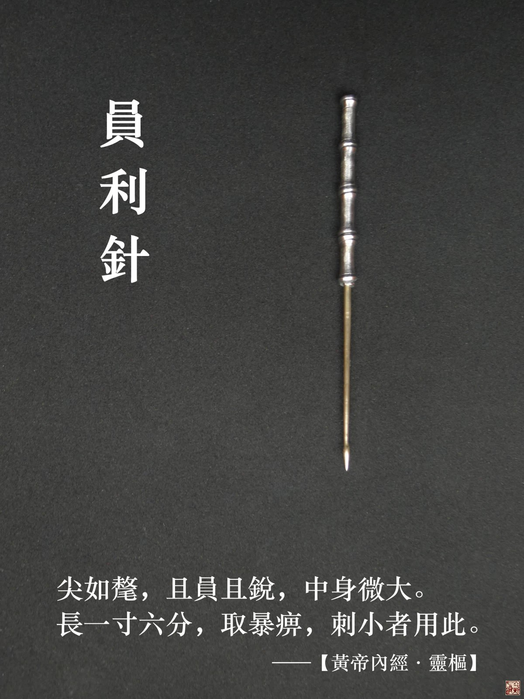
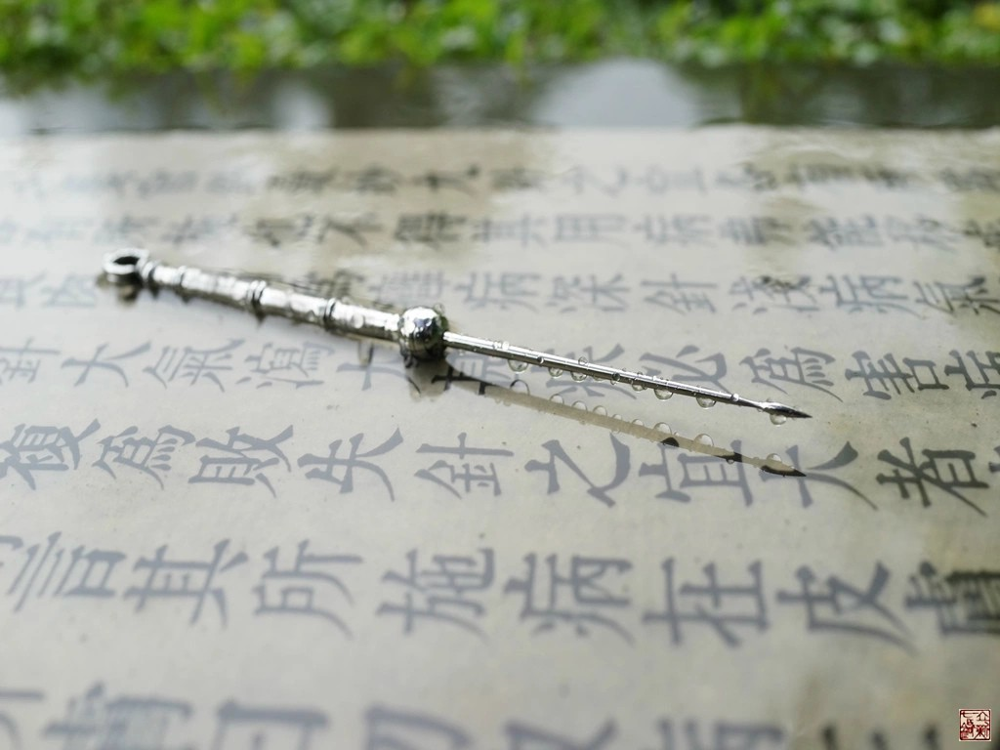
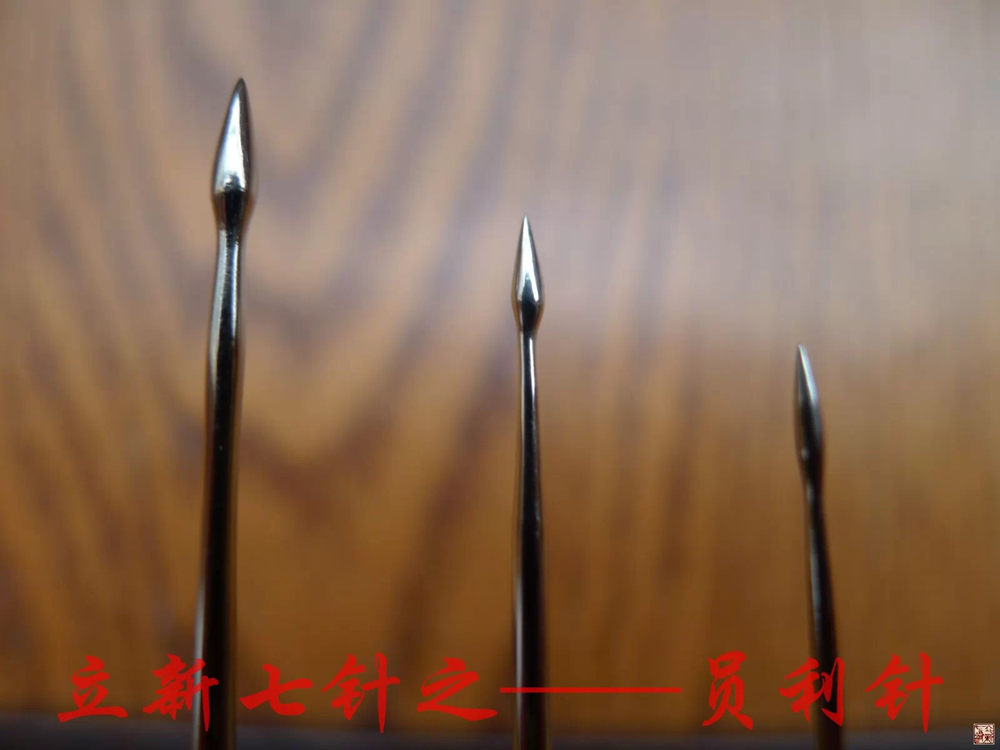
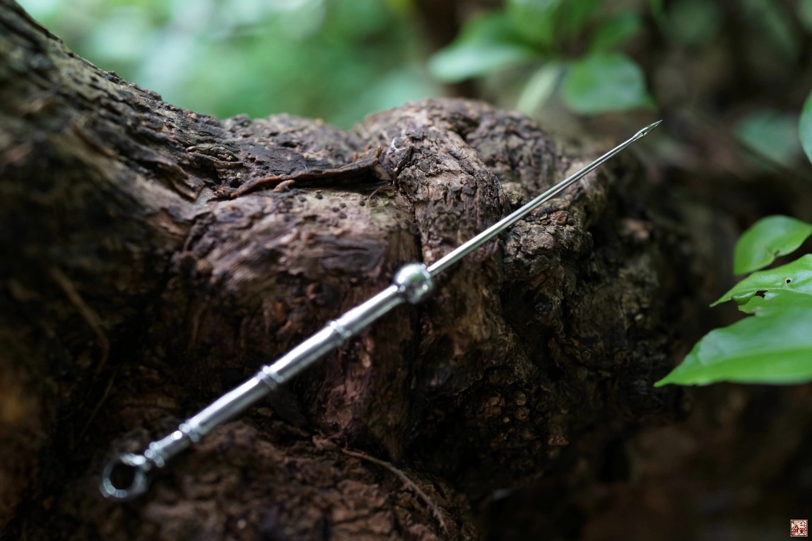

= 什么是九针（六）
冰台
2013-11-3 00:00

*四：员利针*

《灵枢•九针十二原第一》：“员利针者，大如氂，且员且锐，中身微大，以取暴气。”

《灵枢•官针第七》：“病痹气暴发者，取以员利针。”

《灵枢•九针论第七十八》：“虚邪客于经络而为暴痹者也。故为之治针，必令尖如氂，且
员其锐，中身微大，以取暴气……员利针，取法于氂，针微大其末，反小其身，令可深内也，
长一寸六分，主取痈痹者也。”

在开篇之前，我要先做一些说明，其实九针里面，我最推崇的得意之作，就是员利针了，这
支针也最能代表我付出的心血。所以一年前，在我还没将员利针推向网络的时候，我就给她
拿到了几项国家专利。这样做的目的，主要是防止小人抢注专利，我辛苦研究九针这么多年，
如果到头来被人家抢注了，反过来限制我研究运用的话，我岂不是喊天天不应，呼地地不灵？
我必须先做好正当防卫的准备。

请一定要辨识一下，《灵枢经》九针里的是叫员利针，不是市售那种圆利针哦，否则你后面
必定越看越糊涂。要解读内经九针之员利针，首先必须为员利针正名。现在很多人都以为市
面上销售的圆利针就是《灵枢经》里的员利针，其实两种针的形状不同，功效也是不一样的。
就文字来说，员与圆是两码事，古汉语文字是以象形字为主，这个“員”字用来表示员利针
是很合乎情理的，前面一个圆头，后面连着一个圆柱，与员针一样，是以象形义命名。而
“圓”字则表示员被框住围了起来，如果用来给针具取名，就表示受限无法施展，于理不符。
而且我们现在公认最权威的《灵枢经》版本，应该是明代赵府居敬堂的版本了，我们看这书
原版影印本上面的员利针字样全都是写的“員利針”，只有在近代的一些铅字印刷版内经书
里才出现了“圆利針”。最重要的一点，《灵枢经》里把员利针的功用写的清清楚楚，是专
门用来治疗筋痹的一种针具，是扎筋用的，针的形状是如牛尾巴一样的，而市售圆利针则主
要是用于肌肉斜刺，是扎肌肉的。其形状也与《灵枢经》描述的员利针完全不符，它只是一
支稍粗一点的毫针。也不能说是粗一点的毫针，因为《灵枢经》九针里的毫针本来就有这么
粗，具体的观点，后面我讲毫针的时候再说。

最早我对员利针产生灵感，是在2009年，那时候我还在和济刺灸诊所坐诊，医术受西医理念
影响比较大，治病方面常产生很多疑惑，很多病痛都没弄明白到底是怎么回事，疗效不好压
力就巨大啊，所以头发白得很快呢。临床搞疼痛的医生就能体会到我说的那种感受，我那几
年经常是晚上睡梦中也在给患者扎针治疗，梦中的情景就跟白天诊所里一样的在忙碌。有一
天晚上做梦，一个中年妇女对我说她膝关节里面痛，蹲下去和起来都痛，我当时就在想，这
怎么整呢，然后就看到旁边桌子上有一本书上依稀写有几个字“膝中痛，以员利针，刺膝无
疑”，这时候我一下子就醒了，坐在床上发愣，我在努力回想梦里那几个字。然后我就翻阅
床头柜上的《灵枢经》，在《灵枢•杂病第二十六》里找到这么一段文字：“膝中痛，取犊
鼻，以员利针，发而间之，针尖如牦，刺膝无疑。”后来我回想这事，常感觉不可思议，我
是不信鬼神的，我想应该是日有所思夜有所梦吧，估计是某天我看《灵枢经》的时候，这一
段文字不经意的印到我脑子里去了，所以才会发生梦里的情景。然后我又翻阅了关于员利针
的一些章节，一下子就产生了一些思路，睡不着了，我爬起来，工具箱里翻出榔头钳子锉刀
砂布不锈钢焊条这些东西，半夜三更的到楼顶去做了我的第一支员利针。所以我老婆后来对
朋友们说我经常半夜起来做针呢，其实并不是经常，就这么偶尔的事。

第一支员利针做出来的形状跟现在的员利针还是比较像的，只是那时候对“反小其身”没有
理解好，针身做得很细，也没有针柄，总共才长不到两寸，特别是那时候我对员利针的治疗
理念完全不清晰。我的手工艺技术还是可以的，针做好了我爱不释手，就放兜里随身揣着。
很神奇的事往往也很巧合，我第二天诊所上班的时候，真的就来了一个膝关节痛的妇女，我
那时候对用小针刀扎髌下脂肪垫有些经验，所以就想到用昨晚上做的“员利针”来扎髌下脂
肪垫试一试，针具消毒之后就从外膝眼（当时理解的犊鼻）进针，斜刺了髌下脂肪垫，有效
果！当即患者就活动自如了。我大喜过望，以为自己发明了神针，呵呵，于是后来凡是来了
膝痛患者我都用这个方法去治疗，结果大部分疗效都不好。知其然不知其所以然，在遭受几
次打击之后，就扔掉了这支员利针。这一治疗理论直接导致了员利针的夭折，直到2010年我
从和济诊所辞职专心投入研究九针，才再一次捡起员利针进行研究。我在自己和家人朋友身
上做了无数次试验，我的膝关节似乎就是专门用来让我做实验的，现在还能看到针孔累累痕
迹。随着对《灵枢经》的逐渐深入理解，并在临床中患者身上不断总结修改员利针的治疗思
路，直到2012年申请专利，才算真正成型了。

我讲这些经过，并不是浪费笔墨，也是为了让大家更深刻的认识员利针，做了一个铺垫。
《灵枢•九针论第七十八》曰：“员利针，取法于氂，微大其末，反小其身，令可深内
也。”氂，在古代是比喻牛的尾巴，牛尾是什么形状？见过牛的就知道了，就是象一支毛笔
一样的，在这里我专门拍了牛和尾巴的照片给大家看。牛尾巴的形状就是“且员且锐，中身
微大，反小其身”，所以员利针的形状大概就是如此，前面针尖如毛笔尖的形状，又圆又锐，
中部稍微粗一些，后面针身相比之下更细小一些。

员利针的作用，是“令可深内也，主取痈痹”。这句“令可深内”，似乎是说可以扎针进入
里面很深的意思。可是员利针的长度，总共才一寸六分，再深又能够深到哪里呢？《灵枢经》
并不主张扎肌肉，所以员利针绝不可能是用来往肌肉深处扎的针。《刺灸心法要诀》有云：
“员利针形尖如氂，主治虚邪客于经，暴痹走注历节病，刺之经络实时痛。”从这几句话可
以大概了解员利针的功用。根据员利针的长度，也是一寸六分，那么按照我前面的分析来看，
这个针所治疗的部位，也应该是在肉分间这个层次。“令可深内也”，说明针头是要扎穿进
去的，肉分里除了筋膜就是筋腱了。筋膜是不可以伤的，伤了就会泄漏元气，肉更不可以伤，
所以这样推测下来，员利针就是用来治疗筋腱的了。

为什么说员利针是用来扎筋腱的？因为员利针是用于“取暴痹”的，暴，在古汉语里，有突
然、猛烈等意思，暴痹就一定是很痛的痹症了，什么痹症才会暴痛呢？在临床中，我经常遇
到一些疼痛很剧烈的患者，以前我用粗针扎他们肌肉起止点，效果非常不错，常常立竿见影，
只是疗效不稳定。从解剖的角度来看，筋腱是肌肉与骨骼连接的起止端，肌肉的起止点正是
筋腱。我们都知道热胀冷缩的道理，如果寒湿冷凝侵扰筋腱，就会引起筋腱挛缩，筋腱挛缩
就会牵扯肌肉，由于筋的力量相比肌肉来说是很大的，互相撕扯之下当然就引起肌肉剧痛。
我在02年曾学过中医接骨，那两年治疗一些外伤骨折后遗症患者，观察到很多手腕骨折的患
者，打了石膏用三角巾胸前吊着，两三个月后，手腕骨折处倒是长好了，可这时候肘关节和
肩关节的筋却缩了，手臂伸不直，抬举也不行。如果强行的伸直或抬举，患者就会发出惨烈
嘶叫声，谁都受不了，所以我从中认识到筋缩在治疗一些痛症中的重要性。

《灵枢•官针第七》：“病痹气暴发者，取以员利针。”如果筋痹发作了，就可以用员利针
治疗，尖锐而员形的针尖可以刺破筋腱，然后将“中身微大”也就是鼓起来的身子挤进去，
就相似于起到了一个扩张的效果。这个作用有点类似鍉针的原理，员利针是反小其身的，所
以尖头圆肚身小的员利针挤进筋里穿过去之后，就是“深内”了，由于针身比较小，所以筋
腱纤维在还没被针头扩撑到撕裂的程度时，立刻又缩弹了回来，这样随着员利针一进一出，
筋也就张弛有度，不至于被损伤撕裂。筋腱的密度是比较大的，扩张之后，针具抽出之后原
本紧张挛缩的筋，立刻就能获得一些不同程度的松懈，症状也就立刻改善，疗效来得远比
“风之吹云，明乎若见苍天”还快。这个道理其实我们在生活中就可以观察到：孕妇大肚子
绷得紧紧的，生了孩子之后，肚子立刻就松得一塌糊涂。所以要想让变紧的筋腱变松，最好
的办法就是先让它变大，拿大肚子的员利针一扎，一进一出，原本紧张的筋立刻就松了，又
不会产生撕裂损坏，肢体正常的活动功能完全不会受到影响。这就是《灵枢经•刺节真邪第
七十五》所说的：“刺大者用锋针，刺小者用员利针。”关于这段话，我曾买过一本巨厚的
讲针灸学的国家十二五重点图书，后来看到书上注解这段话的时候，说“治大病用锋针，治
小病用员利针。”呵呵呵，真不知专家们为啥要这样理解。我说这些并不是刻意揭谁的短，
而是确实我们被别人误导太长时间了，总要有人站出来说句公道话，我一草根啥也不是，所
以不怕得罪人，反正光脚的不怕穿鞋的。

老祖宗的智慧就在于总结出来了很多非常安全非常有效的针术，老祖宗推崇的上乘兵法是
“不战而屈人之兵”，即使在迫不得已的情况下，也要尽量想办法以最小的代价来取得最大
的胜利。而我们现在很多疗法呢，则是杀敌一千自损八百，我这么说并不是踩踏谁，我也没
有任何资格踩踏谁，因为我是这么一路在临床实战中走过来的，我明白其中各方面的内涵，
所以我有发言权。我这两年在网上三番五次的提醒大家，要重视气血要重视气血，就是希望
唤醒更多人，今后大家不要一看到这个筋紧了，就用刀刃之类去切断它，人在做天在看哪，
何况这样做根本就不是治病解决问题的办法。老祖宗设计的员利针实在是太绝了，可惜疗效
这么强大的针具却尘封了两千年。我常在想，如果当初朱汉章老师发明的不是小针刀，而是
灵枢员利针，那么现在的疼痛市场，又该是怎样一番繁荣景象呢？至少，不会出现那么多针
刀致死致残的医疗事故。

实际上，用员利针刺筋腱，就可以对相连另一头的肌肉起到松减张力的作用，我们根本就不
需要去直接刺激肌肉，比如我们直接用灵枢员利针去扎环跳，很多坐骨神经痛麻之类的症状
立刻就会消失。《灵枢•厥病第二十四》：“足髀不可举，侧而取之，在枢合中，以员利针，
大针不可刺。”足是小腿，髀是大腿，“足髀不可举”即泛指整个腿的痛麻等症状，枢合之
中就是臀中肌在大转子骨头的附着处，如果不懂解剖，你摸到大转子骨头边缘最紧的那条筋
扎就不会错。因为员利针不会产生创损，所以员利针扎完之后，患者下床完全可以自由活动
不会有任何影响，如果医生懂得合理运用这一针法，患者的症状肯定只会减轻不会加重。请
注意，您千万别理解成国标环跳，如果你按国标环跳去扎，就扎到臀中肌肌腹里去了，伤了
臀中肌患者走路会跛的。《黄帝明堂经》对环跳的定位是：“环跳，在髀枢中，侧卧伸下足
屈上足而取之。”所以真正的环跳并不在肌肉里。现在我们就可以理解老祖宗为什么说“病
在肉，调之分肉”，而不让你直接去调之肉，因为肌肉刺伤了就会痛上加痛更加痛。所以每
当我看到某些人用大针长针之类在患者的肌腹上刺、撬、拨、戳的时候，我只好叹息摇头。
我要是指出来他这么做不对，人家恼羞成怒之余立刻就会用很多现代医学理论来反驳，结果
我反而成了别有用心的人。我要不说呢，看到无辜的患者被他们如此残暴折腾，内心里又实
在忍不住想站出来喝止他们。世上任何一个观点都不可能令所有的人认同，总有人跟你唱反
调，这是一种自然社会现象。很正常，比如我的《什么是九针》系列写到现在，很多朋友看
了我前面的文章都已经认同内经九针的理论非常优越，非常人性化了，可还是有个别人在替
那些破坏性疗法辩解：管副作用干嘛只要有效果就行…存在即是合理…不要践踏…不要排
挤…不要攻击其他疗法…以和为贵……当然了，我动了别人的奶酪，总会有人公开或半公开
骂我的，或借事说事以责难我，这些都无所谓。险恶用心的人大有所在，眼看最近有人借事
在媒体网络上泼九针的脏水，故意把李鬼当李逵以混淆是非，我感觉这样下去可能会导致灵
枢九针继续尘封两千年，所以我必须将九针内涵写出来，让大家明白真正的九针是啥功效。

作为医疗行为来说，人命关天，疗效更好更合理的医疗技术就应该发扬光大，疗效差的有毒
副作用的理当受到质疑与消灭，除非你眼里只认钱不尊重生命。其实我做了这么多努力，只
不过希望大家都来重视内经，推广九针，发挥九针应有的功效，振兴中医针灸。虽然我努力
的宣扬立新七针，但我一直都讲得明白：我只是挖掘发现了这些针具而已，这些都不是我的
智慧，都是老祖宗的智慧。说到这里，我要再次提醒各位一下，我前面讲扎臀中肌附着点所
用的这个员利针，是灵枢经九针里的员利针哦，也就是如图所示立新七针之员利针，你别拿
市面上买来那种圆利针来模仿这样扎，那是做不出这般疗效的。

我们可以借助解剖来理解一下员利针的巧妙之处，骨边缘的肌肉起止点部位的肌腱，正是中
医所谓的筋。这些筋，很有韧性和密度，筋直接连接的是肌肉，所以筋的张力大小，就决定
着肌肉受到被牵拉力的大小。用“尖如氂”的员利针刺入筋里，可以起到松懈筋张力的作用，
就能够让肌肉松软而缓解“肌急”，请注意，我说的是“松懈”，不是“松解”。以前我曾
在这些部位用0.35的毫针扎，有点效果，但是很不稳定，而且往往有点力不从心的感觉，后
来我用0.8的粗针去扎，疗效就能提高不少，但相比用员利针去扎，那简直是天壤之别。所
以当我理解到内经里真正的员利针的寓意之后，不由得欣喜若狂，运用于临床广泛验证，确
实疗效出众。

员利针的针法是怎么样的呢？《灵枢•官针第七》中关于治筋痹的针法，有十二刺之恢刺，
以及五刺之关刺。先讲一下恢刺，“恢刺者，直刺傍之，举之前后，恢筋急，以治筋痹
也。”我理解的恢刺就是进针直刺一下，然后向旁边左右各刺一下，然后再前后各刺一下，
总共五针，五居中央属土这个理论在内经里还有很大的讲究，那是后话。扎了这几针就可以
恢复筋急现象，就如同针刀刺环枕筋膜一样，针刀在筋膜上切割几下，切断了筋膜，筋膜张
力当然就减小了，就可以使拘急痉挛的颈项部肌肉松弛，但这一招在内经针术里面是绝对禁
止的，从内经气血理论来说，这样做不但危险而且治疗机理也非常谬误。

接下来是关刺，“关刺者，直刺左右，尽筋上，以取筋痹，慎无出血，此肝之应也，或曰渊
刺，一曰岂刺。”关，也就是四肢的关节，通过人体解剖，我们知道，肌肉附着点的筋或韧
带之类，都是附着在四肢关节部位骨缘。渊，在古汉语里是廻水之地，积水的地方，人体关
节处正是人体气血所聚积迂回之地，所以渊刺符合关刺之意。为啥又叫岂刺？“岂”在繁体
字的写法是“豈”，上面一个山字，下面一个豆，观察自然事物：山是尖的，豆是圆的。篆
书文字“岂”的写法上面是山下面是圆形的，所以这里是一个象形取义，这个字的形状就跟
员利针是一样的，上尖下圆，所以才“一曰岂刺”。关刺很清楚的指出，筋病要针在筋上，
小心不要刺到肌肉出血。刺筋是因为肝主筋的缘故，肝主身之筋膜，与肢体运动有关，肝之
气血充盛，筋膜得其所养，则筋力强健，运动灵活。肝藏血，肝之气血亏虚，筋膜就会失养，
则筋力不健，运动不利，所以刺筋痹不要刺到肌肉出血。筋腱大多位于关节附近，所以称为
关刺。

员利针是主治筋痹的，那什么是筋痹？《素问•长刺节论篇第五十五》这样写的：“病在筋，
筋挛节痛，不可以行，名曰筋痹。刺筋上为故，刺分肉间，不可中骨也；病起筋炅，病已
止。”这里这个节，就不是穴位了，就是指的关节。附于骨节者为筋，包于肌腱外者为膜。
实际上中医所谓的“筋”，也就是解剖学的筋腱这些，筋腱位于皮下，附着于骨关节处，上
无肌肉覆盖，少有脂肪充填。因此，筋痹，我理解为也就是筋膜筋腱挛缩现象，也就相似于
我们常说的“筋缩症”。临床治疗疼痛，最简单最好治的就是肌痹，一般的针灸火罐按摩膏
药等等都可以很轻松的治愈，甚至很多肌痹稍微保养休息一段时间自己也能好。如果涉及筋
痹，那就不容易了，不但不能自愈，还会逐渐加重筋缩，而且很多疗法轮番上阵都见效微弱，
而员利针则可以法简效宏。当然，如果涉及骨痹，那更是毫针控们望洋兴叹的了，不过这是
属于大针的权限范围。

筋缩的发生，有人说是由于缺少锻炼运动，似乎有些道理。但我观察到有些人根本就极少运
动锻炼，他却没有筋缩现象发生，比如痴傻之人呆坐在家，不运动，吃了睡睡了吃，却没见
他们有筋缩发生。这又是何故？其实老祖先早就告诉我们，“风寒湿三气杂至合而为痹也”，
筋痹就正是风寒湿所致。所以筋缩现象最主要的原因，就是受到风寒湿的侵扰，而筋腱的密
度比较大，又是与肌肉关节这些密切联系着的，一旦受寒挛缩就很难自我松展开来，就会紧
紧牵拉肌肉关节，形成僵紧板结状态，引起疼痛和功能活动受限。

治疗筋痹，“刺筋上为故，刺分肉间，不可中骨也”，意思是针要扎在筋和韧带之上，也包
括肉分里筋膜层的筋结，以及肌肉与骨相结合的肌腱部位，但不可以扎到肌肉里去伤了肌肉，
也不可以扎到骨面去伤了骨膜。做骨膜触激术的盆友别跟我急眼，“刺筋无伤骨”这个观点
不是我发明的，是内经里的观点。

“病起筋炅，病已止”，炅，是热的意思，因此“筋炅”有筋热之意，根据筋受寒则缩则痹
痛生，受热则变软则关节灵活的现象，所以我理解为，筋痹用员利针治疗，让这些挛缩的
“筋”变软了，筋痹也就好了。
