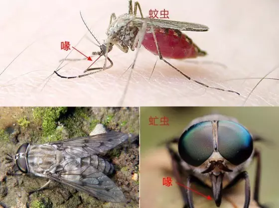
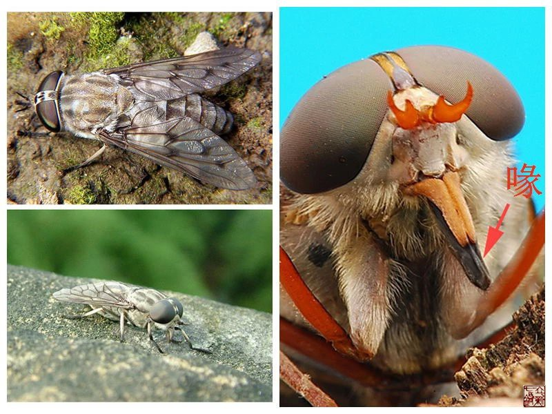
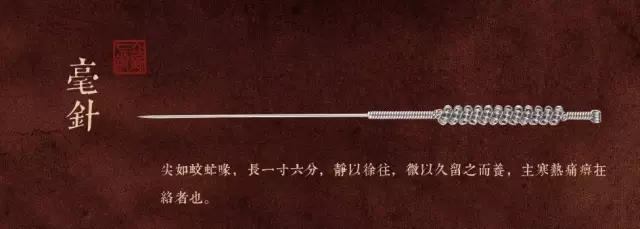
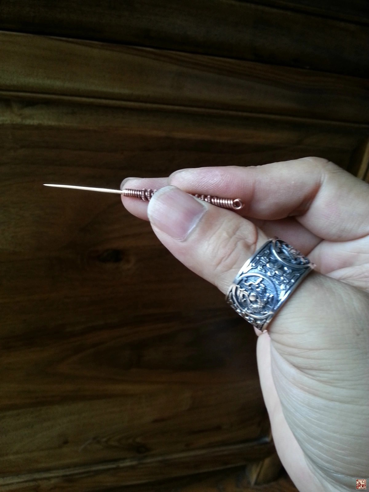
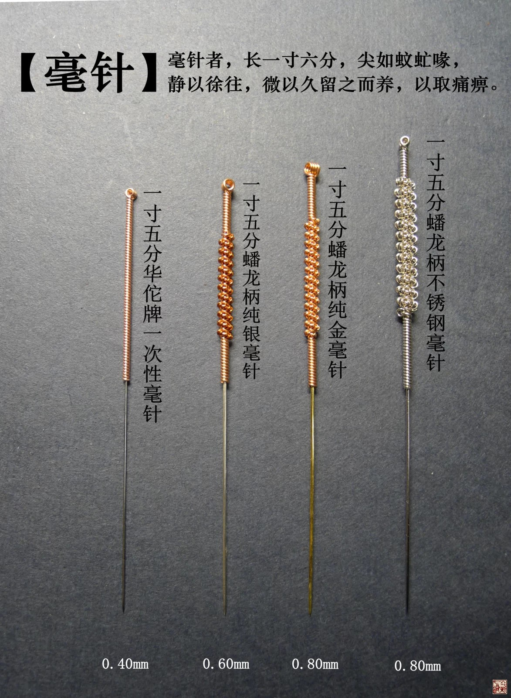
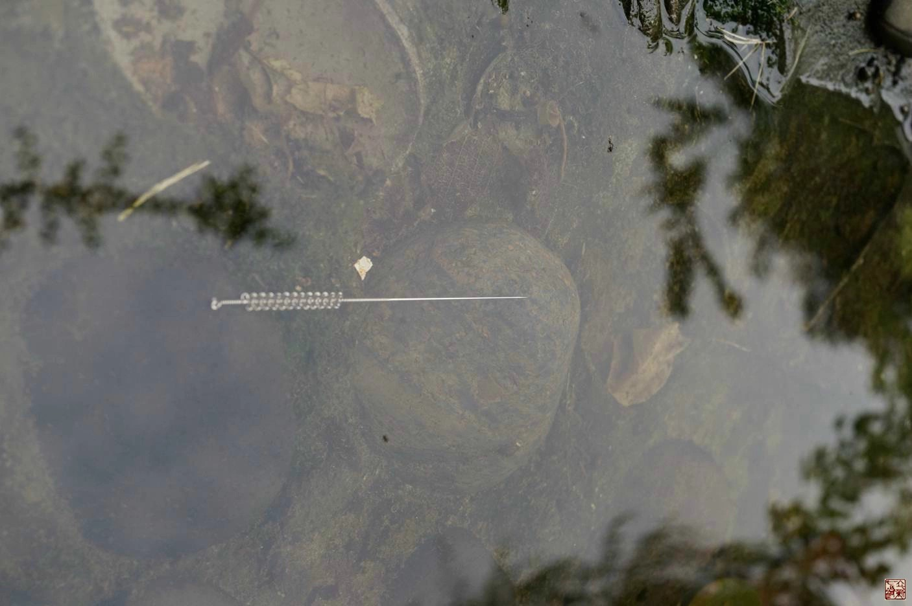
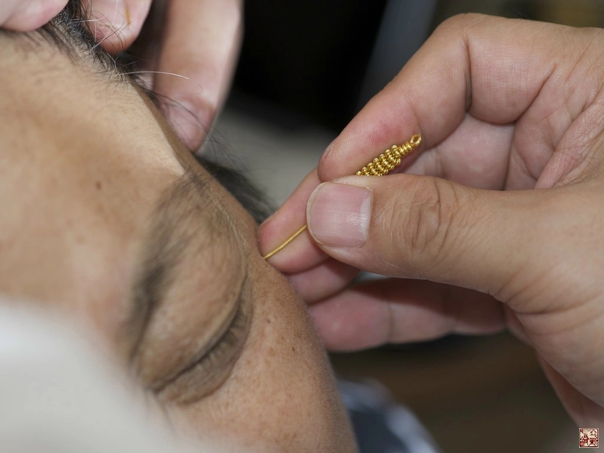

= 什么是九针（七）
冰台
2013-11-4 00:00

*五：毫针*

《灵枢•九针十二原第一》：“毫针者，尖如蚊虻喙，静以徐往，微以久留之而养，以取痛
痹。”

《灵枢•官针第七》：“病痹气痛而不去者，取以毫针。”

《灵枢•九针论第七十八》： “邪之所客于经，舍于络，而为痛痹者也，故为之治针，令尖
如蚊虻喙，静以徐往，微以久留，正气因之，真邪俱往，出针而养者也……毫针，取法于毫
毛，长一寸六分，主寒热痛痹在络者也。”

毫针也是我的常用针术之一，在立新七针的组合里占据着很重要的地位，能解决很多其他针
具无法解决的问题。在九针里，毫针的功用非常重要，是其他几支针所不能代替的。现在毫
针满世界到处都是，本来无需专门另作叙述，否则就有点多此一举。但我想，我们通过对
《灵枢经》里描述的毫针进行推断论证，可以更深一步了解灵枢九针的奥义。

毫针的针尖“如蚊虻喙”，喙，意思指嘴，蚊虻有人认为是蚊虫，因此他们很坚定的认为毫
针就是跟蚊虫的嘴一样非常的细，于是狂热追求0.18甚至更细的毫针，目的是想减轻患者针
刺的痛苦，结果在治疗一些痛痹方面疗效甚微。我参考与《黄帝内经》差不多同时代东汉王
充写的《论衡》里，有蚊虻一说：“蚊虻之力不如牛马，牛马困于蚊虻，蚊虻乃有势也。”
由此我分析，内经所说的蚊虻，应该是牛虻，也叫牛蚊子，这是一种比较大的类似苍蝇一样
的吸血昆虫，在乡下喂养牛马的地方常可以看到。夏天常见那种细小叮人的蚊子是叮不动牛
马那厚厚皮肤的。而牛虻的嘴那就比较粗了，而且是锥形的，它可以将牛马等动物厚厚的的
皮肤刺穿，吮吸其血液，可以想象这个牛虻的“喙”钻透能力是多么厉害。牛尾巴的功能其
中有一项最重要的任务就是拂扫驱赶那些叮咬它的牛虻，牛虻有时也叮咬人类，小时候在乡
下看到被牛蚊子叮咬到的人，会立刻肿起很大一个硬结的包。为了让各位对蚊虻理解得更明
白，我在网络上找了几张关于蚊虻的图片供大家参考一下。

根据毫针的尖如同蚊虻的喙这一说法，我很自然的就想到要去看看牛虻的嘴长什么形状，也
就因此知道了毫针的针尖跟牛虻的嘴一样，是锥形的尖。可是，有个问题，自然界里可以用
来比喻和形容毫针的东西很多，可《灵枢经》为什么单单要用蚊虻喙来形容毫针的针尖呢？
后来我才明白，古人在这里埋了一个伏笔，他这句话其实还表明了毫针的粗细，是跟牛虻的
嘴的粗细是差不多的。我曾专门去乡下牛场捕捉几只蚊虻回来做研究，从喙的大小来看，我
分析九针里毫针的直径至少都应该在0.5毫米以上。

而《灵枢•九针论第七十八》里说“取法于毫毛，长一寸六分”，有人据此认为毫针就是如
同毫毛。我们知道，毫毛是非常非常细的，如果按照内经成书年代推算，两千年前到底有没
有这种可以制作毫毛一样纤细的金属材料，并且能够运用于针术而不会折断在人体内，这恐
怕还真的是个问题。据我收集查找到的资料显示，近代针灸大师承淡安先生于五十年代初从
日本引进不锈钢来制作针灸针，之后才有了现代这种纤细的毫针，在此之前的毫针，其实都
还是很粗的，明代《针灸大成》里还专门讲到要用马衔铁制成铁丝来打造针灸针的。所以，
我认为这个“取法于毫毛，长一寸六分”，只是比喻毫针的外形类似毫毛一样的修长，针体
长度有一寸六分，并不是说毫针就跟毫毛一样细。

古人用蚊虻喙来形容毫针，伏笔里还有另一层意思。牛虻之类的虫子在叮咬牛马的时候，动
物们常常是没有感觉的。所以其实古人言下之意已经告诉我们针法了，毫针应该是无痛的，
而且“静以徐往，微以久留”，是在安静的环境下，缓缓的将针挤进穴位，不要有太强的刺
激，然后留针候气，让正气顺着过来，将邪气全都驱赶。这样的话，即使针拔出后，正气也
已经培养起来了。

毫针长一寸六分，从这个长度来分析，说明毫针设计出来是应用于皮内肉上的经脉气穴，并
不针对肌肉深处。这个观点我已经说过很多次了，《素问•刺要论篇篇第五十》里也说：
“刺皮无伤肉、刺肉无伤脉、刺脉无伤筋、刺筋无伤骨、刺骨无伤髓。”所以大家要明白，
《灵枢经》有一个中心思想，九针里所有的针具，都不是用来针对肌肉的。现在很多医生把
毫针扎进患者肌肉里去，做捻转缠绕上下提插等手法，强行令患者产生胀痛感，其实是损伤
了肌肉，往往疗效也并不好，这都是由于对灵枢九针的错误理解造成的。

用针你必须先明白为什么扎针，“邪之所客于经，舍于络，而为痛痹者，故为之治针，令尖
如蚊虻喙，静以徐往，微以久留，正气因之，真邪俱往，出针而养者也……”毫针是用来调
气的，所以通过用毫针调理经络气血，培养正气，就能够治疗很多痛痹。

古人把九针的毫针设计得比较粗，有什么意义呢？我认为原因主要有两点，第一点是由于古
代做针的金属材料延伸性和韧性都不太好，必须做粗一点。如果针做得太细，扎针就很容易
断裂，我们看明代《针灸大成》里还有专门讲“治折针法”，我手里有一些以前收集的民国
年间出版的国医秘方书籍，其中还能经常看到介绍治针断在人体内的方法。说明至少在民国
以前，针灸师扎针治病的时候，经常会有断针的情况发生。由此我们可以推断《黄帝内经》
成书时代，一两千年前的古人们，他们的毫针能不能做出如头发丝这般纤细来扎。第二点，
也是最重要的一点，通过我多年临床中对比实践，我发现在差不多相同的条件下，粗针确实
比细针的疗效要好。说到这里，可能有人立马就会联想到粗针的刺激更强这方面去，其实与
强刺激一点关系都没有。我前面说过，《灵枢经》九针里的毫针其实并不追求强刺激的，讲
究的是“微以久留”，并不需要太明显的针感，微微的有点儿感觉就行了，关键点是留针时
间要长。恰恰是因为九针里的毫针不要求有针感，所以较粗与很细的毫针留在穴位里，它们
各自所起到的功效，就完全不一样了。如果还不明白，你就去河沟里流淌的水中间，用粗棍
子和细铁丝插在水流中间，看看他们各自周围流经的水有什么不同的反应吧。呵呵，学内经
你如果不结合生活，就凭死看书，就凭你学院里学到那些知识就像读明白？没那么容易。这
些观点，《灵枢经》讲得非常明白，但据我所了解，国内外搞针灸的人，往往谈“粗”色变，
似乎只要针粗了就是一种罪过，大多都盲目追求纤细毫针，很少有人思考如何通过针具来提
高疗效这个问题。

至于毫针做的非常细小，有没必要？这是仁者见仁智者见智的事，因为现代的制针技术已经
完全不必担心细针容易断的问题了，只要你愿意，你做0.1或者更细的针来扎也没问题。但
就《灵枢经》九针的治疗理论来说，其实并不赞成用太细的毫针，因为九针本身的治疗机理
是绝对安全的，所以首先要考虑的就是如何取得更好的疗效。至于说扎粗针痛苦就一定大，
这纯粹是一种意淫。意淫是你在心里的想法，你非要想得这么邪恶，我能有什么办法呢？但
我要代表灵枢九针告诉你，扎针产生的痛苦大小，其实并不取决于针的粗细，只不过粗大的
针容易让人联想，产生一种恐惧的感觉，那其实只是心理因素占了主导。所以古代一个高明
的针者在扎针之前，对患者要做的第一件事情都是先治“神”，如果这第一步做好了，患者
们就会发现原来粗针并不会比纤细毫针更痛，甚至痛苦还更小。疗效自然也很好。当然了，
扎针的痛苦大小，除了“神”的决定性作用以外，还取决于针者对病痛的认知深浅以及运针
熟练程度。愚医们往往认识不到，自己不在这些方面找问题，却一味只怪针太粗了。如同人
穷怪物饥，屋漏怪瓦稀，这种行为非常荒唐。

你只需想一想，牛马等动物的警觉性可以说非常高，你要想悄悄靠近它们，再轻的动作也是
远远的就被它们发现了。但它们被牛虻咬了却不知道，往往是被咬完之后皮肤发痒起大包了
才有感觉，人家蚊虻是怎么做到的？针术是一种术，进针是靠手法技巧，并不是靠蛮力。虽
然是粗针，手法运用好了，并不会有什么痛苦。即使再细的针，你如果手法不熟练，不会正
确运针，扎人也是很痛的。做医生，如果你的疗效不好，请多在自己身上找找原因吧。
