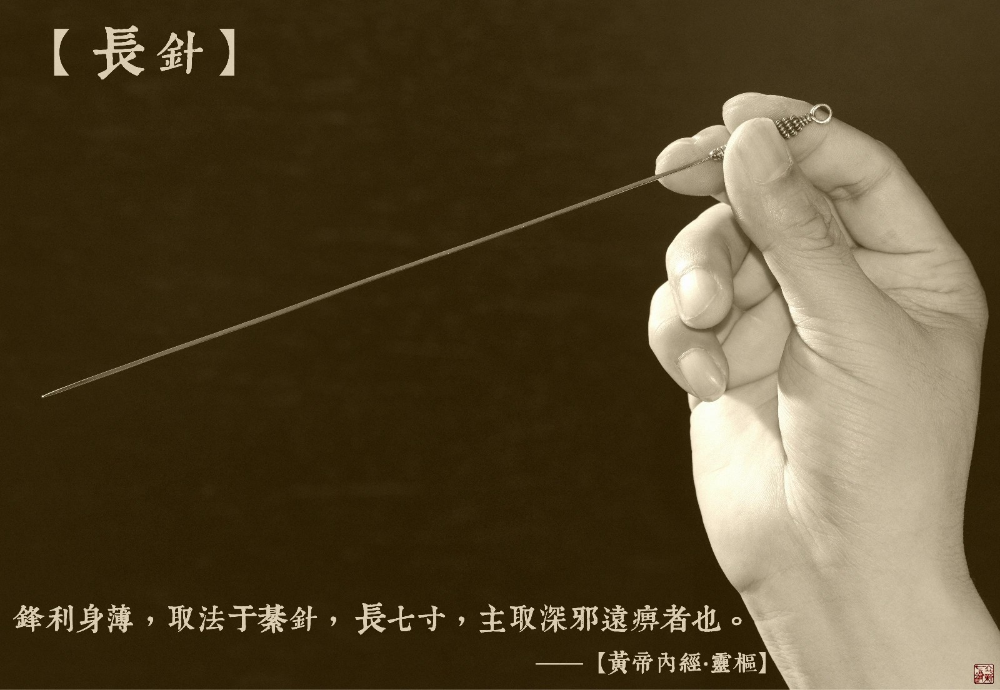

= 什么是九针（八）
冰台
2013-11-4 00:00

*六：长针*

《灵枢•九针十二原第一》：“长针者，锋利身薄，可以取远痹。”

《灵枢•官针第七》：“病在中者，取以长针。”

《灵枢•九针论第七十八》：“八正之虚风，八风伤人，内舍于骨解腰脊节腠之间，为深痹
也。故为之治针，必长其身，锋其末，可以取深邪远痹……长针，取法于綦针，长七寸，主
取深邪远痹者也。”

“病在中者，取以长针。”这个“中”，是内、里面的意思。那这是指什么病因？《灵枢•
九针论第七十八》将九针分别对应天地四时阴阳，其中长针对应的是风，“风者，人之股肱
八节也，八正之虚风伤人，内舍于骨解腰脊节腠之间，为深痹也。”八正，指二分、二至、
四立，也就是春分、秋分、冬至、夏至、立春、立夏、立秋、立冬这八个农历节气。节气交
换的时候，气温变化比较突然明显，人体最容易遭受病邪的侵扰。“股肱八节”，指两腋、
两肘、两髀、两腘，也就是肩、肘、髋、膝这八大关节，因此，“病在中”，就是指在这些
部位关节里面的痹痛，就要用长针来深取，以除风邪。

“深邪远痹”这个深和远，均指病位在人体的层次深，人体四肢结构表为皮，次为肉，再深
为筋，至深为骨。从这个意义上讲，筋骨之间的痹症即为“深邪远痹”。深、远，又有久远、
长期之意。邪气深伏，病程较长，治疗起来见效就相对比较困难。《素问•痹论篇第四十三》
指出，“其留连筋骨间者痛久”，就是对深邪远痹的又一注释。

长针，“取法于綦针”，《诗经》里有“缟衣綦巾”之说，据此推测綦针应该是缝綦巾衣服
之类用的针，巾相对而言是比较轻而薄的，所以綦针应该是比较细的针了，那么由此推论，
长针也不会是很粗的针。但长针“锋利身薄”，说明长针是扁的，尖端尖锐，长针“长七
寸”，相当于类似20厘米左右这么长的针，所以其实九针里的长针就是一支扁针。以前长针
的图片我只放了一些长毫针模样的“长针”在网上，我想如果真正喜欢研究九针的人，稍微
动点脑筋就一定会明白“锋利身薄”这么浅显直白的描述吧？可笑那些模仿立新七针的人真
的是丝毫不动脑筋，也可以说毫无实战经验，所以一个都没明白，仍然是依葫芦画瓢，老老
实实做了一些加长版的毫针当长针去卖，嘿嘿，有时候观察这些现象，有趣得很。

扁形的长针有什么优势？跟圆形的长针在疗效上有何不同？呵呵，你没有体会，也没见过，
仅凭想象，我怎么说怎么讲你也不会明白的，试一试就知道了。老祖宗的智慧，岂是尔等
“高文化程度”的人所能凭空领悟的？

那么，什么样的“病在中”需要用这么长的针来取？前面我们已经分析过，内经针术理论中
九针都是不针对肌肉的，那么不可能这里又要用长针去扎肌肉深刺。再看《灵枢•九针论第
七十八》：“八风伤人，内舍于骨解腰脊节腠之间”，长针的功效是除这八风，风在哪里？
舍于“骨解腰脊节腠之间”，骨解，是指骨缝。腠，指皮肤和肌肉的交接处。按此理解，长
针，应该是专门用于八大关节和腰背部脊椎间透刺的，这些部位都没有直接针对肌肉肌腹。

国内一些针法如芒针、莽针、巨针、赤医针、红医针等等，都可见到类似长针的针具，但这
些“长针”多是用于皮下透刺，治疗某些疾病确实也有一点疗效，但他们早已经不按灵枢的
规矩办事了，除了诊治理论，针具也与灵枢的长针有别，有的甚至把长针做太长甚至达到一
米多长来用，看上去很霸气，但疗效似乎并没有展现出内经长针的霸气来，呵呵。

皮下透刺我就不讲了，立新七针里面没有这个针法，内经里我也没有读到这个针法，内经里
并不主张用针去直刺肌肉以及胸背部等要害部位进行深刺。我不用，但人家喜欢用，有人说
存在就是合理，所以我不能说皮下透刺怎么着，我只说我的观点。在这里，我主要讲一下我
从内经里悟出来的长针内热针法。

很多人对我表示非常奇怪，说你怎么就想得出来这些稀奇古怪的念头哇？呵呵，我说过，我
并没有把玩针和治病当成一个必须挣钱的手段，没想过要靠这个养家糊口，我只是一个针术
玩家，相当于一个九针发烧友。九十年代我曾是一个HIFI发烧友，痴迷于晶体管、场效应管、
电子管、功放、CD机、音箱等等器材设备的制作和改造，疯狂到已经变态的程度，有时候仅
仅为了更清晰的听到歌手演唱时发出的一丝轻微气息声，就不惜成本重金投入。这些都已经
成为过去，如今我摇身一变成了九针发烧友，我同样是不惜成本，用样是有些变态，疯狂痴
迷于九针的研究。所以那些把针术当成挣钱养家发财致富手段的人，你和我追求的境界都不
同，怎么跟我比呢？你会很累很累的啊。我有位七针弟子曾这样控诉我：“当我们还在玩毫
针的时候，您已经在玩大针了，当我们开始玩大针的时候，您已经在玩立新七针了，当我们
开始玩立新七针的时候，您已经在玩纯金七针了，甚至还开始用天然野生麝香来喂养金
针……师父，您这样做叫我们情何以堪啊？”

呵呵，如果按照九针玩家的级别来衡量，我至少应该是属于骨灰级别的。按我的生活理念来
说，如果玩九针，不能玩出个与众不同，不能玩出个高层次，不能玩出个高品质，不能玩出
个技术比别人高高在上，那活着还有啥意思哩？

内经里面讲到有一个燔针，现在的人都认为燔针就是火针，甚至还有认为内经里的大针就是
火针的，完全曲解。我不以为然，我认为这是对内经针灸理解方面的一个很大的误区。关于
燔针，内经里依稀散见下列章节之中：

《素问•调经论篇第六十二》：“病在肉，调之分肉；病在筋，调之筋；病在骨，调之骨，
燔针劫刺其下及与急者，病在骨，焠针。”

《灵枢•官针第七》：“九曰焠刺，焠刺者，刺燔针则取痹也。”

《灵枢•经筋第十三》：“足太阳之筋……其支者，出缺盆，邪上出于頄。其病小指支，跟
肿痛，腘挛，脊反折，项筋急，肩不举，腋支，缺盆中纽痛，不可左右摇。治在燔针劫刺，
以知为数，以痛为输，名曰仲春痹也。”

焠，是工匠们将金属烧红后浸于水中急速冷却，以控制金属中的含碳量，使打造出来的刀具
锋利而坚韧。焠针是什么意思呢？不可能是将针烧红了放凉水里吧，这一行为有点不符合情
理。我思前想后，最后认为焠针应该是用火将针烤热来扎针。“焠刺者，刺燔针则取痹
也。”《说文》对燔的解释：“燔，热也。”所以燔针就是把针烤热了然后去扎，这才叫焠
刺。我们以前在民间尚能够见到民间老中医先将针灸针含在口里，再取出来扎针的情况，有
人见了还以为老中医在用口水消毒，嘲笑中医愚昧无知，殊不知这正应了“无知笑有知”那
句古话。老中医为什么要先含口里？我们看《灵枢•官针第七》的解释：“刺燔针则取痹也”，
这燔针是用于治疗痹症的，我们都知道，风寒湿三气杂至合而为痹，本身就是寒凉所致的病
痛，如果我们再用冰冷的针去治疗，岂不雪上加霜？《素问遗篇注》里有这样一句话：“用
长针，未刺之时，先口内温针，暖而用之。”这也能够解释老中医为什么要口含银针。我们
都知道热胀冷缩的道理，冬天我们的手因为寒冷，手指冷的苍白，所以看到手掌都要小一些，
到了夏天，手比较温热，气血充盈掌指，手就显得大一些。气得温而易行，冷则缓行，古代
有针灸医生将针投入热汤里取出扎针，也就是这个用意。

所以有人认为燔针就是现在的火针，这个理解肯定是不对的。我们看看现在的火针疗法，针
灸师把毫针烧的彤红白亮，然后迅速把上千度高温的针刺入患者肌肤里，这种针法我估计是
受到满清十大酷刑的启发研制出来的，不然我真的想不明白这样变态的疗法从何而来。曾有
人说火针是源自内经九针的针法，我听了又晕又吐，内经岂能干这等脑残事儿？我且不跟你
争论疗效如何，也不跟你争论烧烫伤之后遗留的瘢痕等问题，我只消问你一句：人体这些局
部出现冷凉，病因你弄明白没有？如果你不疏通经脉令患者气血来恢复局部体温，你以为用
火烧电烤就可以解决这个问题？这未免把人体想得太简单了吧，如果气血不足以濡养患处，
你把人家皮肤烧烂烤焦了也解决不了问题，过了身也还是会冷的。

《灵枢•寿夭刚柔第六》里有这么一段话：“刺寒痹者内热……黄帝曰：刺寒痹内热奈何？
伯高答曰：刺布衣者，以火焠之；刺大人者，以药熨之。”这里提到一个内热，但黄帝并没
有问布衣的内热怎么治，只问了大人的内热法。为何布衣和大人有区别呢？布衣为啥就要以
火焠之呢？因为劳动人民所受风寒湿更重更深，深达骨缝，“病在骨，焠针”，所以要将加
热的长针深入到骨缝里面去治疗。而大人们养尊处优，病邪一般都不能深入，大多只是肌痹
筋痹的问题，所以浅刺扎针后再热熨皮肤就能有很好效果。

“寒痹者内热”，何为内热？除了焠和燔让我理解成用火把针烤热再刺入体内，这“内热”
二字也让我产生了灵感。《素问•调经论篇第六十二》：“病在骨，调之骨，燔针劫刺其下
及与急者，病在骨，焠针。”这里提到“劫刺”，何为劫刺？劫，有强取，劫持之意，《说
文》解释：人欲去，以力胁止曰劫。而通常抢劫打劫的时候动作都是很快的，陌生人悄悄地
温柔的从你兜里往外掏钱拿走就不叫抢劫叫偷了。所以从这样来理解，我就想到劫刺与内热
的关系，于是立新七针多了一个叫内热针法的名词。把长针刺入痛痹的关节缝隙里，来回快
速的抽插，对，抽插，这个动作不用我教，你懂的，然后患者会感觉关节里面像着火一样的
发热，但皮表却不会受到损伤。不懂吗？有生活常识的都明白，摩擦能生热啊。呵呵，你们
说如果这都不是内热，还有啥是内热？

特别是骨关节深处寒气聚集，如果天长日久形成骨痹，这时你要是再用冰凉的针进去刺激，
就类似于雪上加霜寒更寒，会有什么现象发生？症状加重啊伙计！这一行为肯定不利于疗效。
如果你要用粗银针插进去再在外面点火加热，想把热量带进去驱寒消炎，且不说你这招疗效
差强人意，先说你这笨办法，恐怕热量还没带进去多少，外面皮表的肉先被你烫熟了，杀敌
八百自损一千二啊伙计。

所以要记住，内经讲“病在骨，焠针”，在用长针、大针之类治疗骨关节痹痛的时候，最好
是先加热再扎针，然后视情形采用内热针法，这样疗效会很好的，一些患病多年的膝关节冷
痹，很快就治愈了。长扁针内热针法，教科书上没有，市面没有，内经里有，所以这是内经
九针的针法，也是冰台的玩法。
