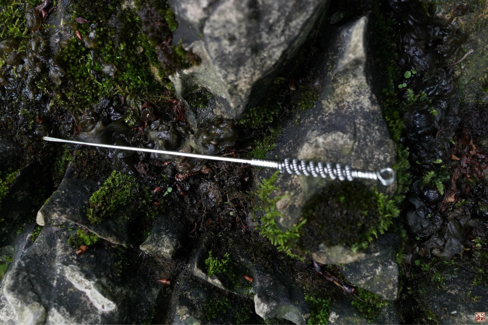
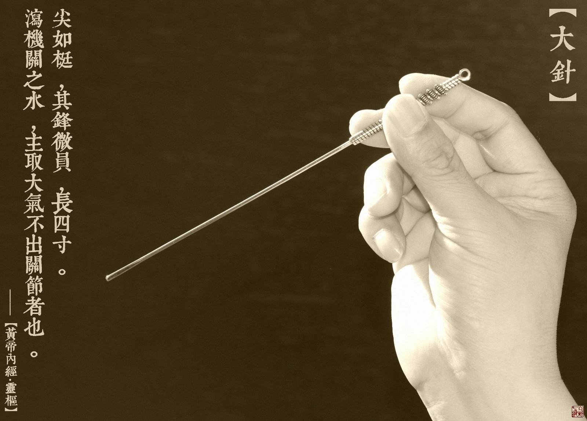
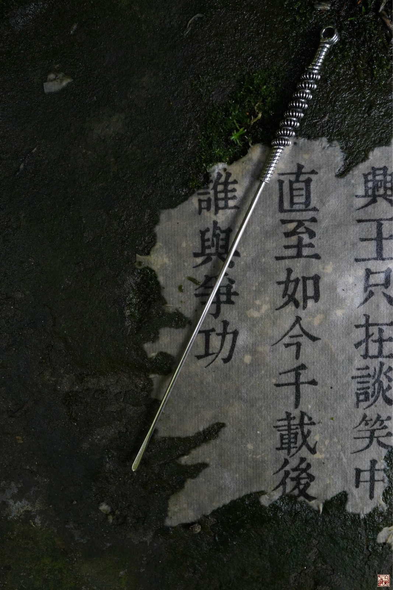
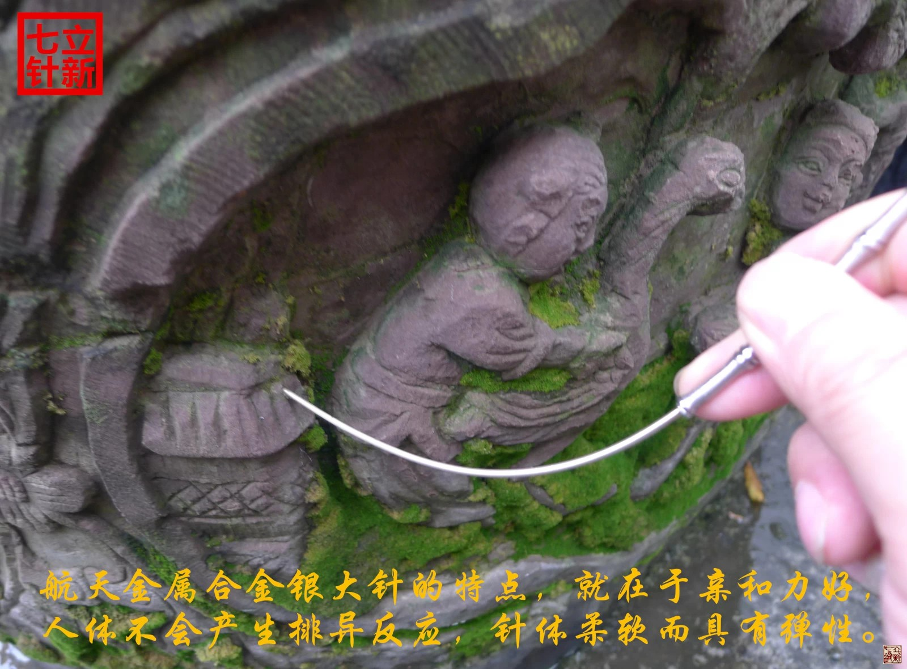

= 什么是九针（九）
冰台
2013-11-5 00:00

*七：大针*

《灵枢•九针十二原第一》：“大针者，长四寸，尖如梃，其锋微员，主取大气不出关节者
也。”

《灵枢•官针第七》：“病水肿不能通关节者，取以大针。”

《灵枢•九针论七十八》：“九者，野也。野者，人之节解皮肤之间也。淫邪流溢于身，如
风水之状而溜，不能过于机关大节者也。故为之治针，令尖如梃，其锋微员，以取大气之不
能过于关节者也……九曰大针，取法于锋针，其锋微员，长四寸，主取大气不出关节者也。”

在剖析大针之前，我想先讲下与大针相关的一些事情，其实大家明白其中道理之后也会受到
一些启发的。网络上曾有人说我是直接把陈超然老师的拨针改名大针，骂我欺世盗名。我一
直不怎么做解释，我想清者自清，但最近别有用心的人老是拿大针来说事，让很多不明究竟
的人也跟着鄙视我，这种感觉很不爽，所以我觉得有必要澄清一下很长时间以来扣在我头上
的帽子。

我是08年9月跟陈超然老师学超然拨针，回家运用过程中疗效有好有坏，但总的感觉是比之
前用的针刀钩针之类的疗效要好得多，所以当时我也在爱爱医上也努力宣传超然拨针。到了
09年3月，陈老师到重庆办事，顺便来我诊所，让我安排几个患者他来治疗给我看。我就预
约了八个患者，结果没料到陈老师治疗的这八位患者有七个疗效都不好，其中有两个后来症
状比原来还加重了，这件事令我很惊讶。这时候我才开始正视拨针，陈老师的拨针肯定是有
效的，但为什么会导致这样的事情发生？我发现他是一位西医理念的医生，这个问题上，他
完全忽略了患者的地域差别这个重要的因素，他在江阴用这样的方法可能疗效很好，但重庆
的地理气候与江阴完全不一样，重庆本地患者大多身上寒湿都比较重。当时拨针的针法主要
是很大力的撬、拨、扫散等动作，会导致深处的肌肉软组织水肿，拨针那种剧烈的针感也是
一种气感，而体内寒湿重的人，这种气聚在体内，就会如同凝泣的经水一样久久散不开，影
响气血循环，从而影响疗效。所以这类重度寒湿体质的患者，如果纯粹考虑用运动解剖学等
西医理念的诊治思路去治疗，疗效大多都不会好到哪里去。我把这件事说出来，主要是想跟
大家分享一下我的学医历程，学习一门医术，我是怎么走进去又怎么走出来的，而不是死守
陈规。**从内心来讲，我一直很感恩陈超然老师，毕竟，是因为超然拨针才让我逐渐开始认
识到灵枢大针的。**

之所以让我发现这个道理，是由于我曾去北京山东等地用拨针治疗过几个患者，我发现北方
的患者们扎拨针之后针感很快就消失了，疗效也比我预期的要好很多。而我在重庆用拨针治
疗的患者，同样的操作方式，往往针感会持续三四天甚至更长时间，很少有患者在经历这种
剧烈的针法刺激之后，针感能够快速消失的，见效也比较漫长。这些现象让我对不同地域不
同体质的患者的诊治思路产生了重视，其实道理都明摆着：**北方冬季虽然寒冷但很干燥，
南方虽然潮湿但不寒冷，重庆这地方冬季又寒冷又潮湿，生活风俗饮食习惯地域气温环境差
别等等因素，必然导致患者相似症状却有完全不同的病因。所以我不可能把其他地方去学到
的老师的针法，一成不变的拿到重庆来用，这里面肯定有一个因人而异因地制宜的不同，用
得不好并不一定是老师的医术有什么问题，而是你自己泥古不化了。**于是我改变了拨针的
诊治思路，把拨针的撬拨扫捅等针法完全扔弃，只把它当做一支粗的针灸针来用，针法是提
插捻转点揉为主。后来在《灵枢经》里看到大针，很合这圆头针的形状，于是我就把已经改
为针灸思路的拨针形状的针具叫做大针。但那时候虽然当成针灸针在用，但目标主要还是在
腰大肌、多裂肌、回旋肌等脊柱稳定肌群上做文章，还是在扎肌肉。

后来就是到了2011年，我才开始正式的完全融入灵枢九针里去，随着自己对道法自然方面领
悟的越来越深刻，整体气血诊治理念也越来越清晰，彻底的不再用大针去刺激腰大肌多裂肌
回旋肌等软组织了，后来的针法就单纯的只是揉摩骨缘为主，不再会造成软组织水肿，刺激
也没那么强了，扎完针之后患者再也没有任何不适感觉，能起到立竿见影的功效。目前的大
针，不但外型上已经完全回归到针灸针的行列，诊治思路也不断地完善提高，最终在市场林
立的各种针法中独具一格，彻底回归了内经。

《黄帝内经》其实是道法自然的一部医书，内经九针的诊治理论，是“上合之于天，下合之
于地，中合之于人”，古人通过观察天文地理人文事物等等这些自然现象，才总结出来九针
的。在《灵枢•九针论第七十八》中，九针各自对应天地四时阴阳，其中大针对应的是野。
“野者，人之节解皮肤之间也，淫邪流溢于身，如风水之状，不能过于机关大节者也。”**
所以我们就要去自然界看看山野之风水有些什么表现，通过观察，我们就能够大概的明白大
针的功用。**

人体的关节皮肤，就如同山野一样凹凸起伏，人体之气血，也如同山野里的风水那样营行流
动。我们都见过这样一些自然现象：夏季天暑地热的时候，河水流速加快，就容易涨洪水，
并且突然的刮风下暴雨；而冬季天寒地冻的时候，冷到一定程度河水快被冻住了，流动速度
就会变得很缓慢；最平和的季节，则是春秋两季，这时候天地温和，河水相对而言是很平静
的。所以《素问•离合真邪论篇第二十七》指出：“夫圣人之起度数，必应于天地；故天有
宿度，地有经水，人有经脉；天地温和，则经水安静；天寒地冻，则经水凝泣；天暑地热，
则经水沸溢，卒风暴起，则经水波涌而陇起。夫邪之入于脉也，寒则血凝泣，暑则气淖泽，
虚邪因而入客，亦如经水之得风也，经之动脉，其至也，亦时陇起，其行于脉中，循循
然。”这段文字就充分的说明了人与自然的很重要的关系。我十多年的临床经验总结告诉我，
身上寒湿重的人扎针疗效不会太好的，因为寒湿困脾，而脾主运化，所以患者气血不会太好
调理。其原因主要是寒湿之气容易产生凝泣，比如我们衣服掉干燥地上捡起来拍拍灰就行了，
但掉湿润的地上捡起来粘上面的污垢是拍不掉的，所以**病邪流溢在人体里，特别是流转到
关节等结构复杂之处，就容易在关节里滞留，气血循行就会受到影响**。

大针的形状，是“长四寸，尖如梃，其锋微员”，主治的是“病水肿不能通关节者”。梃，
是古代一种工具，在过去，农村杀猪的时候，杀猪匠要用梃竿，在皮下筋膜层穿捅分离，然
后往里面吹气，令肉体软塌的死猪膨胀绷紧，开水烫了好刮毛。这个梃竿的形状就是圆形长
铁棍，其尖端做了点小巧妙的文章，有的做成圆形有的敲扁，所以大针的形状就一目了然。
最早我扎“大针”是按照西医理念去运用的，主要是一些撬拨扫捅等针法，幅度也比较大，
曾经遇到过两个农村的患者，说我给他们扎针像是在给猪打梃杆，因为我当时正用大针在他
皮下朝几个方向来回的捅。当时我没留意患者说的这番话，只是觉得好笑，后来翻阅到内经
的这段文字，说大针状如梃，静下来细想，这大针的形状果然有点像杀猪用的挺杆。所以**
灵枢九针里的大针，尖端是微扁的，类似于小针刀的形状，但与小针刀不同的地方是尖端没
有刃口，其锋是微圆的**。当然，诊治机理和疗效也跟小针刀有天壤之别，大针因为并不带
刃口，所以没有针刀那种切割损毁之害，无需担心大针会伤及无辜，这是老祖宗的智慧结晶。
进针的时候，取法于锋针，因为针尖是圆润的，直接扎不进去，需要借用锋针开皮，然后进
针治疗。

自从我前几年在网络上宣传“大针”以来，渐渐地，市面运用大针的人也多起来了，很多学
医人不善于研究琢磨，但依葫芦画瓢的本事还是蛮强大的。但我并没有将自己真正的大针图
片放到网上去，而模仿者也不动脑筋，不明究竟，所以他们千篇一律的也就模仿一支前端稍
小的圆头大针出来，呵呵，有时候看到就很好笑，为什么不去了解大针的内涵？所以其实他
们只是模仿了针的外形，根本不明白大针为什么做，怎么做。所以基本上都在错误的运用大
针。我看到有人用大针扎肩关节的，有扎臀中肌的，有在腰背肌肉里大力斜刺的、有用来扎
膝关节的，还振振有词自己是内经九针的大针。**他们这么做有效吗？有的有效，有的没效，
因为脑子里全部都是解剖，完全没有考虑气血等问题的影响，所以大部分患者效果都不好，
有些还会加重症状。**原因就是没明白这支针到底应该为什么而扎，患者的病痛到底是哪里
的问题。《灵枢•官针第七》指出“疾浅针深，内伤良肉，皮肤为痈；病深针浅，病气不泻，
支为大脓；病小针大，气泻太甚，疾必为害；病大针小，气不泄泻，亦复为败。”老祖宗两
千年前就提醒了你，行医不能做一个没脑子的愚医，如果该用毫针你却用了大针去扎，该用
大针你却用了毫针去治疗，效果都不可能多好的。如果病因在远处，你却在局部扎针，或者
病因在浅处你却拿了大针往深处捅，那么你忙活半天也是徒劳，甚至还会大量耗费患者的精
气。**作为内经针灸来说，针者下针之前，必须明白医理，明白病因，为什么扎这一针，扎
完后立刻会有什么效果，后期还会有些什么变化，这些在扎针之前，心里至少应该有个八九
成的数，否则你这针扎得就是稀里糊涂的。**

我们看看关于大针的主治，“主取大气不出关节者也”，“不能过于机关大节者也”，“病
水肿不能通关节者”，都涉及到一个词“关节”，关节肯定是指四肢关节了，但你可别以为
这就是说在四肢关节处扎针。千万看清楚了，《灵枢经》可是说的“大气不出关节”、“水
肿不能通关节”哦，所以这大针肯定不是用于四肢关节处扎针的。那么什么地方出了问题，
才会导致大气不能“出关节”和水肿不能“通关节”呢？

首先分析一下四肢所过的经脉，我们看看手臂，手三阳经从手臂出去到哪里了？大椎，大椎
是诸阳之会，如果颈椎下位段出了问题，手三阳经受阻，就会导致关节之气不能出上肢关节。
“病水肿不能通关节者”，肿，繁体字写法是“腫”，肉旁加一个重，只有肉里面水分多了
才会重，这就是肿，其实说穿了还是个堵，经脉不通造成的。而我们看到人体最长的一条经
脉膀胱经是从腰椎两旁走到腿上去的，如果腰椎部位出了问题，膀胱经受阻，就会导致水气
堵塞不能通下肢关节。所以这才是古人说的不能“出关节”和“通关节”，针对的病灶处就
是颈椎和腰椎部位了。这也说明了大针只是用于治疗骨病，不是用来扎肌肉的，再次符合
《素问•刺要论篇第五十》：“刺皮无伤肉、刺肉无伤脉、刺脉无伤筋、刺筋无伤骨、刺骨
无伤髓”这段话的要义。

为什么要这样去分析思考？没办法，写《黄帝内经》的老祖宗们人已经不在了，我们无法问
道，唯有从祖宗们留下的片言只语里去分析，结合自然现象，尽量还原老祖宗的思想原貌。
我的理由就只有一个，老祖宗们当初并没有谁教会他们精湛的解剖知识，也没有学过高深的
现代医学体系，更没有借助复杂的检查仪器和进口医疗设备，不但没让子孙们绝了种，反而
不断繁衍了几千年。这一切，不可能只是你近代才几百年历史现代医学的功劳。那么，在那
些没有文化“不科学”的年代，“愚昧的”老祖宗们又是怎样去理解和诊治疾病的呢？《黄
帝内经》里面其实用了大量的文字解释，很清楚的一个中心思想就是遵循自然现象。想一想
吧，我们要还原老祖宗千年前的思想，不可能去借鉴现在的生活习俗语言文字思想这些，因
为这些早已变化了两千年。几千年来，亘古不变的是什么？答案就是一个：自然现象！千年
以前水是高处往低处流，千年以后依然如此；千年前太阳出来黑夜就下去了，千年后也是这
个道理；千年前有春夏秋冬季节变化，千年后依然存在季节的变化气温不同现象……我们要
挖掘千年以前老祖宗们的思想，不借助这些自然现象来理解，还能怎样？

《后汉书·华佗传》里曾对华佗的医术作过这样的描述：“若当针，亦不过一两处，下针言：
当引某许，若至，语人。病者言：已到。应便拔针，病亦行差。”如此神奇医术，华佗到底
是扎哪里治什么病能有这样的疗效？**我们都知道华佗发明了华佗夹脊穴**，我以前在治疗
一些坐骨神经痛患者的时候，在他们腰椎脊柱两旁扎粗针，偶尔也能取得这种效如桴鼓的疗
效。扎针之前，我告诉患者说一会儿针感会胀到你腿上疼痛的地方去，如果胀到那里了就告
诉我，我扎针的时候患者急叫：到了到了，然后出针，患者起来之后，坐骨神经痛的症状立
刻消失殆尽。这些治疗过程与华佗所治疗的那个病例有非常相似之处。有了这些临床经验作
参考，然后我再看看大针的尺寸，长度是四寸，我们现在所看到的《灵枢经》，是唐代王冰
注释的明赵府居敬堂的刻本，**宋明时期的1寸大约是现在的3厘米，4寸大约是12厘米左右，
这么个长度，是应该用在什么部位呢？或许是因为我曾经运用了两三年的“大针”疗法，大
多数都是在颈椎腰椎部位做治疗，远期疗效大部分都还不错，所以总结了丰富的经验。而且
我在颈腰椎部位治疗也主要是扎华佗夹脊穴，在这个部位，从表皮到达脊椎椎板上的深度，
差不多都在3寸左右，肥胖的人主要是胖在肚腹这边，背脊处并不会堆积太多脂肪，四寸也
基本上够用。所以我综合我前面的分析，认为四寸大针专门用于颈椎腰椎这些脊椎部位的治
疗，是比较合理的。**

现在我们可以肯定大针是用于治疗脊柱颈腰椎部位的专用针具了，那这个脊柱部位造成水气
不能出或不能通，主要是什么原因呢？《素问•痹论篇第四十三》说：“风寒湿三气杂至，
合而为痹也。”前面我们分析过了，寒湿性凝滞，必然造成体内深处的气血瘀阻，那么时间
久了，滞留的气血就会在骨边缘形成一些病理性堆积物，比如增生之类。这是一种自然现象，
水流经过河道的凹洼或结构复杂之处时，比重较大的砂土淤泥之类就会沉淀在这些地方，形
成堆积物。我的这个观点是有根据的，我十来年临床中，阅读过大量患者的X片，观察总结，
我发现凡是农村的患者，大多数都是很年轻就在颈腰的脊椎处开始出现骨质增生，城市里的
人则很少出现这种状况，特别是农村中老年患者，更是增生骨赘之类非常厉害。分析原因，
过去农村人由于生活工作的条件所致，整天都跟水田湿土打交道，居住条件也是瓦房土墙为
多，地面和房屋周围一般都比较潮湿，还很频繁的遭受风雨侵扰，风寒湿对气血的影响就是
循环变慢，寒生瘀，瘀性阻滞不流通，就会滞留于骨关节处，长此以往，必然逐渐形成堆积
物。所以为什么他们椎关节处附着的增生物质特别多呢，就是这个道理。

由此得知，这些由于风寒湿侵骨所引起的症状，就是骨痹了。关于骨痹，《素问•长刺节论
篇第五十五》里作了这样的描述：“病在骨，骨重不可举，骨髓酸痛，寒气至，名曰骨痹。
深者刺，无伤脉肉为故，其道大分小分，骨热病已止。”

“大针，取法于锋针，其锋微员”，正是因为大针是圆头的，无法直接刺入体内，所以这里
才特别的说了“取法于锋针”，意思就是说大针是要依靠锋针来协助开皮进针的。**“深者
刺，无伤脉肉为故”，因为脊椎关节骨痹都在深处，所以刺骨痹就要深刺，但整个过程尽量
不要伤到血管和肌肉。“其道大分小分，骨热病已止”，理解为大针从肌肉不同厚薄处挤进
去到达骨面，当我们感到针下由紧变软了，气血就通畅了，骨痹局部得到气血的润养，体温
就会逐渐恢复正常，骨热了，病也就好了。**

治疗骨痹，针法采用《灵枢•官针第七》里的“输刺”和“短刺”针法。“输刺者，直入直
出，深内之至骨，以取骨痹，此肾之应也。”输，有输送之意，也就是将大针直接扎到骨面。
“短刺者，刺骨痹，稍摇而深之，致针骨所，以上下摩骨也。”短刺之说，有多种解释，我
的理解可能与众不同。这个短，我认为应当是针刺时间上的控制，意思是说扎大针的时间要
尽量短一些，为什么要控制扎针时间？因为这大针是用于治疗骨痹的啊，也就是治疗那些体
内深处气血瘀阻过久引起的毛病，这类患者的元气，必然已经衰败。而大针粗大，耗散元气
是很厉害的，如果长时间的扎针留针，就会耗散更多的元气，于治疗有害无益。所以进针达
骨面，只需短时间就可以出针了。*为什么要摩骨？既然是骨痹，气血瘀阻就必然在深处，
圆头大针要摩的正是深处骨缘的筋痹啊，这才是大针的真正奥秘。*
