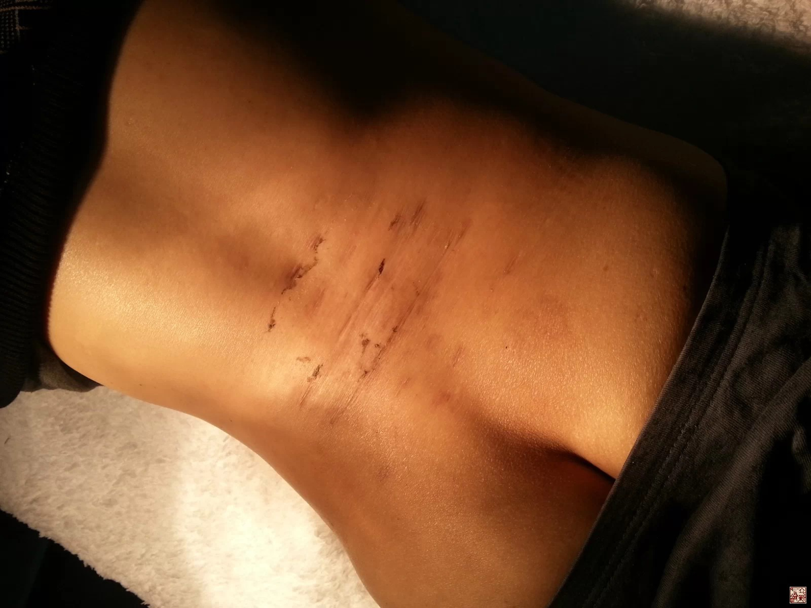

= 九针的核心思想
冰台
2014-3-14 00:00

这是前几天接诊的一个腰痛患者的腰部现状，患者是重庆大足龙水镇的一个农民，32岁，主
要症状是腰胀痛，双腿外侧发麻，病史三年。之前曾到成都、贵州、湖南等七、八个地方求
医，经过多种方法无数次的治疗，久治不愈。后来到一家正规医院接受了所谓x刀微创治疗，
因为他拍CT显示L3/4、L4/5、L5/S1都有椎间盘突出，所以医生就据此合理合法的在他腰部
切了十九刀，每刀100元，仅仅这一次治疗患者就花了1900元。扎这十九刀也就罢了，如有
些效果也还勉强有点值得，可惜这十九刀切完了之后症状依旧，最后腰部被扎成了这个样子，
如干橘皮一般。由于十几年来我都在城乡结合部地区，所以经常会碰到这类状况的患者，每
次我都忍不住哀叹：专业医生尚且如此，那些没有什么医学基础的人去行医，又会给患者带
来什么后果？最终又给自己带来什么下场？

本地有一个乡村医生，几年前去某地学了“小x刀”这一“神效医术”，回家扎一刀只收10
元，吸引治疗了大量患者。确实有些人症状在短期内有所改善，因为收费低廉，很多人都称
赞其“医德高尚”，但却没人看到他用“x刀”给这些患者残留的瘢痕和皮下结节，反而都
把他当做好医生去宣传，都不知道被人卖了还帮人数钱。我曾接诊一网球肘患者，被这乡村
医生局部切了五次，肱骨外上髁处被整出蚕豆这么大一个硬疙瘩，虽然胳膊肘的疼痛略有缓
解，但仍然是以酸痛无力为主。问题的关键是这硬疙瘩今后又怎么治疗？现在很多医生都只
看到治疗之后疼痛缓解或消失了，却很少思考今后患者会不会残留什么后遗症，更不会去注
意患者在治疗一段时间之后气色的衰败现象，视而不见。只要有疗效了，医生就颇有自豪感，
拥护的患者也众多。

我并不想要攻击谁，我相信每一个医生的本质，都是善良的，都不会故意伤害患者。我只是
觉得，现在医患纠纷越来越多，到底谁对谁错呢？其实无论医生还是患者，都应该做一个明
白人，了解一件事物的真正本质。这几年我发表在网络上的一些言论引起了很多人的不满，
从2010年“秃针”开始，我提出治病以圆润的针具针形为治疗针的观点，由于动了一些人的
奶酪，备受个别人的攻击和诬陷。但我很欣慰，因为总算有一部分医生受我所宣传的内经思
想的影响，摒弃了伤害性的医疗器具与诊治理论，逐渐的回到“圆润”的这么一个治疗理念
上来了。

在我国古代，治病所用九针乃是活人之术，所以我们现在要解读《黄帝内经》，要挖掘九针，
复原古代的九针医术，首先应该明白九针的核心思想。

其实九针的核心思想是以和为贵，以顺为治。这跟我国这几十年来的治国政策是相似的，大
家看看我们国家这些年的发展速度和日益富裕程度，再对比一下世界上另一些国家的现实状
况就明白了。反正通过解读《黄帝内经》，我是越来越明白我们国家领导人制定的治国方针
政策，也越来越佩服国家领导人的英明，高度拥护和赞同。《灵枢•玉版篇》有这么一段话：
“夫治民与自治，治彼与治此，治小与治大，治国与治家，未有逆而能治之也，夫惟顺而已
矣”。古人说“不为良相便为良医”，确实是这么个道理，调理一个患者，实际上也就相似
于治理一个国家，一个良好的医生，一定也应该是一位治国治家的高手，起码思想上应该具
备这么个理念。

真正的中医思想都是以顺为王道，不会以逆为常规的治疗手段。《内经》讲医术应该“上合
之于天，下合之于地，中合之于人”，也就是道法自然。既然道法自然，首先就应该遵守自
然规律，绝对不能动辄就使用杀戮破坏之器具。所谓“治病救人惩前毖后”，只有到了已经
成了脓血的时候，也就是情非得已的情况下，才会用砭石或带刃口的针具类去治疗。也就是
《灵枢•玉版篇》所说”以小治小者其功小，以大治大者多害，故其已成脓血者，其唯砭石
铍锋之所取也”。在依靠九针无法达到疗效的情况下，才使用砭石铍锋取之。

正因为内经九针是活人之术，所以九针里，除了铍针和锋针带刃口，其余的针，大都设计成
圆润为主的形状，即或锋利也很细小。带有刀刃的“针具”，是个正常人都知道有切割损伤
破坏的作用，这其实已经属于兵器的范畴了，《灵枢•玉版篇》说得非常清楚：“何物大于
天乎？夫大于针者，惟五兵者焉，五兵者，死之备也，非生之具”。五兵即古代战争所使用
的兵器，通常情况下，带刃口的器具是用来杀人的，所以古人讲这是“死之备”，非常情况
下才使用之。而我们现在很多医生却把一些带锋利刃口的针作为常见软组织疼痛的常规治疗
用具了。古人认为，针与兵器，一个是救人的，一个是杀人的，一生一死，生死之间的事，
道理悟明白了，对与错也就一切都明白了。

我们再仔细看看《内经》，九针之中，具有损毁伤害功能的锋针与铍针，所规定的治疗范围
是什么？“锋针者，刃三隅以发痼疾，铍针者，末如剑锋，以取大脓”，“病在经络痼痹者，
取以锋针，病为大脓者，取以铍针”。就是说，锋针是专门用于泻痼痹瘀血的，铍针是专门
用于治疗大脓的，只有病变成了脓疮的时候才用得上，这是有严格的运用范围。除此之外，
没有一个针具是用于切割杀戮的。我们看看其他的针吧：长针锋利，但是细小，而且并不针
对肌肉软组织；毫针的针灸如蚊虻的嘴，也就是说九针里的毫针的针尖其实并不是非常尖锐
的；其他的大针尖是微圆，员针尖如卵形，鍉针尖如粟黍状，员利针的针尖如牛尾状，这些
针都不具有很强的杀伤力和破坏能力。

圆者滑也顺也，针形取法太极之理，圆润而为之，以顺为治，以疏调为主，这样的针具和医
理，应该大量运用于常见的病痛治疗。非到迫不得已，尽量不开刀手术，尽量不动用切割损
毁之类的疗法，这才是明智的。
