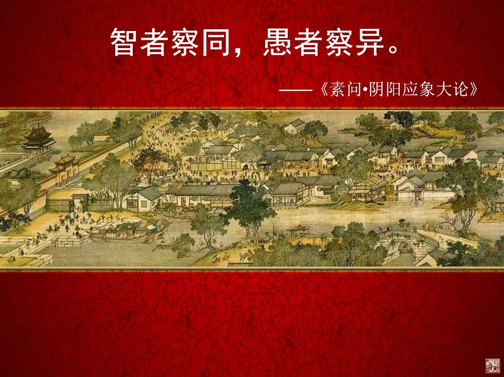
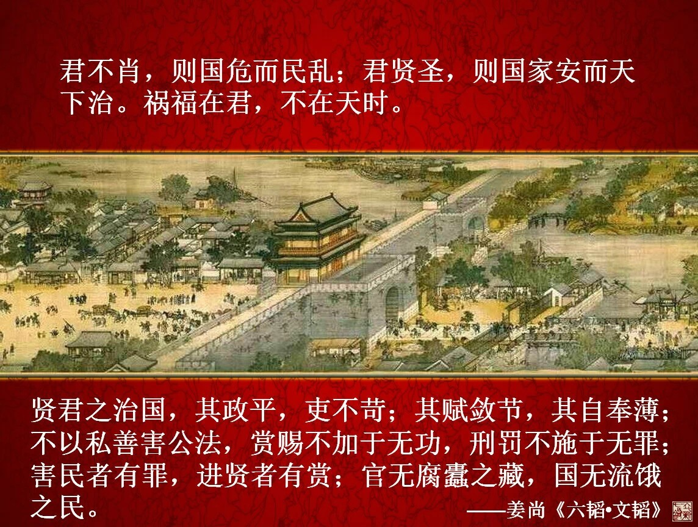
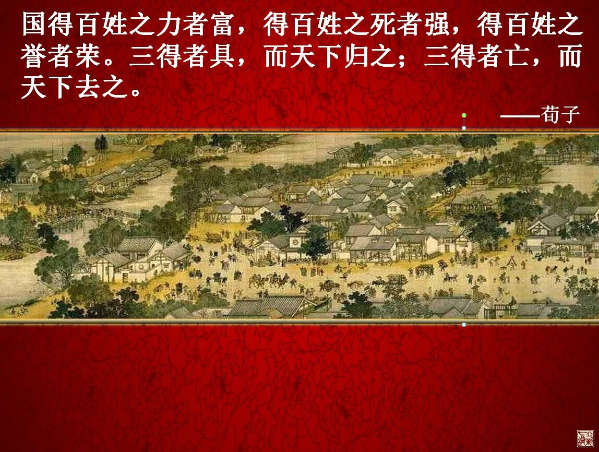
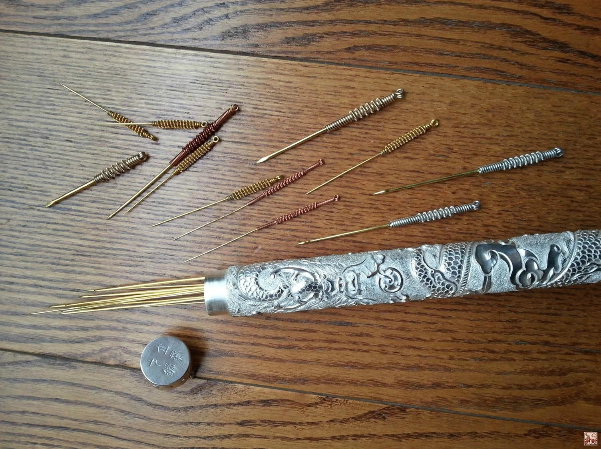
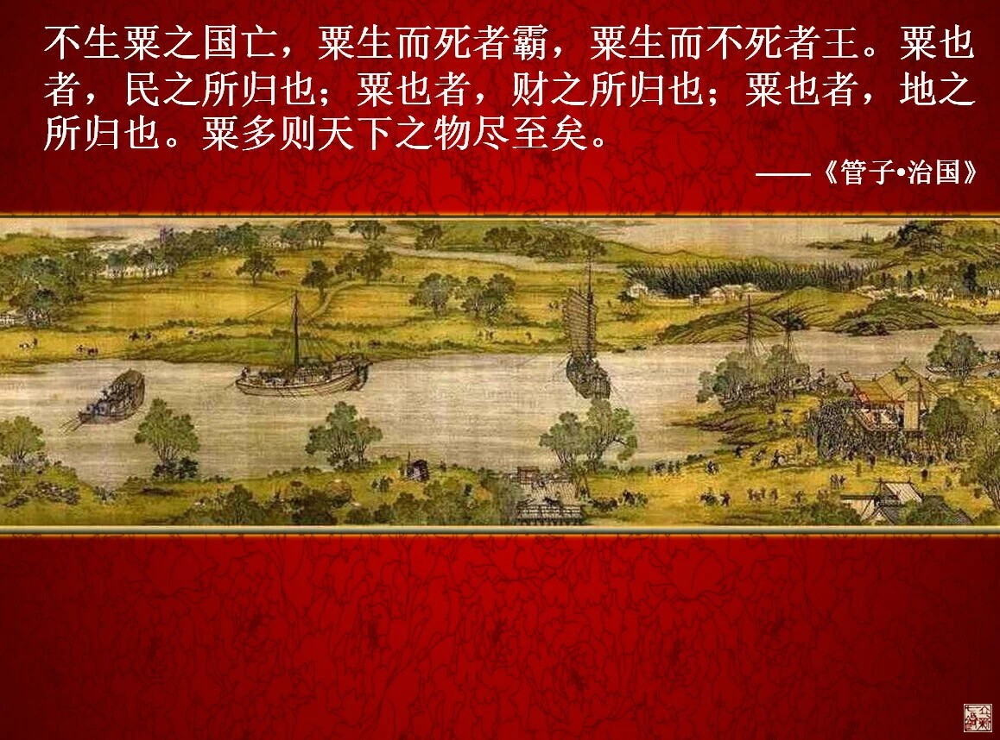

= 不为良相便为良医
冰台
2014-8-30 00:00

察观当今之中医者，有一个现象令冰台感到突兀，似乎忧国忧民者突然多了起来，时常能听
到很多中医们在高谈阔论“不为良相便为良医”，挂在他们嘴边的词，最多的就是为国，为
民，为了中医……

然而观其医术，大多还停留在术的阶段，并没有上升到法的层次，在立新七针看来，治病如
治国，一定是全方位多系统多层次的思考和处理问题才对。所谓“术”，就是小乘，“法”
则为大乘。如果用针法来解释，那些还拘泥于某穴，某点，或者解剖位等等，主要依靠经验
穴治病的针灸医生们，所持有的就是“术”。所以由此可知，所谓“不为良相便为良医”对
他们来说，实际上只是一句空口号而已，喊给别人听的，他们并没有明白治国与治病的相通
之处。懂得“法”的医生，则会局部结合整体、内外、前后、上下、左右、时间、空间、情
志、环境等等多种因素来诊治。“法”与“术”两者其实根本就不在一个层面上，所以两者
的价值观是截然不同的。

“不为良相便为良医”是句古话，按世间通常的理解是这样的：良相治国平天下，救民于水
火;良医悬壶济世，救死扶伤，这两者都非常伟大，所以，某些人就将相与医相提并论，认
为人生在世，如果当不了宰相，就要当一名造福苍生的医生。

我对此则持不同观点，我认为如果仅仅是将相与医的职位和作用来相提并论的话，这就有点
误读古人的用意了。

我们先看看古代的名医们眼中“良相与良医关系”：

春秋•医和：上医医国，其次疾人，固医官也。

东汉•张仲景：进则救世，退则救民；不能为良相，亦当为良医。

晋•葛洪：一人之身，一国之象也：胸腹之设，犹宫室也；支体之位，犹郊境也；骨节之分，
犹百官也；腠理之间，犹四衢也；神犹君也，血犹臣也，气犹民也。故至人能治其身，亦如
明主能治其国。

唐•孙思邈：古之善为医者，上医医国，中医医人，下医医病。

由此可见，古代名医们其实是把治病之道提升到了治国之道这么一个境界上来看的，也就是
说应该从思想和内涵上寻求相同的原理来理解。

在《黄帝内经》里有这么一句话：“智者察同，愚者察异”。什么意思呢？就是说有智慧的
人，看两种不同事物，看到的是他们内涵里面相通或相似之处，而愚钝的人，看到的就只是
两种事物不一样的地方。比如大自然与人，有智慧的人就会通过察观大自然和人类，做类比，
总结两者之间相类似的那些规律与表现，将自然界里的那些恒定的规律用于诊治人类的病痛，
古代中医们聪明的地方就在于懂得借力，借用自然界那些已经验证成千上万甚至上亿年的自
然规律，无需自己进行试验验证，就可以直接拿来用，一用就灵验。而愚笨的人呢，则很
“聪明”的看到区别和不同，在他们看来，人就是人，自然界就是自然界，两者性质形状都
不一样嘛，两种完全不同的物质，怎么能够直接相通呢？所以他们会“非常聪明”的认为，
一定要在人体身上进行大量的试验，得出的结论才是科学的，但试验又不能拿活人做实验对
吧，因为那违反人道的啊，所以呢就进一步聪明到去利用小白鼠来先做实验，然后将在小白
鼠们身上取得的实验成果，运用到人类身上去治疗。其实他们的表现非常无知，只知道人与
自然是不同的两种类别，却没看到小白鼠与人也不是一种类别的物质，为什么他们懂得取小
白鼠与人类相类似的地方去运用，却拒绝人类与大自然的道理相通呢？就是因为他们属于内
经所言的“愚者”一类。如果从人道这个角度看，将人比拟成小白鼠来研究，才是真正的不
人道。

丞相，乃高居君王之位，肩负的是治理国家的重任。治理国家，首先要有一位明君。一位圣
明的君王，自身必须是清廉正直的，然后明君必须懂得要从政治思想、文化生活、经济建设、
内外援交等多方面去治理国家。姜太公在《六韬•文韬》里指出：“君不肖，则国危而民乱；
君贤圣，则国家安而天下治……贤君之治国，其政平，吏不苛；其赋敛节，其自奉薄；不以
私善害公法，赏赐不加于无功，刑罚不施于无罪；害民者有罪，进贤者有赏；官无腐蠹之藏，
国无流饿之民”。从中医的角度来看，也就是说一位医者首先必须保证自己身体要好，一个
病歪歪面色灰暗的中医，很难令人相信你到底能治好什么病？欲正人请先正己。其次在治病
之前，必须先要有个规划，先做什么，后做什么，再做什么，最后做什么，有一个合理的步
骤，比如这个患者是情志病为主呢？还是痹症为主呢？是脏器问题为主呢？还是经脉问题为
主呢？那么不同的病因，就要运用不同的治疗手段与方法去对付，不至于盲目乱治，甚至滥
杀无辜。

其次治国还必须制定顺应民心的政策，荀子曰：“国得百姓之力者富，得百姓之死者强，得
百姓之誉者荣。三得者具，而天下归之；三得者亡，而天下去之”。治国必须顺应人民的意
志才是天道，如果逆民心而治国，百姓必定与你对冲，如果执政者这时候不反思自己的行为，
反而对百姓镇压围剿屠杀，这一定是走了下下策。只有顺应民心依法治国，将国家建设成法
治国家，这样的国家才能够走向繁荣昌盛，但前提必须是这个“法治”是顺应天道的，否则
越法治就越乱。《灵枢•师传》说：“夫治民与自治，治彼与治此，治小与治大，治国与治
家，未有逆而能治之也，夫惟顺而已矣，顺者，非独阴阳脉，论气之逆顺也，百姓人民皆欲
顺其志也”。医生必须明白，治病之道，其实与治理国家的道理是一样的，治病的上上策应
该是道法自然，任何强行或违反自然规律的手段都不是最佳治疗手段，遇到病痛千万不要轻
易切割损毁，你要知道，你前面的行为与后面的疗效是联系起来的，只有良好而稳定的疗效，
才能令你受到患者的拥护和爱戴，赞誉有加，后面的行医之路才会一帆风顺。如果医生损毁
切割烧灼之后，疗效不显，或疗效不稳定，那么你这个医生就很容易与患者之间变成仇人，
类似现在的医患纠纷繁多，非常值得我们反思，如此下去医生们未来的行医之路只会日益艰
难的，还谈何疗效？

第三点，君王的治国之道是知人善用、任人唯贤，这也是治国的根本策略。古人治国，求贤
若渴，如刘备三顾茅庐请诸葛亮的故事我们家喻户晓。楚汉战争中，刘邦在运筹帷幄方面重
用了张良，在安抚百姓，供应粮饷方面重用了萧何，指挥三军则重用了韩信，所以战胜了不
可一世的楚霸王项羽。而项羽由于误信谗言，导致范增不被重用，所以败亡。往大的方面来
说，一个国家，不可能君王一人去干所有的事，所以就有国防部、农业部、教育部、交通部、
水利部、外交部等等，每一个部门下面又有分了厅、局、所等等细小的组成。而且每一个部
门的第一二把手，都应该是德配其位的人才，这样才谈得上治理国家，事半功倍。那么对于
一位中医而言，针、灸、药、手法、祝由等等医术方法，也都应该掌握才对，这是从整体上
说的，具体到单独的一种疗法而言，也不应该是唯一或独立的存在，因为那样就有违自然之
道。比如针法的组成，就不应该仅仅一支毫针就代表了的，也应该具备九针，这才符合天道。
如果再细化到立新七针，其针术成员就有七：员针、鍉针、锋针、员利针、毫针、长针、大
针，这七针就类似于一个国家的几大重要部门，缺一不可，七针擅长调制五痹（脉痹、皮痹、
肌痹、筋痹、骨痹），内经说“夫九针者，小之则无内，大之则无外”，所以七针也不是固
定不变的尺寸，每一支针又有大小粗细的组成，在具体的运用时，也是各有所宜的，因人因
病而异，根据患者病情的大小、轻重、深浅、范围、新旧、内外等等因素，去选用合适的一
种或几种针具，并从患者的志意、素质、劳作、居处、脏器、经脉、经筋、气血等等，多系
统多层次全方位的进行综合调节。该用毫针调养气血的时候就别用大针去破人气血；需要用
长针治疗的深邪远痹就必须用长针；员利针是松筋的，那么筋缩筋痹的地方，就别用员针去
治，否则是出不来那功效的；该用大针治的骨痹，就别用毫针去逞能……只有如此“知针善
用”，“适得其所”，方可最快时间内真正治愈病痛，并保持长久稳定的疗效。很多针灸人
表示不理解，认为治疗病痛用一支毫针足矣，何需这么多粗大怪异的针具呢？如果你明白治
国之道，并且善于“察同”，就不会产生这种愚蠢的见解了。

试想，内经乃神书也，其道理是至圣至上的，数千年来中医名家无不顶礼膜拜，你一介小区
区，何德何能，居然敢口出狂言，轻易否定内经九针？倘若真如你所言，一支毫针足以解决
所有问题，那《黄帝内经》为何还弄那么大篇幅记载九针呢？莫非老祖宗们都活得稀里糊涂
了，非要弄出个无用的九针来长篇大论？

无论别人怎么看，他们或许是学识丰富到了仅靠一根指头也能生存的境界了。在下深知学识
浅陋，但尚且明白“尺有所短，寸有所长”的简单道理，所以此等稚言是断然说不出口的。
玩针十五载，更是越发的不敢以毫针去傲视天下，即便有了七针，也不敢以七针傲视天下，
因为有所长即有所短，这是必定的。但我若以九针自居，那便是自满了，盖因九乃天地之大
数也，谅我本事再大也不敢造次冒用九针之名，贻笑大方，故仅仅七针为用，但唯一所幸的
是，七针的所有诊治理论均取自于《黄帝内经》，继承了九针之精髓，针具针法均道法自然
而建造，并效法治国之道而创立七针的诊治理论，这就是立新七针的用针原则。

在立新七针看来，治理国家归根到底的还是要培养国民百姓能够自给自足，而不是依赖政府
救济或外援救济，如果一个国家的百姓全都丧失了工作和劳动能力，一味依靠依赖政府，那
样政府也很快就完蛋了。如果一个君王对百姓的行为过多干预，详细到一手一脚，先出左脚
还是先出右脚都要按规矩办，这样的君王这样的国家，也一定很快完蛋。真正善于治理国家
的君王，会想方设法给百姓创造一个平安、宽松、和谐的环境，但是在政治思想上狠抓，让
百姓死心塌地爱着祖国，让他们生活在风调雨顺的自然环境里努力工作，他们自己知道他们
该怎么做，这样的百姓能够自强自立，这样的国家才能够真正的强大。《管子•治国》曰：
“不生粟之国亡，粟生而死者霸，粟生而不死者王。粟也者，民之所归也；粟也者，财之所
归也；粟也者，地之所归也。粟多则天下之物尽至矣”。同理，医生治病，也是应该尽量帮
助患者身体自立独立，而不是患者长久依赖你的药物，长期找你治疗。人体内五脏六腑的功
能是天生的，经脈循行的规律也是天生的，不需要做医生的过多操心甚至干预，医生只需调
衡脏器之间的关系，保障经络营行畅通就行了，剩下的事身体自己知道该怎么办。我曾在很
多场所演讲的时候提出过我的观点，我认为医生不应该是患者生命中的伴侣，而只应该是患
者生命中的过客。粮食是国家的动脉，一个国家没有了粮食，很快就会大乱从而灭亡。气血
是患者的根本，气血大乱或衰败，医者视而不见或毫无察觉，那是很危险的事情。所以我们
所有的治疗手段，都应围绕气血二字去做文章，只有气血养好了，气血恢复了，患者们的病
痛才能够真正彻底的治愈。如果患者气血失养，你视而不见，或你的治疗手段反而会耗损患
者气血，那么这个病，你是治不好的，患者也就只能长期依赖你，最后是越来越衰弱，逐步
加快走向死亡的步伐。
