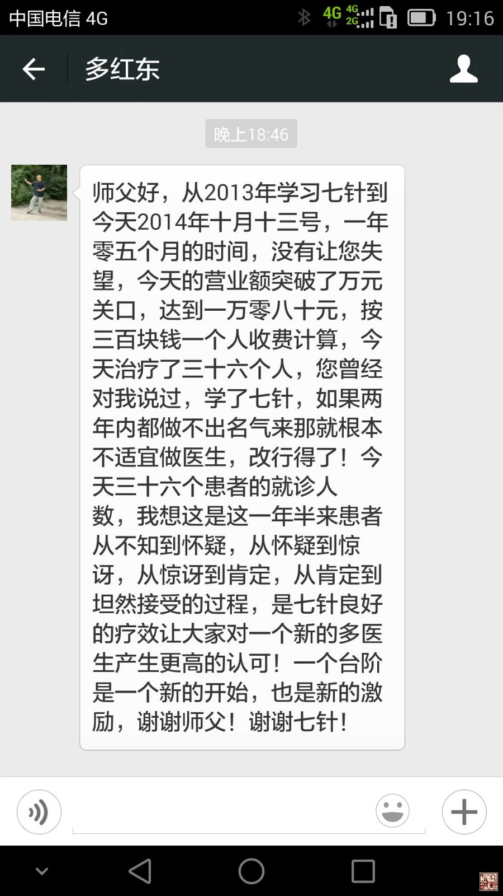

= 钱不是万能的但中医不谈钱也是万万不能的
冰台
2014-10-14 00:00

现在的中医圈比较混乱，各种养生手段层出不穷，有点类似八十年代气功热那时候的情形了。
虽然各种科普媒体和中医先贤们不断在弘扬宣传中医大道理，但人们的头脑，似乎并没有越
来越清醒，很多人的思维越来越混乱，一个混乱就是认为养生理所当然应该比治病的价值高，
也就是说会治病的医生是最没价值的，懂得预防的医生才是最有价值的。结果很多人都认为
善于治病的临床医生理所当然应该收费低廉，而那些能够“治未病”的养生师，理所当然的
应该收取高额报酬。

之所以产生这样的认识，主要是由于传说中的扁鹊三兄弟的故事，上医治未病中医治欲病下
医治已病，能“治未病”的上医被人为的忽悠宣传，夸大了他们的影响力。所以很多人其实
是被吓坏的，认为“治未病”的才是高手。也就因此，能够解决当务之急病痛症状的中医医
术，老百姓认为收费越低廉越好，收高了就是没有医德，不但收费要低，而且患者们还整天
抱怨不已，责怪医生没能一次两次拔掉他们的病根。而在一些装修比较有档次格调的养生馆
里，调理师们可以收顾客们几千一次，甚至几万元一次。特别是在繁华一线大城市里，我知
道有些甚至夸张到了做一次艾灸收费3000元，刮痧拔罐一次2000元……由于这些顾客群往往
都是有钱人，所以尽管养生馆大把大把的挣钱，也见不到有什么顾客在抱怨。

在重庆的时候，我的患者群里也有一些是富人。但我发现非常奇怪的一个逻辑，富人们去保
健消费可以一掷万金，但治病的时候，是万万不值得掏这份钱的。也就是说我在那边行医十
几年了，我能够两次三次就很彻底的解决他们身上痛了很多年，大医院也无法解决的所谓
“腰突症”“椎管狭窄”等问题，但我就从没被他们肯定过我的价值。你能很快解决这些病
痛，就说明你太容易，医生治病太容易就肯定没价值，人家养生保健能“治未病”，能解决
那些没有问题的“问题”，那才是真的有价值。有一位亿万富翁，也认识我好多年了，患腰
腿疼痛麻木，但一直对我的肯定程度比较低，因为在这类人眼里，中医针灸也就只是那么个
低廉的价格和低级的层次。所以他到处求医，治了好几年也没解决，最后来找我治疗，我给
他针一次之后症状立刻有了明显改善，顿时大喜，主动扔了900元给我的收银员，在他看来
900元已经是很高的诊费了。过了两天打电话给我：腿是没什么问题了，怎么腰还是痛
呢？……言下之意这钱跟这效果，不成正比。

我认识的一位房地产商老总，因失眠性功能减退等症状，听人介绍，到重庆江北一家隐藏
在写字楼里的养生馆里去调理，按摩师告诉他，你的症状现在虽然不很严重，但实际情况
非常严重，因为你没检查出来不代表没有问题，等医院检查发现的时候，你就病入膏肓悔
之晚矣...把这位老板吓唬的乖乖掏60万来做半年的调理。直到按摩了三个月之后，老总才
开始发觉自己好像是有点被对方忽悠了。因为他跟我也有一点熟悉，所以就联系我跑来咨
询，我一看老总的面容气色，我说你的问题哪里是那按摩师能够解决的呢？你的失眠和性
功能减退食欲不佳这些症状，其实都是外因导致的，因为这两年房地产不好做了，房子卖
不动，有时候一个月也卖不了几套房，而你公司那么多员工要拿工资，那么多的税收要上
交，银行的贷款催着要你还，大笔利息要支付等等，这些问题整的你焦头烂额，岂不是寝
食不安？所谓饱暖思淫欲，你性欲怎么可能旺盛？这些外因不解决你的症状怎么可能解决？
如果回到以前那样你房子建好几天甚至开盘就卖光了，高兴得整天红光满面的，哪里还会
有失眠性欲减退？我一句话破了这个格局，老总恍然大悟连连点头称是。然后他说他还不
算被忽悠大的，在那里调理的人里，还有一位富婆，因为感到有点胸闷，被按摩师“诊断”出
是肺癌早早期，按摩师说最高级的中医是“治未病”，将疾病“扼杀”在未成形时期，如
果此时不调理的话，等到医院检查出来就晚了，然后一番点穴按摩之后，富婆觉得呼吸顺
畅轻快了许多，立马划卡支付100万，这就是她的“早早期肺癌”的调理费……

类似乱象，在这几年我耳闻目睹太多了。一说到大把赚富人的钱，有些医生会非常赞同，立
刻使劲拍手欢迎，在他们眼里，就是应该大把赚富人的钱，然后对穷人优惠或免费，美其名
曰“劫富济贫”。对此我是极不认可，在我看来，医术根本不应该跟慈善挂上钩，在医生的
眼里，本不应该有贫富贵贱之分别心，无论患者是有钱还是没钱，这些跟你都没关系，只有
他们的病痛才跟你有关系，古代真正的明医们了解关注患者的贫富贵贱，只是为了分析寻求
患者的病因，而不是在乎他们的钱财多少，所以医生治患者当一视同仁，一旦医生有了分别
心，那就多了几份谄媚与盛气，这些东西对医术是极大的祸害。慈善是慈善家和国家政府的
行为范围，你是一个医生，去披这件外衣干嘛？你只消专注做好自己的正事，将医术精湛到
底就对了。所以我总是很犀利的指出：大医，请问谁给了你劫富济贫的权利？那些富人，难
道都是贪官污吏来的？那些穷人，难道都是天生的穷人？倘若这位富人，是靠自己辛苦劳动
勤劳所得，倘若那位穷人，是好吃懒做不思进取所致，你去劫富济贫，那么，你的行径与贼
人强盗有何区别？你的眼里为什么就只看到人家的成功，却看不到别人财富背后辛勤的汗水
与承担的风险？你这样不明事理的人去做医生，如何能真正治愈疾病？

我很难相信一个连明摆着的症状都不能迅速解决的“大师”，反而能够解决那些看不见摸不
着还没有开始发芽的“未病”，我不认为这种“大师”真的明白了多少中医的道理。

在我看来，少屁话多实话才是我们中医人的当务之急，中医都没落了几百年了，要让患者们
信任你，你先做一些实事让他们惊讶于你的即刻疗效再谈“治未病”好不好？你都被西医挤
压得喘不过气来，接近走投无路的状况下，居然转换概念去跟老百姓们说你擅长治“未病”，
也就是说你不擅长解决眼下的病痛，但能解决别人身上那看不见摸不着现代医学也检测不出
来的“潜在的疾病”。稍微有点脑子的人都知道你在瞎扯，无论你的理由多充分，关键是从
古到今没有哪一位“上医”是活了几百岁的，自己尚且不能长生不死，又如何能保障别人长
生不死？如果你“治未病”的结果与那些治“已病”的医生差不多，甚至“已病”的患者被
那些“下医”们治愈后生存质量更高更好，你凭什么说治“未病”更有价值？

在我看来，经济越是发达的大城市里，人们见多识广，对事物的认知度就越高，经济发达的
地区现代医疗设备也就越先进，医疗诊治水平也就越高，这是事实。所以经济发达的地区，
才是养生馆“治未病”生长得非常滋润的土壤。但如果一个中医，在发达的现代医学面前，
不是靠保健品或治未病等手段忽悠，仅仅靠医术去实实在在解决患者病痛的人，能够挣到不
菲的一份收入，我认为这种人是值得我们尊重和推崇的。我有个上海的学生叫陈蓉，家境殷
实，她最开始来学立新七针的时候，仅仅是闲得无聊之后的一种爱好，但她回去之后很轻松
的解决了周围一些朋友们久治不愈的病痛，她并没有去开门诊行医，但这些朋友的家人亲戚
以及他们的朋友们会主动口碑相传，一年多的时间里，她俨然已经成了一些患者眼里可望不
可求的“大师级神医”，患者们支付的酬谢费已经令她日收入超过了两万元。她不差钱，所
以每天这一两万的诊金并不是她的成就感，能够令患者们心甘情愿支付这笔钱，这种成就感，
才代表了她的人生价值。我肯定她，也并不是她日收入过两万，不管钱的事，但衡量她的价
值离不开钱，因为她这份收入，并不是靠保健、养生、文化宣传、知识普及等方法赚来，而
是靠一针一针实实在在的中医针术，解决了患者们的病痛换来的，所以我非常赞她！

在立新七针一百多个学生里，广州省中医院的范京强主任医师和番禺区中医院的多红东医师，
也算是表现得非常不错的学生之一，他俩都供职于大中型现代化国营医院的第一线，也都是
不靠注射也不依赖药物的纯针灸医生，范京强主任运用立新七针在省中医诊治了大量的颈腰
腿疑难重症患者，每个月的门诊收入最少的也在十万元以上。多红东医师最近也做到了日门
诊收入一万元以上。

虽然有人非常介意医生这个职业跟金钱挂钩，但立新七针说话不懂得虚伪，从来是表里如一。
所以我们认为在大中型医院里，门诊收入更应该是衡量这个医生医术高低和技术价值的主要
标准，因为这才真真切切的代表着患者的认可。以范京强和多红东来讲，他们二位所在的医
院里，可谓人才济济，能做到这么个日诊金的收入，更是有很多的非常不容易的。其中一个
不容易，是在大中型医院里高资历高职称的人多了去了，有著书立说的人也不少，患者更容
易被这些专家教授们吸引过去，作为一个普通门诊医生，再会说再会讲也没用，你的门诊收
入日益增长才是硬道理，这才证明有越来越多的患者开始接受你了，因为患者不都是傻的，
所谓群众的眼睛是雪亮的，诚然！另一个不容易，是因为在大中型医院里各种疗法林立，同
行里的各种针推、中药、灸疗、保健按摩，西医里的各种理疗、药物、注射、微创等等，这
些行业里每一个医生都是人精，谁都有浑身的挣钱本事，谁都能解决一些病痛，立新七针的
学员能够在这里面混得潇洒自如，傲视群雄，真的是非常不容易，所以我为他们喝彩！

立新七针源自《黄帝内经》，血液里流淌着几千年中医文化的沉淀积累，所以她很坦然，因
为来日方长，我们不仅只看现在谁笑得富足，还要看谁能长久的笑着辉煌。

