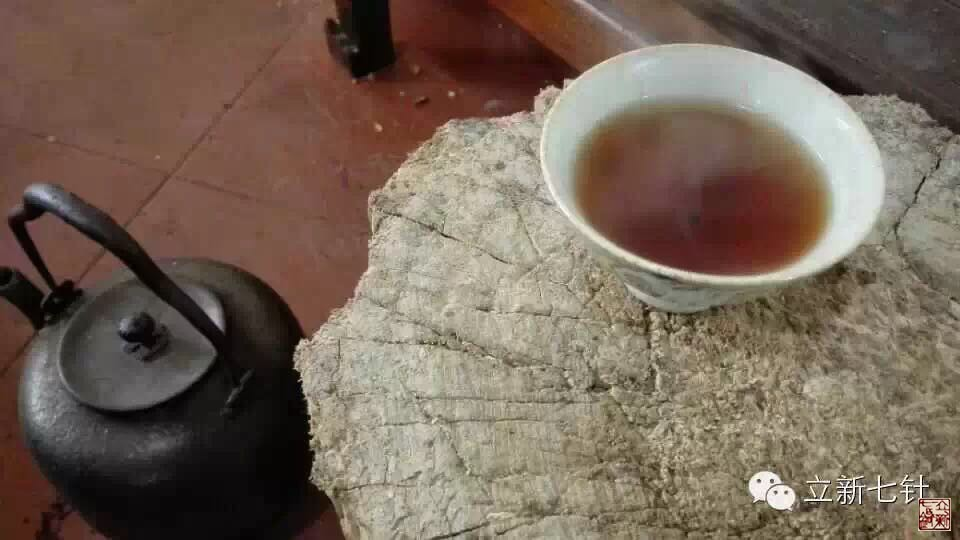

= 内经的读与思
冰台
2015-1-13 20:38

内经其实不应该读，应该是拿来思考。但是这有个问题会出来，如果读内经呢，能聚集人气，
吸引来很多“志同道合者”；思考内经呢，则只会有少数人认同你。因为内经是一本教人看
透事物“真相”的书，让人明白上古之人“天真”的真正意义，通过思考内经，你会发现原
来世间很多很多的事情，人生、医学、宗教、信仰等等，绝大多数人所看到的那部分内容，
其实都是幻象，我们大多数情况下也只是被事物的表象所迷惑忽悠着。

可是现代人，特别是一些受现代文化知识熏陶的知识分子，那种“知识”培育出来的自以为
是的性格已经很坚定了，所以他们会认定他们看到的和进行的都是对的。那么这种情况下，
思考内经的人与读内经的人，就不可避免的会产生很多的分歧。

image::img/20150113-02.jpg[]

思考内经的人会是怎样一种思维呢？他看到的“人”，是由经络气血组成的，是一些抽象而
虚幻的存在，他们在做事的时候则完全相反，会踩在地上行走。而读内经的人所看到的
“人”，则是血肉之躯，实实在在存在的经络路线与血气，可是在做事情的时候则不会脚踏
实地了，往往会不沾地气。

读内经的人，会信佛，信神，会相信有外星人，有地心世界，所以这类人如果有可能，他们
会去探索太空，寻找外星人，会去挖掘地底下，寻找地心的奥秘。思考内经的人，则不信神，
不信佛，更不会相信有什么外星人，地下世界之类的，在他的眼里，那些都是幻觉，就如经
络一样，是存在的，但你哪里找得到实物呢？因为经络是拿来用的，不是拿来看的。所以你
如果抛开思想，想去解剖出来实实在在的经络，永远找不到，因为你愚蠢。天也一样，是存
在的，可是你到天上去寻找，能找到什么？地下去挖，能挖到什么？永远找不到除了人之外
的神鬼人。

发达国家开发太空其实是基于战争需要而出发的，也就是打仗先占领制高点的策略，他们借
口寻找外星人探索太空世界其实只是一个掩盖事物真相的幌子。内经早已说明白，至大无外，
至小无内，内外这个范围都不存在，你如何找得到大？又如何找得到小？所以，经络是这样，
外星人也是这样，你找一辈子找不到，再找几万辈子也找不到的。天就是天，地就是地，人
就是人，人居天地之间，是因为人有思想有心念，所以思考内经的人就懂了：世间所有的一
切，其实都是围绕着人的心念而变化的。
