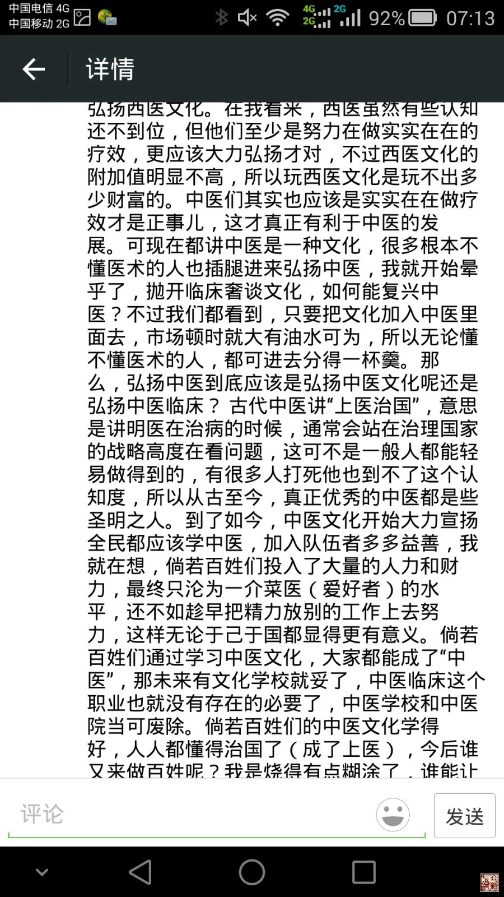
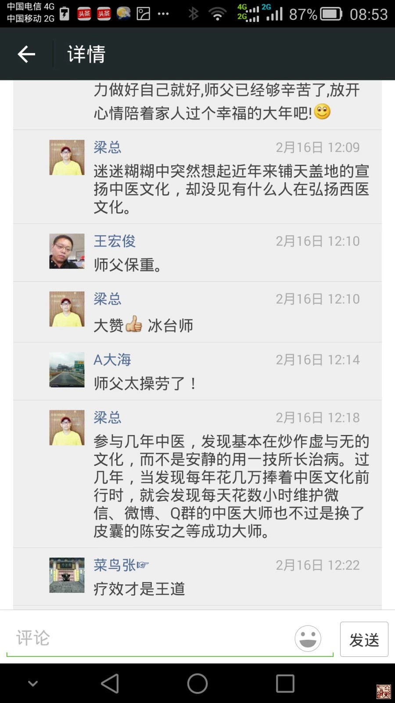
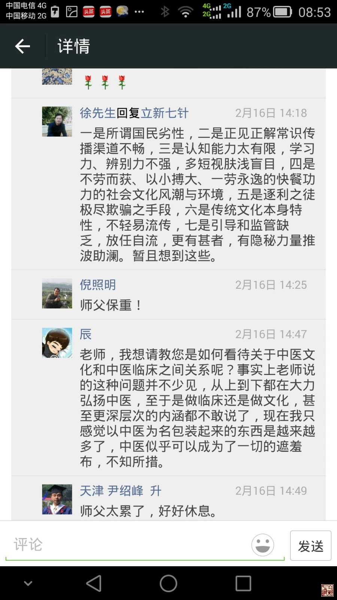

= 思考中医文化
冰台
2015-2-18 00:00

从八十年代最初的武术热潮至今，我经历过的中国传统文化热潮已经有很多种类了，每次热
潮那种全民蜂拥参与的情景历历在目，然而每次文化高潮退去之后，除了一小部分人中饱了
私囊，一大部分人得到了娱乐以外，复兴这些“传统文化”，似乎并没有让我们社会的文明
程度得到多少改良。

反其道而行之的事总是不容易让人想得明白，比如中医临床的现状是很局限也很落魄的，但
国内这几年铺天盖地都是中医文化热；西医临床的现状是很发达也很强势的，但国内却几乎
见不到有西医文化热潮。我很纳闷，古老的中医应该是接地气的临床医学，而文化是不做临
床的，现在提倡大力弘扬中医文化，几乎掩盖了临床的重要性，莫非文化比临床更重要？难
道西医也是靠弘扬西医文化才走到这么发达的？又莫非越发达的医学越不需要弘扬？......此
等疑问在我脑子里已经很久了，无奈本人愚钝，始终琢磨不透其中道理，所以前几日在微信
朋友圈里发了一通感慨，反响甚多，竟然收到了近八十条回复。

身兼某地道教协会领导职位的梁总，用他的践行感悟回答了我的疑惑：“参与几年中医，发
现基本在炒作虚与无的文化，而不是安静的用一技所长治病。过几年，当发现每年花几万捧
着中医文化前行时，就会发现每天花数小时维护微信、微博、Q群的中医大师也不过是换了
皮囊的陈安之等成功大师”。

一位爱好中医的法律人徐先生回复说：“都想当文化人都是文化人，中医一帖文化的标签，
不懂点中医让人觉得没文化啊，让人觉得没面子，此其一；再者无非就是个利益和功力化的
驱动，都知道当下做文化产业更容易赚大钱，打文化牌拉虎皮做大旗的事比比皆是，真正发
心当作事业去认真做的少之又少。似乎不独中医，各行业皆然”。

我又问徐先生：“为什么中国总会出现一浪更比一浪高的各种热呢？如八十年代的气功热，
特异功能热，到后来的养生热，佛道文化热，中医热，到现在的中医文化热……”

徐先生这样回答我：“一是所谓国民劣性，二是正见正解常识传播渠道不畅，三是认知能力
太有限，学习力、辨别力不强，多短视肤浅盲目，四是不劳而获、以小搏大、一劳永逸的快
餐功力的社会文化风潮与环境，五是逐利之徒极尽欺骗之手段，六是传统文化本身特性，不
轻易流传，七是引导和监管缺乏，放任自流，更有甚者，有隐秘力量推波助澜”。

二位的回复令我茅塞顿开，我突然明白世事并不是你我个人能够左右的，也不会因为你明白
真相就能够改变什么，唯一能够不浪费自己能量的事，真的就是走自己的路，做好自己。

从医的这些年，我一直在破自己，跟自己的从前说告别。比如积累了四年的勾活术临床治疗
经验，说放下就放下了；辛苦沉淀了九年的针刀经验，说放下也就放下了。其实内心也是蛮
心疼的，毕竟我有那么多年的时光和精力耗在里面，也是我大量的心血啊。但还是忍不住要
不断推陈出新，一切都是内心那股寻求医学真相的动力在作怪，一切都为了想做得更好。

问题是麻烦不断有，本来我是通过破自己来提高自己的认知，结果无形之中也破了别人，我
便因此成了某些人眼里的恶人。这着实有点冤枉，我只不过想让我和我的朋友们都活得清醒
一点而已，要怪就怪我经常喜欢把自己了解到的一些事物的真相写出来，那便有可能破了别
人苦心积虑构建起来的格局，当然成了恶人。可气的是，我写我的，又没强迫你们走我的路，
你们做你自己的就好了，干嘛老来看我写了些啥呢。

不过梁君与徐君的这番解惑，让我终于明白了，我其实应该住嘴和收手，我宣扬的那些真相，
其实一直都是在纯粹的浪费自己的能量，损人不利己。

因为，中国人在利益面前，大多都懂得难得糊涂，真相对国人而言并没有什么意义，所以破，
是破不了的。比如有的人也是很讲道理的，我破他，他也知道自己的不对或欠妥，于是闷声，
不再狡辩，但就是行为不改。有一阵子我很纳闷，后来我才明白，他就只会这一手，别的技
能不会，属于真相的道理他还没掌握，那需要时日，现在一下子让他放下手里的那些假象，
他怎么放？他要吃喝养家糊口的呀，放下就会挨饿，所以明知是错的，也必须死鸭子嘴硬，
违心坚持。

中医以及中医相关行业，是很大一块香馍馍，正所谓“广阔天地，大有作为”，一定有很多
真相存在，也一定有很多假象存在。不明真相的那部分，有的是真不明白，有的是假装不明
白。真不明白的那部分大多都是想脚踏实地做中医临床的，只不过认知还没到位罢了。假装
不明白的这部分往往都是不懂医术的外行们的团体行为，也就应了“真理只掌握在少数人手
中”这句话，因为就中国人目前普遍的修养和认知状况，不可能已经有一大群人都明白了真
理。组建团体是因为可以具备更强的实力去趟中医行业的浑水，浑水好摸鱼，前期投资投入
巨大，期待的就是后期的回报，所以，其实从这个角度看，搞中医文化有点像搞房地产开发。

从业的道理很简单，民以食为天，无论中医还是伪托中医之徒，真正能够站在为国为民这一
无私高度考虑的人，屈指可数，绝大多数人进入这个行业都是为了混口饭吃，所以谁砸谁的
饭碗都会跟你急。可能我的目的性更简单一点，就是在混口饭吃的前提下尽量做好临床。我
一直认为只有临床才能拯救中医。却没想到现在的形式是要靠文化拯救中医了。确实，中医
靠做临床顶多只能小富起来，中医只有加入文化才能整合出巨大的金蛋。所以中医文化必将
越来越热，其他行业不好做了，更多的抱着大把资金的财团必定加入进来，因为在他们看来，
中医这个行业懂不懂医术并不要紧，大家有一颗参与的心才是最重要的，似乎这是一个正当
理由，所以他们会理直气壮的站出来替中医们担当起弘扬中医这一重任。

外行填充内行，热炒中医文化，掩盖了中医临床的重要性，我不知道不粘地气的中医文化最
后能把中医振兴到怎样一个程度，从梁徐二位有良知的朋友的回复里，我相信其实并不止我
一个人多虑，也有很多人已经预感不妙。但无能为力，除非国家政策法规强制介入，才有改
变的可能，那也是斩草除不了根的，过不太久，文化们又换个形式变个花样重新开始忽悠，
哪里禁绝得了呢。

也就是说，我们把事物的真相讲再多再明白，其实对中医的发展也是没有多大帮助的，势力
团体们在乎的根本就不是真相，而弱势群体明白这些真相也没什么意义。而且，确实，中医
有难匹夫有责，人家不做临床可以做文化，还可以站旁边呜嘘呐喊帮中医助威嘛，这都是传
统特色，所以人人都有冠冕堂皇的理由来弘扬中医。

罢，做恶人做了这么久，也累了。所以，对我而言，近五十而知天命，从今以后，放下，闭
嘴，这才是真正的大彻大悟，彼此都值得一乐！

逢此年关三十，新春佳节之际，冰台非常虔诚的恭祝所有中医人和中医文化人，新年快乐，
羊年继续发大财！

*祝各位朋友春节快乐，健康平安，吉祥如意！*
