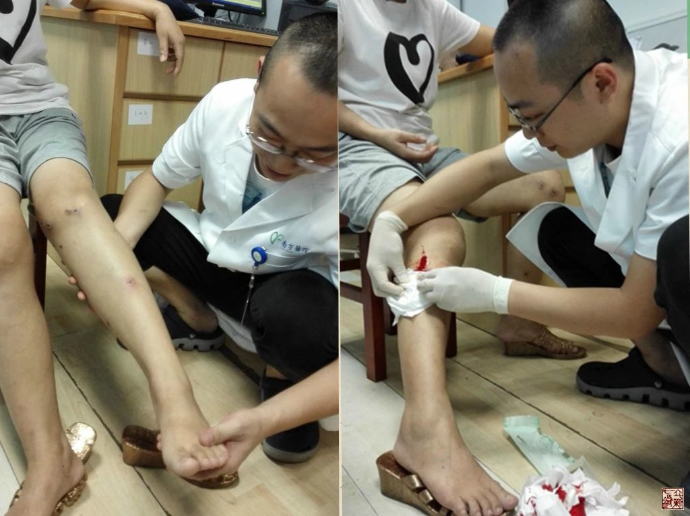

= 百日蜕变
冰台
2015-9-20 00:00

今年五月份的时候，广东南方医院古中医科吕英教授跟我联系，希望能够专门为李可中医药
学术传承基地培训一批七针医生，以此实现真正的针药结合。

于是就有了五月份那期立新七针疗法内部培训课程，参加者有南方医院古中医科7名医生、
甘肃省酒泉市中医院4名医生、甘肃平凉市庄浪县中医院7名医生，三家单位共计18名专业临
床中医。

8月中旬的时候，我带着比利时针灸医生walter去了一趟南方医院古中医科，跟医生们交流
学习。然后又去了一趟甘肃庄浪县中医院，考察7名七针学员的临床进展状况，同时也是为
了要去轩辕谷再次祭拜黄帝。本来预计还要去酒泉市中医院看看的，后来因故没有抽出时间
成行，所以委托了吕英代我去酒泉考察。总的来说，还是很欣慰，我看到的和听到的，都是
非常不错的成绩。由于这些医生们本来临床经验就比较丰富，所以学习七针诊治理论之后，
临床疗效提高了不少。于是我决定以立新七针研究所官方的名义，把他们作为值得信赖的七
针医生，向患者们推荐。

我最关心的还是南方医院，因为这里有目前国内正规医疗系统里唯一的“立新七针”工作室，
我当然希望这里要做好。而且这里也是吕英教授针药结合治疗重症危症的主战场，我针灸行
医十五年，也在一些急重症方面有点心得体会，特别是这些年通过对《黄帝内经》的解读，
明白九针是可以治很多危急重症的。我也很清楚立新七针不仅仅只是擅长治疗软组织骨椎关
节方面的病痛，也可以治疗很多内科病，也应该在危急重症方面有一点发言权的。但基于民
间医生的自我保护意识，我一直只坚持在慢性久治不愈的病痛方面努力进步，我几乎从不让
立新七针去涉及那些危急重症的救治，也不建议我的学员们带着“责任感”和“使命感”去
冒风险。不是我贪生怕死，我心里非常明白，医疗行为不能是低智商的善良，只有保存医生，
才可以帮助到更多的患者，只有先保证患者的安全，我们才真正安全，作为个体，我们承受
不了任何的重大医疗事故。

我还是非常希望能看到立新七针在危急重症方面的运用，而吕英教授所在的南方医院，无疑
具有承担医疗风险的责任和能力，而且三甲医院在医疗法律条规方面也是非常健全的，我很
放心吕英把李可古中医与立新七针结合起来，运用到急危重症的治疗中去。所以这三个月里，
我到南方医院去了五六次，跟吕英他们交流了很多内经学术思想和实践认知。李可中医药学
术传承基地的医生们，都是硕士以上文凭，而且本科必须都是中医临床的，可谓本钱很强大。
但我从没有在他们脸上看到丝毫自满的表情，反而学习热情非常积极，总是抓住一切机会跟
我探讨交流。相比其他有些学生缺乏学习激情，似乎要让我追着他们学，两种迥然不同的学
习态度，也让我很乐意跟南方医院这帮医生们探讨医学。

吕英是我今年三月份立新七针培训班的学员，这一期的学时总共安排了九天，第四天早餐的
时候，吕英就跟我提出要拜我为师，我很诧异，因为我那时并不了解吕英，面对一个刚学了
三天就要拜师的人，我认为她对我根本还不够了解，无论人品还是医术，应该只看到我的皮
毛，这样就提出拜师，未免唐突了点，所以没有当场答应她。等她走了之后，我掏出手机百
度“吕英”一词，才知道她居然是南方医院古中医科的大教授，还是李可的得意弟子。李可
在中医界的名气虽然很大，但我并没有认真的去了解过李可和他的学术思想，因为我这些年
只在关注内经针灸。教授也就罢了，我对专家教授之类头衔也向来不感兴趣，盛名之下其实
难副的情况我见过很多。但百度搜索第一页，我看到有患者在公开投诉吕英，劝大家不要迷
信名医，然后我看了下投诉内容，这就让我就对吕英感了兴趣。中国有十几亿人口，任何一
个医生，都不可能令所有患者都满意，如果整个网络都在夸耀和赞誉她，那反而不真实，恰
恰是一直有个别患者在攻击谩骂，而该医生的医术和事业又一直在突飞猛进，这种医生，才
是真正值得信任的，因为接了地气。

所以后来吕英再次跟我提出拜师，我就问她心里的中医理论应该是怎样的，于是吕英就把李
可的学术思想简要的说了一下。通过吕英的介绍，我才知道李可的古中医思想和我探索中的
《黄帝内经》九针医学，在很多方面的医理是比较一致的。吕英然后说了实话，正是因为听
了头三天的理论课，在课堂示范的时候，注意到我扎针的神态，然后经我手把手的教她感受
过七针，她才认定了这就是她一直在寻找的那种针灸。她说，李可在世的时候，就一直在寻
找跟他医理相似的针灸，以期针药结合，可惜一直没有寻找到，现在终于让她遇到了，所以
才提出拜师的。

吕英刚开始创建南方医院“立新七针”工作室的时候，立新七针的很多老学员并不看好她们，
甚至认为七针只能被她们作为辅助疗法，并不会真正认知到七针的优势。事实上，除了古中
医科在治疗某些急危重症会针药结合之外，古中医科的王中华和林锦韬两位医生，带领一些
研究生们干起了专注的立新七针疗法。

时间过得很快，转眼间，南方医院古中医科医生们学习立新七针回去就有一百天了，这三个
多月下来，他们运用七针到底怎样了呢？

于是上周我专程飞了一趟广州，我的目的，是要考察南方医院立新七针工作室的实际成绩，
然后向大家做个百日汇报

周四下午，我来到南方医院第一医技楼的第七楼，林锦韬和王中华两位医生正在忙碌治疗患
者，短短两三个月时间，诊室的墙壁上多了患者们赠送的好几面锦旗，我刻意的看了一下这
些锦旗，是送给南方医院立新七针针灸室的。

现场有一位双膝关节滑膜炎的女性患者，她说她是立新七针的超级粉丝，看到立新七针针灸
研究所官方推荐的七针医生名单，才专程从远处来南方医院治疗。她双膝肿大，据说已经十
几年了，曾经过多次的治疗，大多数都是用抽积液的方法。我对患者解释说：抽积液并不是
解决这个病的好办法，除非真正的化脓坏死，一般情况下不需要抽积液，是由于经络不通畅，
才导致积液形成，抽是抽不完的，抽空这里，身体其他地方的体液又会流过来填满，除非你
身体里没有津液了，那些积液都是身体需要的东西，这里在堆积，可别的地方正等着需要呢，
如果医生不明道理，把它们抽出来白白的扔掉了，叫做不明而为，抽掉那些积液，有极少数
患者能恢复正常，但大部分患者的病痛都无法真正治愈，都是当时或短期有效，稍不注意就
复发了，最关键的，是患者的气色会变得越来越差。这位患者听我这么一解释，立刻就说：
是啊，以前每次抽完积液，我的两个腿当时很轻松，但很快就变得特别沉重，好长一段时间
人都感到疲惫，然后很长一段时间总感觉关节里面缺少润滑油那样的发干发紧。

林锦韬医生仔细的查看了患者的双腿，然后在几个明显瘀络处扎针，放出一些污血。他并没
有在积液出下手，患者左腿上那些伤疤和溃烂处，是患者在家自己艾灸造成的。我告诉患者，
经络没有调通畅的时候，不要做艾灸，否则于事无补，反受其害。积液就在里面，如果不去
给予疏导，经络不通畅，最多只能缓解，而调理经络最佳手段，非九针莫属，你做艾灸的意
义何在呢？是想把积液烤干么？

治疗之后，患者原本肿大的双膝，立刻小了很多，原本发烫的髌骨皮温也正常了，也能够蹲
下去了，痛感基本消失，还可以不靠撑扶自己站起来。治疗以前，患者是蹲不下去的，即使
勉强忍痛蹲下，如果双手不撑地或攀扶物体，是无论怎样都站不起来的，所以患者现在乐坏
了。

短短一百天时间，王中华和林锦韬二位医生，发生了巨大的蜕变，在学习立新七针之前，他
俩本来是方药的医生，几乎都没有针灸方面的临床经验。之所以七针医术提升这么快，主要
由于他们是吕英的弟子，之前经历过好几年李可古中医学术思想的熏陶，认知比较高，相同
境界的不同术器，理是无二致的，所以只需要短时间的转化，就可以很快的运用自如。另一
方面，进步这么快，在于两位医生的悟性与动手能力，都很不错。

关于针灸医生的悟性与动手能力的重要性，我曾在不同场合多次讲过我的观点，《灵枢•官
能第七十三》要求针灸医生是“徐而安静，手巧而心审谛者，可使行针艾”，古人认为，观
察细致，而心灵手巧的人，适合从事针灸。事实上也确实如此，因为心灵手巧的人，内心的
理念可以通过灵巧的双手充分的展示出来，大大的提高疗效。比如，同样都明理的两位医生，
都对病因了然于胸，都运用同样的针法，但其中一位由于手比较笨拙，扎针的时候手下只能
够展现50%的能量，另一位手很灵巧，能够把内心的理解展现出90%，这两位针灸医生所表现
出来的疗效，一定是截然不同的。

我在培训课上还对学生们讲过我的另一个观点：同类事物的真相，只应该是一个，不可能有
很多个真相并存，如果中医的分门别类越多，大家离真相就一定越来越远。所以无论针、药、
灸、按蹻，真正能治病的那个真相，理都是一样的，只不过表现的方式不同而已。病各有所
宜，各不同形，各以任其所宜，世上所有的医疗手段，都不可能以一概全，针有针的长处，
药有药的作用，但医理都一样，只不过各自擅长的领域不同。就如同内经九针，针各有所宜，
各不同形，各任其所为，九针结合形成团队，才能够治愈更多的病痛，立新七针疗法之所以
要七针并存去团队作战，也是这么个道理。

所以吕英教授希望能够把李可古中医跟立新七针结合起来，针药并举，实际上她是认识到中
药的局限性。她的可贵之处，在于并不固守门派之见，力推立新七针，她也是为了要扩大中
医治疗的适应范围，以帮助到更多的患者。

附南方医院立新七针工作室治疗案例一则：

卢某，女，32岁。

【初诊】2015-7-18

【主诉】月经淋漓不尽2年。

【简要病史】患者于2012年8月剖宫产第二胎，产后10个月后断奶，月经复潮，复潮后月经
淋漓不尽，15-20/30；第1-5天量偏多，色暗红，血块多，第6-20天月经淋漓不尽，每日只
需护垫即可，色暗黑；lmp：29/6至今；淋漓不尽；

2014-12-11于中山市中医院行阴道B超示：剖宫产术后，子宫下段切口憩室，并微量积液，
双侧附件未见明显异常。

精神可；纳寐可；大便1-3日1解，质干结呈羊屎状，排解费力；小便调；怕冷；易上火，熬
夜或进食煎炸食物则咽痛；舌淡粉，苔薄白黄微腻；脉沉细。

患者曾我科就诊，服清养方、引火汤合芍药甘草加味、三阴寒湿方、乙未甲胆风木方未效，
遂停中药，转七针诊治。

查体：背部膀胱经可触及条索状物，局部肤陷；宗筋结节多处，关元处可触及条索状物。脐
下可见面积约4*5粗毛之处。

【病机分析】

患者剖宫产后、哺乳后出现月经淋漓不尽，考虑为产后、哺乳后胞宫空虚，冲任血虚，肝肾
不足，气虚气滞、血瘀、郁热，血不归经及三阴本气不足，内生寒湿兼甲胆不降，气不摄血
同时存在。

【七针治疗思路与过程】

道、法：月经淋漓不尽不仅单纯是经脉之病，依据立新七针的气血、河流、上下游理论，
《灵枢•经水》：“经脉十二者，外合于十二经水，而内属于五脏六腑。”气血是月经、胎
孕、生产、哺乳的物质基础，而脏腑是气血化生之源，经络是气血运行的通道，妇女的生理、
病理特点还与冲、任、督、带相关，通过带脉的纽带作用与十二经脉、五脏六腑密切联系。
带脉不引，十二经脉、五脏六腑失约，腰腹这一带属于带脉之宗会，查体可见下腹部瘀堵
（宗筋结节多处，关元处可触及条索状物，脐下粗毛）明显，后背足太阳膀胱经受堵，道路
不通，气血运行不畅，受堵下游相对卫气不足，“卫气虚则不用”，在该患者表现为月经淋
漓不尽，即阳不统阴、气不摄血（阳气、卫气）之理。此诊按查体所见治疗，思路为疏通气
血、河流道路。

术、器：1、背部膀胱经可触及条索状物，局部肤陷，于双侧膈俞锋针破皮，中号鍉针上下
疏通；2、宗筋锋针破皮，中号员针揩磨；3、关元中号毫针挑拨。

查体下腹部图片

【二诊】2015-7-23

调宗筋时突然出现口干思饮，关元毫针挑拨后双膝关节内侧微汗出，自觉舒适；针刺后第2
日阴道排出白色胶黏状物，量渐少；余无不适；舌暗红，苔薄白；脉沉；治疗后阴道排出秽
物图片：

【七针治疗思路与过程】

道、法：调宗筋时突然出现口干思饮，说明局部经脉得以疏通，火热燥外散，关元毫针挑拨
后双膝关节内侧微汗出，提示足三阴经、任脉脉气血回流运行畅通，三阴经开阖枢、气化功
能增强，即达桂枝汤之“微汗法”之效。瘀堵以通，此诊考虑继续给予扩充狭窄之空间，三
焦松绑，改善盆腔、宫腔空间缩窄，继而开闸放水（气），加强三阴经回流畅通，解决方法：
松绑、放水（气）。

术、器：1、八髎中号员利针松解；2、双内踝瘀络点刺放血，出黑血甚多，提示伏热于里、
余热未尽。

【疗效】 ：二诊治疗后第3日，月经淋漓不尽现象完全干净。

重庆巴南立新七针研究所2015年9月20日文稿
