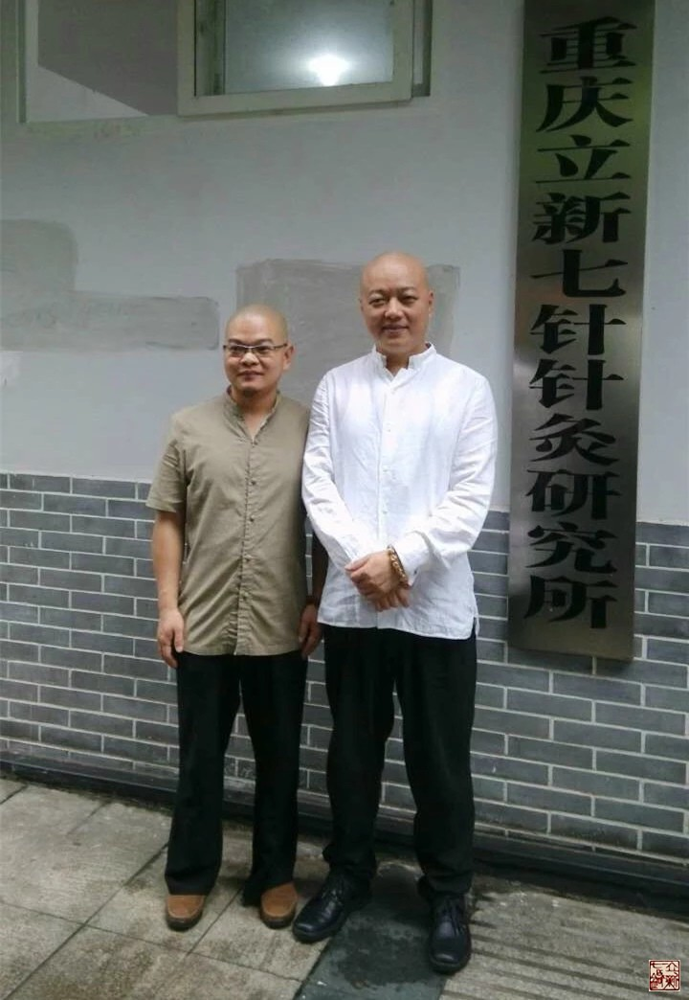
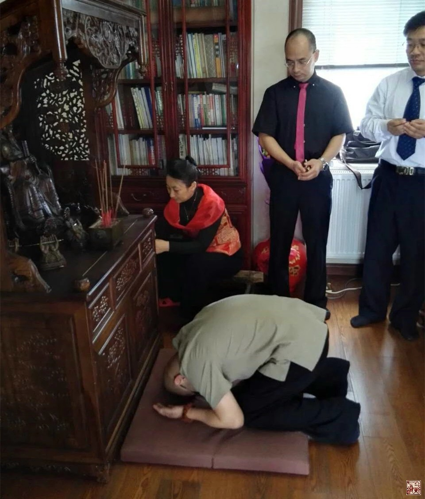
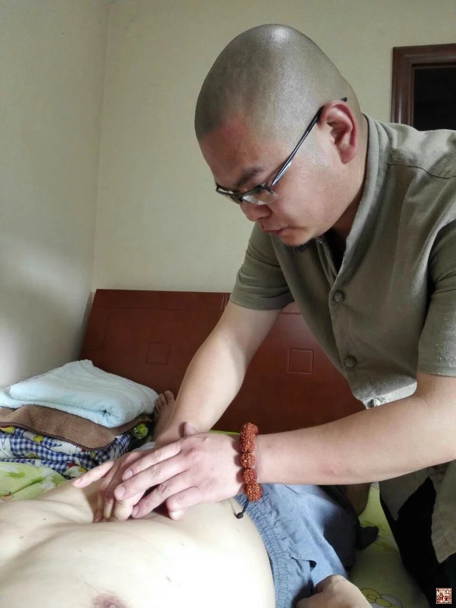
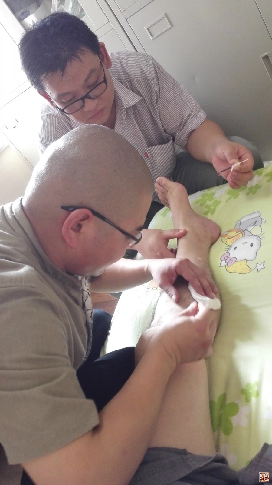

= 以彼之道还施彼身
冰台
2015-9-30 00:00

立新七针门内弟子吴臻普，执业中医师，是立新七针针灸研究所官方推荐的七针医生，在河
北承德开个体针灸诊所，具备十多年临床经验，现专注于立新七针疗法研究和临床。

在去年11月份的第二届立新七针年会之前，我几乎没有关注过吴臻普，所以对他没什么了解。
年会前他主动给我打了个电话，他说自己以前只顾着自己发展，没有团队意识，现在领悟了
七针思想，意识到这样做很不好，所以提出要捐助年会500斤柚子，以犒劳师兄弟们。

从那以后，我开始比较留意关注这个小个子的中医。在我看来，中国人最缺乏的就是集体主
义，一个有团队集体意识的人，通常容易获得更多的发展机会，如果我有能力，我会很愿意
去帮助那些无私的队友。立新七针学术思想遵循的是内经医学理论，非常注重整体治疗，提
倡上医治国的境界，一名优秀的七针医生，首先必须是通达人情世故明晓事理的人，如果自
私自利的人，不适合做我们的队友。

渐渐的，我发现吴臻普这个人，虽然平时话不多，但他却是一个用心细腻，而且非常心灵手
巧的人，品行认知方面也很不错。我尤其欣赏他的格局，不注重眼前利益，这一点很不容易，
大多数人都做不到。在跟我学完立新七针之后，他回去就毅然的把以前的那些疗法统统放下，
专注于立新七针疗法。由于患者们对新生事物一下子不能接受，结果诊所萧条，甚至门可罗
雀，从以前一个月三万多的收入跌落到一个月仅五六千元，巨大的失落感并没有令他改辙易
道，他坚持了过来，现在每周只工作几个半天，患者集中而来，内心了然，信手除疾，轻松
治病，日子过得优哉游哉，每月的收入比前些年起早摸黑累死累活干，挣的还要多。这就是
格局的重要性，这种人思维清晰，又有毅力，所以我才决定把他吸收为我的门内弟子。

这几年培训立新七针，拜我为师的弟子也不少了，但很多都只是做了个形式，根本没把心思
放在立新七针的精进上面，我甚至都不知道他们拜师的目的何在。还有的弟子曾经也表现优
秀，但遭遇某些状态之后，锐气信念等丧失殆尽，现在已经根本不是那么回事了。茫茫人生
路，本来就是一个阶段一种认知，如果格局很小的人，在困难挫折面前，是不可能坚持下来
的，所以人与人之间曾经的山盟海誓，到后来分道扬镳，也不是什么稀罕事。立新七针的弟
子与门内弟子是有区别的，弟子只是比普通学员多磕了几个头，其他并无二致。但是门内弟
子则不同，我要求门内弟子要有为振兴中医真理而付出身心的思想准备，要在立新七针学员
里起到带头作用，必须有强大的责任感和承担事务的能力，并不只是来吸收获取的。

七针学员群里有近三百人，可是我与这些学生的接触，是从陌生到认识，也就是靠十天半月
的培训课期间，所以我几乎无法在这么短时间内了解这么多学生们的认知、品行、心性等这
些内涵的东西。但学中医的人都懂得一个基本道理：有诸内必现其外。所以我通常是通过观
察学生们在微信群里的交流，从他们的参与态度、观念、语气、用词、文字等等，去了解这
个人的心境，以知道他们的大概情况。立新七针学术思想是集天地自然人文社会规律而成，
思想上的认知度与一个人的行为表现一定是相匹配的，认知度高的人，行为语言交际等一定
是张弛有度的。所以除非这个人不参与交流，否则我一定可以从他的行为语言上，知道这个
人对于立新七针学术思想的认知度是否到位，以我的阅历和认知，那些金玉其表败絮其中的
人，还是不容易瞒过我的眼睛。而不参与交流的人，要么是自卑，要么是不屑与别人为伍，
孤傲的人能具备多大的事业能量？

由于长期熬夜研究学术，和超负荷的带教学生，加上一些自然环境等伤害，我的身体也出现
了一些亚健康的状态，所以这次邀请吴臻普来重庆参加“立新七针研究会”，我抽时间亲自
体验了他的立新七针诊治思路和针法，我笑言这就是“以彼之道还施彼身”，我自己研究并
创立了立新七针疗法，然后教吴臻普学会立新七针疗法，然后他又用我教的疗法来治疗我身
上的病痛，这就是以其道还施彼身。

吴臻普从问病、交流、沟通、检查、定位、进针、手法等一整套系统做下来，最后他在我身
上扎了十二针，分别运用了员利针、鍉针、毫针、锋针四种针具，我的感觉是很不错的。整
个诊治过程，他表现得落落大方，气路血路筋路，前后左右上下内外深浅宽窄，怎么来怎么
去，各条思路都非常清晰，取穴精准，进针基本无痛，行针轻柔，手法细腻！仅仅在某些细
微处的表现还不够好，我是极少表扬一个针灸师的，但他确实已经具备我眼中的优秀中医针
灸师的素质。

扎完针，我对他说了一句话：我本来想明年三月份中级班的时候让你来跟班学习的，现在看
来已经不需要了，因为你已经做得足够好！

在进入《黄帝内经》的世界之前，我曾接受过十余年中西医疗法理论的熏陶，尤其是西医解
剖学运动力学等等的洗脑，曾很随意的以自己的身体，去体会注射疗法、针刀、钩活术、拨
针、银质针等等，任凭那些针具在我肉体里切割、撬拨、松解、烧灼，从未胆寒过。自从潜
心内经医学之后，基于我对内经医学思想的理解，对精神魂魄志意重要性的理解，对气血的
特殊理解，对市面上各种针法疗法理论方面的了解，这几年里我只让自己给自己扎针，绝不
会轻易让别的门派针灸师在我身上扎针的，因为我心里透亮了，不再拿自己做小白鼠。即便
有我的学生给我扎针，那也是我指示他用什么针，扎那里，不给他们独立行医权利的。

这次吴臻普的整个诊治过程，我保持不去干扰他，他说扎哪里就扎那里，他觉得该用什么针
就用什么针，他认为扎几针就扎几针，我只做一名患者乖乖的配合，闭着眼睛去感受针下的
细微变化。能够令我如此放心的在我身上扎针的人，吴臻普的医术绝非浪得虚名，这是立新
七针的功德，世间从此又多一位明医，应该赞一个！

