= 十二经脉论
冰台
2015-10-4 21:36

人体治病，终究是离不开经脉的，无论哪种疗法，无论什么手段，其实最终都是通过气血的
归经而产生疗效。所不同的，只是理论与形式而已，实质都是一样的，抛开了经络学说的那
些手段，并没有脱离经脉，只是日用而不知罢了。

因为，在《黄帝内经》里早已明确指出：“十二经脉者，人之所以生，病之所以成，人之所
以治，病之所以起，学之所始，工之所止也，粗之所易，上之所难也”。意思是说人的生命
能延续，人会得病，得了病能治，病能够被治好，学医的基础，医生取得的成就，庸医能够
轻易治好一些病，良医治病会遇到困难……等等这些状况，全都是在于十二经脉的原因。

古人把经脉看得如此重要，事实上也确实是这个道理。谁能离得开经脉呢？这个世界上，只
有口头不承认经脉的人，没有身体里不存在经脉的人。不承认经脉的人，那是由于他们对经
脉没有正确的认知。千百年来，中医的经脉被人误解为一条条细细的线，所以当解剖者们划
开人体看不见摸不着那些线条的时候，就会对经脉学说嗤之以鼻，断言中医：荒谬，不科学！

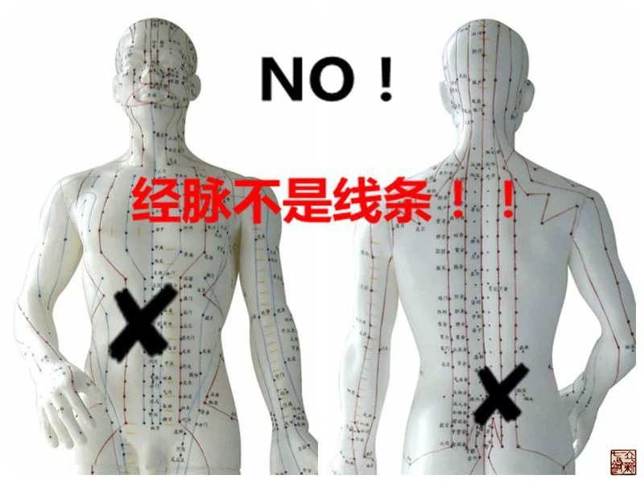

事实上，中医从来没有荒谬过，荒谬的只是人们对中医的认知。

其实，经脉是立体的，并非线条。世界不是一个平面，人体也不是一个平面，经脉更不是一
个平面，世界上很多事物，你眼睛看到的并不一定就是真相，所以我经常对学生们说不要仅
仅靠眼睛和耳朵去判断事物的真相。内经医学法天则地，援物比类，需要我们具备一种抽象
的思维能力，看山不是山，看人不是人，正所谓“道可道，非常道”，通过平面的文字描述，
脑子里要善于构造出立体多维的多个画面，那样才读得懂《黄帝内经》，能够对内经医学有
所认知。否则根本就看不懂内经，也就无法明白古人在讲什么内涵。

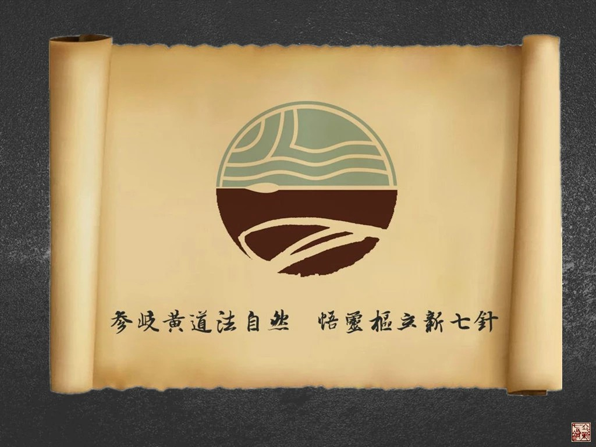

但是，经脉这玩意儿，千百年以来，似乎就是一个谜。

众说纷纭，有认为经脉是线条者，有认为经脉路线与内经所述不一致者，有认为经脉是神经
者，有认为经脉是血管者，有认为经脉是筋膜者……

真正的经脉，是看不见摸不着的，因为它是一种“气路”。就像地球上的道路一样，自然界
里有水路、空路、陆路，人体里面也有这些路，只不过中医更重视的是气路。自然界里的水
路与陆路，不过是最基本的载体，大气的斡旋才是至关重要的，要实现风调雨顺、五谷丰登、
国泰民安的景象，更多的要取决于气路的正常与否。人体也一样，调理身体的时候，气血情
志之类远比肌肉骨骼神经血管重要。我在很多场合说过我的观点：活人与死人相同之处是都
具备肌肉、骨骼、神经、血管，不同之处就是死人缺少了气血与情志。这就是为什么立新七
针疗法比较重视“气”这个概念，而对于筋骨皮肉血管这些肉眼可以直接看到的组织，反而
不是很重视的原因。

如内经所言，粗之所易，我们常见一些庸医也能治好一些病，其实他们无非是误打误撞，阴
差阳错运用了经脉的一些规律而已，甚至很多时候只是利用了情志这种安慰剂，通过语言或
行为的暗示，通过心理作用，起到的一些疗效，结果被不明真相的人惊为“神医”。也如内
经所言，上之所难，我们也看到很多认知比较高的良医们，临床上也常会遇到一些难以治愈
的病痛，其原因，主要还是源于对经脉的认知不够明确。

经脉是如此的重要，所以，无论你是医生还是患者，你都应该了解经脉。

那么经脉是怎么来的？到底存在于哪里？为什么解剖划开看不到摸不着？

前面我已说过，学中医需要抽象思维，经脉是“气路”，而不是陆路和水路，当然是看不见
摸不着的。这个气路，根据功用的不同，分为三路：宗气、营气、卫气。宗气主要是呼吸系
统，卫气另有循行路线，但又是与营气阴阳相随的。我们这里是论十二经脉，所以宗气和卫
气先按下不表。

我们常说的十二经脉，实际上主要是指营气的循行路线，我称之为营气经脉。其基本载体，
就是人体的血液循环系统。

为什么说血液循环路线就是营气经脉路线？《黄帝内经》是揭秘人类的大宝藏，它把我们所
有的疑问全都讲清楚了，《灵枢•经脉第十》有云：“人始生，先成精，精成而脑髓生，骨
为干，脉为营，筋为刚，肉为墙，皮肤坚而毛发长”。这里讲得明明白白，人一生下来，就
具备血液循环系统，就是以脉为营的，营，就是营行，是循环，所以这个天生的脉，就是血
管。

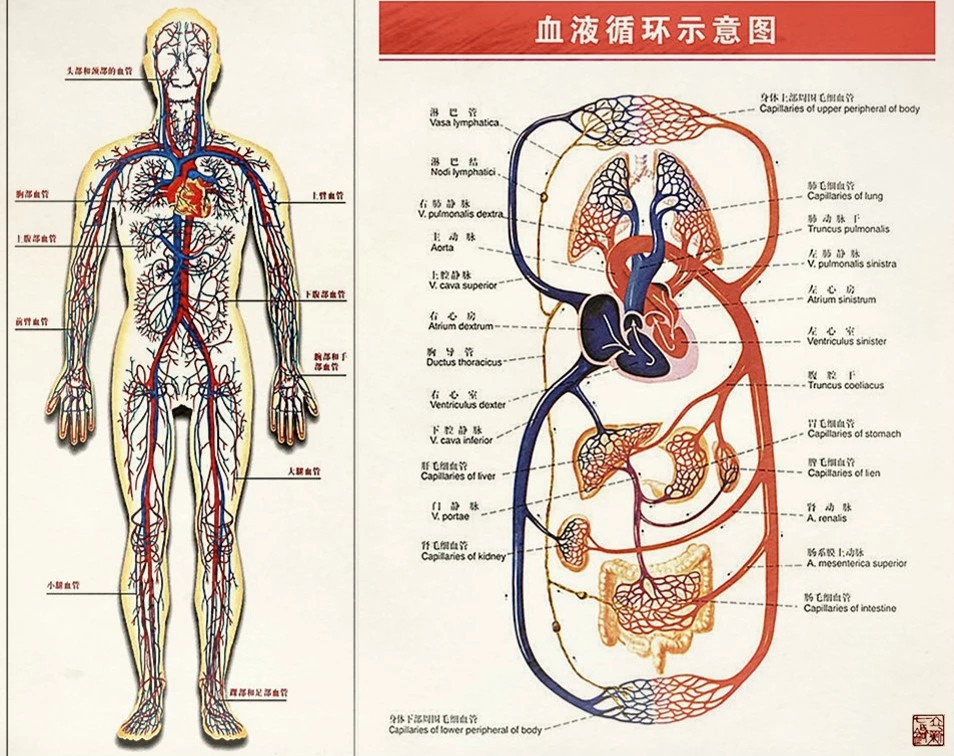

《灵枢•经脉第十》还有讲到：“经脉十二者，伏行分肉之间，深而不见；其常见者，足太
阴过于外踝之上，无所隐故也。诸脉之浮而常见者，皆络脉也”。意思是说血管穿行在肌肤
里面，被脂肪肌肉所掩藏，是看不到的，但在足踝等这些皮薄肉脂少的地方，是能够看到的，
而其他那些皮肉表面能看到的那些细小血管，是属于络脉，也就是毛细血管。

很多人习惯于一定要靠眼睛和耳朵来代替大脑，看到这里就会纠结，人身上的血管怎么才只
有十二条呢？你冰台这不是瞎说么？所以讲到这里估计很多人又糊涂了，我再提醒一下：道
可道，非常道。分布全身的动静脉血管，实际上只是十二经脉的载体，并不是营气经脉本身，
所以不要把血管本身看成经脉。

《灵枢•营卫生会第十八》说：“营在脉中，卫在脉外”，意思是说营气经脉的循行路线是
在血管中，这个“中”，只是一个范围而已，千万不要呆滞的看成血管里面，否则你又要解
剖划开血管去翻找营气在哪里了，那也肯定是找不到的。

因为内经把经脉比喻成经水，经水是中国古代版图上的那些河流，《灵枢•经水第十二》说：
“经脉十二者，外合于十二经水，而内属于五脏六腑”。指出十二经脉的循行规律，类似于
自然界里的十二条河流，其实质与来源，则是受脏器的支配。

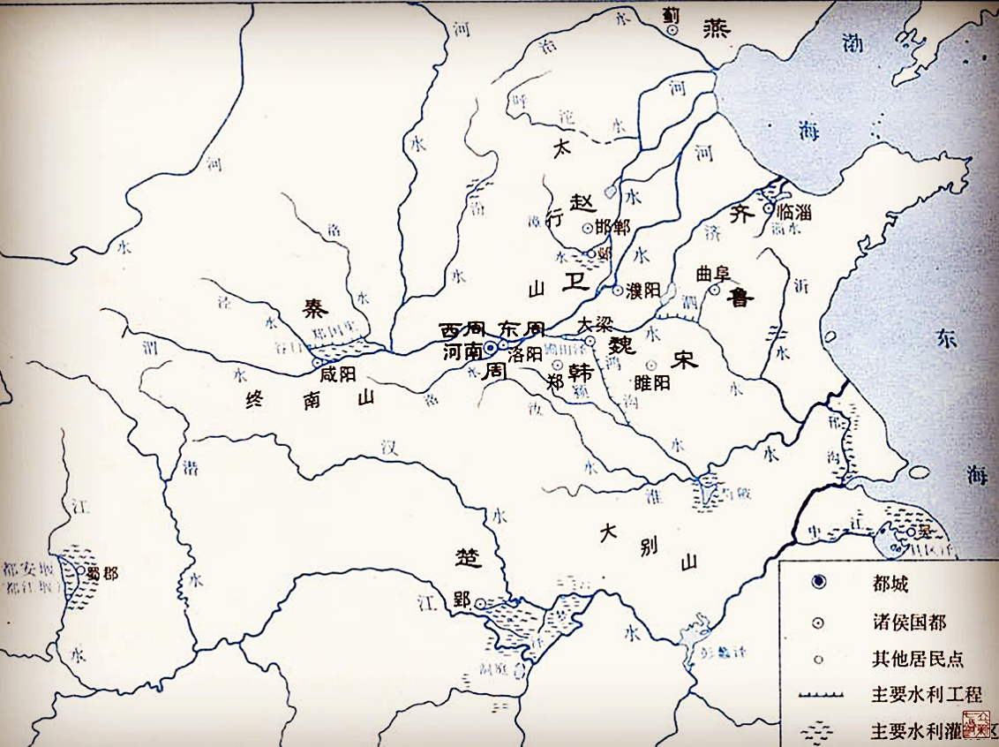

既然把经脉喻为河流，我们就要先去了解河流。河流是因为有水流动，才成为河流，否则没
水的那条山沟，只是叫做山谷罢了，不会被称为河流。因此，河流的河床是次要的，流行的
河水才是重要的。要知道，水本身并不具备能量，是不会动的，它要依赖于“内有所禀，外
有源泉”的补充，才能够运动不止。其内在地泉补充和外在溪流的补充，实际上是水的上升
下降以及推动，才带来这些能量。《素问•阴阳应象大论篇第五》有云：“地气上为云，天
气下为雨，雨出地气，云出天气”。

水的蒸发与下降，是通过大气的斡旋来完成的，这是自然常识。在太阳的辐射下，河流湖泊
海洋等蒸发出来的水蒸气，被气流带到陆地的上空，凝结成雨、雪、雹等，落到地面，一部
分又被地表热量蒸发，直接从地表返回了大气层，其余部分成为地面的河流或地下暗河等，
通过循行，最终又回归进入江河海洋。水的这个升降过程我们通常看不见，但却是真实存在
的。所以，我们就应该知道了，自然界里河流本身并不重要，重要的是水的升降过程，缺乏
升降过程的水就是一滩死水，自然界也就是死寂的一片。

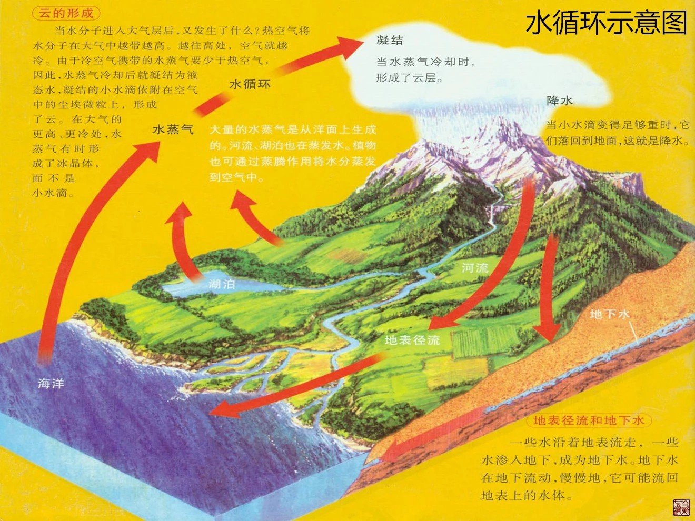

人体的血管就类似于河流，血管里的血就类似于河流里的水，营血是血液，但血液的循环依
赖的是气的推动来完成的，没有气，血液就无法流动，没有气，心脏也无法跳动，所以中医
的十二经脉，实际上是指营气，是一种依赖于血液循环却又不是血液本身的物质。

我们在看待营气的时候，就不能傻傻的分不清，这时候愣头愣脑的智慧是行不通的了。你需
要具备一些自然生活基本常识，要明白自然界的河流是有分疆界的，但这些河流水蒸发到天
上的水气，疆界就不能分得那么细了，河流的水只在一定范围内流转，而水气则是可以输布
天下的，内经也有指出：“海之所行云气者，天下也”。打个比方，你能分辨你家乡的雨水，
是来自世界上哪一条江河大海吗？你无法分辨，也没有分辨的意义。自然界里那些大江大河
大海里的水，蒸发上天之后，混为一体，然后在大气的斡旋之下，就分布到全天下，这对整
个地球才有意义。

所以我们不能把经脉看成一条条的细线，经脉是抽象的。十二经脉只是把人体划分为十二个
范围来看待而已，记住，只是意念上的划分，只存在于思想里，如同我把你看成十二块，但
你实际上并没有被划开成十二块，你还是一个整体。身体里有空间有缝隙的地方，都分布有
经脉存在，这样经脉输布经气于全身，濡养筋骨皮肉，对于整个人体而言，才有重大意义。
实际操作运用的时候，我们就按脑子里经脉的循行规律去调节。

当然了，就如同自然界水气的升降一样，大体规律看似很简单，实际上还受很多因素的影响。
经脉也一样，虽然经脉如大气斡旋作用于人体，但经脉也受各种内外因的影响很大，比如外
因的寒暑燥湿风，内因的喜怒思忧恐等等，所以实际调理的时候，并不只是大禹治水那么简
单的，需要全方位多层次多系统的考虑，所以立新七针为什么会有七种针具呢，就是因为病
痛的表现各不一样，各有其适宜的治疗方法，针具也各不同形，各自发挥其所擅长的功能。
由于今天我是讲经脉，治疗这些事是后话，此处也暂且按下不表。

那么，六经是怎么来的呢？

所谓六经，也就是三阴三阳，手足分别三阴三阳，合起来就是人体十二经脉。

所以，要了解经脉怎么来的，首先要弄明白阴阳是什么。

一说阴阳，很多人又懵了，中医的阴阳太复杂啦！

我也对现代中医的阴阳学说感到头痛，巨厚一本教材，理论那么丰富，疗效却如此的不尽人
意，到底是对的呢还是对的呢？

实际上，阴阳没那么复杂，最原始的阴阳，就是男人和女人，再直白一点，就是男性生殖器
和女性生殖器，男人的为阳，女人的为阴。

男女之间的性交行为，古人又称之为“云雨”之事，《素问•阴阳应象大论篇第五》里有云：
“天地者，万物之上下也；阴阳者，血气之男女也；左右者，阴阳之道路也；水火者，阴阳
之征兆也；阴阳者，万物之能始也”。这里讲得非常清楚：阴阳是天地，是男女，是道路，
是能量，是万物的开端。

地球上的生命最早起源于水，人也是起源于水。有了水才有了人，自古以来人类都是旁水而
居。男人与女人相结合，才会有子孙后代产生，孤男寡女一个人是无法延后的。因此，我们
就可以理解，老子的《道德经》为什么说：一生二，二生三，三生万物。这个“一”代表的
是水，代表人。“一生二”，“二”就是男人和女人，代表阴阳。“二生三”，阴阳相合而
生子就成为“三”。子长大之后又是男女阴阳相合而生子，人类就是按照如此规律，千秋万
代的繁衍下去的，所以叫做“三生万物”。就是说只要有了阴阳结合，生命就可以延续下去
了。

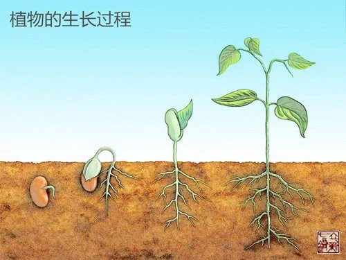

但是，生命其实并不只是阴阳二者所生，而是由阴、阳、气三者所生。如前所述，阴阳只是
基本的载体，气才是最重要的。

我们都知道一个科学的常识，维持生命的延续，必不可少有三要素：阳光、水、空气，这三
者缺一不可。水为阴，阳光为阳。我们常说，女人是水做的，男人是阳刚的，就是阴阳之分。
但阴阳的结合，没有气的推动，却是无法完成的，这个道理依然在最古老的人的本能也就是
性行为上面，得以充分的体现。

阴阳结合，受气的推动而循环，循环就可以生子，人类就得以分布天下。正是由于气的存在，
才使得阴中有阳，阳中有阴，阴中又有阴，阳中又有阳，如果你又糊涂了，你就换个概念想
一下，为什么女人能生儿子，又为什么女人能生女儿？这样你就能明白。阴阳只是基本概念，
如果只有阴阳而没有气，生命就不能延续下去，气是万物的生命动力，所以内经非常重视
“气”，立新七针学术思想也正是把“气”作为了核心思想在研究，所以才受到许多有识之
士的认可与拥护。

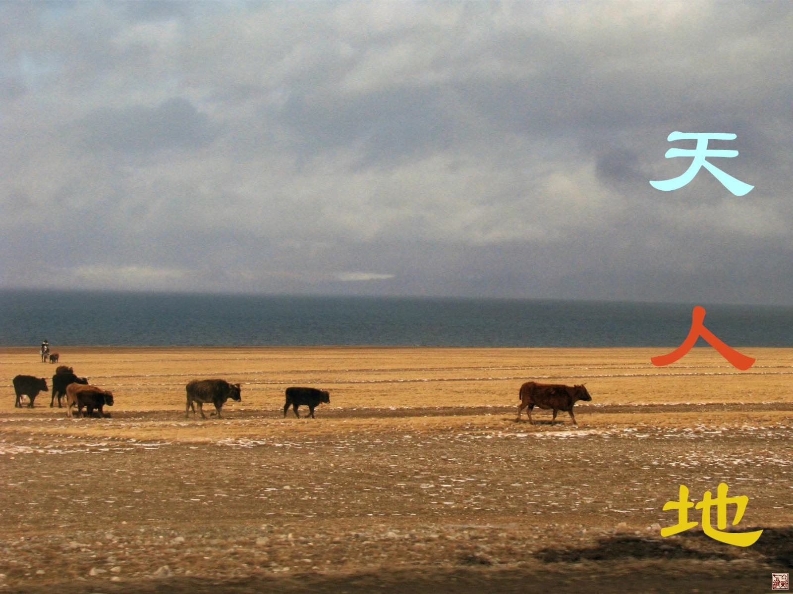

人活天地之间，依赖天地自然的能量而生存，所以必须遵循自然规律。人除了睡眠的时候躺
卧，日常活动的时候是头顶天，脚踏地，与天和地之间就形成一个天人地的立体构造。在自
然界里，太阳在天上，水在地上，太阳照射大地，水气就蒸发，上升到天上，受风气循行的
影响，形成雨水又从天空下降返回到地面，完成了自然界水的循环。只有如此持续的循环，
这个世界才是充满生机的，如果缺少这一环节，自然界将是死气沉沉的。正所谓天气下降，
地气上升，这个上升下降的过程，就是连接天地之间能量的无形的路线。人体也是这个道理，
要沟通连接体内上下之间的能量，就需要通过看不见的“经”来连接上下，经，就是路线，
人体也遵循着阳气下降，阴气上升这么一个规律，就需要经脉来维持，所以当人双手上举的
时候，十二经脉的阳经就从上往下行，阴经从下往上行。而且十二经脉必须一直保持着不中
断的循环，也就是内经所言“如环无端”，身体才会健康。这个循环一旦受阻或中断，就会
出问题，产生病痛甚至死亡。

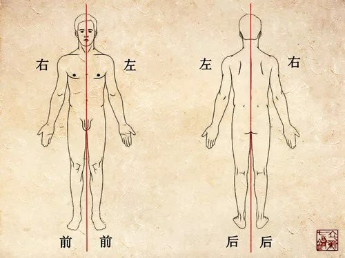

正是因为三生万物，所以把经脉分为三条路线走，是必然的也是必须的。从结构上来看，人
虽然是一个整体（一），但也是分为前、后、左、右、内、外。我们人体左右是基本对称的，
如果把身体从中间对称的分开（二），就出现了左侧的前、后、左（三）三大部分，和右侧
的前、后、右（三）三大部分。左侧和右侧又都由表（阳）和里（阴）两部分组成，所以就
形成左右各阴阳六部分，也就是阴阳六经的分布。

或许有人还是不明白，没办法，我培训带教的时候就是如此，总有少数学员很难明白我在讲
什么。在这里，我尝试着用一个苹果来演示，比喻经脉的道理吧。

请你拿起一个苹果，仔细端详，这时候你看到的苹果，就是一个苹果，是一个整体，对吧？
如果我这时候跟你讲这个苹果上面有左右阴阳和六经，你一定骂我有神经病。

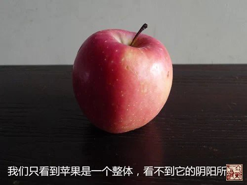

然后请你把苹果纵向的切开，分成两瓣。这时候，你就看到了苹果的表里，阴阳（表皮为阳，里为阴），对不对？

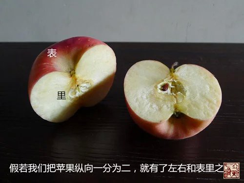

然后请你再把半边苹果切两刀，分成三份，然后再把各自分成三份的两瓣苹果合起来，是不
是就成了六瓣？那就有了六阴六阳，苹果皮部分在外为阳，苹果核部分在内为阴。

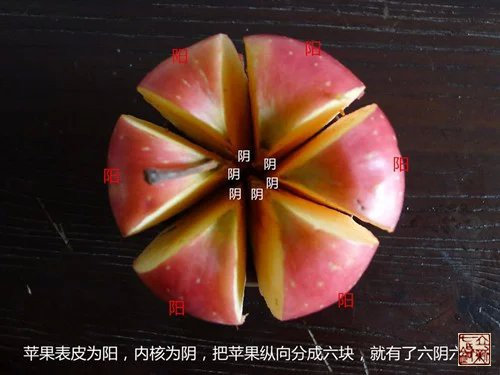

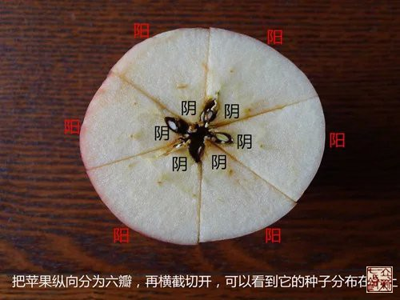

为什么只切成三瓣而不切成两瓣，也不切成四瓣或五瓣呢？这也是很多人心里的疑惑。我只
能告诉你，这是自然规律，除了我前面所述的“三生万物”的道理以外，三这个数，包含了
大中小、老中少、强中弱、上中下、前中后等等概念在里面，是一个最基本也最简单的大数。
试问，没有中怎么分前后？没有中怎么分上下？没有中怎么分大小？没有中怎么分强弱？如
果你非要把半边苹果分为大、偏大、偏大中、偏中、中、偏中小、偏小、小......若干份，
那么事情就被你搞复杂了，那就很难成为规律。因为你虽然很聪明，很能钻牛角尖，但你不
如古人那么有大智慧，古中医的聪慧之处，就是善于寻找和运用各种自然规律。

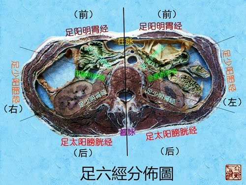

好吧，如果到这个时候你还不明白，那您就别玩这个了，经脉不是您的菜，比较直观的西医
肌肉解剖才是你适合的事业。真正明白了经脉这些道理的人，在临床治疗上都是游刃有余，
轻松治病的。但不明白这些道理的人，临床或凑巧能治愈少许患者，不凑巧的时候则一筹莫
展，束手无策。我有少数的学员，曾跟我一起学内经理论，学了一段时间始终无法领会经脉
真谛，找不到感觉，就放弃了，转而投奔西医解剖运动力学阵营，于是惊呼终于寻找到真正
科学的医学，奉之为圭臬，继而对立新七针嗤之以鼻。这种人我不能说他对与错，他们就是
因为无法习惯抽象思维，只要遇到看不见摸不着的问题，他的行为意识立刻就变得不知所措
了，对他们而言，学中医是痛苦的。这很正常，世界不可能统一，不可能让所有人都接受中
医理念，也不可能让所有人都接受《黄帝内经》，更不可能期盼所有人都能掌握立新七针学
术思想。

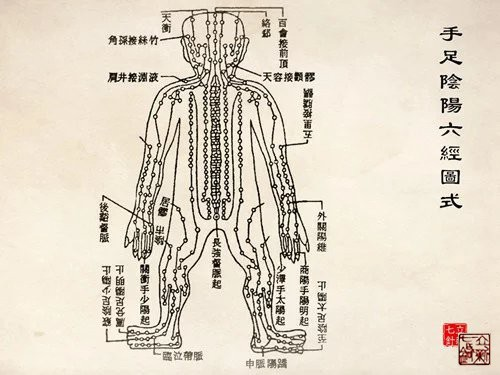

在我看来，古人就是这样来理解经脉的，把人看成一个整体，实际上人又分为若干个部位；
把天地自然看成一个整体，实际上天地自然又由很多成分构成；同时古人又把人体与天地自
然结合起来，看成一个整体。然后以“三”为基数，在整体的人身上去分别阴阳，得出三阴
三阳六条气路。然后在“三阴三阳”之中，根据人体内气路的强中弱，分为少阳、太阳、阳
明、少阴、太阴、厥阴，以此为“经”，贯穿人体周身，形成一个完整畅通的循环体系，成
为十二经脉系统，以此对人体和天地自然进行对比研究，总结出内经医学理论。

众所周知，立新七针的针具源自《黄帝内经》九针，七针的学术思想也深受内经思想的影响，
非常重视道法自然，重视整体思维模式，将上医治国的理念贯穿了整个学术理论体系。所以
立新七针对经脉气血等等的解读，也自成一说，有别于常规医学门派的理解方式，然智者千
虑必有一失，难免有差错或谬误，迎来褒贬不一的评价，也是正常的。今著此《经脉论》一
文，旨在抛砖引玉，以期吸引志同道合朋友，同心研发内经医学，弘扬真理，造福人类。
