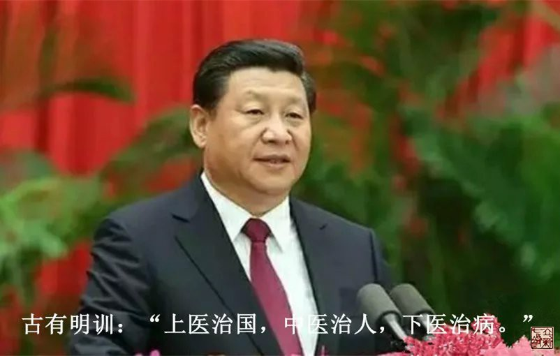
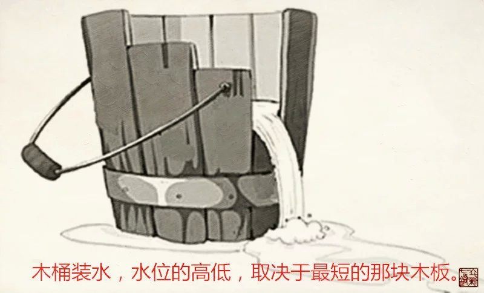
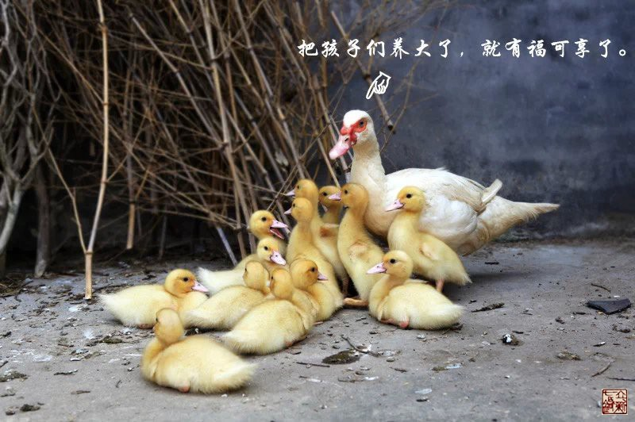
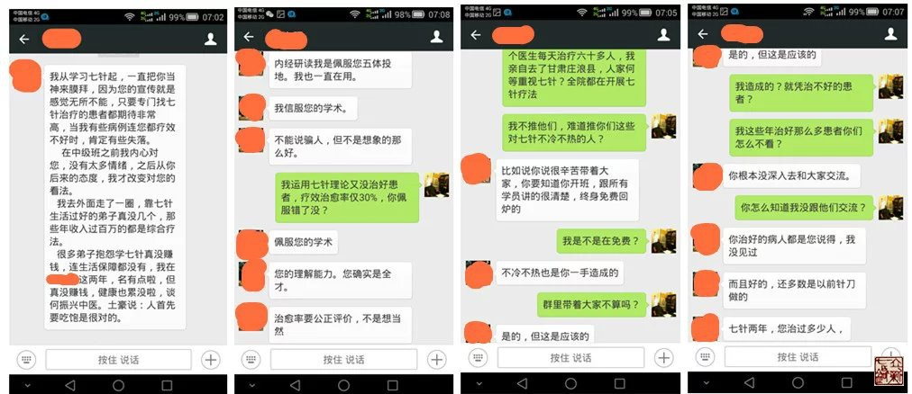
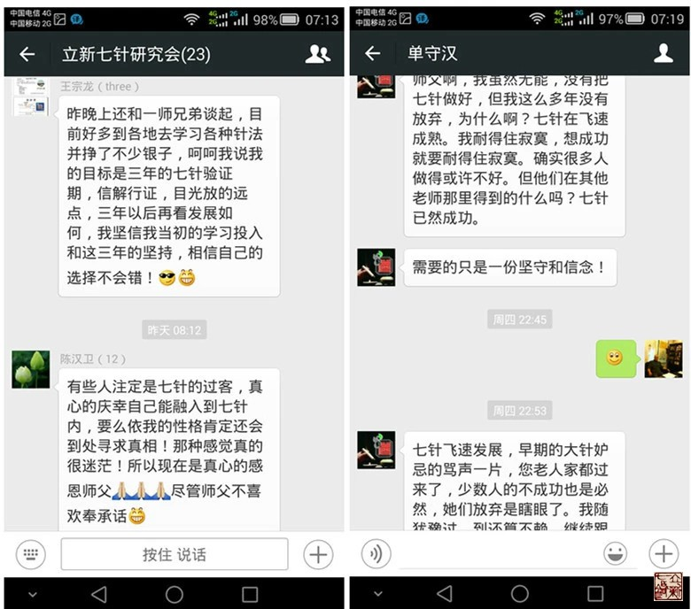
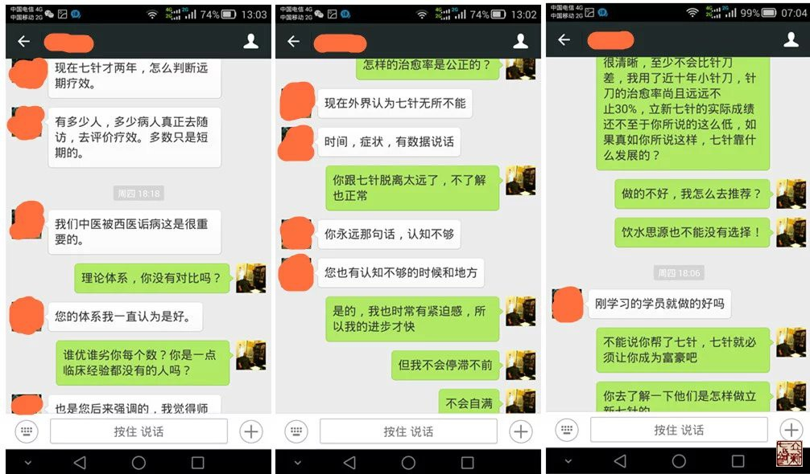
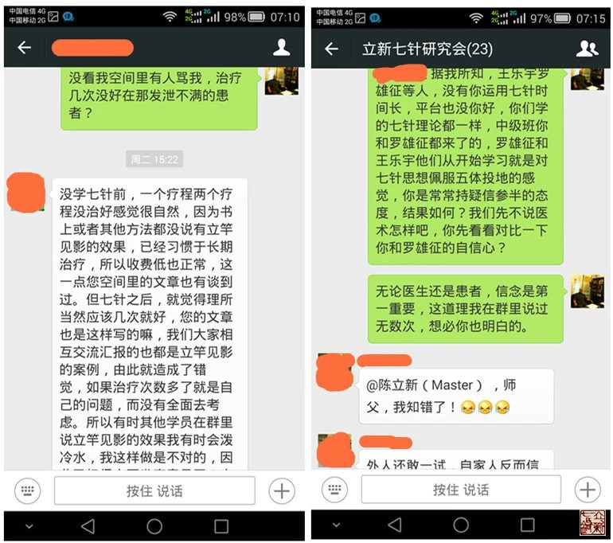
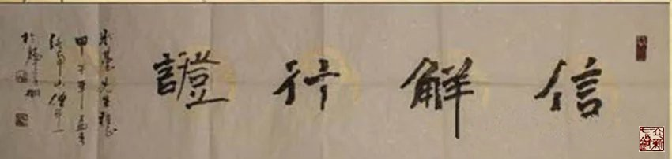

= 格局
冰台
2015-10-11 00:00

《灵枢•师传第二十九》有一句非常具有现实意义的话：“夫治民与自治，治彼与治此，治
小与治大，治国与治家，未有逆而能治之也，夫惟顺而已矣”。意思是治病与治国、治民、
治家都是一个道理，无论大小，都必须顺应规律，治国要顺应民心，治病要顺应经脉和患者
的志意。

一个顺字，说起来容易，执行起来却有千般的难，难易程度，取决于认知度的高低。治病要
顺，首先是顺患者的志意，那么患者的学识、认知、性格等等就直接影响他们七情六欲的展
现，患者对医生的认可度，信任度，接受与否，很大程度上就直接决定了疗效的好坏，这就
是中医所谓“病治有缘人”的意思。其次治病要顺应气血经络的循行规律，这个更显得重要
了，如果连经络是什么，经脉在哪里，气血何去何从这些基本常识都没搞明白，针灸医生算
不算是在忽悠呢？另一方面，人的认知是有限的，再明理的医生也会有不足之处，中医是自
然医学，大自然有多少未知现象？人体有多少奥秘？谁弄清楚过？所以一旦走上中医这条路，
就只有一刻不停的研究学习。认知不到位会令医患双方出于难堪的境界，假若患者对医生非
常信任也非常的配合，苦于医生只是一个凡人，对人体奥秘也有诸多的未知，疗效差强人意，
也在所难免。若患者通情达理还好说，病治不好会鼓励医生继续努力上进，若患者属于睚眦
必报的人，则怨恨谩骂攻击等等接踵而至，医生的苦恼可想而知。

治国有多难？国君在制定国策的时候，必须从大局出发，因为他要考虑整个国家的未来，大
锅饭显然不利于国家的发展进步，所以领导者或许会利用一些优惠政策让小部分人先富起来，
从而带动大多数人富裕起来，这不失为一条英明决策。然而一个国家有那么省市自治州，国
策一定会顾此失彼，如果西部地区享受优惠政策，东部地区就会不满，让南方经济先发达起
来，北方就充满羡慕嫉妒恨，由此容易引发不满抱怨。老百姓由于环境、学识、认知等因素，
导致格局不会太大，所以看事物的时候最善于计较眼前得失，人人都觉得自己应该受到公平
对待。而事实上东南西北中各地域的自然资源不同，交通便利性有优劣区别，发展肯定有快
慢，而且每个人的能力也有大小，职责分工也不同，所以待遇收入不可能绝对的公平。有智
慧的百姓，就会体谅国家的难处，处处维护国家利益。但格局小的人是不懂这些的，他们只
看到自己与别人在待遇上的差距，结果就是人比人比死人，不满情绪油然而生，这也是百姓
容易对国家和社会产生负面情绪的主要原因。负面情绪积累多了，就产生很多的怨恨，继而
流言蜚语、谣言、中伤、挑拨是非、夸大其词跟着就来了，就会给国家和社会带来动荡，危
害国家安全，搞得民心惶恐，如果国家领导者仍旧对这些负面情绪不闻不问，任由这些怨恨
蔓延，那么这个国家离衰败，也就不远了。

我的学员微信群，有两百多人，由于我对内经医学的认知在不断提升，培训教学内容当然也
在不断的提升，虽然我也经常在微信群里讲课，及时新的知识与收获，适当机会的时候，也
带着表现好的老学员继续跟班学习。可是有的老学员就不满了，他们学了回去只顾自己埋头
挣钱，极少关心团队建设活动，群里也基本不参与交流，所以渐渐的就发现自己跟新学员的
水平拉大了距离，由此而埋怨我一碗水没有端平。学员之间是互相有联系的，情绪的传染就
导致有一段时间微信群整天闲着，没人说一句话，大家都不愿意分享交流。于是我运用激励
和表扬的方式，人气渐渐旺起来，每天都有很多学员分享案例，交流心得体会，互相帮助，
很多学员因此而受益。但是激励和表扬也有弊病，激励就免不了要严格严厉，个别脸皮薄的
知识分子们无法接受，认为我故意跟他们过不去，从而自暴自弃，反而离这个团队越来越远。
我表扬任何一个学员，都会引起其他某些学员的不满：你夸他优秀，难道我就很糟糕么？——
从而导致负面情绪四处扩散，特别一些初学者，就容易被老学员的言论搞得惶恐而分不清南
北了。

我常感慨于此，在学员微信群里教导学员们，要意识到只有锅里有碗里才有，大家共同团结
奋斗，水涨船高，整体发展好了，我们每一个人才会过得更好。然而总有些人不以为然，有
时候我也真的感到很无奈，想放弃吧，看到其他那些对我充满信任与渴望学员的眼神，我又
不得不带着他们继续前进。我讲过一个比喻，我说过去老百姓都认为多子多福，所以很多家
庭都养育了四五个七八个甚至十几个孩子。在孩子们小的时候，这些家庭都很美满幸福，其
乐融融。但是一旦孩子们长大成人，成家立业的时候，家庭矛盾就出来了，孩子众多，父母
毕竟只有一双，财产也就那么点，一碗水怎么端平？顾此难免失彼。孩子们学识教养好的，
格局大点，就不会跟父母计较这些，无论父母对待兄弟姊妹厚薄如何，还是保持一颗心的孝
敬父母，为这个家庭做贡献。这种格局的孩子，往往在社会上都很有出息。但是格局小的孩
子，则没有这份气量了，他们会因为其他兄弟姊妹在利益上多得了一点，自己少得了一点，
而怨恨父母，甚至从此以后孝道尽失，父母生病死亡都与自己无关了。反观这种格局的孩子，
往往一辈子生活都不如人意，甚至温饱都难以解决。如果一个家庭七八个孩子，全都是这种
窄狭格局的孩子，这对父母就惨了，他们当初幻想的多子多福，辛辛苦苦把孩子抚养成人，
最后竟然变成了灾难，孩子们长大以后，全都指责埋怨父母不公平，都不孝敬父母。所以我
们在生活中、电视上、网络上、新闻上，常常可以看到老人儿孙满堂，却老无所养，流离失
所，甚至被儿孙辱骂殴打的现象。

我们可以说出现这种状况，还是老人们当初教导无方，一碗水端平就没事的。话当然可以这
么说，事实上根源不在这上面，每个孩子的天分、教养、教育、聪慧、悟性、环境、平台、
认知、运气等等，大多数的条件并不是父母能够左右的，这些不同的因素组合，决定了这个
孩子长大以后的能力、事业、家庭、社会地位等等，我们怎么可以不明事理的把自己发展得
好坏这些责任，全都推到父母头上？所以根源实际上在于人的本性上，也就是人的根性。这
个根性，就决定了格局，格局的大小，也就决定了每个人的未来。

近日有一两位老学员向我袒露了他们长久以来埋藏在内心对我的不满，我知道他们的想法其
实还代表了极少部分学员的情绪，虽然他们说的都是实情，但显然他们有点误会了我的初衷，
有些医学道理并不是他们理解的那么回事，包括我平日在群里里对他们学习要求严厉一些，
也并不是要故意为难他们。所以觉得有必要公开解释一下，主要也通过这件事情，让更多的
同学能够明白一些道理，以免他们把自己的格局一再的缩小。

他们的不满情绪，归纳起来，大致有五点：

. 学了立新七针没赚到钱，甚至有的学员连生活保障都没有了。
. 治愈率只有30%，治好的患者多，治不好的也不少。
. 立新七针正式公开传播才两年，怎么可能判断远期疗效？
. 老师居然也有没治愈的患者，深感失望。
. 有些刚学的学员凭什么成为推荐七针医生？

我并不想为自己辩解，这么多年，立新七针的发展一路走过来，我知道自己需要什么，自己
应该朝什么方向前进，所以我的信念很坚定。我发表在QQ空间里的大量文章，每一篇都坚持
原创，从不剽窃抄袭别人的文章，从最初的骂声密集到质疑声逐渐稀疏，事实早已证明了我
的对与错，没必要去刻意解释什么，因此我从不删除任何人在文章后面留下的质疑与叫骂声。
所以，对于我的学生，尤其是个别老学员提出对我的质疑，我更是没必要遮掩。

不辩解有时候就等于默认，理总是不辩不明，任何人都不是生下来就先知的，提出质疑的学
员，我也理解他们的心情，总的方向他们还是希望立新七针变得更好，否则我真的令他们失
望的话，根本不会继续留在七针的阵营里，早就扬尘而去。

就如我QQ空间里那些说七针不好的人，他们又一直在关注七针的动态，可见他们内心其实还
是对七针有一定认可度的，否则骂完了早就转身离去，哪里还会长期关注？

关于第一点，抱怨学了立新七针没赚到钱，我确实需要反省，在收徒标准上还不够严格，令
一部分经济拮据的人参与进来了，以至于变成了我在欺骗他们。众所周知，我一直申明贫困
的人不适合学医，在我看来，医生是济世救人的事业，是先苦后甜的行业，同时也是学无止
境的生活方式。你自己尚且为衣食忧愁，如何耐得住只出不进的落寞？如何静得下心去救助
病患？又如何沉得住气去研究学习提高？

我知道那些经济条件还比较可以的学员，是不会有这些抱怨的，他们可以更专注的投入学习
研究上，假以时日，认知一定可以得到很大的提升。我从前到现在，一直在对学生们讲思路
的重要性，正如08年第一个拜我为师的河北学员陈汉卫所说的：“您教我那些思维理念，令
我受益匪浅，有了这些理念，我相信今后即使不从医，我在其他行业也一样会干得不错”。
正所谓思路决定出路，立新七针是一种学术思想，没有多少固定的套路性的医术，但思想需
要一个成长过程，思维理念需要一个转变过程，这个过程的长短因人而异。聪慧敏捷细腻而
心灵手巧的人，短时间内就可以成为高手，这绝对是没说的。那些愚钝粗心大意身手也比较
笨拙的人，虽然勤奋两三年下来，可能还是难以见到有多大成就，也是很正常的规律，你欠
缺的是坚定的信念，灵活的头脑和灵巧的双手。

我明白这些道理，所以我自己一天也没有停止学习，我也每天都在告诫学生，撵着学员们前
进，督促他们不要松懈。只有当我们真正明理之后，对病痛怎么来怎么去这些了然于胸的时
候，那才是我们收获的时候，那时候的收获将是永远的长久。

所以你如果是想学了立新七针回去立刻致富，对不起，七针满足不了你的需求，你应该去学
那些固定穴位套路性的疗法，学那些一招一式，一穴一药治百病的方法，那些方法学回去无
需动脑筋，立刻就可以用，马上就可以赚钱的。立新七针是把对人体气路的研究当做核心思
想在传播，致力于内经医学思想的践行，法天则地，援物比类，努力让学员们变得更具思想
智慧，三五年以后，培养出来一批充满智慧的中医。

立新七针是一种道法自然的思维模式，教人如何更智慧，传授的都是内经医学理念，我听到
的大都是学员们由衷感恩这些学术思想带给他们巨大的提升与变化。也许那些说七针好的学
员都是在蒙骗我，我不知到底有没有因学了立新七针反而基本生活都不能得到保障的人，如
果真的有，七针的理论体系高大上我是不会怀疑的，原因只有两个，要么就是我教学方式失
败，要么就是我遇到了一些敲不响的石鼓。可我疑惑的是，如果他说的是事实，那些学了七
针能够从医院里跳出来单干，那些学了七针能够开七针专科的学员，又是怎么理解呢？这几
年七针发展这么快，怎么有那么多人认可它？南方医院那些医生们把连温饱都不能解决的这
么差劲的针灸医术引进医院里，是想害人么？

七针人学医，追求的境界是上医境界，上医可以治国，其思想理念岂是只计较眼前利益的小
老百姓所能相比？身为麤工之医，想必没几个人心甘情愿。这个世界上，只有靠大智慧才能
把事业发展得更长远，有几个人是靠愚笨的劳力和窄狭的思维观念把事业做长久的？所以当
你抱怨学习七针两年了还没赚多少钱的时候，我就知道你还是没明理的人，同时也充分的显
露了你的聪智不如人。这两年下来你虽然不停地抱怨没赚多少钱，难道你没有赚到经验和认
知？你具备的这些经验和认知，难道不是财富？那些久治不愈的病患在你手里被轻易治愈的
时候，今后何愁不能过上比较优越的生活？

关于第二点，治愈率30%，我相信那些街头摆地摊的游医看到这个数据也会不以为然，即便
是任何一种中医疗法的业余爱好者，恐怕也瞧不起这个数据，何况你还是在专业平台上的医
生。我相信绝大多数七针学员都不止这个治愈率，初学者只有这个治愈率我还相信，你都是
从医近十年的人，又干七针临床一两年了，竟然还只取得这么低的治愈率，到底是怪七针学
术理论体系不好呢？还是怪我冰台教的不好呢？还是别的什么原因？无需考究，我只知道我
不能向患者们推荐治愈率一直这么低的医生。

第三点老学员提到立新七针正式公开传播才两年，怎么可能判断远期疗效好坏。我顿时对这
个学员感到陌生起来，我觉得他似乎根本没有学过立新七针，他完全不明白立新七针学术思
想是什么，又似乎是一个刚开始从医的人。我一直在提醒大家，立新七针治病，不仅仅只看
病痛消失与否，更要注重患者的气色、睡眠、饮食、精气神等各方面指标的改善。立新七针
是自然疗法，不用药不吃药不注射，一切诊治理念都顺应生命的需求而出发的，除了症状消
除之外，患者整个精气神状况都明显改变，眼睛有神，气色红润有光泽，精神面貌焕然一新，
整体状况越来越好，这样的疗效，如果持续一两年都没衰败，还不够说明问题吗？还需要用
多少年来验证呢？我相信稍有生活经验的人，都已经明白这疗效的稳定性如何。

第四点，他看到老师居然也有没治愈的患者，而深感失望，从而丧失了对立新七针信念，辗
转四处学习其他疗法。这更是令我哭笑不得，我竟然遇到如此不明事理的学生！你为什么不
去对比理论体系的优劣，不看被我治愈的那些大量的患者？不去看立新七针给那么多学员带
来的巨大进步？个例能代表所有功过吗？我又不是神，世人都说扁鹊华佗是神医，难道你不
知扁鹊也有六不治？难道不知道华佗是因搞不定曹操的头痛而丢命的？连被中医人奉为圣典
的《黄帝内经》还有很多人骂它是糟粕呢，完全遵从内经医学理念的立新七针又何德何能不
容许有丝毫的不足与失误？世界上七十多亿人口，谁能够满足所有人挑剔的眼光？我不知道
普天下有没有100%治愈率的医术，有没有从不失手的医生，有没有百分百的常胜将军，我只
知道立新七针走的是接地气的路线，你怪我宣传都是捡好的说，误导了你，那世界上谁不是
展现自己优秀的一面来吸引别人的？如果你总是把自己丑陋的一面展示给人，我相信你恋爱、
工作、朋友等等，都会有很大的失败。

七针疗法的优越性是明摆着的，但是尺有所短寸有所长，立新七针并不适合所有人学习，也
不能满足所有患者病痛的治疗。一个有正常行为能力的成年人，在决定一件事情取舍的时候，
你不可能不考虑不考察，只有听风便是雨茫然跟从的人，才会在现实面前产生那些巨大的失
望。如果你把立新七针想象成无所不能的神针，那已经超脱了现实，期望这么大，失望肯定
也很大，那是没头脑的人的行为。而且很显然是过分的要求，就如一位老学员所言，他可以
容忍其他疗法半个月治不好，但不能容忍七针疗法三次没治愈，要求高是对的，但也要有个
尺度啊。而且不能因此而丧失信念，产生猜疑心。我治疗失手心里当然也难过，但我不会放
弃信念，只会让自己有紧迫感，加倍努力进步，不容许自己懈怠，但我从不苛刻自己决不失
手，因为我只是一个凡人。

第五点是这部分老学员对于立新七针针灸研究所官方名义向患者推荐部分七针医生，表示了
非常大的不满。他们的理由是有些刚学的学员凭什么成为推荐七针医生？他们似乎全然不知
医术的高低并不是取决于行医时间长短，一个认知度高、格局大、悟性强、心灵手巧、善于
学习、专心专注、又具备多年临床经验的人，已经属于人中龙凤，绝对是能够触类旁通，举
一反三的，立新七针本来就注重的是思维模式，凡是具备这些素质的人，我都认为他们已经
是一名合格的中医了。何况我推荐的那些七针医生，没有一位是真正的医术弱者，都是临床
上的实战悍将，而且对立新七针抱着坚定信念的人，他们在信解行证，当然值得我推荐。

俗语说响鼓不用重锤，人要有自知之明，评价一个事物，请先充分了解之后再说话，只有知
此知彼才可以下断论，就如我们不能把西医那套固定思维模式拿来套内经医学思想一个道理。
中医是自然医学，学中医需要有悟性，需要有生活阅历，扎针灸更是与用药不同，扎针需要
心灵手巧，心里再怎么明白道理，手上能够展现出来几分，那才是最重要的。

针灸这门医学上，除了要明理，更看重一个人手上的灵巧，身手笨拙的人，肯定不如心灵手
巧的人表现得好，粗心大意的人肯定不如用心细腻的人做得优秀，所以你在哪些方面不足，
就更要加倍的勤奋。如果把针灸作为事业的时候，除了平台很重要，一个人的格局，很大程
度上注定了他发展的好坏，所谓格局，就是这个人思维的广阔度，那些不懂人情世故、不通
情达理、狭隘自私、钻牛角尖、羡慕嫉妒恨的人，你的心思都用在抱怨与愤恨上去了，还有
多少精力去治学？又如何能得到同道们的真心帮助？一两年走下来，自己做的不好，不去看
那些做得好的同学们的优点，反而跟几个都学习差的人抱团，整天的怨天尤人，意义何在呢？
既然感觉到自己与大队伍的差距了，要想跟上队伍，要想提高层次，不去反省自己的不足，
不好好地投入学习，一味的去抱怨老师对你不公平，对抗老师的教学活动，这是解决问题的
办法吗？

人的一生，都是前进在路上，如果你认定了七针不是你追求的路线，请无需多言，断然掉头
离去就好。如果你认定七针学术思想正是你想要追求的路线，那就请丢掉那些不满情绪，坚
定信念，专注去做吧。

《黄帝内经》一部几千年前的书，世人对它的评价是功过参半，每个人的认知不一，格局也
不同，所以每个人站在不同的角度，发出来的声音是不一样的，有称受益于内经者，有自称
被毁于内经者。即便如此，立新七针依旧非常执着的循行内经医学路线，在我看来，《黄帝
内经》是我们祖先智慧的结晶，是不可估量价值的巨大宝藏。它不但教导我们行医治病，也
教导我们为人处世的道理，更教导我们治国治家治理事业的方针策略。曾有人说：你整天内
经内经不离口，难道中医没有黄帝内经就不活了吗？我的回答是：内经是自然医学，是自然
规律的总结与运用，我们生活在大自然里，有什么理由不遵循这些自然规律？我反问一句：
你整天抵触《黄帝内经》，事实上你的生命也一直在遵循自然规律，比如用嘴吃饭用肛门排
泄，只是你日用而不知罢了，难道你逆行这些自然规律也可以吗？

内经一书，由于文字语言晦涩难明，人们在解读内经的时候又往往执着于书面文字，而疏忽
了与自然社会接轨，所以同样读书，有人有所得，有人无所得。识货不识货，常常表现为截
然不同的两种结果。识货者敝帚自珍，笃信之，信解行证之，乐不可支。不识货者，曰改革
之，曰取舍之，曰中西合璧之。孰对孰错？黑格尔说：存在即是合理。

无论如何，我只讲道理，不可能强扭歪瓜，路是每个人自己在走，旁人的话，仅作参考。对
于中医而言，我们毕竟是在研究自然医学，所以努力提高认知度，就显得非常重要。

最后，引用内经一句话作为《格局》这篇文章的收尾：麤工兇兇，以为可攻，故病未已，新
病复起！
