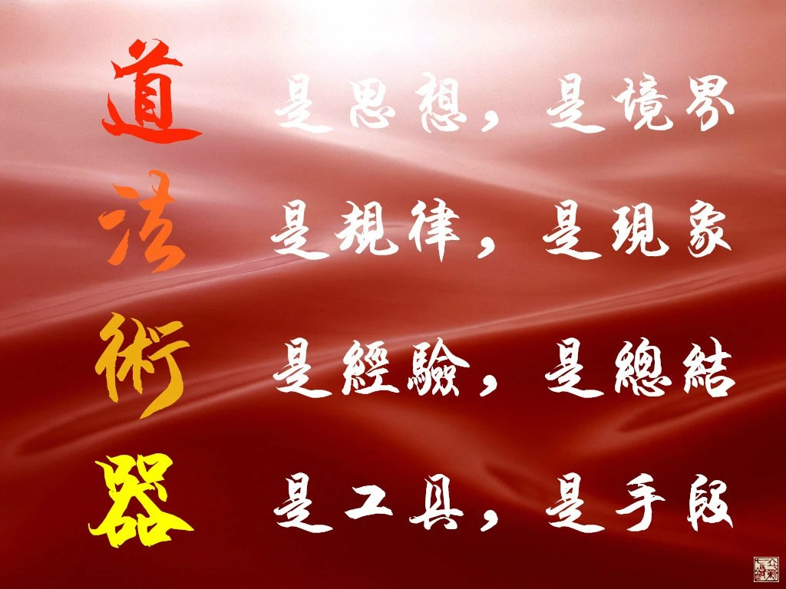
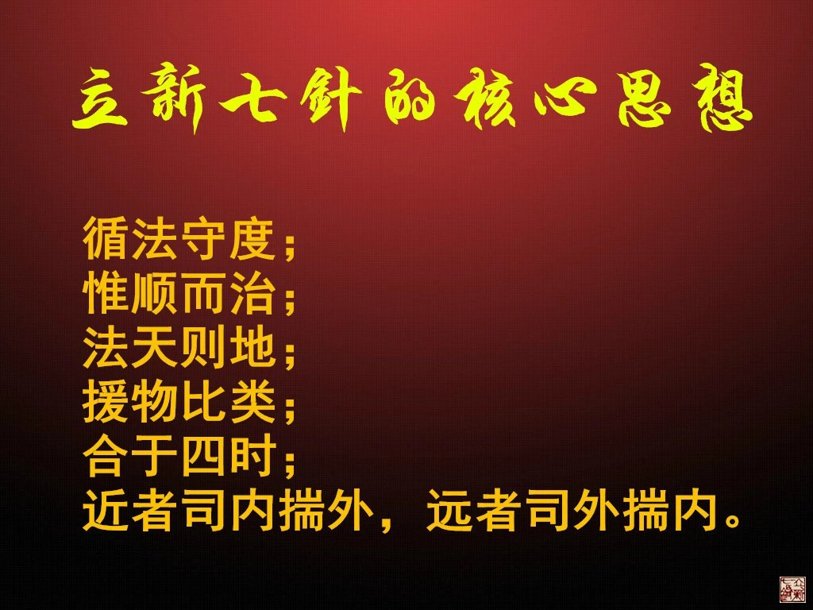
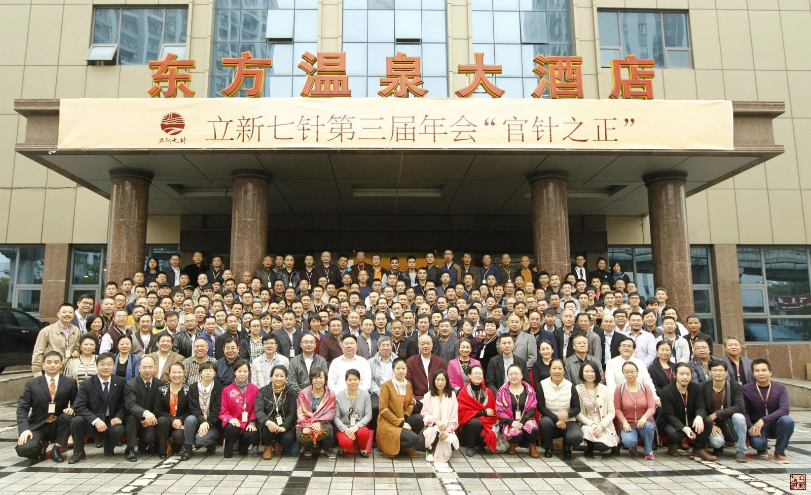
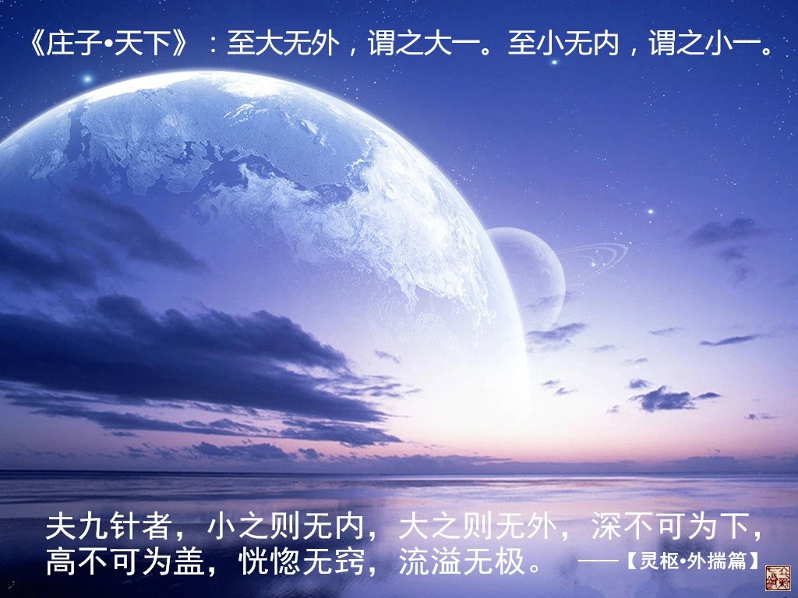
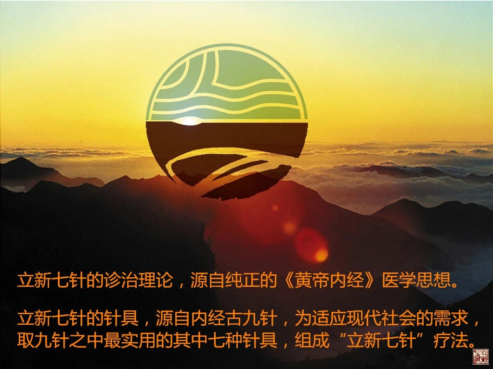

= 德不孤，必有邻
冰台2015-11-24 22:02

2012年5月，我在网络上发布了《破译千古【黄帝内经】九针之员针、员利针、大针》系列
文章，随后又向世人推出了立新七針疗法。从那以后，国内有相当大一部分人，因我的影响
而开始去注重和研究《黄帝内经》，这几年在国内掀起了一股九针热和内经热。

这是令我感到很欣慰的一件事，虽然，有不少专业医生和官方人士以及网络名人等都认为
《黄帝内经》是糟粕，早已落后不实用了。但在我看来，《黄帝内经》其实是属于我们整个
中华民族的瑰宝，是一部可以改变人生命运，得天下之大道的奇书。这样的宝贝，怎么可以
令他一直沉睡，长期被人误解误读呢？

识货与不识货，得出的世界观当然是截然不同的。那些攻击中医的人，我认为他们并没有错，
只是因为他们所看到的中医确实太糟糕了。如果我所见识的一些名老中医的表现，也填满了
我的整个世界观，那么我也会高呼应该取缔中医的，一点都不奇怪，因为我看到的见到的经
历的，就是那个样子。

那些骂《黄帝内经》是糟粕的人，也没有错，只因他们尚不识内经之奥妙罢了。在若干年前，
我也读不懂内经，我也认为这书连擦屁股都不好使，但如今谁要跟我这么说，我内心虽然非
常鄙夷他，但眼神会如同看着我读幼儿园孩子那样，慈祥的看着对方。我们绝对不能指责一
个几岁的小孩子会犯多大的错，即或有错，也是错在认知上，并非他本性就是坏人。

也正是因为我领悟到认知对于一个人的重要性，所以我遵循内经思想，把立新七针按照“道、
法、术、器”分为四个不同的修炼境界，也就是四个层次。道和法偏重于思想认知，决定医
生的层次高低，术和器偏重于实践经验，是提升认知的基础，理论与实践结合起来，才成为
一个完整的立新七針学术体系。

然而“道法”二字，说起来容易，真正要落实起来，却是非常的不容易。绝大多数人都习惯
于招式的培训方式，要想改变他们的思维模式，谈何容易。事实上我们也看到某些谈理论口
若悬河，遇实战则噤若寒蝉的名医，人家也混得很好啊。很多只懂埋头玩针法穴位经络，不
明上医治国法天则地之理的中医们，他们的收入和名声也都不错呀，干嘛立新七針学员就一
定要研究那么通透呢？

所以有的老学员也向我建议可否分阶段的进行培训学习，免得基础差的人学得那么辛苦。确
实也有一小部分学员听我的课感到比较茫然，因为他们只想学一招半式，赶紧的回去混口饭
吃，所以他们学而不会就感到特别痛苦。但我知道这并不是真相，真相其实是他们还没明理，
真正明理了，纵然不能大富大贵，做个一般的人上人也是不难的，怎可能连衣食都不保呢？
所以我力排众议，坚持要求每个学员努力去融会贯通道法术器这四个层次，我坚信，只要学
生自己不放弃，若干年以后，他们必将大有出息。

孔子曰：德不孤，必有邻。近几年来，立新七針一直坚持按照“道法术器”浑然一体的方式，
去弘扬内经医学，吸引了越来越多的有识之士参与到七针队伍里来。2012年3月开始的第一
期七针培训班，只有5个学员，第二期来了9个学员，到2015年7月的首期中级班，虽然学费
高达五万元之巨，也新增弟子近30人。这个发展速度，并不是依靠什么广告宣传策划之类得
来的效果，仅仅就因为立新七針在道法自然，道不远人。

当然，大家也看到我空间日志后面有个别人在留言抱怨，也有极少数七针学员对立新七针存
有非议，也有极少数患者对七针的疗效存在不满，但是，毕竟绝大多数真正明理的学员是认
可立新七針学术思想的，绝大多数接受过七针疗法诊治的患者们，是满意立新七針疗效的，
这便够了。

我并不是否认自己的不足，或替自己疗效不好而辩解，相反，正是认知到我们的不足之处，
我才带领弟子们在加倍努力的进步，我很自信，以前因我们学识不够而令某些患者失望的情
形，将来一定会越来越稀少。

但我们不会因为个别人的不满情绪而懈怠自己的意志，毕竟立新七针无论是针法针术还是诊
治理论，都是合于自然之道的，属于大道之理，这已经足以令我们心安理得了。

而且，这个世界，有谁能够令所有人都满意的呢？没有！

至少，这几年下来，我通过宣传弘扬内经医学，让很多原本医技平庸的医生，在医术与认知
方面，得到了天翻地覆的提高，间接的造福了全国各地广大的患者，我不能说自己功德如何，
但我实实在在是做了一件接地气的事情。

2013年11月，我在重庆举办了立新七针首届年会，年会的主要目的，是通过学员们汇报和分
享临床运用立新七針的经验总结，来互相交流学习，令大家的医术得以提高，同时也借此促
进立新七针学员彼此之间的感情。

参加首届年会的学员们，在年会结束后异常兴奋，大家深切的感到受益匪浅，纷纷强烈要求
每年都举办一次年会活动。所以到今年，立新七針已经举办了三次年会。2013年第一届七针
年会的参会学员只有84位， 2014年第二届七针年会参会学员已有164人，到2015年10月，参
加第三届立新七针年会的学员达到了229人。

正所谓道不远人，立新七針也在这几年里逐渐完善了自己的学术思想，对立新七針全体同仁
而言，《黄帝内经》是我们认识世界的万能工具书，让我们可以明理的行医和智慧的生活。
七针学员的福利是持续的，那就是我在进步，就会带着他们一直进步。

前面我说立新七針属于大道之理，什么是大道之理。

只要稍微看过《黄帝内经》的人，都应该对下面这段话有点印象：“令可传于后世，必明为
之法。令终而不灭，久而不绝，易用难忘”。这是灵枢经开篇，九针十二原第一章里，黄帝
昭示天下的一段话。

很多人都在抱怨《黄帝内经》读不懂，那么，你有没有认真去思考过这段话呢？

这个地球上，有七十亿人口，有两百多个国家，有两千多个民族，公认的独立语言就有四千
多种。就中国而言，就有56个民族, 80种以上的语言,约30种文字……人类的风土人情、文
化、习俗、学识、劳作、认知、基因等等都不一样，这么复杂的环境，怎样的医术才可以
“明为之法”？怎样的医术才可以“终而不灭久而不绝”？怎样的医术才可以“易用难忘”

如果是属于某一个人发明创造的医术，是他一个人能量的展现，这个人死了之后，他的精神
也就消灭，至少，也是衰败了，怎么可能久而不绝？过去很多所谓老中医的“绝招”失传了，
就是这道理，其实那老中医所拥有的只是小术而已，并非大道，大道存在于天地之间，是不
会失传的。如果是属于某个民族的医学，那么受地域、语言、习俗的影响，必定传播不畅。
一旦因天灾人祸，这个民族毁灭了，那么他们的医学也就毁灭了，又岂能终而不灭？

我要明白一个道理，这世界无论多么复杂的环境，始终都有一个共同点，那就是自然规律。
自然规律是不分国界，不分人种，不分民族，不分男女老少，不分语言，不随人类意志为转
移的一种存在，又是你懂我懂大家都懂的基本道理，这样的道理，何愁有人不能明白？

所以，我们就知道了，唯有道法自然的医学，才可以“终而不灭，久而不绝”。自然规律百
年千年亿万年都不会变，道法自然的医术怎会灭绝？除非世界消失了。什么样的医术才可以
“易用难忘”？还是道法自然！人从父母交媾起，还在卵子精子的时候就开始运用自然规律
了，人一生下来更离不开自然规律，天天用，时时刻刻用，属于一种本能，又怎会忘记？世
界上还有什么比道法自然更易于推广普及适应范围广的医术呢？

道法自然的医术，才可以适应全世界，而且永不灭绝。

如果我们去研究道法自然，就会发现，生活无处不医理！原来，令很多人感到深奥的道法自
然，却是我们每天日日时时刻刻都在运用，只不过日用而不知罢了，但绝非写个“道法自
然”的牌匾或书法往墙上一挂就是懂得道法自然的。

什么是道法自然？

很多人把经验技巧这些也误以为是道法的层面，那是认知上的错误。

一个针者在临床中积累的经验教训和技巧，形成的一些类似规律性的认知，比如某病取某穴，
某针治某病等等，虽然也包含了一些思维理念，但大多是一些固定的模式或套路，比较容易
学习掌握，传播运用的时候疗效有一定的概率，但对病痛的来龙去脉不清晰，对经脉穴位的
认知也不够，虽然能够取得一些疗效，但属于知其然而不知其所以然。这些经验在应用的时
候，效果往往要取决于每个医生的环境、平台、应用对象等，碰运气的成分比较多，容易随
个人意志转变，所以还不属于真正意义上道和法的层面。

所谓“法”，是指规律、规则、标准。在人体里，经脉的循行路线就是规则，脏腑关系和气
血的循行就是规律，比如脏腑阴阳表里关系、阴升阳降、经脉河流上下游理论、一气周流等
等，这些都是属于规律，能够令我们做个明医。这些规律在我们了解之前，它是这样一种规
律，在我们了解之后，它还是这样一种规律，不以人的意志为转移。标准是在执法过程中不
可违背的法规，如禁忌，消毒等。懂不懂守法，先要取决于你知不知法，知法的程度，要取
决于你认知度的高低。

所以，比法更重要的，是医生的思想和认知，那就是大道自然。

我一直申明，立新七针学术思想是源于内经医学理论，立新七針的针具是源于内经九针，无
论针具还是理论，都不是我个人的臆造，都是原原本本解读于内经，有理有据，有根有源，
我只是花了一些精力与时间，去领悟和总结运用而已。所以如果要追溯立新七针的学术流派
与渊源，应该已有数千年之久。

虽然这几年我一直致力于立新七針的推广与研究，但我从不否认有比内经九针更高明的医术
存在，正所谓山外有山人外有人。但对于自然规律而言，真相永远应该只有一个，同一事物
不可能有无数个真相，也就是说人类只有在同一真相下达成共识，才有最好的最通用的医术
产生。

世界上有效的医术非常多，拥有特效医术的能人也不是没有，但大家可以对照“九针十二
原”这段话去细想对比一下，世界上所有的医术，有几个能做到“明为之法，令终而不灭，
久而不绝，易用难忘”？要么是运用得好，但是机理方面很牵强，说不清道不明，还是知其
然不知其所以然，这又如何“明为之法”？要么是老师自己用得好，永远是师父一死医术就
全部失传或失传大半，师父能力强大并不代表他的医术本身也强大，那些具有强烈个人意识
形态的医术，传播必然受限，如何能够“久而不绝”？要么就是医术受区域或人群的限制，
只在某地疗效好，只在某局限病种方面有所长处，适应病种范围不广，如何保证“终而不
灭”？要么就是该医术要求功力深厚才能展现得好，耗费十年二十年才磨得一剑，黄花菜都
凉了，如果说要三年才跟老师勉强学会扎个毫针，结果技术还差老师好远好远，人一生有多
少个三年？这样的针术，如何谈得上“易用难忘”？

所以如果有人说坊间有什么疗法比内经医学更高明，那一点都不奇怪，但很有可能那疗法只
是基于某个人或少数人，在某些局限或区域方面的认知，人中龙凤，某些方面表现比普通人
优秀，那是很正常的事。但是，个人的认知再优秀，也永远无法与集人类智慧之大成的内经
医学相提并论，这也是一种自然规律。

内经医学是自然医学，立新七针也崇尚道法自然，立新七针疗法在某些局限的方面的表现，
或许并不如某些特效疗法的效果好，这也很正常，但立新七針的优势在于廉便普及性，无论
是在东南西北中任何一个地区，无论是中国人还是外国人，无论专业医生还是业余爱好者，
无论年龄大小，只要你懂得自然规律并加以利用，就会有疗效出来。这样的医术，并不在于
展现个人特长，所以如果你纯粹用个人特长来与七针对比高低，那是不明理的，请务必要清
醒认知这一点。

还不明白么？说直白一点吧，我其实也不崇尚中医，也不崇尚西医，也不崇尚个人英雄主义，
我判断医学的优劣，就是去对比安全性，对比整体疗效的治愈率，对比疗效的稳定性，对比
适应病症范围的多少，对比医术传播的宽窄度，对比医术的方便性和易用性，对比医疗成本
的高低，对比医生劳动强度的大小……无论中医还是西医，无论内经还是外经，无论是针是
灸汤药按跷熏敷，我只取全面衡量后的优胜者为我所用。

最后，我发现，目前为止，只有《黄帝内经》所汇集的思想理念，比较符合我的审美要求，
所以我狂热的爱上了《黄帝内经》，爱上了九针，爱上了立新七針。

这也是我一直强调立新七針学员们要“法天则地，援物比类”的原因。
