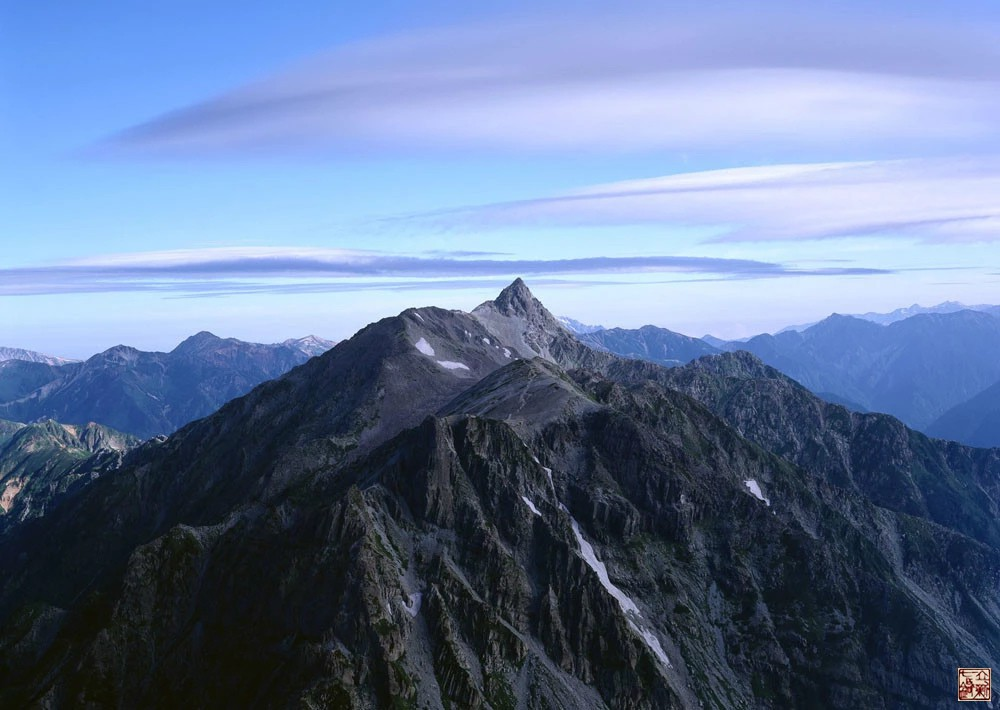

= 高山之巅
冰台
2015-12-21 16:08

有一句话，叫做“高山仰止”。

这句话，常被用于形容一些世外高人、隐修者。

在世俗的观念里，只有一个人能站在山的最高处。

所以无论宗教、门派、行业，大家都只想追随最高位置的那个老大。

都以为，老大的能量是最强大的，是高山之巅。

实际上，未必如此。

如一国之君，国君其实只是一个代表。

真正强大的，实际上是国君麾下的谋略家和将军们。

这座高山之巅，站立的是一群有勇有谋的人。

强大的团队，才是真正的强大，你若是贤才，必有一席之地，你若是将才，必有用武之地。

江湖门派中，通常老大的能量是最强大的，手下皆乌合之众。

老大必须强大，否则托不起这个江湖，所以老大一人站在高山之巅。

若某一日，老大没了，乌合们顿时茫然，或作鸟兽散。

有智慧的人，不会去追随江湖老大。

这是认知与格局的问题。

曾经，我以为，高山之巅，那最高处，一定是尖得最多只容得下一个人的足。

因为，我在山底下仰望高山，山尖处看起来是那么的锐。

直到有一天，我费劲的爬上了一座高海拔的高山之巅。

寻到最高处，我发现，最高处居然是一块平地，可以尽情的撒野。

我才明白，原来，真正够大的高山，其实他的山巅处，不会很小，完全可以容下一群人的足。

真正的高山之巅，应该都是一块平地。

越高的山，山顶承受的狂风就会越大，而且狂风暴雨是经常性的肆虐，自然规律容不得高山
尖锐。

所以，最多只能站一个人的高山之巅，算不上是高山。

因为，那些低矮的山，它的顶尖处，并不会经历多少太大的风雨，才可以维持非常的尖锐。

尖锐得狭窄，当然容不下更多人。

所以，如果只能容纳一个人的高山之巅，这座山，其实并不是真正的高山。

换句话说， 一个人的高山，并非真正的高山。

高山之巅，就在那里，不会因为人多人少而改变，到了就是到了。

屹立高山之巅，可以远眺，江山尽收眼底，可以俯视，一览众山皆小。

那种感觉，很美。

还有更美，那就是你会被激发出凌云之志。

但是，并非所有人都能爬上真正算得上高山的那个山巅。

动力不够、体力不支、意志不坚、气量不足，都到不了山巅。

即便勉强被人搀扶到达山巅，要么累得半死，要么，上气不接下气，喘得心慌意乱。

此刻，哪里还有心思赏阅美景呢。

赶紧下山，才是他唯一的想法。

高处不胜寒。

但高处所能享受到的美景，是在低矮处感受不到的。

总会有那么一些不惧寒冷苦累的人，会努力到达山巅。

所以，真正的高山，不会孤独。

是吗？

是的。

即便，短时间里，还没有更多的人到达山巅。

但是，世上有哪一座高山，不是群山簇拥着的呢？

所以，高山之巅，不可能真正孤独。

那些到不了高山之巅那部分人，就会留在高山周围那些相对比较低矮的山上，

也一样可以饱览美景。

如果调整好状态，他们也可以向更高的山头前进，直至高山之巅。

志同道合的人，一定会聚在一起。

当然，那些背负太多的人，依旧心有余而力不足，

对这部分人而言，即便本身具有攀登高山之巅的能力，由于负累太重，高山之巅也是可望不
可即的。

一个人的智慧，终究是孤独而可耻的。

我曾跟随一群人，到一座大山里，去寻访一位隐修者。

据说隐修者曾经事业很成功，然后就开悟了，然后就躲到山里去隐修。

隐修者蓄长髯，挽发髻。

或许是须髯茂盛的原因，隐修者油褐色的脸，看起来，有点邋遢，嘴角粘着一些唾沫。

他盘坐在蒲团上，讲的都是一些心灵鸡汤以及人生哲理之类的话。

寻访者们听得激动，如饥似渴记录这位隐修者的每一句话，生怕漏掉一个字。

我听了一会儿，听不进去了。

我在想，大隐隐于市，如果他真的明白了，怎会把自己放到山里去？

如果，他的智慧真正够强大，怎会躲起来？

躲在深山里熬出来的这点儿鸡汤，是否适合红尘世界？

我只能想到，他自己还没整明白。

自己尚且没整明白，尚且需要远离尘世躲起来修炼，这样一个人，他的鸡汤，价值何在？

与实践脱节之后的理论，再强大，也只适合给书生们看。

对于实战者，没有什么意义。

最重要的是，只有一个人的山巅，并不是真正的高山。

所以，如果只见到一个人的智慧，就感叹高山仰止，那其实是一种不明状态下的错觉。

他只是比你高而已。

更高的山，你还没见到。

少见多怪。

真正的高山之巅，是平的。

山巅之上，集合的肯定是一群高人。

你在，还是不在，高山都不会孤独。
