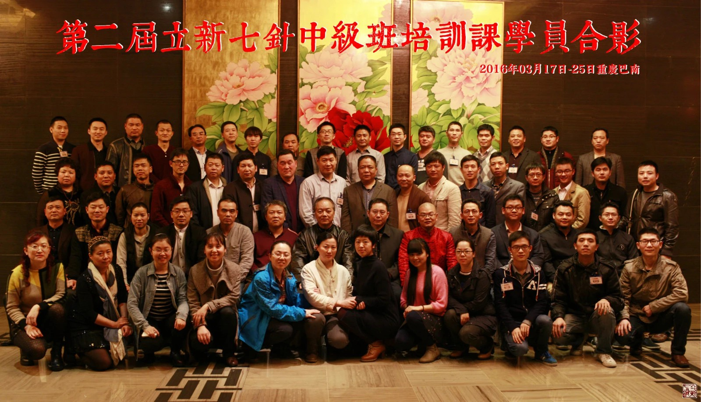
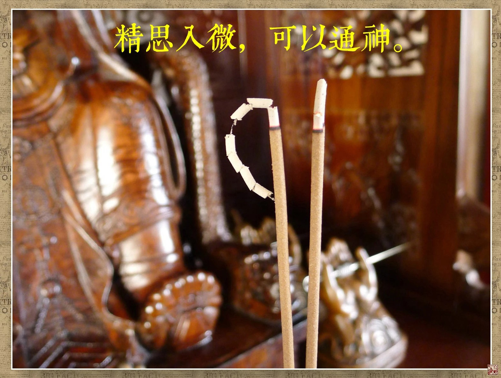
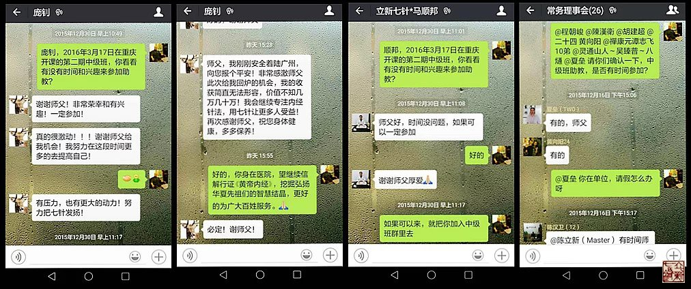
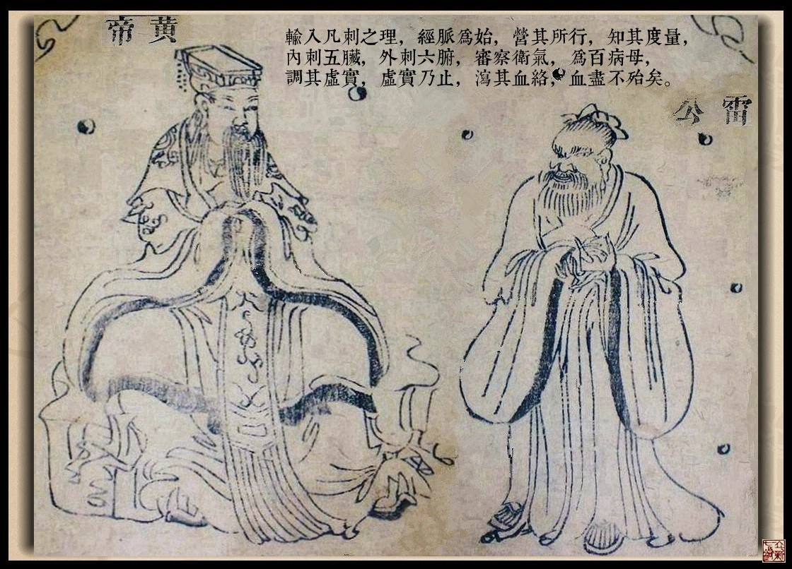
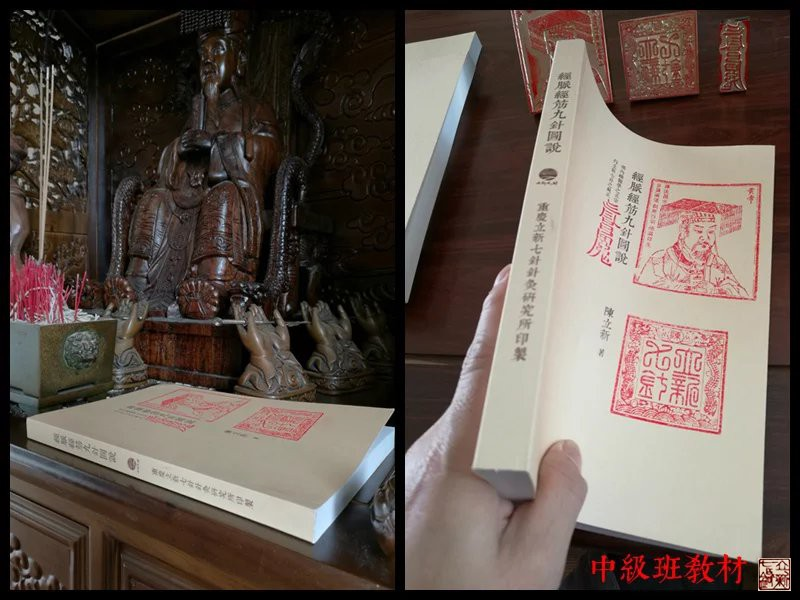
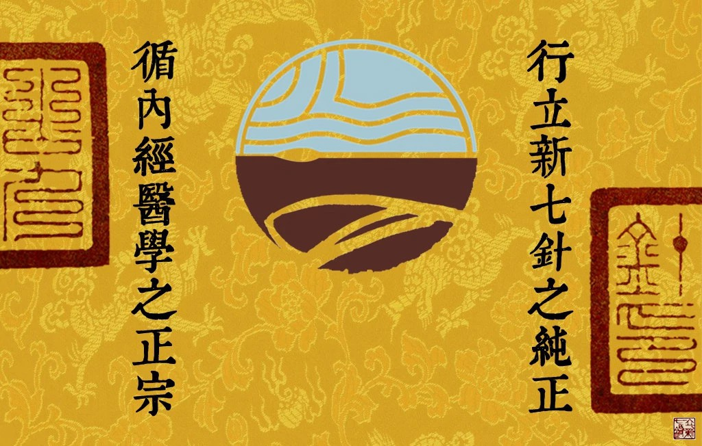
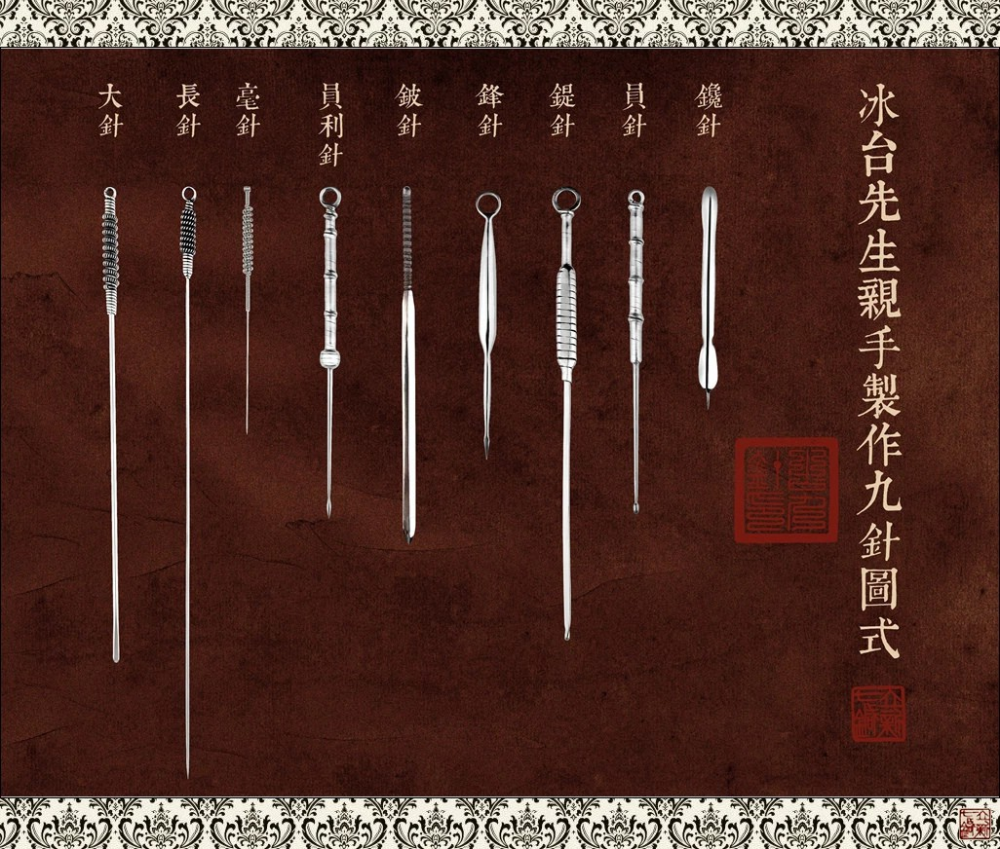
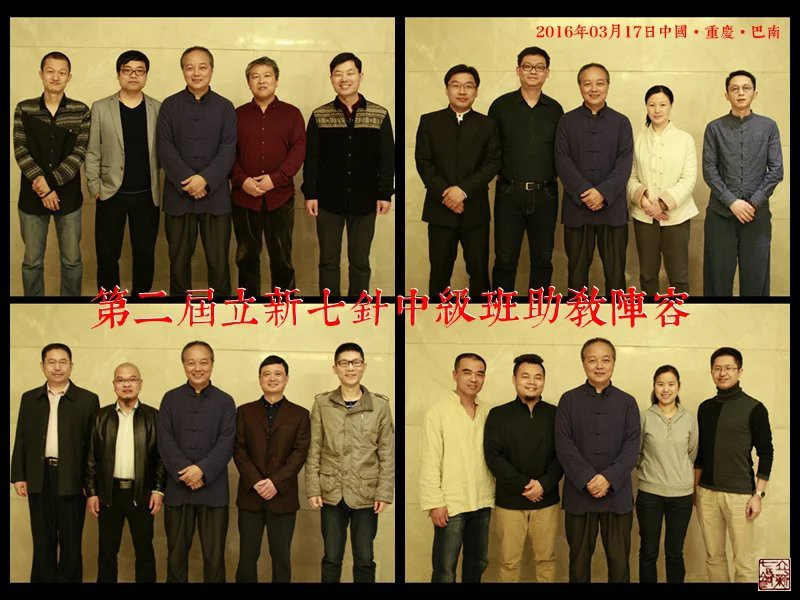

= 四十九年磨一针
冰台
2016-3-27 00:00

2016年3月25日，第二届立新七针中级班培训课程第一阶段结束。谨以此文，作为本期培训
课程的纪念。

孔子曰：五十而知天命。何为天命？听天由命吗？以前我一直不能明白其意。

自2012年开始，我创办成型的立新七针疗法开始面向全社会推广。通过这几年的迅速发展，
自己也在内经海洋里日新月异的进步着，至目前为止，立新七针的整个学术体系已经基本完
善，同时我也进入了人生的第49年，也迎来了第二期“立新七针中级班”的40位学员。

在以往的培训课，我发现有少部分同学比较内向，怯弱于提问和动手，学习效果不太好。一
方面，师生之间，毕竟在认知上有较大的差距，沟通上或多或少都不那么随意，另一方面，
学员与学员之间其实更容易也更方便沟通。所以自2015年三月份开始，立新七针中级班培训
课程试行“传、帮、带”的教学模式，我会根据情况选择一些临床表现优异、又愿意积极跟
同学们分享交流的七针老学员，来协助我解答新学员在课业行针诊治等方面的工作，令培训
课程更加注重理论结合实践，让新学员可以获得更好的学习效果。

内经浩瀚如海，知识取之不尽用之不竭，所以立新七针每一期的培训课内容，都会有较大变
化和提升，这正预示立新七针的生命力是和于自然规律的。这次中级班，尽管限定学员名额
在通知出来后短短数日就满员截止了，由于很多人的强烈要求与举荐，结果实际名额严重超
员一倍。

因此我在立新七针针灸协会群里的老学员当中，挑选了十六位临床运用立新七针疗效很不错
的七针医生，邀请他们作为我的助教，这十六位助教，对立新七针有着坚定的信念，又具备
团队协作精神，积极参与七针建设，所以助教们在为七针做出贡献的同时，我也是奖励他们
一次回炉学习提升的机会，同时也是一次检验七针老学员真实临床能力的过程。

昨日，为时九天的本期中级班第一阶段课程结束。

学员们每堂课都聚精会神听我谈天说地讲内经，我看到四十双眼睛，随着课程的进展，渐渐
的由浑浊变得透亮起来，我知道，他们已经正式步入内经之门了。从最后一天学员们的提问
中，所涉及的知识深度与范围，验证了我的判断。

这四十名学员，以中年人居多，基本上都是临床经验非常丰富的医生，他们有的人曾八方拜
师学医，学过的医术门类比我见过和听过的还多，有的已经在一线行医二三十年了。要知道，
这些见多识广的医生，谁没有几手绝活呢？每一位在他们当地可能都是非常拽非常牛的神人，
走路都不正眼看人的那种。如果不能从灵魂上征服他们，中级班的培训课根本不可能进行如
此顺利，更得不到他们发自内心的掌声。

学医，很多人一直纠结于想学到一些规范化的操作招式，也就是某穴治某病，某病用什么针
扎什么穴之类的临床经验，因为不用太费脑子，易学易掌握，比较受大多数人欢迎。

对此，我有不同的见解。

术，只不过是一些经验和技巧罢了，认知到位了，其实是很容易创造出来的。我若教你术这
个层面的东西，可能短时间内你会非常欢喜，赞不绝口，奔走相告。但五年十年之后，随着
坊间一波又一波各种新鲜奇特医“术”的出炉，你当年所学到的那些医术，一定会落后或被
淘汰，你现在的学费一定是从50000贬值成5000或500甚至不值50元。但是，若从思想思维这
个层面上去学习提升，让思想与思维观念都发生巨大转变，虽然短时期内可能见不到大的经
济效益，但三年五年或十年之后，你的认知提高了，又何愁无“术”？举手投足之间就可以
信手拈来，那么现在付出的5万，一定增值成了50万500万或者5000万甚至更多。

就像房屋筑基一个道理，地基打好了，何愁后头没有好的发展？

人，也是只有自己先富裕起来了，才能够给予社会和百姓更大的帮助。

在我看来，医生这个职业，其实是济世的治国之位。

所以，只有令医者的思想认知提升到上医治国的高度，才能够真正让他们的生活与事业飞速
进步，这时候才能够以高质量的方式去帮助到更多需要帮助的病患。那种日复一日的程序式
工作，只能令医者变得更加机械和呆滞，事业谈何发展？

内经医学，高贵在于他的思想境界和认知度，这才是无价之宝。

内经曰：九针者，天地之大数也，小之则无内，大之则无外。古往今来，有几人领悟了这句
话啥意思？三年前我就一直反复在告诫学生，千万别在针具上着相了，内经九针不是九支针
具，九针其实是思想，七针也是思想，所以七针虽然名为七针，其实只是一针。世界上没有
比思想更广阔的，也没有比思想更狭小的，所以小之则无内，大之则无外。

古人云：积行成习，积习成性，积性成命。今日学生们的思想切入内经轨迹，开始信解行证
立新七针，相信他们绝大多数人的命运从此将得到转变。

那一日，课间休息时，有学生问我：老师，你的阅历怎么这么丰富，居然可以把自己的生活
阅历用来解读内经，而且解读出来如此的实用？

我对学生说，我虽然有那些丰富的阅历，如果我不勤于总结，不善于思考，不去道法天地自
然，不去和于《黄帝内经》，那么经历了也就经历了，即便心有不甘，闲着也只能闲着，我
又岂能借助七针展现出内经医学的辉煌？

话语说完，我蓦然发现，自己生命中走过的这四十九年，经历过的那些艰辛、挫折、磨难、
失败、悲苦、欢欣、喜悦、成功……可谓“历遍穷通”，其实最后都是为现在的立新七针所
准备的，厚积薄发，所以七针这两年才发展得如此迅猛。

我突然领悟到了天命的真意。

古人说“十年磨一剑”，我磨内经九针得立新七针，又岂止用了十年？

自己从小到大在美术、文学、雕刻、电钳工、无线电、武术、气功等方面的兴趣与爱好；在
金属冶炼、汽车维修、商业经营与销售等方面的工作历程；以及在长江边生活长大，山川河
流寒暑易节洪荒郊野等现象对我的启迪；十余年时间数十次赴全国各地学习，涉猎遍及中医
西医，正统与民间；在国内外的各种寻访与旅游，区域种族习俗自然环境方面的异同；在父
母、子女、亲戚、朋友、家庭、婚姻、师生之间所经历的那些情感方面的郁闷困楚与愉悦惬
意；在自己身体上所领受的那些病痛与丧失，变化与愈合……等等等，无一不是为现在的立
新七针所准备的。

真可谓四十九年磨一针！

孟子曰：“天将降大任于是人也，必先苦其心志，劳其筋骨，饿其体肤，空乏其身，行弗乱
其所为，所以动心忍性，曾益其所不能”，自己在内经医学的道路上，何尝不是如此。

老天既然安排我经历那些人那些事那些针，又令我的思维方式与几千年前古人的思想能够同
频，我不入地狱，谁入地狱？

这才是天命。

九针沉寂两千年，经脉被世人所曲解，卫气则不知所云，日用而不知，既然被我阴差阳错的
破解了，我就必须去弘扬，因为是天命。

然而，内经医学这种古老而新鲜的事物，并不那么容易被更多的人所接受。

有一次，遇见某职位与中医有关的高官要员，他听闻“立新七针”，不禁惊讶的问我：我怎
么没听说过这种针法？你的渊源何处？我说，立新七针是内经九针的其中七种，要问渊源，
我的上一代就是《黄帝内经》，无论针具针法、学术思想还是理论体系，皆源自内经本意。
我以为他会感兴趣而继续了解下去，孰料他听闻《黄帝内经》，立刻表现出对立新七针的不
屑一顾了，然后语重心长对我说道：内经这本书，有非常多的糟粕在里面，几千年前的书，
所写的那些理论，很多都不适合于现代社会了，所以你一定要以批判性的眼光去看待这本书。

我极度无语。

我相信，他若明白了内经所讲述的都是天地间永恒不变的那些规律，不仅适用于现代社会，
也适用于千秋万代之后的社会，他绝对不会如此评价《黄帝内经》的。

但是这位官员所代表的，其实是非常庞大的一个势力群体的认知，在这样一种强势的认知状
态下，内经医学焉能受到重视？

能被称作经书的，记载的一定是古人在学术思想方面的重要资料。天变地变，自然规律永恒
不变，若我们一开始就带着怀疑与拒绝的态度去读经书，又岂能解读明白其中的片言只语？

看不懂，其实是自己认知没到位，或心神不够端正，不要轻易否认。

我们可以反思一下，华夏先祖们能够创造出富含无穷思想魅力的汉字，仅凭这一点，先祖们
的高智慧，就不是我们现代人这点思想境界可以随意蔑视的。

内经那些文字，背后到底承载有多少思想？

不可得知。

我只知道，内经浩瀚如海，我们任重而道远。

只有等待未来，更多的人融入内经天地的时候，内经医学才能够被人们所重视。

所以，已经磨了四十九年的立新七针，还将继续磨下去。

