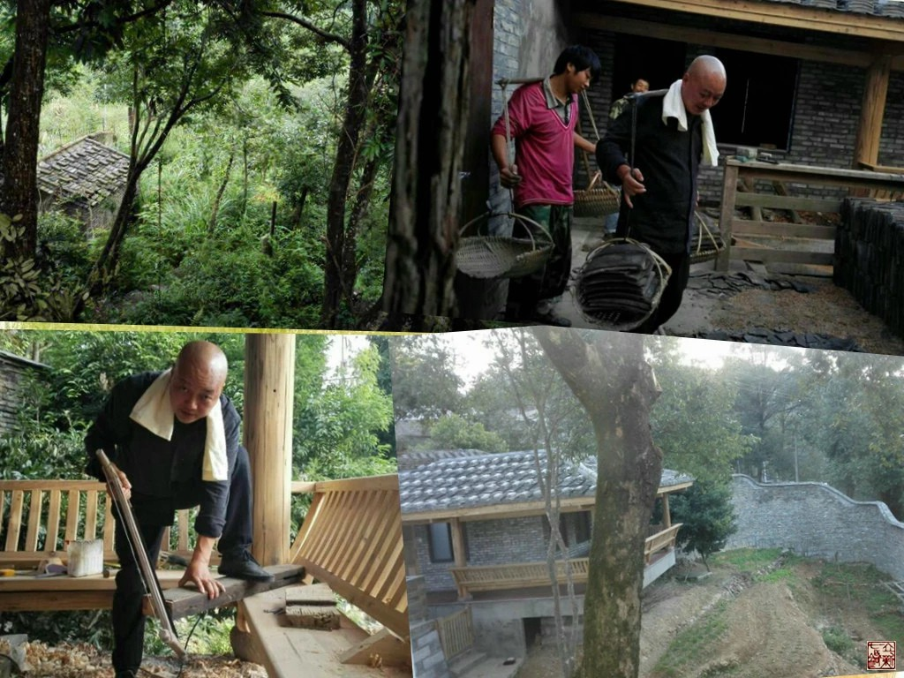

= 中风
冰台
2016-4-19 14:12

很多医生在形容对患者病痛的理解的时候，常常会用“感同身受”一词来比喻自己的心情。

但感同身受，也只是有感而已，与亲身经受还是两码事。

亲身经受，作为病患的那种心情，绝对不是旁观者所能领会的。

尤其是截瘫、中风、偏瘫之类。

一提到中风，人们立刻就会联想到猝死、半身不遂、口脸歪斜、口语不清、瘫痪在床、变痴
傻…… 这类患者俗称中风，是现代社会多发病，而且越来越年轻化，很多事业有成的青壮
年人，平日里意气风发，某一天突然就猝死或瘫了。

死了也就罢了，亡命工作挣来的钱财美人都成了别人的，再不情愿也就那么回事。最令人难
以接受的，还是瘫痪在床，生活不能自理，眼睁睁看着自己的金钱财物统统无法自由享用，
并且还要连累其他人来照料自己。 突患中风，那些气血较好、经脉较通畅、志意较坚强的
患者，一般都很快可以治愈，针灸汤药点穴等方法都比较容易取效。但由于人们对于中风的
真正病因缺乏认知，所以大多数患者只是表象被“治愈”了，真相并没有得到解决，很多患
者往往康复不太久的时间就再度中风。由于病情在不断发展和叠加，所以第二次治疗起来就
会好的慢一些，第三次第四次中风就更难治愈。我治过第五次中风的人，虽然效果很好，但
患者并无惊喜表情，他整个人早已被反复的中风折腾得内心麻木，对康复丧失了信心，所以
要想让他恢复到非常好的状态，并不容易。

中风的后遗症，常见半身不遂，这也是现代医学一大难题。西医没有什么好的治疗方法，现
代中医通常把中风分为中经络、中腠理、中脏腑的不同。这样划分恰恰显露出现代中医在认
知上存在很大不足，所以常见的针灸按摩汤药等方法，虽然比起西医的方法好很多了，疗效
还是很慢，而且总体治愈率比较低。

半身不遂，内经称之为“偏枯”，从字义上理解，偏瘫时间长了就会枯萎。所以常见偏瘫后
遗症要么手脚瘫软无力，要么手脚拘挛僵硬。总之，基本成了一个废人，一个人丧失了工作
和生活能力，对家庭、社会、国家都带来负面的拖累，这是个大问题。

中风偏瘫的滋味，没亲身领教过那种感受的人，其实真的难以理解那是啥心情。仅仅耳闻目
睹亲人朋友的瘫痪，再怎么触动你的心，也无法让你站在患者的角度去产生一种特殊的动力。

说起感同身受，我从一毫无医学基础的外行，走上中医这条路，其实就跟感同身受有关。

十七年前，我母亲罹患腰腿痛，八方求医却久治不愈，饱受“腰椎间盘突出症”痛苦的折磨。
作为儿子，感同身受，看在眼里，恨在心里，恨自己无能为力。所以从那时候开始，自己踏
上了学医之路。

十多年下来，我是卯足了劲，跟“腰椎间盘突出”干上了，我发誓一定要征服这种病，找到
它真正的病因。所以从现代中医针灸到西医针术，再到复古内经医学，一路走下来，我都没
有满足过，不停地学习提升。母亲的腰腿痛自然是早已被我治愈，自己的医术也回归到了最
自然最安全的内经医学上面来。而所谓的“腰椎间盘突出症”，对我而言，早已不是什么难
事，治疗都不费心的，太过寻常简单就没啥兴趣了。毕竟我跟专业医生们还不一样，人家行
医是职业，以此养家糊口，而我只是一个针灸票友，发心是来报仇的。仇恨已报，也就圆了
心愿，所以后来索性把好不容易辛苦创立起来的针灸诊所，都送给学生去做了。

本来以为走到这一步，自己也算报了大仇，可以休养了。所以跑到福州农村的一座山上，找
了处幽静的地方，修建青砖瓦房，住了下来。平日里就看看内经，喝茶聊天，偶尔教教学生，
过着悠闲的生活。

可是在那山上，山清水秀的地方，我竟然中风了。

永远忘不了，2014年11月14日那天下午，我蹲在小桌子面前玩电脑，不知不觉两腿蹲麻木了。
按往常经验，气血受阻嘛，起身伸伸腿麻木很快就会消除的。

活动一会儿后，右腿完全恢复正常，左腿却依旧麻木。

然后逐渐的，就感觉到麻木开始蔓延，整个左半身，包括脸、面，从额头鼻子到肚脐阴部中
间一条线下去，非常清晰的把身体分为左右两半，左侧全部麻木，右侧完全正常。

我从没有过这种感受。

如果说腰椎间盘突出症，我自己也腰腿痛过，特别是感受到母亲腰腿的痛苦，所以对患者们
我是非常的能感同身受，特别的能理解他们的心情，我投入研究也特别狠，在治疗方面也比
较用心，被我治愈的腰突患者也是所治患者中最多的。

中风患者，我也治过一些，看着那些不能自理的患者，经我针灸之后很快恢复正常了，心里
非常惬意，但都只是悲悯他们的不幸，尽量帮助他们，我从来没有过感同身受的心情。尽管
疗效都还不错，但并没有以深仇大恨的心情去征服那些病魔，所以在中风后遗症的治疗方面，
我并不主动接纳患者，也一直没怎么用心去研究。

现在轮到自己中风了，而且还不仅仅只是麻木。我躺在床上，感觉到这种麻感渐渐地在加重，
但自己意识非常清晰，肯定不是脑溢血脑梗之类，还是气路受阻。起来多活动活动兴许会好
点呢？于是下床穿了拖鞋，勉强坚持走了几步，走到门口总是觉得好像有点不对劲，低头一
看，才发现自己左脚的拖鞋根本就没跟着脚走，光着脚丫踩在冰凉的地板上都不知道，自然
站立不稳了。

我这人向来不信邪，不会轻易敬畏某个人某件事物，自然也不会恐惧这半身不遂了。

我在想，还好，不是全身没知觉，即使以后左边动不了，我还有右半边是好的，说不定可以
毅力练成单腿超人呢，嘿嘿，也蛮不错的。

后来回想起自己当时，也幸亏具备这种性格，让自己放松了。若是换了有些心气小的人，认
知再高，也会吓得魂飞魄散，神既不在，血气逆乱也就一发不可收拾，那就真的是瘫倒在床，
一蹶不振了。

当时左思右想，不得其解，自己的四肢筋骨脊椎这些都是练得比较柔活的，气血状态也非常
不错，营气卫气既不虚也不实，怎么居然会出现这种症状？

还是有些不放心，这世界致人生病死亡的食物与环境，防不胜防，不明原因多了去了，我可
不想不明不白。于是叫了朋友开车送我下山，到福州省人民医院拍了脑部核磁。听拍片的人
说没见什么异常，连片子也没取就立马回家了。

脑子里没别的东西，就放心多了。

中风的那天晚上，我几乎没睡好觉，左侧感到特别的冰冷和疼痛，左半边牙齿舌头都麻木了，
左侧身躯几乎不听使唤，连翻身和起夜都成了难题。

且不管这症状了，我开始思考这病是怎么来的。

回想起两个月前，也就是2014年9月14日，跟几个朋友一起去梅里雪山搞活动。有点高原缺
氧反应，但能跑能跳，还去义诊了几位藏民，就是连续几天晚上都睡不好。听旅店老板讲喝
点当地的青稞酒会好一些，我也想着水土不服嘛，道地食材能化解也是中医常用手段，于是
多喝了几盅。当时是想喝多了总可以好好睡一觉吧，却没想这正是不明而为。喝酒当时挺爽
的，然后回到房间休息，不一会儿就体会到了有史以来最厉害的心跳，心脏都快要憋到喉咙
来，呼吸急促，头痛欲裂，即使张着嘴大口吸气大口出气，也还是上气不接下气，持续一个
多小时都这样，吸氧都无法缓解。当时就感觉自己悄无声息的快要死在这房间里了，我在微
信活动群里说了一句自己此刻难受得要死，都以为我开玩笑的。还好林杰信了，过来帮我点
按几个穴位，好半天才慢慢缓过气来。

那天下午，我哭了，在微信朋友圈写下了“人生最失败的莫过于孤独的死去”的伤心感受。

雪山很美，但我一刻都不想多呆，当时立刻想回家了，但朋友说事情没搞完，眼巴巴的希望
我能再坚持，所以又硬撑了几天。雪山上呆了七天，总共加起来没睡上十个小时，每天还要
讲话录音，所以下山的那天，心情简直像逃离地狱一样。回来的路上，行走坐车飞机，如同
梦游。

这一趟，令我元气大伤，严重虚脱的感觉。回到福州山上，休养了差不多半个月，才慢慢缓
过神来。

所以说讲义气害死人，有的人稍微缺氧立马撤退了，那是真聪明人。而我则死撑到底，若那
天死于非命，现在坟头杂草应该有一米多高了吧。现在回想起去梅里雪山的那天早晨，临出
发之前还在犹豫，感觉挺不好的。桌子上放着头一天别人寄来装着零食的一个布包裹，看着
那包裹，我突发奇想，拎着布包装扮成一个乞丐拄拐蹒跚而行的样子，拍了两张照片，发在
微信朋友圈。本来是恶搞自己，不曾想一语成谶，倒也蛮有意思的。

紧接着11月初，北京正安文化第二期立新七针培训班开课，为期九天。这九天里，每天近六
个小时滔滔不绝的跟学员们讲解，讲课是很亏津液的，大耗阳气。

在中风的头一天上午，自己围着火炉，无意识的就坐在旁边石凳上看书，直到后来屁股都感
到冰凉了，才赶紧起身换了木凳。当天午餐后，见太阳很好，就躺在露台上的藤椅里晒太阳，
本来想散散寒气，却不知不觉中睡着了，被冷风吹醒，太阳早已不见踪影。

第二天下午，就出现了中风症状。

理顺一下：

. 高原缺氧，外气供需不足，导致五脏气争，肾气大伤；
. 连续九天讲课，耗损津液，再度大伤阳气；
. 久坐寒凉之地，强力入水伤肾，加之眠中受风；
. 恰逢三虚之时，再遇风寒湿三邪乘虚而入，内舍五脏，外存于脉肉筋骨。

生病没有平白无故的，总有因果。内经曰：“百病之始生也，皆生于风雨寒暑，阴阳喜怒，
饮食居处，大惊卒恐。”诚也然也！

然而，这几个因素其实都只是诱因，最主要的，是自己性格太重感情，多年郁闷压抑，导致
长期的水气凝胸，这就是内经所言“百病生于气”。我对自己性格的评价是：金钱财物事业
这些都伤不到我，唯有感情会令我受伤。如师徒、爱人间的一些过错与误解，朋友或事业伙
伴的算计与背叛，导致相互之间分离仇怨，感情最折磨人，阴阳不和，百病乃变化而生。

长期心情积郁，致脏腑分间窄狭，才是影响我身体健康的最主要原因。

还是怪自己对身体太过自信，疏于防范，导致诸多因素叠加在一起，令我中了招。否则单独
的高山缺氧、讲课耗神、风寒湿侵袭，又岂能奈何得了我。

中风后，我请一位中医朋友开了些祛风除湿的汤药，渐渐的恢复了很多。但恢复到基本不影
响行动的时候，疗效就停滞不前了。道理很简单，治病就是在认知到位的前提下，施展对应
法，一物降一物，一种病因一种克制。

一些同道和学生听到我说自己中风了，纷纷出谋划策，替我扎针，推拿点穴，汤药。包括暝
眩的方法，据说若药不瞑眩厥疾弗瘳，既然古人说得这么肯定，我就一定要验证一下，所以
也大胆地服毒，天旋地转狂泻如注也试过来了。我虽然已知自己真正的病因，还是乐于拿自
己去验证，万一我自己的推论不对呢，万一内经所言还有不足之处呢。

然而朋友们辛苦许久，真的都没有取得一点进展。差不多的医生，都没搞懂我真正的病因，
我看他们心非常善，虽尽心尽力，但究竟还是未明。

这些方法能解决的那部分问题，其实前面早已解决掉了。剩下病因主要在神上，你还在筋骨
皮肉和脏腑这些上面做文章，会有多少疗效呢？通过亲身验证他们的失败，再次坚定了我对
内经理论的信念。

自己调节情绪，是最好的治疗手段，恬淡虚无一点，身心放松了，症状一日比一日好转。然
后按运气规律，以和于四时阴阳的方式给自己扎针，拿自己验证内经医学，效果是令人惊喜
的。

当然了，并不是所有的半身不遂都是这个原因。

中医不应该依葫芦画瓢，前人和老师们的经验，那是基于他们自己的先天心性、认知、学识、
阅历、动手能力、区域、患者群等等因素所总结出来的，你不是他，你学习他们的经验技巧，
那就如同盲人摸象，摸到什么就是什么，一定是或效或不效，这也是为什么现代中医治疗中
风后遗症疗效不好的主要原因。我一直在提醒我的学生，中医不应该是经验医学，靠经验和
偏方治病，属于知其然而不知其所以然，很多的医疗事故就是因为不明而为产生的。中国医
学应该是尊崇自然规律的医学，只有遵循规律来诊治病痛，才能够知其然也知其所以然，治
病相对比较轻松而且安全。

规律不是内观或臆想出来的那些理论，规律是所有人都必须遵循的那些过程与现象，无论你
承认还是不承认，你都必须这么经过。比如用嘴吃饭从肛门排泄、白天过了就是黑夜黑夜尽
了就是白天、地气上升天气下降、河水从上游往下游流等等，没有人能逆而行之，这就是我
所说的规律。

同理，针灸也绝对不能只是纤细毫针的世界，因为无论针、灸、药、砭、按跷、导引，对身
体能起到调理治疗的作用，其实都是在虚实上面做了文章。而虚实之要，还是九针最妙，因
为九针是各有所宜，这也是自然规律。

我正是因为认知到九针具有简捷而稳定的对应法，才觉得九针特别高大上，否则我根本不会
从九针里取出七针，去创立什么立新七针疗法。

image::img/20160419-06.jpg[]

中风偏瘫，内经九针的疗效极佳。但疗效并不主要出在针具上，主要是出自思想认知上。所
以若我们仅仅模仿制作了九针针具，做得再精美那又怎样？并不是有了九针就能擅长治病的，
针具本身并不具备能量，是被人运用得好才产生了巨大能量。所以针具本身的价值极低，最
具价值的，其实是九针背后承载的内经医学思想。

正所谓“天将降大任于斯人，必先苦其心志，劳其筋骨，饿其体肤，空乏其身，行拂乱其所
为也，所以动心忍性，增益其所不能。”以前，腰突症跟我母亲过不去，虽经历千辛万苦、
殚精竭虑的过程，终于被我搞定了。现在，中风这个病，又来让我亲身经历半身不遂，既然
如此，我也一定要搞定它。

所以，中风后这一年半的时间里，我对治疗中风后遗症的深入研究，达到欲雪深仇大恨的程
度，这也是立新七针整个学术体系能够迅速完善的最主要原因。

一切都是天意！

嘿，现在跟十六年前大不同了，那时候俺羽毛初生，是懵懂和孤独的，我凭毅力和时间搞定
了“腰突症”。如今爷羽翼已成，手握七针，还有内经医学思想做靠山，更有那些对七针有
坚定信念的学生簇拥着，爷岂会担心搞不定中风？

中风，尽管放马过来，爷今后就跟你干上了！

面积达700平米的全国首家立新七针专科门诊，将于2016年六月下旬，在重庆市巴南区建成。
这里有全国最好的七针医生，我们会以中风偏瘫后遗症为主要的诊治范围，并以预防中风作
为“治未病”的养生项目来开展工作，追求精良的疗效。希望在未来，我们能以一己之力，
帮助千千万万半身不遂的偏瘫后遗症患者，恢复健康！
