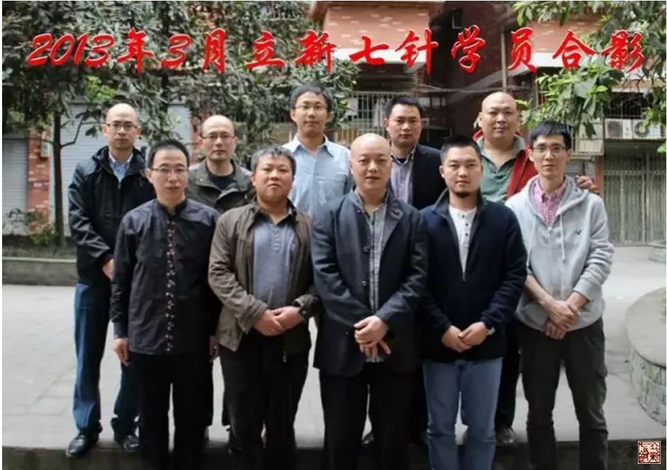
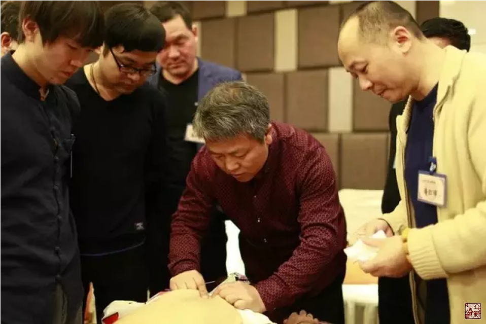
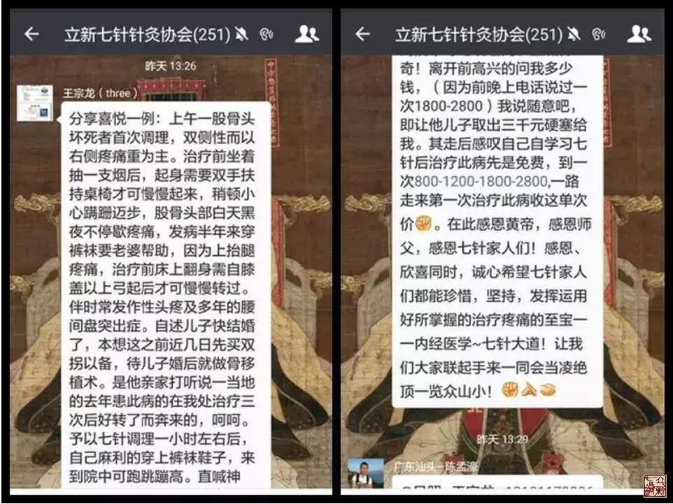
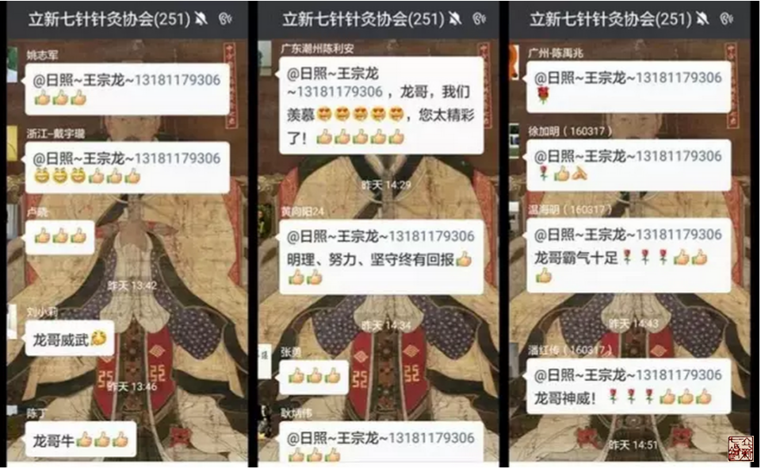
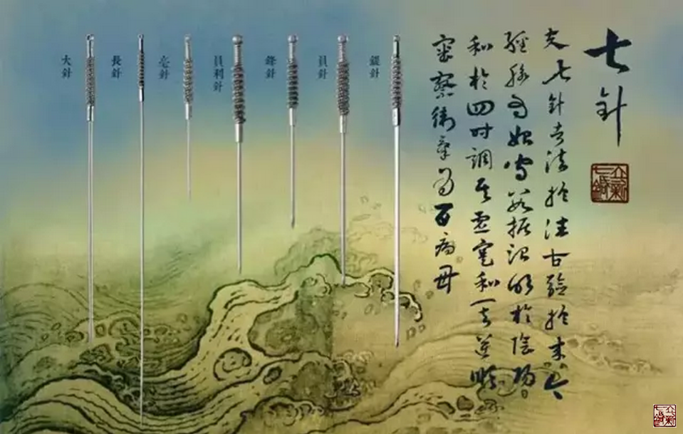

= 冰台“再论‘股骨头坏死’ ”
冰台
2016-4-23 00:00

2013年3月，山东日照乡村医生王宗龙来跟我学习立新七针，回家一个月左右，接手治疗了
一个股骨头坏死患者，取得非常好的疗效，欣喜的向我汇报。所以2013年5月23日，我在QQ
（277845469）空间日志里写下《股骨头坏死》一文，引起了很多患者的关注。

按通常的理解，我向患者推荐一位才刚学习立新七针疗法的学员，显得有点不负责的感觉，
所以当时也曾有人质疑我在炒作。实际上我是从我自己的角度在看待这个问题的，我以前去
学某些老师的针术，只看一两天，回家就可以把疗效做得很漂亮，在我来说自己一看就心领
神会，而有的同学在老师那里呆了半个月还没找到门的方向在哪儿。人与人不同，当然不能
一般齐来看待。

不过我的这种观点也遭受过失败，有一些看似很聪明的学员，嘴上讲得头头是道，我也以为
应该是不错的，就向求医的患者们推荐了，结果患者反过来抱怨我推荐了不值得推荐的人。
患者的心情我当然能理解，换位思考，如果是我听冰台的推荐去接受这位医生的治疗，大失
所望的时候，我的心情也不见得能多理智。所以这两年我除了努力提升自己的认知以外，在
向患者推荐学生的时候，也越来越谨慎，除非是我非常了解和信任的那些弟子，再不轻易向
患者推荐七针医生。

两年过去了，当年的王宗龙已经变成了七针学员里颇受人尊敬的“龙哥”，有时候我看他比
我小好多岁，白头发比我还多，我也叫他“龙哥”，呵呵，就想看到他浑身都不自在的那种
表情。这么多人喜欢他，是因为他在学员群里分享了大量自己的心得体会。一个无私的人，
心胸是宽阔坦荡的，我喜欢这种人。他的进步一定会非常快，因为只有宽广才能容纳更多。

从另一个侧面来看，一个人能够讲出那些道理，能毫不隐晦的跟同学们分享，本身就足以证
明他的进步是实实在在的。相反，若一个人自称自己很厉害，却不把心得体会拿出来分享，
这只能证明两点：要么就是手上有心头没有，模仿而已，当然说不出个子丑寅卯来，靠模仿
能学到的只是形，没有神，谓之知其然而不知其所以然，这样的医生，挣钱再多也没有多少
真本事，我是瞧不起他的。还有一种情况，这个人是自私狭隘的，不肯分享，缺乏团队精神。
从立新七针学术思想而言，只有缺乏整体治疗观念的人才会变得自私狭隘，如果真正通晓整
体治疗观念的人，无论言语或行为都是不可能藏私的。

王宗龙现在成了七针学员和很多患者心目中的“股骨头王”，这是很多人根据他的能量给他
取的雅号，甚至有学员用东邪西毒南帝北丐的“北丐”来形容他在医术上的修为。能荣获这
些称呼，还是因为他在所有的立新七针学员中，可能是治疗股骨头坏死患者最多、疗效也最
好的那个人。说他是“王”者，有人就很不服气，我就好笑，这有什么不服气的呢？我都得
服，你不服，你可以改姓王嘛。

我当然知道真正股骨头坏死治疗起来没那么容易，宗龙在这一点上心里也是非常清晰透亮的，
不可能什么样的患者都接，该做手术的还得让他们去做手术。内经医学是接地气的，并不是
那些胡吹玄吹的神医。其实很多所谓“股骨头坏死”，都是被误诊误判，其原因我就不多说
了。从内经医学的角度来看这些病名、病因，跟股骨头本身并不是直接的关系，还是气与血
的问题。但有的医生就不服，说人家股骨头都变形了甚至都磨没了，影像片上明明白白显示
了，你还能否认股骨头坏死？

肯定有一部分股骨头坏死是需要做手术的，就跟“腰椎间盘突出”一个道理，有极少部分
“腰突症”确实必须做手术才能够真正治愈，但绝大多数所谓“腰突症”根本无需手术，也
无需服药，针灸可以快速治愈。你若明白了针、灸、药、推拿按摩、导引锻炼、刮痧拔罐等
方法，最终都是在“气”上做文章才起到治疗作用，你就不会对此产生疑问。

我说这类病无需服药，中药医生们千万不要着急起来，请稍安勿躁，我自有道理说给您听。
所谓腰突症和股骨头坏死，在内经医学里只能算五痹范畴，五痹其实是九针的菜，这一点您
不服也得服。在用药用针的理论上面，各家门派虽然有不同理论解释，但真相始终只有一个，
都是同一个道，无论怎样解释和包装，理无二致，根，都在内经医学理论里。在调经脉本身
问题的时候，用针肯定更好更快过用药，调脏腑本身的时候，用汤药肯定会好、会快过用针。
针最擅长的就是直接调经脉，具体用针的时候，还要看经脉的问题是脏腑所致血气产生旺衰，
还是经脉本身不畅导致的气血虚实，诊断不清楚不要轻易扎针，针不得其用，病弗能移。如
果确诊是针的适应症，当然用针会比用药来得又快又好。

我这里说的针，不是大家通常见到的那种毫针的“针”，我是指内经九针，也包括毫针在内，
但九针更全面更系统。因为九针是最简单稳定的对应法宝，在调理五痹症状方面，用药再精
也比不过用针来得直截了当，九针各有所宜，长短大小是各有所施。用药讲究药性，讲究君
臣佐使，用针也讲究阴阳，针是有针道的，讲究各有所宜各有所主。针具选择上要有君臣佐
使，经络穴位的运用也分君臣佐使，相对而言，针，更适合经络的调理。

临床上有些“股骨头坏死”患者，影像片看上去非常恐怖吓人，股骨头都变尖了，只是放在
髋臼窝里，似乎一动就要掉出来，这让医生和患者都认为只有换股骨头才是唯一的办法。事
实上，我曾治疗过股骨头已经成了尖椎形状的患者，无法站立，躺床上腿也蜷着不敢伸直，
几次针灸之后基本可以独立行走了，竟然还可以不扶墙做半蹲。不能理解这一现象的医生们，
是因为您忽略了一个大问题，人的站立行走运动，蹦蹦跳跳，并不仅仅依赖筋骨肌肉的，更
重要的是“气”，气虚就站立不稳，走不快也跳不起来，气足了就可以奔跑跳跃。您只在筋
骨皮肉上做文章，虽然也能取得一些疗效，但更好的疗效是肯定出不来的。如果我们重视
“气”的存在，去调理这类患者的时候，就会发现疗效超乎我们想象。

现代医学，无论中医西医，很多的病名，未必是真相。现代医学的病名取决于物理诊断和实
验诊断，比如化验数据，影像片报告等，根据某种特殊病变的病灶而命名，或者就生理上的
某种特殊变化而命名，而现代中医大多也是效仿西医病名。

病名只是医生告诉患者的一个名称而已，并不一定就是疾病本身。这个病名是基于医生的认
知而来的，那些检测仪器也是人发明制造出来的，如果发明仪器的人对疾病的认知度比较高，
那么仪器诊断得到的结论可信度还比较高点。反之，如果发明设计那些诊断仪器的人认知度
不足，甚至是错误的呢？我们根据仪器检测的结论来治疗，会不会误诊误治？我的逻辑观点
就是，医生既然能诊断患者得了这个病名，那就应该能给患者治愈，至少也应该有明显改善，
如果只给患者定个病名，而治了却没有改善，或久治不愈，我们凭什么相信医生的诊断结论
是对的？

无论医生还是患者，我们都要习惯用脑子去思考辨定事物的真相。就中医的经脉而言，谁也
说不清经脉到底是什么，就这么个中医居然稀里糊涂发展了几千年，所以我们完全有理由质
疑任何门派的中医理论，不能盲从专家教授的观点。当然，质疑并不代表不分青红皂白的否
定，我们是为了寻求更接近真相的那些道理。

真相只有一个。凡事勿仅用眼睛和耳朵去表面认识，我们要学会更多的去动用智慧的大脑多
分析、思考、辨析求真!
