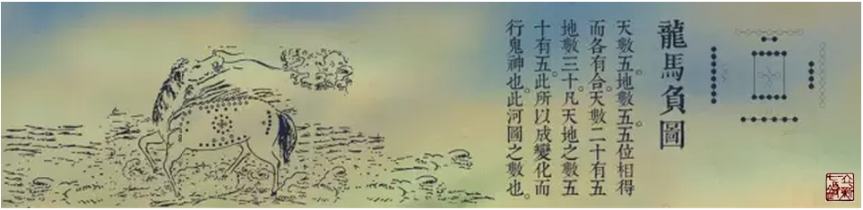

= 冰台说《四时九针》
冰台
2016-6-19 00:00

什么是九针呢？

九针是针，也不是针，所以不要整天纠结在针具上。

内经说得明白：夫一天、二地、三人、四时、五音、六律、七星、八风、九野，身形亦应之，
针各有所宜，故曰九针。

看到没？这整个就是天地自然的节奏。所以，别傻傻分不清。你要明白，天不是天，地不是
地，水不是水，人不是人，经络不是经络。

所以，医者扎针之前，最最基本的，首先要知道经络是怎样一种存在，明白你针下调的是经
还是络？

经络循行，上下游，内外表里这些，是最基础的入门知识。更重要的，是医者要明白，你下
针，在调营还是在调卫？

有人说经络营卫俱调，这其实是自己在忽悠自己。人身上没有绝对的平衡，总有主次，就像
一个国家，不可能所有人都做老大，也不可能群龙无首，更不可能所有人都是好人或都是坏
人，若是那样的话，这个国家就已经完蛋了。

出了问题，往往就是出在以下犯上或弱肉强食，导致原本相对平衡的状况失衡了。

所以经络俱调就是虾扯蛋的命题，络隶属于经脉，古往今来有哪位国王治理国家是去跟每一
位小老百姓纠结的？事必躬亲的话，那些大大小小的官员，拿来干嘛？除非你丝毫不懂治理
之道，或被你治理的这人没有经络，或者是个死人，那就需要你这样摆布。

营卫俱调，其实是医者越俎代庖了。因为这个调是患者自己身心的事，与你外人何干？就像
虚实，有人扎针又要补虚还要泻实，这是想干什么呢？有虚就一定有实，有实就免不了虚的
存在，虚实只在两隔壁，去掉隔阂，实泻下去，虚自然就补起来了，所以只需调一头，另一
头自然就平衡了，别忘了，经络是干嘛用的。

做智者，智者就充分利用经络气血的能量，因势利导，事半功倍。

嗯，如果明白了经络是干嘛用的，那就要继续发挥抽象思维，千万别把人看成人，要把人看
成一个球，我经常说那些不懂事的人：你拽什么拽，你就是个球！

我说的是实话，虽然你以为你长了肢角，但你就是个球。因为你身上的皮，就是一张整的，
不是两张三张四张，若把你的筋骨去掉，你就缩成一个球了，别以为你被骨架撑起来了就跟
球没关系。

于是，我们就明白了，若患者脚痛，跟他头有没有关？跟他手有没有关？跟他肚腹有没有关？
你敢说没关系，那就可以大卸八块。有关系的话，那么在患者手上头上肚子上这些地方扎针，
能治他脚痛，就一点都不奇怪了。

这就是古人所云：一发不可牵，牵之动全身。有患者说，我左脚痛，你针扎我右脚干嘛？我
说，你以为你有两只脚呀？你这两只脚，实际上只是一只脚，包括你两只手，其实都是你的
左脚。

我撂下这话之后径直走开了，剩下患者在那里发呆。

不明白的人，多说也无益，这是时间空间的话题，缺乏想象力的人难以理解，就此打住吧。
若稍懂这些基本知识，那就继续聊。下一个话题，合于四时阴阳。

内经里很多地方都提到四时这个词。

比如：“智者之养生也，必顺四时而适寒暑，和喜怒而安居处，节阴阳而调刚柔”…“春取
络脉，夏取分腠，秋取气口，冬取经输，凡此四时，各以时为齐”…“与天地相应，与四时
相副，人参天地，故可为解”…“邪气者，常随四时之气血而入客也。至其变化，不可为度，
然必从其经气，辟除其邪，除其邪则乱气不生”…“圣人之治病也，必知天地阴阳，四时经
纪”…“和于阴阳，调于四时”…“上应天光星辰历纪，下副四时五行，贵贱更互，冬阳夏
阴，以人应之”…“因不知合之四时五行，因加相胜，释邪攻正，绝人长命”…“取血于营，
取气于卫，用形哉，因四时多少高下”…“病在五脏固居者，取以锋针，泻于井荥分俞，取
以四时”……等等等等。

可见古人非常重视四时，四时是什么？阴阳又是什么？

其实内经所言四时阴阳，是指时间与空间。你看看，在一个由天地人形成的格局里，正是年
月日时，东南西北，天地星辰这些，对人起着决定性的作用。

理解了四时阴阳，就知道这个世界是个变化，人也是个变化，那么很多时候，我们守株待兔，
就行不通。

这些道理，详细说来，简单而复杂，简单是因为前面那些知识为基础才变得简单，复杂是因
为基础不好所以变得复杂。

以前在重庆针灸诊所带教学生的时候，有个别学生往来比较勤，三两个月就回来诊所这边探
望一次。春季来学习的时候，看到我员利针刺筋运用特别多，治筋痹的疗效令他信心爆棚。
到了夏季他再回来了，看我员利针相对用的较少，锋针刺血比较多了，回去就告诉其他同学：
师父现在多用放血的方法……再到秋季回来的时候，见我毫针调养比较频繁，于是回去就告
诉其他同学：师父的针法变了，他现在改用毫针了……冬天的时候他又回来了，这时候他见
我大针用的很频繁，于是回去告诉其他同学：师父又变了，他现在主要是用大针了……

呵呵，这个家伙搞得很多学生云里雾里，越发的觉得看师父似雾里看花。

其实，我上课的时候，真的不是没讲过扎针要合于四时阴阳。

讲归讲，很多人只听课是听不进去的，因为对于四时的理解，每个人是不一样的。

古人有一种称谓叫“三季人”，谓之“夏虫不可以语冰”，这是损人的话，意思是指那些见
识少的人，你跟他讲道理是讲不通的，因为他只窥见一斑，或根本一斑都未曾窥见过，你要
求他对全豹心里有数，他怎么可能知晓？

我引用这句话，并非损人，而是说道理。

每个人都有认知上的不足之处，见识再多也不敢保证自己方方面面都是四季人，所有指责别
人是三季人的人，自己在某些方面又何尝不是三季之人呢。

重庆是一座四季非常分明的城市，春天就是春天，夏天真的就是夏天，秋天是秋天，冬天真
的就是冬天，我从小在这里感受着四季变化对人体的影响，对于四时的理解，可能就会比一
年只有三季或四季如春的地方的那些人，要领会得清晰一些。

重庆依山傍水，一年四季我能观察到长江、嘉陵江水文的变化，所以我对于经水的理解，或
许就比生活在没有江河的地方的人，理解的容易一些。见得少没关系，关键要切忌“以点概
面”。

少牢骚，多做事，不轻易评判，常静观其变，这样我们就不容易被自己下的结论给误导。

有人说粗大的针大可不必有，毫针足矣。这话本没错，只是下这个结论的人有些轻率。你的
四时阴阳，并非别人的四时阴阳，你的心性、学识、认知、地域、环境、平台、对象、习俗
等等，岂能代替天下所有人？怎能以一概全呢？因此若说“粗大针不必有”的人，不用相面，
已知他嘴上的黄色还未褪尽。

当然也不可以一味的以粗针大针猛攻，若如此操行，你与莽汉憨夫无异，头大无脑，谈不上
医道。须知，即使贫穷苦寒之地，也并非人人皆患筋痹骨痹的哦，不然，为什么内经要设九
针？病各有所宜，针亦各有所宜，这就是自然。

因此，真正的针灸，是法无定法，那些一针一技一点一面的功夫，均非真相。

针灸的基础知识不是死记那些经络穴位，你要懂得看风水才算具备基础知识，否则，你怎会
看病？运气好的时候，还能碰到几个奇效的，令你洋洋自得。一旦场不对，人不对，事不对，
时不对，你还不撞得满头是包？

学习是循序渐进的过程，千万不要学到一点经络的基础运用就开始拽。逐渐的把基础知识掌
握好了，我们就会发现，原来，针是不可以执着的。你我他，东南西北中，昨天今天明
天……只要是活着的，只要在循环，一切都是，瞬间已经物是人非，你看到的不动，都是表
象。

很困惑，是吧？

其实法无定法并非没有规律可循，还是有大的框架，那就是五行在心，施行在天，宇宙在手，
万化生身。这段话取自阴符经，由于鄙人没啥文化，整本书我仅仅能理解这几个字，其他的
都读不懂，也记不住，所以我就以为天地身心才是针之大道。

自然界谁最大？当然是人最大。

没有了人，一切皆空，所以内经云：天复地载，万物悉备，莫贵于人。

自然界谁最小？还是人。

人得靠地吃饭，地要靠天收成，无论人多强大，也不能强大到可以脱离天地。地无论建造多
宏伟，也经不起天气瞬间的摧残。只有在风调雨顺的前提下，大地才稳定，人的日子才真正
好过，所以天最大，地其次，人最渺小。

人这个肉球，本来已经够大也够渺小的，却还比不过思想志意，那才是真正的至小无内，至
大无外，因此我才说九针非针呢。

而所有的一切，又被风雨雷电左右着的。因此，关于人的先天、后天、五行、四时、阴阳这
些数据，在医学里，至关重要。

无怪乎内经要说“百病生于气”，有谁可以不尊天地之气呢？

顺者昌，逆者亡。
