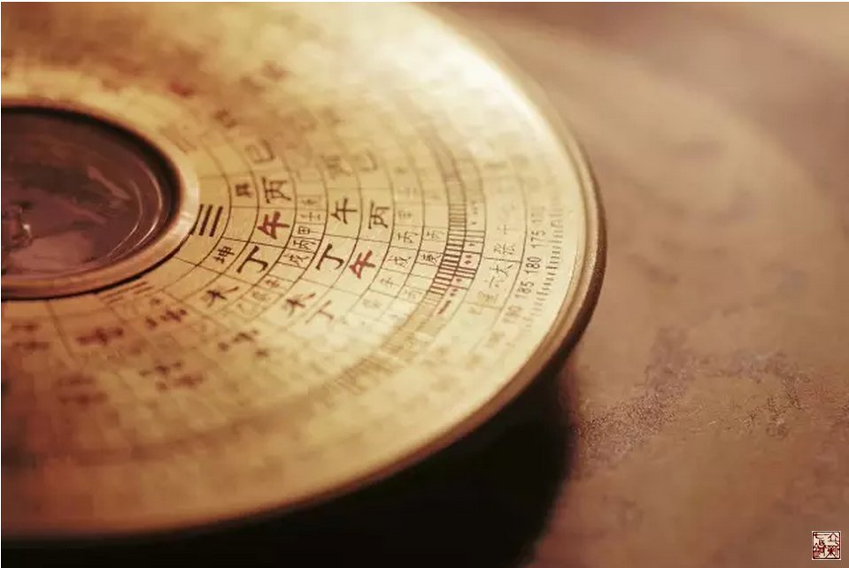

= 冰台话"风水"
冰台
2016-6-23 00:00

*我没学过风水。*

写这篇文字的起因，是因为最近在装修立新七针中医门诊部，有很多关心七针的朋友建议我
可以请个高人看看风水，设计一下朝向与布局。

其实准备装修的时候，也曾象征性请风水师规划了一下，毕竟俺也要赶一下时髦嘛。

不过风水师所设计的那些布局，在开始装修的时候，都被否得差不多了。

还是合了我常说的那句话：最大的风水，是“有关部门”。

有一个曾跟我学过七针的学生，据说后来拜了风水高人学了风水。再见着他的时候，腰比以
前硬了很多，说话底气足了许多，走路的脚步也深沉了些许。

看他在我诊所环顾左右前后，多次欲言又止的玄奥着，我知道这家伙完蛋了，好的没学到，
竟然学会了装老道。于是我就问了一句：你认为不好的风水，难道对别人也一定不好？你可
明白你老师的风水学与内经医理有何不同之处？

他说，其实道理是相通的。

我说，真的吗？他看着我的眼神，不敢回答。

因为我了解他，他对于内经医学的理解，其实才在门口，如果他风水老师传授的是大道之理，
他又怎么可能评判两者是相通的？除非他学的风水也在门口徘徊，他才看得到二者是相通的。

*我对风水的理解就是一个字“顺”，顺法律，顺法规，顺领导，顺自然。*

这个顺，是因人因地而异的，用俗气一点的话描述，就叫做“一条狗服一个夹夹”，长短大
小高矮胖瘦品种都不同，怎能用同样的脖套去栓它？

无论怎样，只要狗狗吃你的住你的，在你的地盘上混，你是地主，狗狗就得服从你的志意，
否则没好日子过。

要怎样服从，就看地主的情志和当下的环境，*除了天时地利人和，还要懂事，懂事好过，不
懂事难过。*

无论哪位大神哪位大师，您的风水，不能与政策发生冲突，不能与相关人员过不去，不能与
自然作对，否则您心里再好的风水谋略，都将什么都不是。

搞风水，弄清这些是最基本的前提。

话说若把这几项研究明白了，其实你已经是风水大师了，比很多不明人事但“精通风水”的
人强太多。

*所以古人说：事在人为。*

*真正的调风水就是人为的，在顺的前提下，去讲究什么人，怎样为。*很多事情，不是随随
便便一个人就搞得定的，方式方法更是十分重要。

至于看个地理，调个方位，选个日子等等，其实都是小巫。

并非蔑视小巫不重要，我的意思是说，天上狂风暴雨的时候，地上的建筑施工者，您再牛，
也得等天气好了才干活儿。

我说的这些观点，也一定有一些人不赞同，这已经是常规。自从有了网络，网络上人们相互
之间的攻击就从没停止过。网络上最多的是“神人”多，还有就是“不接地气儿”的人多，
所以我常说网络上有个“偏激界”。

我也是偏激界其中的一员，想当年也算骁勇善战，跟非常多的人一样，反正彼此不认识也见
不着，闲着蛋疼的时候，或生活中郁闷压抑的时候，甭管有胆没胆，肚子里有货没货，跑网
上乱杀一通，把很多网民糟蹋一番，因为这个发泄成本太低。

其实呢，绝大多数网民都一样，网络上豪言壮语替别人指点江山，生活中还在为自己一日三
餐谋虑着。

呵呵呵，年事已高的时候，俺终于明白没有意义，《素问》云“精神内守”，那才是真的。
我又不是为别人活，咸吃萝卜淡操心干啥呢，于是假装不小心，从偏激界跌将出来，掉地上
摔了个大饼脸，让仇者开心一下下。

好歹开始接地气了，所以现在我对很多事已没了兴趣，也不再理会那些攻击：关你鸟事？关
他卵事？管我屁事！

2010年的时候，一位民间法术老师的大徒弟，成了我的师兄。师兄是风水师，据师兄说他祖
上曾是白崇禧的军师，门下的师叔师伯等均在东南亚一带呼风唤雨，这背景令俺每次见到师
兄都眼巴巴的敬畏他。

师兄专门给人看风水，调运气，收费不菲。每次来来去去都有七八个弟子殷勤跟随着，言行
举止都是谈笑云烟，替人指点江山。

后来我渐渐的不联系他了，几年没音讯。前两月师兄突然给我电话，说他在广西的工程因为
政策变化被亏得家都破了，有朋友想帮他一把，给他介绍了重庆这边一个工程，想托我了解
一下是否真实。

我问师兄：你怎么不掐指一算？

他电话那头笑的挺尴尬的。

我又问他，你干风水也算祖传的，你干风水也几十年了，难道你还不明白政策才是最高级的
风水？

师兄无语。

其实前几年不联系他，也是因为我突然想明白了，他自称祖上是白崇禧的军师，此事若属实，
那我就想到这军师是怎么辅佐白崇禧失败的？

哪有什么高人，世界上最高的人也没超过三米的，同在一个自然，人跟大树高山水流相比，
再高的人也渺小得不要不要的。

*因为没学过风水，所以我这里说的风水，是从内经医学的角度，从自然的角度，去理解世
间的风与水。*

*在我看来，看地理风水，最后真正看的应该是“气”，而治病最后调的也是“气”，道理
是相同的。*

通常人们所谓的“风水”，主要是指地脉或山水的朝向与分布，应用于生活事业等各方面的
调整，属于只有极少部分人掌握的秘中之秘，一般人看不明白，所以被称为“玄学”。

风水师也有很多的门道，我接触过一些从事风水易经之类的朋友，有大道已登堂，有中道始
入门，有小道在门外。

*后来我去理解内经医学，我才明白，无论他们有多深多浅的讲究，我要想了解风水的真相，
只需明白一个道理就行了，任何风水的核心道理肯定是一条：人不可与自然作对。*

*大气的斡旋，谁也掌握不了。*

上次在南充，民间接骨何医生家九十多岁的老母亲，对我说了一句话：*医生不明害一个人，
阴阳不明害一家人。*

这句话，令我感慨万分，老人家真真正正是活通透了的人。有些人不明白老人讲的什么意思，
狭隘的去理解老人说的阴阳。老人是四川人，所以我知道她说的阴阳，是指风水师，是指一
个很大的时间与空间的存在。

在传统习俗下，人们建造、置地、坟墓、住宅、店铺等，免不了要请风水先生看一看，选个
好的位置或朝向，以此安神。

*神，有两层意思，一个是自己的心神，一个是存在于自然空间里的神灵。*

*两个神都要尊重，缺一就容易诸事不利。*

若某人做生意发了大财，某人官运亨通，一家几代人的事业发展得好，很多人会说他们“祖
坟埋得好”。其实何尝不是这些人顺风顺水的和得好？天地人三合，再加上会为人，随便做
什么，都妥妥的。

上次中级班我给同学们分享阴阳和，就这道理。

风水与看病是一个道理，医患身心的神，情志意愿等，以及自然空间的神灵，一些规律规矩
现象等等，都必须尊重，否则绝大多数病都治不好。

*中医的境界是上医治神，治神的前提是知神而守神，神就是气。*

东南西北中，各地的气，是不一样的，男女老少幼，每个人的气也不一样。

所以我的认知并不一定代表你的认知，你的认知并不一定就能融合我的认知，我的观点你不
认可，你的方法我不赞同，这都是对的，有什么奇怪的呢？

一位在浙江某地骨科医院做开刀手术的骨科主任，曾跟我学过立新七针，最近回来看我，他
说，虽然平时七针用的很少，但学到的那些道理，对自己很有帮助。

我说，你还是没明白，你还在模仿的阶段，如果一直这样，那就可惜了你交的那些学费。

你应该知道我经常在说，九针是一种思想，对不对？真正的七针，难道就是那几支针？错哦！
*你的工作是开刀大手术，手里的手术刀，何尝又不是七针？你划开那个部位，何尝不是一个
穴位？*

若你在浙江，依旧模仿按循着我的手法我的习惯，那你并没有学会七针。你要在你们那边，
运用内经医学那些道理和规律，形成一套适合你们当地风土人情与生活习俗的方法，是你的，
是你们的，不是我的，也不是我们的，那才真的学会了七针。

以前我们不能理解韩愈那句话：*“弟子不必不如师，师不必贤于弟子。”*现在，我们就能
理解了，*韩夫子这句话，是在立体的时间空间里，才成立的。*

总归，风和水，其实都是同一个气的不同表现，只因这气分布在不同部位，又在不停变化，
时慢时快，时上时下，时温和时躁动，内外联动着，此一时彼一时，所以才有了风水。
