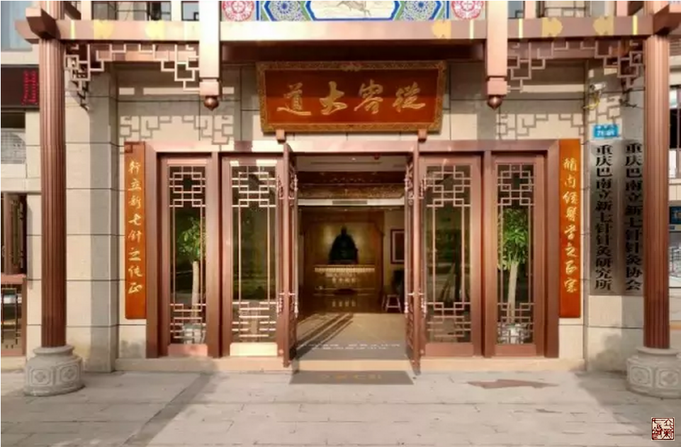
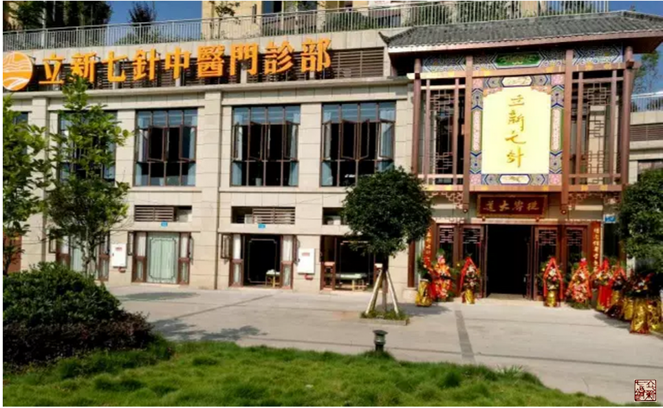

= 从容大道
冰台
2016-8-8 17:30

*谨以此文纪念重庆巴南立新七针中医门诊部试营业三十日*

《论语》云：“人能弘道，非道弘人。”

道是什么？很多人说道是自然，是规律，是轨迹。理由是一切事物或非事物都是自然而然的，
比如日月无人燃而自明、星辰无人列而自序、禽兽无人造而自生、风无人扇而自动、水无人
推而自流、草木无人种而自生……。

似乎好像真是这么回事，其实，非也！我还是觉得老子说的对：道可道非常道。道是可以显
现的，但并不是人人都看得见摸得着。

*道其实是思想，是认知，思想才是大道。*世界上，还有比思想更高远，比思想更窄小的么？

那些规律、轨迹、自然现象等等，你认知到了，他们存在，你认知不到，它们依旧存在着，
并不以人的志意为转移。

一旦我们认知到位了，也就是得道，那些规律，那些轨迹，那些现象，就可以为我们所用，
令我们的能力变得截然不同的自信。

所以，*道，是一种虚无的境界，内经所言“恬淡虚无”，才是人的至高境界。*要想认知到
位，并不是那么容易的，不是学识渊博认知就够高，恰恰相反，曲高和寡，知识越富有就越
孤独，*越孤独就越远离大道了*。

认知也不是你闭了交际，绝了应酬，躲进山里，观天察地就可以提升多大层次的。充其量，
你只能算一个“世外”高人，还是与自然脱节了。因**自然并不只是你一个人组成的，自然
也不只是山清水秀之地，还包括了人文社会。**

一个与自然社会脱节的人，又怎么可能领悟真正的自然之道？
 
*须知，真正的自然，是要扩展生命而创造茂盛，不是局限生命而导致荒凉。*
 
*自然社会是生命彼此需求的循环，只出不进，只进不出，皆非常态。*
 
人是一具凡胎肉体，人还是情志动物，天生就带着欲望的本能：活着、成长、性爱、繁衍。
这些过程，都离不开需求与付出。
 
你可以假装不要，勉强拒绝，实际上你根本就离不开本能。
 
谁能够真正做到毫无欲望？死人。
 
活人不能缺少眼耳口鼻舌，这就注定了人有七情六欲，无论你躲在哪里，无论你自诩多么淡
泊，只要你没有丢弃眼耳口鼻舌这些装备，就免不了欲望的出现，就少不了喜怒忧思悲恐惊
的产生。
 
因此无论你多么淡定，你的那些七情六欲本能，多多少少会扰乱你的心性，心性不正则歪，
于是恼怒、诽谤、践踏、抑郁、隔绝、厌世等言行则油然而生，这种状态下，思维又怎么可
能走到正道上去？思维有了斜（邪）见，则远离大道矣。
 
人与自然是不可能脱节的，要想远离尘世，先理顺一下你是因何而看破？因何而淡定？因何
而逃避凡尘？如果这些原因都没有明确，如何安静得下来。
 
真正看破，真正淡定，你必然可以坦然应对所有欲望与烦扰，也就无需逃避了，*红尘世界
才是你最好的修行之地。*
 
*孤傲与躲避，都不是办法，唯有提升认知，才可以改变我们的状态。*
 
所以子曰：*道不远人，人之为道而远人，不可以为道。*
 
早在准备建设立新七针中医门诊部之时，就有人劝我：自知就好了，你讲那些有几人真正听
懂的？很多人听了都似是而非，不怪别人背后骂你，病好治，人心难治呐，你影响越大，害
人越多，何苦？
 
人的言行，是由思想认知决定的。这是一位并没有真正了解立新七针的人，所以对他这种杞
人忧天的态度，我并不感到奇怪。如果我是那种为道而远人的人，怎可能一路走到今天？恐
怕半途早就夭折了。
 
就像曾有人用“人之患在好为人师”来暗喻我的培训课一样，此人参与弘扬中医文化活动多
年，却连什么是中医都没搞明白，他心存不满而讥讽我，我又怎能与他一般见识？
 
*人虽非生而知之，但一定有先天与后天的优劣之分。根性各个不同，焉能尽如人意。*
 
那种天上知一半地上全知，缺乏临床，却喜欢坐地论道，指点中医迷津的人，本已经脱离了
自然，又岂可与之言道。
 
道是自然常态，凡是太自大、太谦恭、太聪明、太愚钝、太得意、太自卑、太顺利、太坎坷、
太简单、太复杂、太容易、太辛苦、太自由、太拘束、太富有、太寒酸、太渊博、太肤
浅……这类状态，都不可能真正得道。
 
因为言行的过与不及，代表了这个人的思想思维与生活层次。
 
*言行太过，背后附带的，是一具胀满的生命，自身问题尚且消化不及，哪里还有空间去思
 索？*

言行不及，所代表的，是一具枯萎的生命，尚且长期疲于奔命之中，哪里还有能量去思索？
 
*唯有平衡状态，才具有最大的生命创造力。而且这个平衡，一定是要以满足生命的需求为前
提，这样的状态下，才容易得道。*
 
*这个平衡，就是恬淡虚无。无，是有，也是没有。*
 
内经医学治病就是此理。
 
既然要学医行医，我们就不能放下太多，也不能追求太过。对那些受损或被狭隘的生命能起
到恢复作用，对衰败的行业有振兴帮助的事业，是属于我们应该做的，应该弘扬的，那就必
须义不容辞承担起来。
 
再重申一遍，*恬淡虚无并不是不作为*。恬淡虚无是在满足生命需求的基本前提之下，去寻
求一种平衡状态，以提高生命的质量。若你以为恬淡虚无就是看淡一切，放下与逃避，那样
想的话，你已经脱离自然了。
 
总之，在我看来，只有思想认知真正到位了，你的言行，你的人生轨迹，才可以自然而然。
 
所以我认为道是一种思想，是思维方式。当然，我所说的真理未必是你的真理，诸君还请智
者见智仁者见仁。
 
正是因为人类存在认知方面的差异性，老子才会说：“上士闻道，勤而行之。中士闻道，若
存若亡。下士闻道，大笑之。不笑，不足以为道。”
 
*立新七针针灸疗法是我在思考自然与人的过程中的一些领悟，通过信解行证所得。*我是觉
得，*我既然领悟到一些生命真谛，就不能躲起来藏私，就要有弘道的责任与义务。*只有这
样，才会源源不断的提升自己对道的认知，逐渐接近大道。
 
*道，不弘扬，一定就戛然而止，也就谈不上得道。*

*弘道要有载体，或以文载道，或以言行载道。*

*立新七针的道，是内经医学思想。*

立新七针弘道，是筑建了立新七针针灸研究所和立新七针中医门诊部，作为针道的载体。

我们试图通过改变一些医者的思维方式，去改变他们的格局，以此帮助更多的生命恢复平衡
状态。这一行动，影响或扰乱了某些人固有的思维理念，必然招来褒贬不一的众议。
 
而仅以单纯的针术横贯整个门诊的诊治流程，并不借助灸法、中药、推拿、仪器、膏药之类
来盈利，在很多中医人或投资者看来，这样的针灸门诊，实属奇葩，难以存活，所以唱衰者
众多。
 
*管他，吾自从容。*
 
没有人比我更了解立新七针，他们唱衰，只因缺乏对立新七针的了解，在无知或一知半解状
态下所发表的见解与言论，没有任何参考价值，充耳不闻就好。
 
七针治病救人，只是基本。更重要的，是以七针载道，弘扬内经医学思想。这是一项能满足
生命需求的事业，我相信，有识之士终将纷至沓来。
 
*2016年8月8日，立新七针中医门诊部试运营一月整，结算，除去所有开支费用，小有盈利。
很好，此乃从容也，无太过，也无不及。*
 
顺应自然法则的生命，是向上行的。
