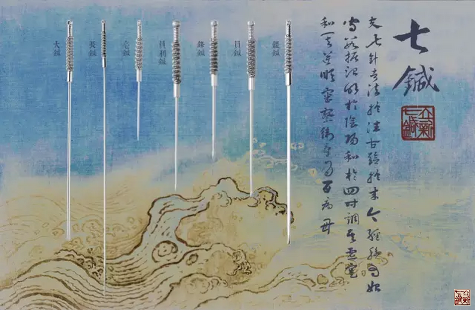

= 立新七针在讲什么
冰台
2016-8-21 00:00

"夫七针者，法于往古，验于来今，经脉为始，守数据治，明于阴阳，和于四时，调其虚实，
和其逆顺，审察卫气，为百病母。"
-- 冰台

曾几何时，中医江湖出现了一个叫“陈立新”的人，带来了一种叫做“立新七针”的新鲜事
物，因其以主治病种范围宏大、安全便捷、疗效稳定、成本低廉而著称，时不时的在中医界
掀起阵阵波澜。然而其门槛巨高，寻常人难以逾越，据说是“*得其人乃传，非其人勿言*”，
故知之者甚少，明之者罕见，很多人是借了立新七针的针具，行了软外解剖运动力学筋膜学
说之理论，与立新七针的本质差缪太远矣。于是坊间道听途说者众，谣传褒贬不一。

[%hardbreaks]
有人以为，立新七针是一个门派。
也有人以为，立新七针是一个叫陈立新的人自创的针法。
有人认为，立新七针只不过集合了其他门派一些针法的经验来运用而已。
也有人认为，立新七针专横独大，容不下其他疗法。

事实上，你们都理解错了。

*立新七针只是在竭力回归古代内经医学，制造当代真正的纯中医。*

立新七针从一开始诞生，就注定了要坚持走回归九针的路线，所以他的门诊，治病绝对不用
中药，不用灸法，不用刮痧抻筋推拿按摩膏丹丸散熏熨等方法，他只用针。但是他这么做并
不是固执己见，因为他的这份认知是来自于古代先贤们留下的经文。他也不是标新立异的独
创针法，立新七针从一开始面世，就一直申明他的学术思想完全归属于祖国医学圣典《黄帝
内经》，并且所有的针具均以内经九针的鑱针、鍉针、员针、锋针、员利针、毫针、长针、
大针来命名。立新七针的针具、针法和学术思想，都不是凭空想象出来的，全部谨守内经原
文原义解读出来，每一支针、每一个针法、每一个观点、每一种理念，都在内经里有根有源
的可以查到。

之所以立新七针能够取得非常不错的疗效，终究还是归功于华夏老祖宗的思想睿智，并不属
于陈立新个人的经验或智慧，他只不过是花了一些时间与精力，从人文社会和天地自然的角
度，在内经医学里去领悟和总结出来了一些规律性的东西，验之于临床，所谓“立新七针”，
只是内经九针部分针具的组合名称而已。

虽然立新七针源自于内经医学，但由于《黄帝内经》所记载的九针及其运用思想，乃非常大
道，寻常的思维模式确实难以窥其全豹，所以尽管两千多年以来人们从没有停止过研究，但
是却从没有人真正把九针与内经本义非常贴合的运用于临床，更别说还能展现出内经所述
“若汤泼雪”“若风吹云”那般神奇疗效。

现在，立新七针做到了，立新七针不仅挖掘了内经九针，还破译了人体经脉的真相，更破译
了卫气的循行与运用，这些都是千古之谜，立新七针不仅能够有理有据的证明其来源，还能
在临床上充分证明经脉的存在和存在的必要性。

由于立新七针有与众不同的针具，有与众不同的经脉理论，有与众不同的气血理论，有与众
不同的对四时阴阳和人与自然关系的解读方式，无论针具、针法，还是诊治理论和学术思想
等等方面，立新七针在很大程度上均有别于其他中西医各针灸门派，根本不存在沿袭与模仿
谁。所以从某种意义上而言，立新七针学术思想是自成体系的，但这个自成，依旧源自于对
《黄帝内经》的传承，只不过由于内经曾被很多人误解曲解和糟蹋荒废了，立新七针才有幸
拾得了这些宝贝。

立新七针致力于内经针术的研究与推广，并不代表此举就是要否定其他。立新七针反复强调
专注的重要性，不过是基于“业精于专”的善意发心，他当然非常明白针、灸、中药、按摩、
热熨、刮痧、拉筋、导引、西医手术等等皆各有所长，他也明白存在即是合理，但他更明白
世间这诸多疗法，其实都是依赖于什么起到了治病的效果，他还懂得在治愈率、稳定性、便
捷性、医疗成本以及劳动成本这些方面，还应该有个概率高低的取舍。正如《灵枢•病传》
曰“诸方者，众人之方也，非一人之所尽行也……守一勿失，万物毕者也”，所以立新七针
在诸多法门里选择了最适合自己本性也最符合自己认知的针术，来作为医学体系的承载，专
注内经针法，是为了更好的探索研究内经医学，并非为了专横独大。

*那么，立新七针到底在讲什么？*

* 他在讲内经医学的构架，讲怎样解读《黄帝内经》。
* 他在讲思维方式的重要性，讲惯性思维与逻辑思维在内经医学上的异同体现。
* 他在讲医术的真相是什么，讲人类获得医术的途径。
* 他在讲对现代医学的反思，讲才能、阅历、教养对于医生的重要性。
* 他在讲什么是病，现代医学为什么出现了几十万种病名，真相是什么，病因何而来，该缘何而去。
* 他在讲什么是真正的医德，德非德，道非道。
* 他在讲“神”是什么，讲恬淡虚无精神内守的重要性，讲如何理解鬼魅妖仙。
* 他在讲阴阳四时变化，讲法天则地、援物比类、循法守度、循经守数、司外揣内、司内揣外、以柔克刚、刚柔并济的运用。
* 他在讲九针，针是针，针非针，讲内经九针的禁忌与不足。
* 他在讲法治对于一个国家的重要性，讲修身对于一个医生的重要性。
* 他在讲内经为何独尊九针，为何说九针是天下之大数，如何理解九针至小无内至大无外。
* 他在讲人体结构，讲经筋，讲脏腑所主，讲脏腑与经脉的关系。
* 他在讲千古之谜的经脉，讲经脉因何而成、因何而定，存在于何处，怎样践行表现。
* 他在讲营气的真相是什么，如何循行。
* 他在讲被绝大多数中医人所忽略的卫气到底是什么，卫气对于人体有多重要，是怎样一种规律循行。
* 他在讲内经所言脏腑到底是什么，在讲三焦与脏腑经络的关系。
* 他在讲内经如何定位神经、血管、筋、骨、皮、肉、经脉、血、气、津液、脏腑、头脑、四肢、躯干、七情六欲、外邪六气、四时、阴阳、五方、五行……
* 他在讲雪山与平原的不同自然现象，河流怎么来的，海水怎么来的，讲自然界水的循环规律。
* 他在讲什么是自然规律，什么是个人经验，讲人的生老病死规律，树木植物的生长茂盛枯萎等规律。
* 他在讲日月对人体的影响，讲阳光、空气、水这生命三要素。
* 他在讲风水、天气、地气、四时、五方对生命的不同影响力。
* 他在讲餐饮、工业、农业、建筑、运输等各行业的经验与规律，将这些道理同内经医学相结合。
* 他在讲孙子兵法的运用，讲古人怎样带兵打仗。
* 他在讲古今帝王是怎样治理国家的，何为昏君，何为明君。
* 他在讲为何“阳者卫外而为固，阴者藏精而起极”，讲阴阳和合的重要性。

……等等等，谈天说地，海阔天空。

立新七针讲经筋、经脉，讲骨度、脉度，唯独不讲解剖，不讲肌肉运动力学。

所以立新七针经常自嘲，说自己是最不像医学的医学。

立新七针就是在讲这些事，至于他为何要设高门槛，相信你现在该明白了。

《灵枢•官能》曰：“得其人乃传，非其人勿言”。诚然！难道一个刚刚会爬，连走步还没
学会的幼儿，我们能教会他如何跑步？面对五六岁的孩子，我们能让他们明白性爱吗？NO！
让他自然的成长八年十年，到时候，你不讲，他们也懂了。因为，性，乃阴阳之本始也。
