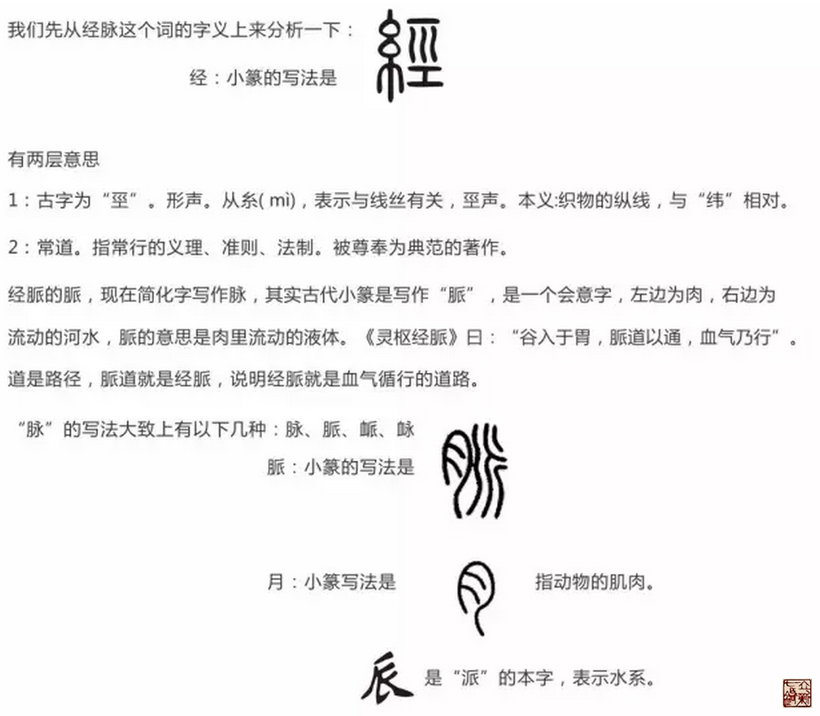
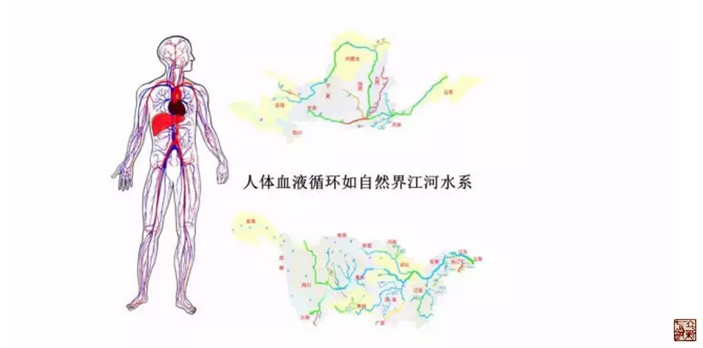

= 经脉——分肉之间
冰台
2016-8-24 00:00

追本溯源，我们继续解读经脉。

我也认为经脉是血管，但我认为血管只是经脉的一部分，并不是经脉的全部。

为何说经脉是血管？

image::img/20160824-02.png[]

《灵枢·经水》曰：“经脉十二者，外合于十二经水，而内属于五脏六腑。”古人将经脉比
喻为经水，经水也就是河流，河流只有在有水存在的状态下才是河，无水的河床并不叫河，
只是一条山谷。也就是说，经脉的重要性是因为有脉的存在。通过古人把经脉比喻成经水这
样一种理解方式，我们就知道了，经络系统其实应该是如同河道一样，是一种立体的间隙结
构，肯定不是一条线，也不是平面的结构。

关于经脉的具体描述，《灵枢·经脉》明确指出:“经脉十二者，伏行于分肉之间，深而不
见。”意思是说经脉的形态是肉眼不能直接看见的，其实质是深藏于分肉间隙之中的。

*内经里经常提到“分肉之间”这个词，我们先要了解一下分肉之间。*

《灵枢·周痹》曰:“周痹之在身也，上下移徙随脉，其上下左右相应，间不容空，愿闻此痛，
在血脉之中邪？将在分肉之间乎？何以致是？”

《灵枢·贼风》曰:“黄帝曰:夫子言贼风邪气伤人也，令人病焉，今有其不离屏蔽，不出空
穴之中，卒然病者，非不离贼风邪气，其故何也？岐伯曰:此皆尝有所伤于湿气，藏于血脉
之中，分肉之间，久留而不去；若有所堕坠，恶血在内而不去。卒然喜怒不节，饮食不适，
寒温不时，腠理闭而不通。其开而遇风寒，则血气凝结，与故邪相袭，则为寒痹。其有热则
汗出，汗出则受风，虽不遇贼风邪气，必有因加而发焉。”

《素问·痹论》曰:“营者水谷之精气也，和调于五脏，洒陈于六腑，乃能入于脉也。故循脉
上下贯五脏，络六腑也。卫者水谷之悍气也。其气慓疾滑利，不能入于脉也。故循皮肤之中，
分肉之间，熏于肓膜，散于胸腹。”由上两段话的意思来分析，分肉与血脉是两个概念，分
肉之间是卫气循行通道的一部分，血脉是营气的通道。

分肉之间什么意思呢？人体内有很多的筋膜、肌肉、肌腱，每一块肌肉都是由一层薄薄的筋
膜包裹着，成为肌肉之间的隔膜。深层处肌肉与骨之间也有缝隙（筋膜）相连，肌肉与肌肉
之间也有筋膜分为间隙，但是筋骨肉相互之间都是结合很紧密的。皮肤之下有脂肪筋膜层，
分布在浅处，在皮内肉上。

肌肉的上层为白肉（肥肉），下层为赤肉（瘦肉），二者之间有一层分隔膜，肥肉与瘦肉之
间是赤白界限分明的，所以内经所谓“分肉之间”，其实是指皮肉骨骼这些组织之间的筋膜
间隙。我们每个人的肚子都能鼓气凸起来，鼓气的时候，皮肤就会绷得很紧，这并不是你肚
子内的肠子内脏之类鼓起来了，而是气在鼓起。

那这些气，是在哪里运行的呢？不在皮肤表面，也不在肌肉里面，如果对中国武学有所了解
的人就知道，练武重在练气，练气有三个层次和境界，第一层是皮内肉上，第二层是分肉之
间，第三层是骨肉之间。第三层也就是所谓的练气入骨，气达到骨膜骨髓这一层，是练武的
高境界，练到这个程度，人体就可以抵抗很大力量的击打，所以我们看到武林高手们搏斗的
时候，在遭受巨大的打击力之下不会一触即溃，那就是气对内脏的保护作用，仅肌肉骨骼或
脏腑本身，是承受不了那样重击的。

*一般普通人的这个“气”，虽然也分布于分肉和筋骨上，但大部分气，还主要是在皮内肉上
这一层循行，即分肉之间为主。*

既然分间是经气运行的通道，经气就会不停地在这些分间里，完成如环无端的循行。所以我
们就不要把经脉看成一条线，通道不可能是一根线，那肯定是一个立体的，有宽有窄有厚有
薄的一个结构。

根据自然现象，道路有宽有窄，有平坦也有崎岖不平，还有沟壑山峦等等。人体经脉的通道
也必然如同自然现象，有些地方宽敞，有些地方狭窄，有些部位经气运行比较快，有些部位
经气运行就比较慢。自然界中倘若遇到下雨滑坡涨洪水，道路就会受阻，变得困难重重，前
进的步伐就不得不变缓慢甚至停滞不前了。经气也是如此，如果经气循行的通道，遇到七情
六欲等内因的干扰，或风寒湿热暑燥等外因的干扰，情绪或筋肉变紧张，分间就会变得狭窄，
如果不能很快的放松改善这种状况，那么经气的循行就必然变得缓慢，就可能会表现出各种
症状。

*然而，我们必须明白，分肉之间并不代表经脉，分肉之间只是经脉的一部分。*
