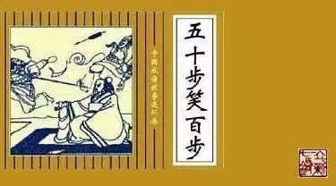

= 五十步笑百步
冰台
2016-9-12 22:32

每逢出现一件较有影响力的医疗事故，往往就会掀起中西医之争的高潮。西医支持者们会指
责中医不科学，而中医支持者则攻击西医的毒副作用大。事实上，无论中医还是西医，都治
愈过大量患者，所以他们才得到了官府的认可与支持。否则中医根本不可能延续上千年，西
医也不可能在中国获得绝大多数病患的信任。

从古至今，任何事业，如果得不到官府的支持，是不可能发展好的，这是自然规律。

如果非要评判合理与否，只能说中医和西医都是合理的。

很多人都懂得：存在即是合理。这种认知无疑是正确的。比如某人发明了一种疗法，即使疗
效非常差，但普天下只要有一个人认可它，那就是它存在的合理性，因为法律面前人人平等，
每个人都有选择的自由，我们不能剥夺别人的权利。虽然无效或疗效极低，但有人就觉得它
好，心甘情愿死它手里，你能怎样？你敢说它不合理么？天底下合理不合法，合法不合理的
事情，多了去了，谁能杜绝或统一？

去争论中医与西医谁的毒副作用大，谁更科学，实在是无聊，无论争论多久，最后都是消耗
无用功。

因为这些争论，对于医学的进步，根本起不了什么作用。争论半天，并不能让老百姓全部否
定中医，也不可能让老百姓全部接受西医。争来争去，到最后中医还是那个样子，西医还是
那个状态。

中医与西医根本没有必要争论，因为大家争论的焦点，都不在一个点上。

*极少有人注意到医学领域里的一些现象*——中医和西医都能治愈很多的病痛，同时中医和西
医也都有很多无法治愈的病痛。很多病，西医能治愈，中医也能治愈。有很多病，中医束手
无策，却被西医治好了。也有很多病，西医定论是不治之症，结果被中医治好了。还有很多
病，中医治不好，西医也同样治不好。

这样的状况下，去争论谁科学，谁合理，岂不是五十步笑一百步？

有个前提，这里说的中医，主要是指近代和现代的中医，西医则是指中国的西医。生存在国
外的西医，符合他们的那块天地，我们不在那个国度，没资格判它对错。

要讨论国内的中西医谁更合理，*先要明白什么是“病”*。

现代医学认为疾病是由于遗传因素、物理化学致病因素、微生物致病因素（病毒或者细菌引
起的炎症）、不良生活方式致病等导致。

*中医认为病痛是由于人体气血津液的失衡引起的：“百病之始生也，皆生于风雨寒暑，阴
阳喜怒，饮食居处，大惊卒恐。”*

在对“病”的理解上，中医和西医，其实是比较相近的，现代医学认为微循环不畅是百病之
源，中医也说经脉不通会令身体产生病痛。也就是说，其实中西医都在围绕改善微循环做文
章。

而在具体的治疗方面，只有约40%的方面是相同或相通的，比如都在筋骨皮肉脏腑方面做文
章。另外60%，则劳燕分飞，各自追逐症状，总结创新去了。

其实那60%，*本应该是对自然规律的运用，是对气血根本的研究。可这部分认知，正是现代
中医和西医都不具备的。两千多年前内经时代，大部分的医生都还懂得，后世医家就逐渐远
离了自然规律和血气之根本。*

几千年来，风云在变，地貌在变，国在变，家在变，人在变，可中国这块土地，却一直没变，
它并没有开始诞生西洋人，它还是诞生中国人，还是盛产养育中国人的那些粮食作物。*也
就是说，中医的根，其实不应该大变的。但事实上，中医失去了根，随着风起云涌，中医产
生了很大的变化。现代中医与内经时代的医学，大相径庭。*

因为后世之医者，都开始围绕患者的病名和症状去做文章了。

尤其当今的医学界，几乎莫不如此。

医生应该是对病痛有认知的人，而且认知度应该很高，才配得上这个职位。患者身体不舒服
了，他当然希望医生能告诉他是怎么回事，哪里出了问题，此乃人之常情。所以医生通常会
给患者一个定心丸，那就是“病名”，目的是让患者不再茫然。但其他的医生一定要懂得：
*病名不一定就是病因啊。*

病名只是医生告诉患者的一个名称而已，就像我们的名字，你叫张三，你也可以叫李四，还
可以叫王五，但张三李四王五都只是个称谓，虽然从名称的寓意或顺口或好记等角度来看，
对你的命运会有一些帮助，但你这具躯体，是没有大的改变的，无论叫什么名儿，你还是你
本人。

但是名称对你有没有影响？有！而且非常巨大，比如从小就给你取个名字叫做“淫妇”，叫
做“坏人”，叫做“僵尸”，你说你这一辈子可能成长得多好？因为公众的认知，无法接受
你，你自己也无法原谅给你取名的那个人。

所以我们就看到，患者会因症状的困扰而长期抑郁，有些患者会被病名吓死。小病治成大病，
大病治成重病，重病最后不治而亡。

*我们要知道，病名，只是基于医生个人的认知而来的，如果医生的认知比较高，那么他下
的结论可信度还比较高点。反之，如果该医生认知度很低呢？会不会误诊误断？*

即使是某一群体名医或大腕们下的定论，那也并不一定就代表真理。只能说团体的认知有可
能比某个人的认知强一些罢了，那还只是有可能，并不是绝对的。

最重要的是，作为患者，你也要保留几分脑子，可以反证一下嘛：医生既然能给你定这个病
名，说明他对你的病应该是了然于胸，那就应该能给你治愈，至少也应该有明显改善，如果
只给你定个病名，却无法治愈，或久治不愈，或需要终身服药，或终身治疗，你凭什么相信
他的诊断结论一定是对的？

比如说“高血压”，那么血压怎么高的，总有个原因对吧？真相只有一个，找到真相，应该
基本都能治愈。如果个别人的血压需要终身服用降压药来解决，那还可以理解。但几乎所有
高血压的人，都要依靠终身服用降压药来控制，难道这个降压药就是高血压的真相？我们都
知道人活一口气，气血是人体最基本的保障，现代科学说人类已经进化数万年了，那么基本
功能早就应该完善了。如果这么个最基本的，一直在循环的东西，到现在还需要依靠外在的
物品来保障他的正常，可能否？

随着社会的发展，人类变得越来越复杂，病患症状一定是层出不穷的，因此医生们需要明确
的“致病因素”就需要千千万万种，普通人的大脑几乎是不可能完成这项任务的。医生想找
到明确的病因，通常是借助各种检测设备和检验仪器。问题的关键是，这些仪器并不是由疾
病制造者发明的，都是由普通人类发明制造出来的，如果发明的人对病痛的认知不到位，甚
至是谬误的，那么，他们发明制造的这些仪器，又真正能解决多少问题呢？

现代医学对疾病的诊断名称，据有关资料显示已经发展到近30万个。大家可以推算一下，
300000个病名，如果一种方法能应对1000种病名，医生需要掌握300种方法，才能应对这么
多病名。如果一种方法只能应对100种病名，那就需要掌握3000种方法来应对……试问有几
个医生能掌握3000种方法？这样下去的话，医生到底需要学会多少种方法，又需要多少医学
团体，才能应对这些永无休止不断出现的症状？

*这是现代医学的状况，那么中医又是怎样的呢？*

从古至今，中医大家们根据他所生活时代的环境、气候、体质、政治、文化等因素对人体的
影响而产生的症状，在治疗过程中总结得到一些经验，于是产生了诸如伤寒派、千金派、局
方派、攻邪派、温病派、温补派、汇通派、滋阴派、火神派、寒凉派、脾胃派……等等众多
门派。

治疗思路也出现了诸如汗法、吐法、下法、消法、清法、和法、温法、补法、攻补兼施
法……等等方法。

治疗手段，也出现了中药、针刺、灸法、按摩、祝由、导引、抻筋拍打刮痧拔罐等等，不一
而足。

每一种手段，又分为诸多派别，比如针刺，就有正经、奇穴之分，部位上又有体针、手针、
头针、眼针、耳针、腹针、足针……，每一种针刺方法，又分为赵钱孙李周吴郑王氏……几
乎有百家姓，就有百家针法。

大家都热衷于千奇百怪的门派、技法、招数，热衷于寒热虚实阴阳六经的辨证，却极少有人
反思中医界存在的一个问题——那些所有的门派，所有的疗法，都能治愈很多类似的病，也都
对很多类似的病束手无策。那么，那些被治愈的病痛，到底是靠什么治好的？那些久治不愈
的病痛，为什么治不好？

我们就会发现，中医几乎没人能把经脉解释清楚的，这也给很多反中医的人抓到一个巨大的
把柄：作为中医最基础理论的经脉，竟然是说不清道不明！你不是伪科学，谁是伪科学？
*入门医学的经脉尚且不明不白，那么中医的辨证，中医的疗法，那么多的门派，到底在干什
么？*

囫囵吞枣和盲人摸象的人越多，分门别类就越多，中医们就一定会离真相越远。

*中医应该是合于四时，而不是痼留于四时。*恰恰很多迂夫子，总要把几十年、几百年、上
千年前的那些中医们总结的经验，当成亘古不变的真理来奉守。自认为只要掌握了某人的经
验，就掌握了真理，并因此一代影响一代，最后把原本道法自然的中医，改造成了一门人为
的经验医学。

还有一个现象，也被很多人所忽略。我们很多人都说西医的止痛药激素等毒副作用大，中医
毒副作用小，是这么回事吗？

说中医毒副作用小的人，你思考一下中药里的附子、川乌、草乌、半夏、蜈蚣、全蝎、细辛、
艾叶等等，皆是毒物。如果轻易就熬在汤剂里让患者喝下去，或燃烧或敷或熨了让患者吸收
体内，无论有没有消除患者身上那些病痛，我想问的是，这些毒物的毒去哪儿了？对人体到
底有没有毒副作用？那些说针灸无害的人，你可以体验一下天天长时间密集扎针，看看对你
身体有没有影响？那些说按摩安全的人，你天天长期的按揉挤搓，对患者筋骨皮肉脏器的负
面作用，难道就可以忽略不计？

有人说刮痧拔罐安全无副作用，你有没有想过，那些满背大面积刮痧拔罐，到底在解决什么
问题？人体内哪有那么多毒，哪有那么多的堵？你在破坏皮肤层那些毛细血管的同时，间接
损耗的血气与津液你却看不到。如果患者满背或者所有经络都出了这么大的问题，那他早就
去见阎王了，轮不到你现在忽悠他。如果只是某一处或某两三处的问题，你这样大面积刮痧
拔罐，是意欲何为？莫非你想以自损五千去杀敌一千？

*对现代的中医进行一系列的反思之后，我们就会发现，原来现代中医很多方法，对人体的
伤害，其实并不亚于西医的化学药品激素手术之类。*

所以无论中西医，在认知都不到位的时候，我们既不能说谁毒副作用大，也不能说谁不科学，
因为都是五十步嘲笑一百步。

地球上的人类有国度、区域、文化、习俗、饮食、种族、阶层、贫富、性别、老幼等等分别，
那就一定有千奇百怪的症状出现。*如果医学总是围绕症状去发展，就一定会变得越来越复
杂，一定有越来越多的隐性伤害产生，医生也将永远疲于奔命之中。*

所有人类，虽然肤色长相各异，高矮胖瘦不一，筋骨肌肉强弱不同，但他们生命的规律都是
一致的，都用脑袋思考脚走路，嘴吃饮食肛门排泄，手拎物品屁股坐凳子……并没有无数种
生命规律出来，你看看有几个人是用头在走路，有几个人是用肛门吃饭的？*所以说，世界
上同一事物的真相，永远只有一个，不会有无数个。*

*因此医学的重点，应该去抓规律，而不是去总结个体的差异性。*

人生活在大自然，肉身只是一个载体而已，其内合情志思想，外合天地自然。所以治病不能
只考虑肉体本身，只有*顺应规律，调和气血，柔和志意，并且和于天地四时，*身体才会平
安无恙。

而现实状态下，西医在追着层出不穷的症状和病名跑，中医则分门别类技法招数花样百出，
那么，谁有资格攻击对方呢？
