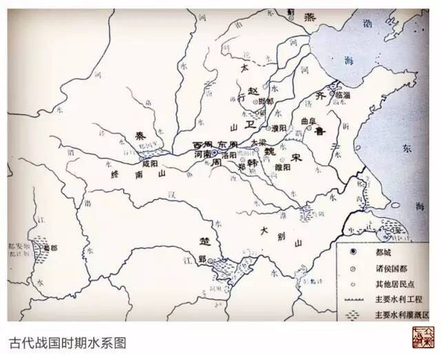
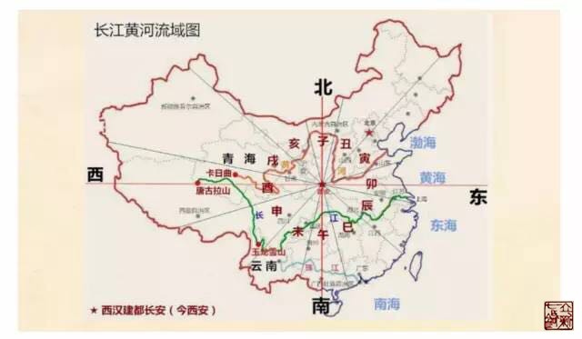

= 经脉——经脉与经水
冰台
2016-9-14 22:22

要真正了解整个经脉体系，我们还必须从华夏文明说起，从人与自然的关系说起。华夏文明
的直接源头有两个：以北方中原文化为代表的黄河文明，和南方的长江文明。

黄河起源:: 黄河仅次于长江，是中国第二大河。发源于青海省青藏高原的巴颜喀拉山脉北
麓的卡日曲，海拔五千四百多公尺，四周高山终年积雪。在中国历史上，黄河沿河流域的人
类文明带来很大的影响，是中华民族最主要的发祥地之一，所以中国人一般称其为“母亲
河”。

长江起源:: 长江是中国第一大河。唐古拉山流出有三条江：金沙江、怒江、澜沧江。它们并
排着进入云南，一起向南流。怒江进入缅甸成了萨尔温江，澜沧江从西双版纳出去越南，成
了湄公河。金沙江流经丽江地段，被玉龙雪山阻挡，在这里拐了个弯，往四川方向流去，于
是才成为长江。所以长江的水源起源于姜古迪如，其实也起源于玉龙雪山。从雪山带来的水，
滋润了长江流域的两岸，因此长江流域的出产才这样丰富。

水是生命的源泉，逐水而居是人类的生存本能。作为我国北方的主要水源，黄河与黄河流域
成为我们祖先的自然选择。人类的文明史总是与水相依而生。逐水而居，不仅是游牧民族的
专利，世界四大文明古国都有一条与国家兴衰密切相连的生命河。在我国，这条生命河就是
黄河，她是孕育中华民族的母亲。

古代的中国，版图上有十二条河流，也就是十二经水。《黄帝内经》把经脉比喻成经水，将
这十二条河流对应于人体十二条经脉，具有很特别的意义。因为在《灵枢·九针十二原》里，
很含蓄的讲了：“令可传于后世，必明为之法，令终而不灭，久而不绝。”怎样的法，才可
以“终而不灭，久而不绝”呢？古往今来，天地日新月异的变化，早已今非昔比，物是人非
了。记载于书上的那些经验，或毁于战火，或毁于天灾，最终也不能保障不会被灭绝。

内经医学源于天地自然，自然规律当然是终久不灭的，所以只要地球不被灭绝，内经医学就
不会灭绝。所以老祖先的用意很清楚，通过把经脉比作经水，提示我们，要把人与天地相参，
河流“五色各异，清浊不同”，“其有大小、深浅、广狭、远近各不同”，经脉也是和于四
时阴阳的。只要有人懂得法天则地的思维方式，通过观察自然界里十二经水的运行变化，就
能够真正明白经脉的道理。即使《黄帝内经》失传了，总有一天，还是会有人把这些规律重
新总结出来。

《灵枢·经水》曰：“经脉十二者，外合于十二经水，而内属于五脏六腑。夫经水者，受水而
行之；五脏者，合神气魂魄而藏之；六腑者，受谷而行之，受气而扬之；经脉者，受血而营
之。”十二经脉像十二条河流一样，都有各自属于五脏六腑的源头，河流是因为承载了水而
通行各处，五脏是因为结合了精神魂魄志意而藏于内，六腑因受纳了水谷而传道输布，经脉
因血气的存在而营运全身各部位。

经水篇分别把十二经脉对应了国家自然领域里的十二条河流:

* 足太阳膀胱经——泾水
* 足太阴脾经——湖水
* 足少阳胆经——渭水
* 足少阴肾经——汝水
* 足阳明胃经——海水
* 足厥阴肝经——渑水
* 手太阳小肠经——淮水
* 手太阴肺经——河水
* 手少阳三焦经——漯水
* 手少阴心经——济水
* 手阳明大肠经——江水
* 手厥阴心包经——漳水

《灵枢·经脉》介绍十二经脉的时候，是从肺经先开始的。经脉的循环从肺→大肠→胃→脾
→心→小肠→膀胱→肾→心包→三焦→胆→肝，然后再到肺，这么一个完整的循环。

经脉为什么要按照这么一个规律来循行？

这也跟自然规律有关，人类出生之后的第一件事就是呼吸，后面所有的一切行为能力，都是
以肺气为基础的。人要活下去，先决条件是离不开能量，呼吸是人体能量最大的来源，饮食
是人的第二大能量来源。古人善于援物比类，他们懂得只有首先保障道路的通畅，然后才谈
得上营行循环，所以呼吸之事更重要的是呼（肺），饮食之事更重要的是泄（大肠），吐故
纳新，生命才得以延续。

我们看到《灵枢·经水》篇十二经水之中，与肺经（寅）和大肠经（卯）分别对应的是河水
（黄河）和江水（长江），长江与黄河流域自古以来都分布着中国的政治、经济、文化中心，
具有非常特殊的意义。肺与大肠是互为表里的两条经脉，长江与黄河也是分居南北，从西向
东横行在中国版图上的两条河流。

这个现象，其实也是自然规律。

我们知道，《黄帝内经》书名最早见于《汉书·艺文志》，《汉书》是东汉班固根据西汉末
年刘歆所撰的《七略》做蓝本编辑的。这就表明至少在西汉时期之前，《黄帝内经》已经成
书，西晋皇甫谧所著《针灸甲乙经》深受《黄帝内经》的影响，也证明内经至少在西晋以前
对人们的影响就比较大了。而且从目前出土的古代针灸文物来看，也是西汉时期为多。1976
年广西罗泊湾汉墓出土三枚绞索状银针，长8.6厘米—9.3厘米，截面径0.2厘米，被考古专家
确认为两千年前西汉时期医疗用针，是迄今为止我国范围内发现的年代最早的绞索状针柄的
金属制针具。1968年河北满城西汉古墓出土金银针，古墓的主人刘胜是西汉中山国的靖王，
于公元前154~113年在位，经有关专家鉴定，确认为这几枚金银针，也是早期的针灸专用针
具。

西汉建都长安，即现在的西安，这里其实是整个中国的中心。虽然现在的地图与内经成书时
代的地图不太一致，但几千年来，长安的地理位置没有变化，长江和黄河的循行路线也没有
大的变化，渤海、黄海、东海、南海这四海也没有变化。内经医学是天人合一的，所以我们
再把现代中国地图对比一下，还是以长安为中心，然后按照方位，把十二地支（对应十二经
脉）放在中国地图上，绘图如下:

我们可以看到，寅（肺）和卯（大肠）所在位置，都是出入大海的口岸，而长江和黄河，其
发源地都是唐古拉山山脉所在的方位酉（肾），而长江黄河又是整个中国最重要的两大动脉，
这也能解疑内经为什么说“卫出下焦”。

长江黄河的水都源自青藏高原，最后都流进大海里，长江与黄河在流行的过程中，沿途都有
很多大大小小的河流溪水补充进来，长江黄河也不断地有水蒸发到天上和下潜入地下去，这
其实就是内经所云:“经水者，外有源泉，而内有所禀，此皆内外相贯，如环无端，人经亦
然。”

*持蟹赏菊度中秋。天心如水，皎皎白洁。*
