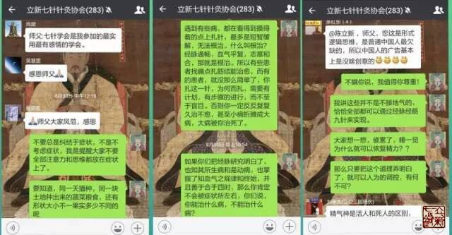
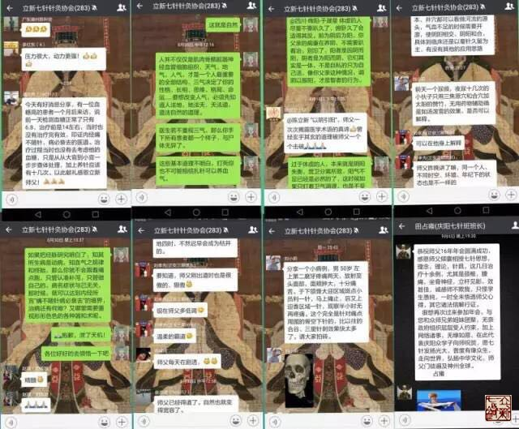
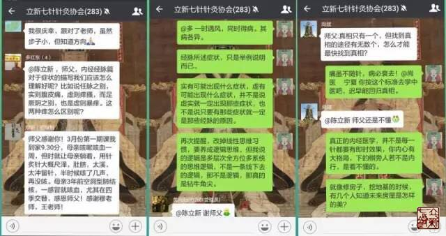

= 立新七针能治什么病？
冰台
2016-9-30 17:27

有很多人问过我：立新七针最擅长治什么病？

每当对方这么提问的时候，我就有些语塞。

我知道对方是按照现代医学的那些标准来理解立新七针。现代医学，无论中西医，都在病名
与症状上做了非常大量的非常深入细致的研究和总结，但凡写论文或报告，大多数人都习惯
于某疗法治某病某症多少多少例疗效分析等格式，所以人们遇见某种不太了解的医术的时候，
就本能的要了解一下对方擅治什么病。

实际上，立新七针恰恰最不重视病名和症状，他几乎解脱了现代医学的所有影响，彻底去回
归自然，所以学术思想完全是自成体系的。立新七针有自己的专利针具、有自己对经脉经筋
理论、营卫气血理论、四时阴阳和人与自然关系的解读方式……无论针具、针法，还是诊治
理论等等各方面，很大程度上，立新七针均有别于其他中西医各针灸门派。所以当人们对比
其他疗法来了解立新七针，我就很难立刻给他们一个满意的答案。

在我看来，立新七针是无病不治，不治无病的。

因为“立新七针”其实只是一个代号而已，并不是标新立异的个人独创针法。立新七针从一
开始面世，就一直申明他的学术思想完全归属于祖国医学圣典《黄帝内经》，并且所有针具
均以内经九针的鑱针、鍉针、员针、锋针、员利针、毫针、长针、大针来命名，属于纯粹的
内经针法。立新七针的针具、针法和学术思想，都不是由我们自己凭空想象出来的，全部都
谨守内经原文原义，忠实的去解读出来。所有的针具针法和观点理念，都在内经里有根有源
的，可以逐一查证，我们是真正在回归内经医学。

而内经医学其实是道法自然，纵观整部《黄帝内经》，都没有多少病名，所提到的那些病名，
只不过是为了举例说事而已。内经医学是通过探索和研究自然规律，来总结人类病痛的原因，
形成一系列的诊治手段与方法，并不是针对一病一症在探索疾病的真相。

经脉、经筋、九针，这是三种能量非常强大的思想，是内经医学的基础。在这些基础之上，
医生再去调和患者的志意，和于四时阴阳，通过对人体气机的调理，就可以治愈各种形形色
色的病痛。

所以，在不违背自然规律的前提下，立新七针可谓无病不治。但我若说立新七针可以治百病，
有些人立刻以为我真是神棍了，我可不愿意背上这个骂名，因此才会三思而后言。

在立新七针面世的最初，为了尽快的融入社会，我们主要宣传立新七针擅长治疗现代医学所
谓的腰椎间盘突出症、颈椎病、脊椎滑脱、椎管狭窄、股骨头坏死征、骨质增生征、骨性关
节炎等等常见病，还特别申明立新七针对顽固性久治不愈的那部分病痛有特效。

立新七针属于内经医学针刺疗法，内经医学之宽广渊博，可谓包罗万象，浩瀚如海。那么，
立新七针除了擅长治疗这些顽固性筋骨痹症，还能治什么病？

立新七针学员有一个针灸协会群，群里有近三百位分散在全国各地的七针学员，大家经常在
群里分享自己临床中运用立新七针诊治的经典病案，相互交流探讨学习，以利于医术提高。
一年多的时间，已经汇总了近330份病案，其中大部分是治疗顽固性颈腰椎骨关节病痛方面
的病案，另一部分就是疑难杂症了，以下是我在学员们提交的病例里，摘录的部分杂症病名
或症状：

咳嗽、前额昏痛、舌麻木、乳腺增生、带状疱疹、肿胀、头胀、耳胀、静脉曲张、牙痛、下
颌淋巴肿大、腹股沟淋巴肿大、胃痛、便秘、黄褐斑、面瘫、眩晕、硬皮症、尿急综合征、
鼻窦炎、帕金森、半身麻木、麦粒肿、痛风、网球肘、胃胀痛、手脚冰凉、抽搐症、中风后
遗症、手术后遗症、耳鸣、风寒感冒、月经淋漓不尽、毒蛇咬伤、尿频尿急、梅核气、三叉
神经痛、腱鞘炎、前列腺增生、癃闭、类风湿、脊柱侧弯、阳痿、手麻、面部红疹、慢阻肺、
结肠炎、疮疡、慢性湿疹、手脚发热、腹泻、长短腿、风疹、腹皮奇痒、颧部疼痛、心前区
不适、偏头疼、晨起腰痛、腹胀反酸、胆囊切除后遗症、突发神经颤抖、无食欲、大椎福包、
急性扭伤、骨折、韧带炎、体位性眩晕、胸闷、多囊卵巢综合征、不孕症、慢性荨麻疹、异
位性皮炎、早泄、肝癌腰痛、经期延长、心慌症、睾丸痛、痔疮、痤疮、龟头炎、甲状腺囊
肿、偏头痛、过敏性鼻炎、银屑病、慢性咽炎、口腔溃疡、小儿遗尿症、慢性盆腔炎、膀胱
结石、冠心病、高血压、流涕、痛经、眼疾、顽固性失眠、口唇干裂、呃逆、面肌痉挛、脑
萎缩、肾衰竭、腹泻、落枕、尿潴留、十指不用、合谷萎缩、心绞痛、哮喘、过敏性哮喘、
多梦症、鱼刺卡喉、腿不宁综合征、食管返流、精神分裂症、抑郁症、牛皮癣、耳聋、乳腺
增生、牙龈出血、子宫肌瘤、烫伤、心肌炎、发烧、偏瘫、痿证、血糖高……

我们可以看到，分散在全国各地的立新七针学员们，诊治了这么多形形色色的病名与症状，
涉及内外妇儿各科，绝大部分案例都取得了神奇的疗效。*而这些病症，都是纯粹以立新七
针针刺去治疗取效的，所以，立新七针针灸疗法的诊治范围，其实非常的广泛。*

事实上，这些都是表象，并非真相。源自内经医学的立新七针针灸疗法，并没有围绕病名和
症状去做文章，*我们的核心目标是四时血气*。因为我们清醒地认识到，如果医学围绕症状
去发展，医生将永远在一条充满未知风险的道路上疲于奔命。*七针人可不想活得那么累，不
希望自己过得那么辛苦，人生不过几十年，我们这辈子不要揣着那么多的愚昧而死去。*

为什么不围绕病名和症状去做文章？我们可以反思一下，随着社会的进步或衰退，病患的症
状一定是层出不穷的。据有关资料的统计，目前世界上的疾病诊断名称，已有近30万个，这
个前提之下，如果医生围绕每个病名和症状去研究医学，需要医生明确的“致病因素”就必
然有千千万万种，普通人脑几乎不可能单独完成这项任务。如果一种医疗方法能应对1000种
病名，医生至少需要掌握300种方法，才能应对30万种病名；如果一种方法只能应对100种病
名，那医生就需要掌握3000种方法来应对……医生到底需要掌握多少种方法，才能应对这些
永无休止的症状？

在这样的状态下，现代医学不得不把病痛分成若干类别，你负责哪一类症状，我负责哪一类
症状，他又负责哪一类症状，超出我的能力就不属于我的责任范围。于是把一个原本整体的
患者，人为的分成若干单独的器官组织，成立若干个科别，以此治疗病痛。

*这是科学的医学吗？*

用一个简单的病案，我们就可以验证医学这样分门别类是否真的科学。临床上有很多这样的
患者，由于长期的感情纠结、工作或生活压力过大等原因，形成肝气郁结，影响了饮食与休
息，导致肠胃功能失调，继而影响了气血的营行，导致筋骨失养，然后恶性循环，筋骨脏器
精神相互持续的影响。由于每个患者在体质、工作、认知、生活、居处等各方面条件的优劣
程度不一，患者们的症状就可能分别突出表现在失眠多梦、月经不调、阳痿早泄、肝胆症状、
肠胃症状、颈腰椎骨关节症状等等各个方面。那么，患者们应该去看神经科呢？看妇科呢？
看男科呢？看肝胆科呢？看脾胃科呢？还是看骨科呢？试问，如果就这样单独对应孤立的脏
腑、器官、骨关节、软组织，有哪一个科室的医生，能够真正治愈这类患者的症状？

再来看中医，古往今来，中医发展门派众多，如伤寒派、千金派、局方派、温补派、攻邪派、
温病派、汇通派、滋阴派、火神派、寒凉派等等。中医的治疗思路也是纷繁复杂，如汗法、
吐法、下法、和法、清法、温法、消法、补法、攻补兼施法……中医的疗法更是层出不穷：
针刺法、灸法、中药、按摩、刮痧、拔罐、拍打、熨疗、熏蒸、拉筋、拔抻、电疗……而每
一种疗法又衍生了非常多的创新和改进，如针刺就有正经、奇穴、对应针、体针、腹针、腕
踝针、平衡针、头针、眼针、耳针、手指针......每一种针刺法下面又有赵钱孙李周吴郑王
氏等各家不同刺法，数不胜数。

这么多的门派与方法，人们通常都说他们皆各有所长，也各有所短，似乎已经成为自然规律
了。请注意啊，这些其实都只是方法，并不是医学真相。如果大家的理论体系都达到真理的
高度了，这种前提下说大家各有所长短，是没错的，临床实际运用的时候，就视具体情况，
各取所需。但是，如果大家的认知都远离了真相，这时候说各有长短，其实是不妥的，因为
大家都还在盲人摸象。

比如腰痛一症，针灸可以治愈，中药可以治愈，按摩推拿也可以治愈，刮痧拔罐也能治愈，
熏蒸热熨也能治愈，拍打拉筋也能治愈……这些都是事实。问题是，这么些方法，为何大家
都能轻易治愈很多腰痛，也都会遇到一些难以治愈的腰痛？而且有一个现象值得我们深思：
某疗法比较容易治愈的那些病痛，其他的疗法也比较容易取效，而某疗法难以治愈的那些腰
痛，其他疗法往往也感到比较棘手。这些现象背后的真相，到底是什么？

*大部分中医都在遵循前辈们的经验行医，然后根据自己的经验与发现，又创立一些新的门
派或疗法，导致中国医学的门派越来越多，疗法越来越多。*发展趋势与西医一样，分门别
类越来越多，也越来越细化。那么，从远古→古代→近代→现代，中医到底是在发展还是在
倒退？

在《灵枢•病传》里，黄帝问岐伯：“余受九针于夫子，而私览于诸方，或有导引行气，乔
摩、灸、熨、刺、焫、饮药之一者，可独守耶，将尽行之乎？”

岐伯曰：“诸方者，众人之方也，非一人之所尽行也。”

黄帝问岐伯说：常见的治病手段，有运动锻炼、按摩、灸法、熨法、针法、熏法、汤药等等，
我是掌握一种呢，还是全部都要精通？岐伯告诉黄帝说：这么多的方法，是为了应对不同状
况所用，并非全都要精通。

黄帝具有非凡的悟性，他立马就明白了，万象后面有真相，于是概括了一句被后世医家们广
泛忽视的真理：此乃所谓守一勿失，万物毕者也。

守一勿失，万物毕者也！说的多好啊，真正大道至简。

黄帝所说的这个一，是什么呢？纵观内经全文，一，就是专注，就是抓根本，守规律。所以
*《素问•阴阳离合论》说：阴阳者，数之可十，推之可百，数之可千，推之可万，万之大不
可胜数，然其要一也。*守住根本，守住规律，就可以临危不乱，任其千变万化，真相只有
一个。所以兵来将挡，水来土掩，于是所有复杂的事情，都因此而变得简单了。

管他那么多症状干嘛呢，世界上人口那么多，一个人一种天性，一个人一份阅历，一个人一
层学识，一个人一颗思想，要多复杂就有多复杂，你怎么应对得完？我们必须清醒的认识到
一个问题：地球上的人类虽然有国度、种族、阶层、贫富、性别、老幼等区别，但所有人类
生命现象背后的规律都是一致的，并没有无数种规律。比如所有人都是用脚走路，用脑子思
考，用嘴吃饭，肛门排泄等等。世界上同一事物的真相只有一个，真正解决问题的核心也只
有一个。如果我们在解决问题的时候，分门别类越多，就一定会离真相越远。

在内经医学里，治病的真相，就是古人对经脉和经筋的思想认知，治病的核心手段，不是九
针针具本身，而是九针的思想理念，所以内经选择了九针作为宣扬内经医学的载体。

作为一名医生，必须首先清晰的明白，什么是病。很多医生把症状当成了病，在应对症状方
面积累了大量经验，视为至宝，却不知症状一定是随着社会的发展与落后，表现得千奇百怪，
而且会层出不穷。我们如果把症状当成病来认知，就是靠耳朵和眼睛在判断事物真相，往往
容易不明而为，必将把医学带进无底的深渊里去。

*无论医者还是患者，所有人都希望治病能求本。本是什么？当然是病因。*我们看到和感觉
到的病痛症状，都表现在皮肤肌肉血管神经骨骼脏腑等等器官上面，于是很多人就埋头在这
些器官上去研究，不断的细化，企图以此发展人类医学。但从内经医学来看，病因并不仅仅
只存在于皮肤肌肉血管神经骨骼脏腑等器官上面，人生活在大自然，身体只是存在而已，其
内合情志思想，外合天地自然，互相密切联系在一起，根本不可分离。所以治病当然不能只
看肉体本身，于是，《灵枢•百病始生》非常明确的指出了人的病因：百病之始生也，皆生
于风雨寒暑，阴阳喜怒，饮食居处，大惊卒恐。

我们还应该明白，虽然中医有导引行气、乔摩、灸、熨、刺、焫、饮药等等诸方诸法，但真
正把病治好的，其实不是针，不是灸，不是药，不是外部热量，也不是符咒或导引术之类，
这些都是**为我所用的方法，都只是起到了调节血气的作用，并不是能替代气血本身。**真
正能够治愈病痛的，还是人体的神，也就是气血和志意。

如果明白了这些道理，就可以做到“守一勿失，万物毕者也”。

在立新七针针灸疗法的诊治理念里，极少去重视一招一式一针一穴的运用。除了一些急性或
短期病痛，我们会追求在1至3次之内治愈的快速疗效，对于那些体质较差、患病时间较长、
八方求医却久治不愈的患者，无论什么疾病，我们都不会把即时的症状改变当成首要目标。

慢性病患者往往都是多种病症叠加，也许他们症状仅仅表现为局部的某一处，那也必须整体
治疗，如果只针对局部某病某症，叫做治标不治本，即使见效或“治愈”了，稍不注意，就
又会复发。

我们首先是察观患者的气色、眼神、光泽，循其经脉经筋而调，更穷三根四结，依标本而治。
如果复诊的时候，患者的眼神依旧浑浊无光，面色依旧晦暗无华，精神状态也没有趋于好转，
那么只有两个原因：要么就是医生诊治思路有误；要么就是患者在某些禁忌或情志方面对气
血有所触犯。

例如我纯用立新七針针刺疗法治疗某妇人子宫肌瘤：该患者两月前经医院检查子宫肌瘤有5
公分大小，同时伴有乳腺肿瘤。这类患者怎么治？我既不针对她的乳腺，也不针对她的子宫
肌瘤，根本就不去碰她乳房等隐私部位。在我眼里，她的肌瘤也好，肿瘤也罢，跟平常治疗
的那些腰腿痛肠胃不适等等病症，并无二般区别。*我只管调理她的营血和卫气，关键是卫
气，同时兼顾观察她的情志变化。所以每次治疗前后，我从不问她症状如何，她来去轻松，
我也若无其事。*

治疗两次之后，我看她原本晦暗的脸色，已经开始光泽红润，眼睛也明亮了，即使她说疼痛
依旧，但我知道治疗已经取效。就这样间隔五天八天的来扎一次针，整个过程不允许她内服
任何中西药，不让外敷膏药，两个多月时间下来，患者逐渐的变得神清气爽，精神与体力都
明显好转。最近还开车出去长途自驾游一圈，说自己以前走路都累，现在居然能独立开车四
五个小时而不觉疲惫。旅行出发前曾到医院复查，子宫肌瘤仅剩1公分大小了。

类似患者，其实大可不必惊慌，只要你对内经医学有信心，能坚持治疗，我们迟早还你一个
真正健康的身体。内经说“言不可治者，未得其术也”，中医治病，无论什么方法，之所以
能够建功立业，其实都是依赖于“气”。*中医的“卫气”一说，千百年来均模棱两可，医
家不明经脉为何，更不明卫气如何循行，*以至于都在药物或穴位上有所发现，依靠临床总结
的经验在治病，虽然“创造”出一些新颖的理论学说，由于缺失了对经脉的正确认知，其根
本还是知其然而不知其所以然。

而今立新七针早已跨越了在穴位和针术上做文章的阶段，步入了内经医学大道。随着我们提
出的卫气理论在业界的影响力逐渐扩大，我相信在不久之后，一定会有很多还在玩针术和穴
位点的针灸医生，慢慢的都会加入到对“卫气”的研究运用队伍里来。因为“道”的魅力，
诱惑无穷大。

所以，面对琳琅满目的各种病名与症状，立新七针不为所动，我们谨守营卫血气，顺应经脉
经筋，合于四时阴阳之气，调和志意，补虚泻实。

如此，则痛虽不随针，病必衰去矣。
