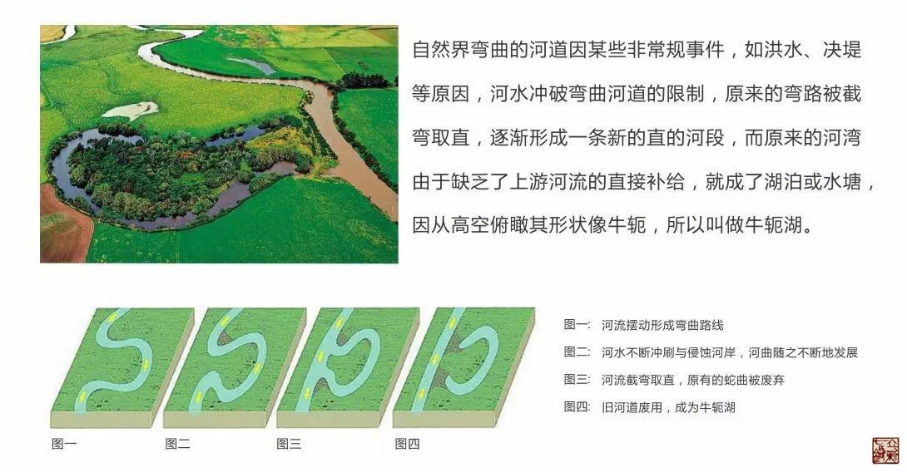
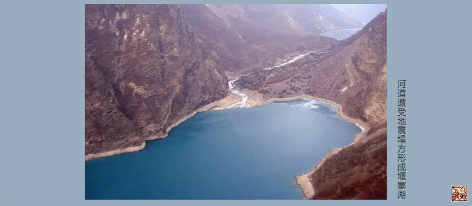

= 经脉——离经之血
冰台
2016-10-12 20:16

既然十二经脉外合于十二经水，那么经脉也应该具有河流的一些规律与现象。

在自然界里，有一个现象，就是在河流的附近，常常有很多湖泊或水塘存在。这些湖泊形成
的原因有很多种，比如地壳运动形成塌陷、自然的侵蚀堆积、人为的构建等等，都会让地表
形成凹陷地，这些凹陷之处就会蓄水，变成湖泊或水塘。

在平原地区，流水所过会因地势的高低和地形的软硬，而形成蜿蜒的河流。随着河流的迂回
发展，流水天长日久的不断冲刷侵蚀河床周围的泥沙，遇到坚硬的石头就绕过，遇到烂软的
泥沙就冲掉，河流就会越来越弯曲，相邻的两个弯曲的河道就会不断靠拢，形成很窄的“地
峡”。

这种弯曲的河道平时是相安无事，如果遇到上游暴雨，下游就会暴发一次较大的洪水。拥有
巨大力量的河水，将冲击两个邻近的弯曲之间，从而发生决口，一旦产生决口，河水就会由
上一个弯曲河道处直接冲入下一个邻近的弯曲河道，在决口处直接连通。而旁侧的河道将逐
渐被泥沙淤积堵塞，不再有经常性的水流经过，原来的河湾就变成湖泊或水塘，不再直接参
与河流的循行。这种湖泊因形如牛轭，地貌学上叫牛轭湖。

除了牛轭湖之外，还有一种自然现象叫堰塞湖。

堰塞湖是由火山熔岩流或由地震活动等原因，引起山崩滑坡体等堵截河谷或河床后贮水而形
成的湖泊。由火山熔岩流堵截而形成的湖泊又称为熔岩堰塞湖。堰塞湖的形成有四个过程，
一是原有的水系；二是原有水系被堵塞物堵住；三是河谷、河床被堵塞后，流水聚集并且往
四周漫溢；四是储水到一定程度便形成堰塞湖。

堰塞湖一旦决口会对下游形成洪峰，处置不当会引发重大灾害。

堰塞湖与牛轭湖是不一样的，一个是对自然界的影响不一样，另一个是构造形成原因不一样。
简单地说，牛轭湖的发育需要漫长的时间，而堰塞湖可能是一次灾害中形成的。

如果所形成的牛轭湖或堰塞湖之类够大，那就可以形成一个极小的循环，水气蒸发，雨水降
落，还勉强可以具有生命力，鱼、虾、水中植物都可以在里面生存，形成良好自然环境的一
部分。但是堰塞湖往往是在水流的中间形成，它会逐渐变大，而且极不稳定，一旦崩溃就会
严重影响自然环境，这就有点像人体里的血栓，栓塞到一定程度成为溢血。

如果形成的湖泊或水塘比较小，相对就比较稳定，不太会直接破坏自然环境。但是由于蓄水
量过少，循环就会很差甚至无法循环，成为死水一潭。死水会怎样呢？我们在自然界看到那
些比较小的水塘，由于缺乏循环，加上自然人畜的排污，植物的腐烂，日晒雨淋等等原因，
水质就会变臭，成为污水坑，这就会影响到自然环境。

援物比类，在人体里的气血，有一些现象，很类似自然界形成的牛轭湖或堰塞湖，中医叫
“离经之血”。

所谓离经，就是堆积在那里不再参与经脉的循环了，也就是瘀血，《黄帝内经》里叫做“恶
血”。在《灵枢·九针十二原》里就讲到：“凡用针者，虚则实之，满则泄之，宛陈则除之，
邪胜则虚之”，后面《灵枢·小针解》有补充解释：“宛陈则除之者，出恶血也。”

《说文解字》云：“瘀，积血也。”关于瘀血的病理，在内经以下几个篇章里有讲述：

* 《素问·调经论》曰：“血有余则怒，不足则恐，血气未并，五脏安定，孙络水溢，则经有
留血……视其血络，刺出其血，无令恶血得入于经，以成其疾。”
* 《灵枢·邪客》曰：“肺心有邪，其气留于两肘；肝有邪，其气留于两腋；脾有邪，其气
留于两髀；肾有邪，其气留于两腘。凡此八虚者，皆机关之室，真气之所过，血络之所游。
邪气恶血，固不得住留。住留则伤筋络骨节，机关不得屈伸，故拘挛也。”
* 《灵枢·贼风》曰：“尝有所伤于湿气，藏于血脉之中，分肉之间，久留而不去。若有所
堕坠，恶血在内而不去，卒然喜怒不节，饮食不适，寒温不时，腠理闭而不通。其开而遇风
寒，则血气凝结，与故邪相袭，则为寒痹。”

瘀血对人体健康危害极大，许多疑难病、慢性病都与患者体内存在瘀血有直接关系。凡血液
运行不畅，或体内离经之血未能消散，都称为瘀血，比如“气结则血凝”、“跌打红肿未破
皮”等等。瘀血是病理产物之一，又成为一种致病因素，其成因大致可概括为五点：（1）气
滞则血行不畅；（2）气虚则血运无力；（3）阳虚血寒而凝滞；（4）外伤脉络，血不归经；
（5）寒、热、痰、湿等邪气阻络，血液或凝涩或壅塞而形成瘀血。

离经之血是失去了气的血，是没有生命力的血，是废用的血。《素问·调经论》曰:“五脏之
道，皆出于经隧，以行血气。血气不和，百病乃变化而生，是故守经隧焉。”经脉是运行气
血的通道，当血不在经脉中循行就是离经之血，因为已经丧失了血液的生理功能。

离经之血表现在人体身上，就是在经脉所过皮肤周围，有一些颜色很深甚至发黑的类似静脉
血管的小弯曲，但这些瘀络并不是静脉血管，因为它是离经之血，瘀在那里的，如果用锋针
刺之，会流出来很黑很稠的血液状液体。《灵枢·血络论》曰:“血脉者，盛坚横以赤，上下
无常处，小者如针，大者如筋，则而泻之万全也。”如果刺血方法得当，疗效非常惊人，往
往数年顽疾愈于顷刻之间，而且远期疗效非常稳定。
