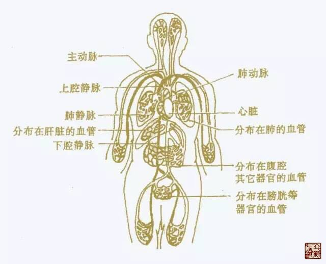

= 百病生于气
冰台
2016-10-13 18:37

黄帝内经》里有两句非常经典的文字，一句是“百病生于气”，一句是“恬淡虚无，精神内
守”。这两句话，一句是讲病因由来，一句是讲预防疾病的办法。人们总是困惑于疾病从哪
里来的，其实在内经里都有答案，比如《灵枢•口问》说“百病之始生也，皆生于风雨寒暑、
阴阳、喜怒、饮食、居处、大惊卒恐”，《素问•举痛论》说“百病生于气”。

每个人都有一个出生年月日时，*在中国传统文化里，人的出生年月日时，叫做生庚，生庚
与五行有非常密切的关系。*因为在自然世界里，地域分为东南西北中，通常而言，南方温
度偏热，北方偏冷，西方偏于干燥，东方沿海风比较大，中原地带土壤比较肥沃，古人根据
这些自然现象，就把东南西北中分别对应木火金水土。在不同区域不同时节里，大气所展现
的状态是有所不同的，比如夏季炎热冬季寒冷、雨天湿气重、干旱的地方空气也干燥、西北
部高原地带的氧气就比东南地区要稀薄等等自然现象。自然界的天地之气通常是按这么个规
律展现，但并不是恒定的，会随着时间而有所变化，比如夏季里也有比较冷的天气，冬季里
也有暖阳天气出现。

*人生存在天地之间，天地之气对母体和胎儿的影响是最直接的，时节和空间的不同，天地
之气对人体所产生的影响也有所不同。*再加上每个人的遗传基因、父母的情志、饮食居处
等条件的差异，就决定了一个人的五脏六腑会有一方或几方面处于相对较强或相对较弱的这
么一种状态，在没有其他影响力的情况下，这个状态也是相对比较稳定的。内经根据脏腑各
器官的功能作用，用金水木火土五行来进行表达和解读，如果脏腑五行的能量强弱不等，再
受到一些外因影响，就会产生相克或相争。这个相克相争，实际上并不是器官本身在伤害对
方，*而是器官周围空间里存在的气的多寡所致*，有强就有弱，五脏气争或气攻，强不堪受
或弱不堪受的一方就会受伤，于是就变现为长期生病，或早衰或短命。有的人天生五行相对
比较均衡，如果他们不受外界因素太多影响的话，自然就会长寿。

既然说百病生于气，那么脏腑气从哪里来的？这些气还是自然空气，人体通过器官呼吸变化
而来的。人是情志动物，有七情六欲，要衣食住行，即便在某个地方不开心的生活着，你也
不能随意迁徙，总免不了因工作、婚姻、事业、环境、饮食等等的不适应，而产生愤怒郁闷
忧伤思念难过等情绪，这些情绪是病气的根源之一。

*有没有不受这些病气影响的人？有，一种就是认知比较高的人。*生活在红尘世界里，但他
们知道病气的来龙去脉，也肩负养家糊口的责任，因机遇或靠某些手段挣了钱，不再受累于
事业，于是就把钱财物质感情这些看得恬淡虚无了，该玩玩，不瞎操心，也不闲扯淡，总之
与世无争，精神只为自己而内守，只管自己门前霜，休管他人瓦上雪，自己及自己家人衣食
无忧，日子过好了就行，这类人是可以少生病或不生病的。不过人人都如此活着的话，国家
和社会也就谈不上进步发展了，想想吧，乌龟王八活万年，并不创造啥价值，活着的意义也
就是个活着，我本人是不屑如此活着的。

*另一种就是逃离红尘，比如到山中隐居或出家为僧，隐士一般是自给自足，与世无争，也
不肩负社会责任与家庭义务，尽管粗茶淡饭，活得倒也清闲无疾。*僧人是靠化缘或别人的
供养而活着，少了事业工作等等压力，真正伴守青灯的人，也断了情爱肉欲，就少了许多男
女感情方面的纠结，自然也活得比较恬淡，身体也相对比较健康。说到这里，有个怪象要顺
便提一下，有些隐士和僧人并不本分，他们日常吟诗作对，饮茶作画，闲得蛋疼的时候就写
点人生箴言或心灵鸡汤之类，还偏偏要给红尘中的人们看。这很要命啊，生活在红尘中的人
看了他们那些恬淡虚无的境界，不免心动，如果能顺从红尘外那些人所写的心灵鸡汤，倒也
惬意，但是有几人能够扛着繁重的事业和家庭生活，去恬淡虚无的？红尘之外的人怎知红尘
之内的具体？总不能都随你去做隐士和尚吧。没有那些箴言的刺激，就不会产生那么多欲罢
不能的纠结，那些令人干捉急的心灵鸡汤，看了真的无益于身心健康和家庭安稳。而写心灵
鸡汤的僧人或隐士们，因为没有尘世俗务的牵扯，自然可以活得悠闲，这是比不得的。所以
在朋友圈一看是“某某禅师云”“某某隐士曰”等文章，我就直接忽略，都出世修行的人了，
不好好安静呆着，老来给红尘中人添堵，是咋想的呢？反正，我个人不会轻易走隐居或看破
红尘这条路，某一天真要走，就悄无声息的匿着。

*还有一种人，可以不受病气影响，就是白痴与傻瓜，啥也不懂，也没有七情六欲了，只会
哭和笑这两种最基本的情感表达。*这类人通常皮肤光滑，长得白白胖胖，不会受到什么肩
周炎、颈椎病、腰椎间盘突出之类病痛的骚扰。也有一些像白痴傻瓜一样活着的正常人，他
们基本没有家庭责任心，也无视父母子女的赡养抚育等等义务，更谈不上事业心，社会国家
的发展与衰败都与己无关，一概活得无忧无愁，天塌下来与己无关，无论发生什么事，有钱
没钱，歌照唱舞照跳酒照喝牌照打，这种人是不容易生病的。

而普通人，要自己养活自己，要肩负责任义务，免不了衣食住行事业家庭父母儿女夫妻感情
方面的许多折腾，气血随情志的波动而快速充盈，血脉偾张的时候是无法避免的。而且人有
七窍，眼耳口鼻舌等器官自然免不了外界的种种刺激，肉身的刺激和情志的刺激，就容易导
致身体呼吸急促，而经脉通道是比较恒定的，气入太过的时候，通道又不能随之扩大，邪气
太旺就会产生聚集，经脉的空间有限，不会存留多少在此，最直接的就是停留在脏腑周围的
那些空间里，导致分间饱胀，直接狭隘了脏器，导致脏腑无法正常功能。

所以人体在情绪剧烈波动之后，需要给气一些出路，发泄的方法包括呻吟、出汗、落泪、愤
怒、抓狂、嚎啕大哭、大吼大叫、撕扯、喋喋不休、性爱、歌唱、跳舞、酗酒等等，令邪有
出路，发泄了，就可以减轻气聚对脏腑的压力，令身体保持相对健康的状态。如果生气之后，
那些负面情绪在体内憋着，闷着，没有发泄出来，如果再遇到流年不利，自然界风寒湿暑燥
火等六气能量的变化，正好处于对身体不利的时机，聚在脏腑分间的那些气，对身体就会产
生非常大的伤害！

在对身体的各种不利条件没有达到极致状态的时候，人体生气之后所产生的气聚，主要是对
五脏六腑中相对较弱的那一方或几方面，产生一些伤害，就出现诸如胃病、肺病、肝病、心
脏病、肾病等等，继而影响整个身体气血循环，出现各种千奇百怪的病痛或症状。比如，很
多人生气之后就没胃口，吃不下饭了，也睡不好觉，时间长了，不仅肝气郁结导致肝胆受损，
脾胃也不好了，然后失眠头晕、便秘、乳腺增生、月经不调、性欲减退、皮肤病、四肢疼痛、
脊柱关节等等问题接踵而至。又比如某些人长期情志不舒，郁闷压抑，导致气血循环不畅，
也许平日里动不动就生气习惯了，纠结了，郁闷了，却啥事没有。这类人你可以无所谓，可
以忽视养生预防，但如果你自身的五行属性里木比较弱，又曾因外伤或跌损导致肝胆经脉不
畅，平时也喜欢辛辣高脂肪的食物，经常熬夜劳累，加之生活在西部或南方地区，遇年月运
属金或火的时候，就特别容易引发肝脏的一些疾病，诸如肝炎、肝硬化、肝癌、肿瘤等等，
因为五行之中是肝属木，金克木为木害，木生火为木耗，就容易对肝脏产生重大伤害。如果
你五行里土比较弱，各种不利条件叠加在一块的时候，就比较容易患上胃炎、胃溃疡、胃癌
之类……不是不报，时候未到。

*如果某人的脏腑五行相对都比较均衡，没有太强太弱的，气伤不了全部脏腑，却又走投无
路，越聚越厉害，最后这个气，就只有直接攻心了。因为心脏是人体的最重要的部位，只有
废了他，不再生气，这个气才能消停。*有句话叫“气急攻心”，也有句话叫“气得死人”，
生活中有些人在遭受重大打击，或极度生气的时候，常常容易突然晕厥，甚至死亡。*因为
心脏受到气的挤压约束，负累不堪的时候，就只有让跳动加速或减缓。*血压加快增高，就
容易引起脑血管堵塞或破裂出血，出现昏迷。脑供血和四肢供血不足，就容易出现晕厥或四
肢瘫软。若这类人的经脉通道再因风寒湿或外伤跌损等原因导致营行流通不利，心脏就会饱
受内忧外困，心脏在抗争一段时间之后，如果加速或减速还是无法缓解困境，就只有停止跳
动，直接晕死过去。如果抢救的医生，懂得内经医学所言气绝于内和气绝于外的不同，施术
适当，晕死的患者是可以很快的抢救回来的。如果医生不明而为，明明是气绝于内，见患者
晕厥了，还给他输入冰凉的药液去“急救”，或者急掐患者的人中，刺百会、涌泉、手指十
宣等处放血，意图救命，那么这患者将很快安静的死去。

*所以医生的手，一面是生，一面是死，生与死就取决于医生是否明理。*作为患者，如果明
白这些道理，自己平日里注意调控情绪，远离生气根源，让自己少生气，不生气，保持愉悦
心情，或不至于成为刀俎之鱼肉，若自己不明道理，胡乱折腾，身体生病之后，就看你运气
好不好了。

天地不可一日无和气，人心不可一日无喜神。秋安！
