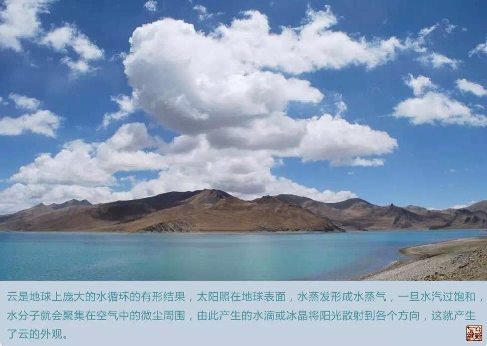
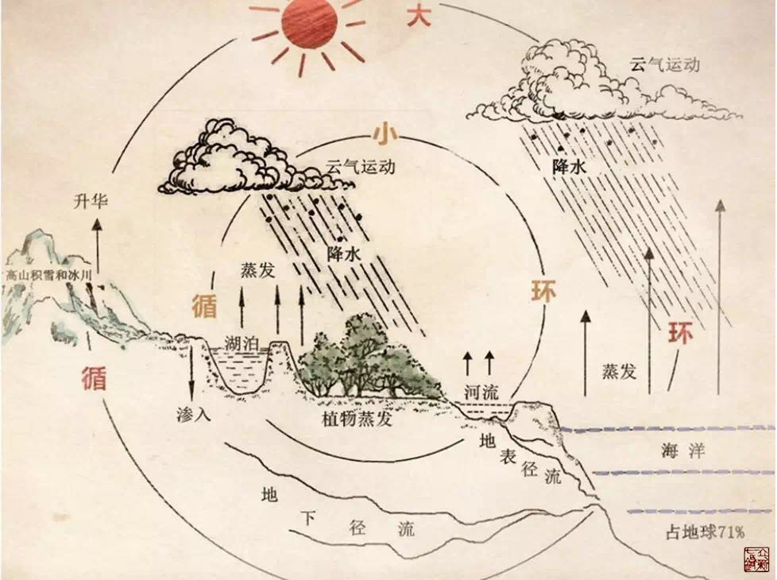

= 经脉——阴升阳降
冰台
2016-11-16 08:57

内经将经脉比喻成经水，其中就寓意了非常丰富的信息，值得我们去深入思考。比如自然界
水的循环过程，我们只看到大江小河的水最后都流进了大海，那么这些江河的水，又是怎么
来的呢？每天大量的水流进大海，这些水又怎么变化的？

大气的循环，其实是靠蒸发为主的，蒸发是水在大自然中循环的第一动力，蒸发的过程，是
阳光、空气、水的能量。太阳的能量会把海洋、江河、湖泊、水塘、湿地里的水，以及地表
的水，都蒸发到天空上去，还有地球上广袤的树木、庄稼、花草植物，也会把土壤中的水抽
去到叶面，然后蒸发。这些人类看不见的蒸发现象，每分每秒都在把大量的水气输送到空气
中，水气上升到高空，在低温的作用下，形成云。

当云中的水气增大到一定程度时，云的体积和重量就会不断增加，大到空气再也托不住它时，
便从云中直落到地面。这些水气中的一部分会成为雨水降落，再度将水还回陆地。另一部分
会在高海拔的山上形成雪，然后受到太阳的融化，形成无数条细小的水流，然后汇合成河流，
经过漫长的流淌循行，最后再次将水输送到海洋里。

阳光蒸发水的这个过程，离不开空气的作用。由于地球是圆的，太阳的辐射将导致地球表面
受热不均，冷热交替就引起大气层中压力的分布不均，形成一种空气的动力，空气沿水平方
向运动就形成风，风的形成就是空气流动的结果。风起云涌，所以是空气使水气产生了散布
和游动的作用。

《素问·阴阳应象大论》云:“地气上为云，天气下为雨；雨出地气，云出天气。”自然界水
的循环分为大循环和小循环，所谓“天气下降，地气上升”，在太阳的辐射热下，海洋蒸发
出来的水蒸气，被气流带到陆地上空，凝结为雨、雪、雹等落到地面，一部分又被蒸发返回
大气层，其余部分成为地面径流或地下径流等，最终又回归海洋，这种海洋和陆地之间水的
往复运动过程称为水的大循环。仅在局部地区（陆地或海洋）进行上升下降的水循环，成为
水的小循环。自然环境中水的循环并非独立，是大、小循环交织在一起的，并在全球范围内
和在地球上各个地区内不停地进行着。

根据自然界水的循环过程，我画了一个示意图:

《灵枢·玉版篇》:“海之所行云气者，天下也。胃之所出气血者，经隧也。”我们从自然界
可知，世界上所有的水最后都流归大海，而大海里的水经日温而蒸发上天，随着地球的自转，
水气又下降到世界其他地方，其中高山上会形成冰雪，太阳出来之后冰雪融化成水，又流下
来成为河流，河流在疆土上经过漫长的循行，然后又流进大海。

*自然界的水就是这么个循环过程。中国的长江与黄河，也是这么一个循环过程。*

在这个自然循环过程中，我们别忘了天地是有阴阳之分的，《素问·金匮真言论》云:“夫言
人之阴阳，则外为阳，内为阴。言人身之阴阳，则背为阳，腹为阴。言人身之脏腑中阴阳，
则脏者为阴，腑者为阳。”《素问·阴阳应象大论》云:“天不足西北，故西北方阴也。地不
满东南，故东南方阳也。天地者，万物之上下也；阴阳者，血气之男女也；左右者，阴阳之
道路也；水火者，阴阳之征兆也；阴阳者，万物之能始也。”《素问·五常致大论》云:“阴
阳之气，高下之理，太少之异也。东南方，阳也，阳者其精降于下，故右热而左温。西北方，
阴也，阴者其精奉于上，故左寒而右凉。”

根据内经的提示，东南为阳，西北为阴，左右者，阴阳之道路也，把人体按照腹为阴背为阳，
应在地图上，我们就可以看到，*孕育中华民族的黄河就相当于人体的任脉，长江就相当于
人体的督脉，*《灵枢·五音五味》曰:“冲脉、任脉皆起于胞中，上循背里，为经络之
海。”《素问·骨空论》曰:“任脉者，起于中极之下，以上毛际，循腹里上关元，至咽喉，
上颐循面入目……督脉者，起于少腹以下骨中央，女子入系廷孔，其孔，溺孔之端也，其络
循阴器合篡间，绕篡后，别绕臀，至少阴与巨阳中络者，合少阴上股内后廉，贯脊属肾，与
太阳起于目内眦，上额交巅上，入络脑，还出别下项，循肩髆内，侠脊抵腰中，入循膂络肾；
其男子循茎下至篡，与女子等；其少腹直上者，贯脐中央，上贯心入喉，上颐环唇，上系两
目之下中央。”由此可知，*任脉和督脉都是一个方向循行的，都入了髓海*。这样一来，我
们就可以很容易的理解督脉和任脉在人体里的作用了。

古人其实是有人明白任督二脉与天地自然关系的，如清代李潆所著《身经通考》在《督任二
脉导引说》一篇里就认为任督二脉相当于地的南北:“夫人身有督任，犹天地之子午也。人
身之任督以腹背言，天地之子午以南北言，可以分，可以合，分之以见阴阳不离，合之以见
浑沦无间。此修真者之周行也。”可惜的是李潆并没有把经脉与自然界的江河联系起来去认
知，这样就局限于理论方面而少了实践性，所以他的观点对后世并没有产生多少影响。
