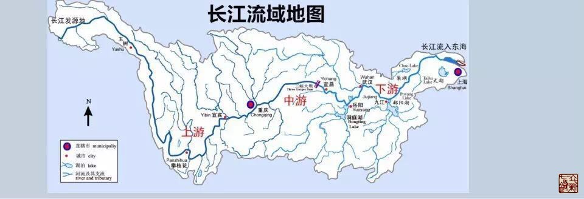

= 经脉上下游
冰台
2016-12-28 21:15

经脉是流注的，所以内经讲经络阴阳相贯，如环无端。

如环无端，在自然界就是循环的意思，如《立新说》经脉——阴升阳降文中，我所画的自然界
水的循环图所示，有大循环和小循环，小循环包含在大循环里。

既然涉及水的循环，而且内经也将经脉比喻为经水，那我们就应该从河流的一些规律来理解
经脉的一些规律。自然界河流有上游与下游之分，上游与下游的状况是不一样的，比如长江，
整个长江分为上游、中游和下游，在长江发源地是涓涓细流，上游的特点是落差大、峡谷多、
水力资源丰富。中游的特点是河道曲折、河湖众多、流速缓慢。下游的特点是河道开阔、水
流缓慢。其实上下游只是相对而言，上中下游的每个阶段里面，分别又有上中下游的概念。

受自然界水循环的启发，我首先在中医界提出了经脉上下游理论，并在《灵枢·周痹》里找
到了内经医学理论支持:“痛从上下者，先刺其下以过之，后刺其上以脱之。痛从下上者，
先刺其上以过之，后刺其下以脱之。”

这句话让很多人看不明白，是因为脑子里对经脉没有一个立体的概念。我们要知道，这段话
是在《周痹》这一篇里讲的，那就是跟痹症有关，痹症的表现，并不仅仅就是痛，诸如酸胀
麻木冷凉等等都是痹症的常见表现。所以，这个痛，并不一定就只是指疼痛，我们可以理解
为各种症状。

如果我们明白人体发生自然病痛的原因，是由于气血虚实不均所致，那么这句话就比较好理
解了:气血从上往下（经脉的循行方向）循行受阻，不通则痛，就要先调理其下方（经脉远
去的方向为下），令经脉疏通，然后再调理其上方（经脉迎来的方向为上），令经脉气血顺
利输送下来，通则不痛。气血往下行却受制于上方（上方输送不足），是一种虚，络虚则痛，
就要先调理上方，令气血能下行先充盈经络，然后再调理下方，令经脉气血顺利输送过去，
顺则痛消。

*九针治病，其实无非就是调阴阳虚实。*

* 《素问·痿论》曰:“各补其荥而通其俞，调其虚实，和其逆顺，筋脉骨肉，各以其时受月，
则病已矣。”
* 《素问·调经论》曰:“百病之生，皆有虚实。”
* 《灵枢·九针十二原》曰:“虚实之要，九针最妙，补泻之时，以针为之。”
* 《灵枢·官针》曰:“用针者，不知年之所加，气之盛衰，虚实之所起，不可以为工也。”
* 《灵枢·九针十二原》曰:“凡用针者，虚则实之，满则泄之，宛陈则除之，邪胜则虚之。”
 
临床常见症状表现方式，大致分为虚实两类：

* *虚*：痛、麻、木、酸、困、软、晕、昏、沉、冷、凉、紧……
* *实*：胀、重、热、肿……

请注意，这里所讲的虚实之分，是从经脉卫气的角度来讲的，我们是把经脉看做一条河流而
言，自然界的河流，上游不足，则下游表现为虚，上游过剩，则下游表现为实。我们将这个
逻辑运用到人体身上，经过全国各地大量弟子学员多年的临床验证，实践证明，人体经脉也
确实存在这么个规律表现。我们运用立新七针补虚泻实，调理恢复经络气血平衡，在临床上
取得了非常好而且非常稳定的疗效。

学中医切不可学成死脑袋，我提出的经脉上下游理论，有的人就一味死死的牢记上下游，无
论什么病来了都是上下游，这就犯了盲人摸象和刻舟求剑的禁忌了。我们必须清醒的知道，
经脉上下游理论，只是立新七针学术思想的一部分，并不是全部，所以千万不要以一概全。
临床上我们也会遇到一些患者，病痛所在经脉，经过反复仔细的检查，该经脉似乎并无大碍，
很多人就束手无策。如果遇到这种情况，我们该怎么办？《素问·缪刺论》有答案:“有痛而
经不病者，缪刺之。”经脉本经没有出问题的这种情况下，就要采用缪刺的理论。

《素问·缪刺论》:“邪客于经，左盛则右病，右盛则左病，亦有移易者，左痛未已，而右脉
先病，如此者，必巨刺之，必中其经，非络脉也。故络病者，其痛与经脉缪处，故命曰缪
刺。”缪刺，是以左取右，以右取左。其实病因还是一个平衡被破坏了，人体是一个整体，
绝对不能孤立看待某局部或某一条经脉。什么情况下在本经上治疗？《缪刺论》从邪气客于
身开始，把病理讲的很清楚:“夫邪之客于形也，必先舍于皮毛，留而不去，入舍于孙脉，
留而不去，入舍于络脉，留而不去，入舍于经脉，内连五脏，散于肠胃，阴阳俱感，五脏乃
伤，此邪之从皮毛而入，极于五脏之次也。如此则治其经焉。”

那么，什么情况下需要缪刺呢？《缪刺论》继续说到:“今邪客于皮毛，入舍于孙络，留而
不去，闭塞不通，不得入于经，流溢于大络，而生奇病也。夫邪客大络者，左注右，右注左，
上下左右与经相干，而布于四末，其气无常处，不入于经俞，命曰缪刺。”
