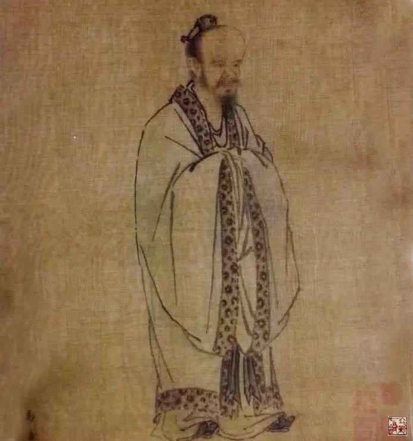
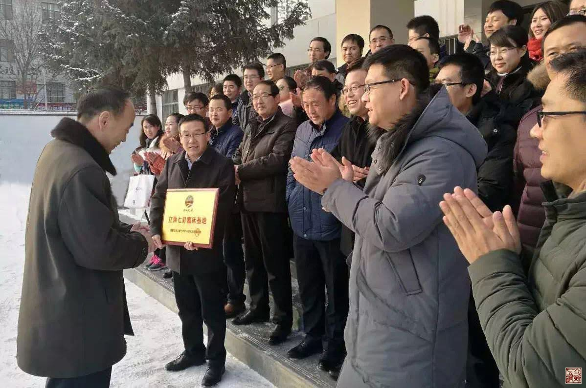
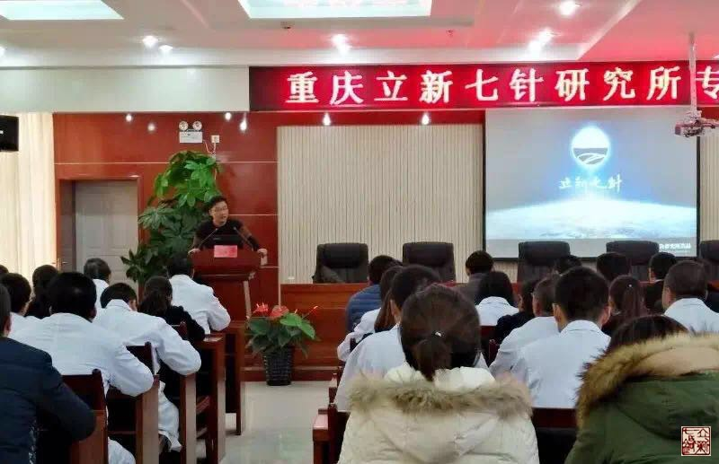

= 立新七针教学特色——理论结合实践
冰台
2017-1-7 20:14

古代中医的传承，主要通过师带徒三年五年，耳濡目染，心口相授的这样一个学习过程，然
后出师，独立行医。在当今时代，过去那种师带徒形式，无论师父还是徒弟，绝大多数人都
无法实现了，最现实的还是通过培训班的形式学习。从学习的真相来说，真传一句话，假传
万卷书，真正明理，也就是捅破窗户纸这么轻松，是否真的需要几个月、几年、甚至十几年
这样一个漫长的学习过程，则是仁者见仁智者见智了，反正我认为是不需要的。

**能否快速的学到老师的医术精义，首先取决于学员是否能够明理，若老师自己也不明理，
只是在个人经验上转悠，那么你即便跟了他十年二十年，最后也只能做个平平庸庸的粗工医。
**其次是传授方式，理论一定要和实践相结合，才能够快速的学会掌握。理论课很容易，坐
在教室里听老师讲，只要老师不保守，只要学生具备一定的领悟能力又心灵手巧，学员很快
就可以上手。但领悟能力有高低快慢之分，动手能力也有强弱之别，所以每个培训班教学下
来，总会有优秀者，也有水平比较差点的学生。也正是因为如此，新学员们最担心的，就是
学不好和学不会，这是摆在所有老师和学生面前最现实的问题。

.南宋马远《孔子像》

**孔子有一句话说“生而知之者，上也；学而知之者，次也；困而学之，又其次也；困而不
学，民斯为下矣。”**我的理解，孔子把人分成了四等，其实是在讲知识改变命运的道理。
有的人天生悟性很强，通过“仰观天文，俯察地理，近取诸身，远取诸物”就可以获得知识，
也就是《黄帝内经》所谓的“法天则地，援物比类”，这可不是一般人能够轻易明白掌握的，
所以凡是能够道法自然的人，就称为上人；而有的人悟性虽不太高,却聪明的懂得通过向别
人学习来获得知识，所以孔子又说“三人行，必有我师焉，择其善者而从之，其不善者而改
之”，这是绝大多数人获得知识的最好方法，向老师或书本学习，称为次人，孔子也认为自
己属于次，说自己是经过学习之后才知道的；还有的人悟性不够也缺乏聪明才智，却不爱学
习，是受工作或生活所迫才不得已去学习，虽然是被迫学的，也能学到一些知识，所以称为
再次；最低级的人，就是本身愚钝笨拙，即使到了穷困潦倒的状态，依旧不肯学习的那种人，
这种人往往是穷困一辈子，窝囊一辈子，因此称为下人。

**学中医最后一定要回归到自然规律上去，才能够解放自己的身心，否则医生终究是令人身
心憔悴终身的工作。**如何回归自然医学？在已经逐渐远离自然的人类社会中，靠自己领悟
来回归自然，无异于天方夜谭，只有通过学习经典的方式来达到。悟性再高，再聪明的人，
也需要学习，所以**韩愈说“人非生而知之者，孰能无惑？”**意思是说每个人都不是生下
来就具备知识的，谁能没有困惑呢。人类的知识是从哪里来的呢？还是来源于自然世界，由
高智慧的人实践总结出来，再形成语言和文字，通过心口相传或书籍传授给其他人类。所以
排除困惑的方法，就在于你爱不爱学习，以及学习的方式如何了。

以学中医这行来讲，悟性确实非常重要，但悟性是先天的，并不见得有多少人具备这种天性。
所以凡是有责任心有志向的人，都会热爱学习，从而通过学习来改变自己的命运。**因此，
类似《黄帝内经》这种古人通过法天则地援物比类合于四时阴阳而总结出来的经书，必然应
该成为我辈非圣贤之人的知识源泉。**

每一个名医，每一个大医，都是从一张白纸开始的，没有人生下来就懂得治病之道，也没有
人生下来就是神医。我们只看到名医们现在的能力和成就，却忽略了名医的当年，他们也是
通过学习摸索积累这样一路走过来的。只要学习，都是从无知和幼稚开始，逐渐变得睿智而
成熟，因此每位医生在成长之初的那个阶段，或多或少都会遇到一些学习瓶颈。

我自己也是从无到有，通过向老师、同行、书本和网络学习，一路摸爬滚打挺过来，最后在
内经医学基础上创建了立新七针针灸疗法。数年来，我已经带教和培养了几百位学生，其中
有佼佼者，也不乏碌碌无为者。在教授学生的过程中，最令我感到困难的有两点。

一是理论课程学习中学生的领悟能力，由于立新七针的学术思想是道法自然，需要学员具备
一定的抽象和逻辑思维能力，才能够融汇贯通掌握，但是在全国人民都读同一本书，都用同
一种思维模式的教育制度下，学生大都欠缺抽象思维能力，逻辑思维能力也很弱，很难让他
们明白怎样法天则地，怎样援物比类，加上很多人阅历见识也少，他们根本无法想象和理解
内经那些自然规律是怎么回事，要扭转他们习以为常的线性思维，来适应法天则地援物比类
的思维方式，需要一个适应过程，再快也快不到哪里去。学生必须全身心而虔诚的投入学习，
至少也需要十天半月才能慢慢习惯。若来学习的人持有疑信参半的态度，这十天半月也只是
相当于坐了一次过山车，回到家里也用不好，要不了多久就只有放弃，再次回到经验医学的
模式。

另一个令我感到困难的，是立新七针培训课的实践过程。立新七针针灸疗法发展到今天，针
具的使用和生产都已合法，理论体系也已经比较完善了，相信只要学员用心学习，理论课程
都可以学得很不错的，但仅仅明理是不够的，除了极少数悟性极强的学生，能够仅通过理论
学习就可以在临床上运用得得心应手，成为一方名医，其余大多数的学生，都会在理论与实
践之间产生卡顿。这部分学员非常迫切的需要一个临床实践的教学过程，能够见证大量患者
的治疗效果，增强他们的信念，对各种症状、各种表现、各种病因、各种诊治理念、各种治
疗手法，见识多了，他们才可以顺利的将理论实践于临床之中，取得优秀的疗效。

怎样将理论与实践结合起来？很简单，多治患者，亲自参与在患者身上治疗，见得多，治得
多，医术提升就快。培训班上同学之间相互扎针练习，学员在自己或亲朋好友身上扎针，这
些虽然能够起到一点帮助，毕竟同学亲朋还是有限的寥寥无几，代替不了众多千奇百怪病痛
的患者，只有临床治疗患者进步才是最快的。但是在谁身上扎针？谁愿意让学徒治疗？相信
这不仅仅只是我一个人的苦恼，也是所有培训课老师的困扰，更是绝大多数学生最关心的问
题。**缺乏实践环节，老师担心学生们学不好，学生担心自己学不会。**

我的担心不是多余的，学中医的人都会存在实践过程的困扰问题。以立新七针为例，立新七
针源自于《黄帝内经》，是对古老的内经医学的整合运用，也是紧紧贴合内经原文原义的一
种解读方式，所以当立新七针将古老的内经医学思想理念展现在世人面前的时候，反而成了
一种新生事物。人类对于新生事物都会经历从害怕、担心、怀疑、观望、认可、到接受这么
一个惯性认知过程，所以现阶段能够勇于接受立新七针针灸疗法的人肯定不会太多，这是学
生实践过程中会遇到的第一个问题。

其次，由于现代医学知识的普及和洗脑，大多数患者都只愿意接受“科学”的正统医疗行为，
且不管疗效和后果如何，只要科学就是对的，这种逻辑认知，对于民间针灸疗法的践行，也
是一个很大的阻力。

第三，相对于现代中医针灸而言，除了思维理念方面的优势，立新七针最直接的优势主要是
表现在顽固性筋痹和骨痹方面的治疗，而在大城市和经济稍微发达一点的地方，这类病痛患
者大多数都被拉去开刀大手术或住院治疗，求诊于民间针灸医生的患者少之又少，往往都是
一些被翻来覆去折腾很久治疗无效的患者出院来求医，这类患者病情复杂，往往也不太适合
初学者诊治。

第四，每一位相信中医的患者，都希望能够接受老师或老中医的亲自治疗，因为患者不了解
学生，无论你有多少临床经验，无论你在家乡名气多大，只要一听说你是学生，都不愿意接
受学生给自己治疗，不希望学生在自己身上练手。包括被众人围观，也是很多患者所反感的，
这是人之常情，将心比心，大家都能理解患者的心情，所以学员希望能够在学习期间亲手操
作或大量的观摩，真的是不太现实的。

我一直希望能够突破教学培训的这些瓶颈，所以在保障疗效和稳定性的前提之下，我努力的
在学术思想上提高认知，尽量把针法针术和诊治理念都往绝对安全的程度去追求，以令初学
者能够放心践行；同时也尽最大努力建设了较大规模的门诊与培训场所，让学生们能够在一
个相对正规和舒适的平台里学习；另外我还尽力争取获得官方对立新七针的支持与认可。我
希望通过这一系列措施，能够提升患者对立新七针的信任度，从而也降低学员临床实践这个
学习过程的门槛。

但是这一切措施终究还是不能完全代替临床践行这个学习过程，所以我继续寻求更好更稳妥
的解决办法，我们虽然无法做到全部学员都像古代中医那样由师父带着学徒在患者身上练习
成长，但是能不能寻求一种更好更合理的方式方法呢？

.图为“立新七针临床基地”在甘肃省庆阳市西峰区卫计局授牌仪式

或许是天意，为了能够让内经医学立新七针针灸疗法回归岐黄故里，令内经医学更好的为广
大病患服务，甘肃省庆阳市西峰区卫计局主动向我们伸出了橄榄枝。2016年12月，重庆巴南
立新七针针灸研究所与甘肃省庆阳市西峰区卫计局签订了“立新七针临床基地”的合作协议，
根据合作协议，立新七针专家组成员将带领学员们，不定期的在庆阳市西峰区众多医疗点举
行密集型义诊活动，此举很妥善的解决了立新七针学员们缺乏临床践行这个环节的尴尬。

2017年1月1日，立新七针讲师团团长穆超和立新七针中医门诊部主任王非两位老师，带领已
经学完第一阶段理论课并且已回到工作岗位临床了两个月的十几位七针学员，前往庆阳“立
新七针临床基地”开展了为期一周的大型义诊活动，在西峰区十余家社区卫生服务中心和中
心医院，仅仅六天时间，就义诊了近三百位患者，绝大多数患者都取得了立竿见影的疗效，
获得广大患者的高度认可，纷纷八方传颂，吸引了络绎不绝的患者前来主动要求扎“七针”。
这样的义诊教学，令立新七针学员们大饱眼福，收获到了前所未有的惊喜和成就感，当地二
十余名立新七针医生的诊疗技术也再次得到提高，此行意义非凡，可谓非常成功。

**在甘肃庆阳建立“立新七针临床基地”的益处，至少有六点：**

. *第一*：甘肃是黄帝、岐伯、皇甫谧的故里，源于内经医学的立新七针针灸疗法在岐黄故
里得以发扬光大，乃众望所归，此举也是对传统中医文化的复兴行为，可以让更多的人了解
和认识到内经医学的伟大。

. *第二*：甘肃，地处西北，广大老百姓很容易罹患筋骨痹证，在这样的经济欠发达地区，
现代医学昂贵的开刀大手术普及得还不是很广泛，所以存在着数量相对多的颈腰椎骨关节顽
疾重症患者，他们正需要立新七针这样的针灸疗法的帮助，推广普及简便易廉的立新七针针
灸疗法，能够充分的解决一部分患者就医难治病难的问题。

. *第三*：通过密集型义诊活动，在快速彻底治愈病痛的同时，也为穷困患者们减轻了经济
负担，切实的解决常见病和多发病对一部分贫困家庭的困扰。

. *第四*：立新七针专家组成员都是临床经验非常丰富的专业医生，经常性组团前往西峰区
各医疗点进行义诊和讲学，对西峰区各医疗点的医生们也是一个很好的学习机会，可以令当
地医疗人员医疗技术得到进一步的提高。

. *第五*：立新七针学员再也不用担心学不好学不会了，通过临床基地大量病患的观摩与实
践，可以令学员们拓宽眼界，增长见识，踏实的掌握立新七针针灸疗法学术精义，迅速成长
为一名能征善战的临床医生。

. *第六*：经常性举办这种官方行为的义诊活动，既可以为广大患者带来福音，也可以为当
地医疗点带来人气，从而推动中医的影响力，还可以获得老百姓对政府的支持和口碑效应。

如此皆大欢喜的计划和活动，利国利民利己，何乐而不为？

