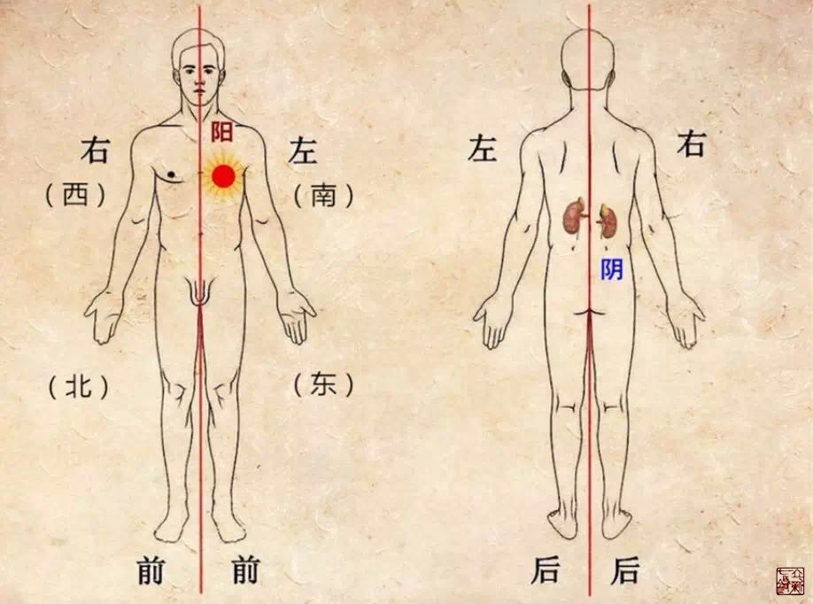

= 天垂象地成形
冰台
2017-1-11 21:26

理解了经脉的循行顺序，我们继续解读经脉的真相。

内经之理，在于万物类象，《素问·五运行大论》说:“天垂象，地成行”，天地之间的规律，
在人身上也会有所表现。人活天地之间，头应天，脚应地，除了睡眠躺卧，站立活动的时候
是头顶天，脚踏地，这也是天地规律。天地不能分开存在，人的头与足也不可能分开存在。
太阳在天，水在地，天气下降，地气上升。人体也遵循着自然界阳气下降，阴气上升这么一
个规律，就需要用“经”来沟通连接天地（头足）之间的能量，所以当人双手上举的时候，
阳经是从上往下行的，阴经是从下往上而行，这就形成了经脉的循行规律。

**《道德经》曰:“道生一，一生二，二生三，三生万物。”这句话，看似难以理解，也有
很多种解释，其实，这句话暗藏的是阴阳之理。我们在一个人身上来看怎么理解二和三的存
在:人立于天地之间，人是一个整体（一），但是分为前后、左右、内外，这就是阴阳的分
布。如果把身体左右对称分开（二），就有左侧的前、后、左（三）三部分，和右侧的前、
后、右三部分。这三部分循环很好的才是有生命有思想的正常人，这样的人是有创造力的，
所以才能够三生万物。**

而左侧和右侧又都由表（阳）和里（阴）两部分组成，所以就形成了左右各阴阳六部分，示
意图如下:

**这六部分，就可以看做连接天地的“经”，以此来类象自然界“天气下降，地气上升”的
过程。《灵枢·九针论》说:“六者，律也。律者，调阴阳四时而合十二经脉。”律是什么呢？
律是法则、约束。调，《说文》解释是和，调和之意。《九针论》的这句话已经说得很清楚，
六经就是用来规范四时阴阳的。古人是把人体和天地自然看成一个整体，以“少阳、太阳、
阳明、少阴、太阴、厥阴”为“经”，对人体和天地自然进行对比研究，于是就有了手足六
经的分布。**

经脉的基本概念就是这样来划分的，手有六经，足有六经，合起来就是十二经。但这些经，
并不是线条，纯线条有什么意义呢？经所代表的是一个空间，十二经脉是用于划分气血在身
体不同部位的循行范围。古人只是采用了一种抽象思维，在看待人体自然规律。气血并没有
被分为十二份，只是有十二个循行范围而已。人体也并没有真正被分为十二份，人还是一个
完整的人。

有的人可能还是不明白，有很多人确实不善于抽象思维，只要看不到实物，让他用脑子构想，
打死他也想不出来。为了再具体形象化来说明六经的意思，我这里再用一个苹果作为道具，
来比喻讲解。当然了，用苹果只是一个寓意，假设苹果就是一个人，因为苹果可以划开讲解，
我们不能也没必要拿人来划开讲解。如果你这时候开始纠结“苹果就是苹果，苹果怎可代替
人呢？”那你就别学内经，内经不适合你的思维模式。

我们看到，一个苹果就是一个苹果，通常人们不可能把它看做两个或六个，因为它就是一个
呀，是一个整体。但我们可以在脑子里抽象一下，想象着把苹果分成两瓣，这就是思维上的
不同理解方式了（图1、图2）。

两瓣又分别可以划开成三瓣，每一瓣都有内外之分，然后，我们再把苹果合起来，这时候还
是一个苹果，但这个苹果已经有了六部分，每一部分都有内外阴阳之分，所以就有了六阴六
阳（图3）。如果我们此时再把这个苹果横切，那就更直观了（图4）。

为了让专业医务人员能更明白，我特意找了一张现代医学的解剖图片，这是一张人体腰椎部
的横切断面图，我在上面按照《灵枢·经脉篇》所描述的经脉循行路线，以足六经为例，把
人体三阴三阳六经分布画了出来。通过现代解剖学，我们可以看到人体的脊椎，位于身体的
中央，为人体的中轴，而围绕着脊椎的骨骼肌肉器官等组织，就把人组成了一个整体。这也
就是很多人特别是西医们无法理解的问题，人是一个整体，但也是分为前、后、左、右、内、
外的，有部位不同，有内外不同。
 
