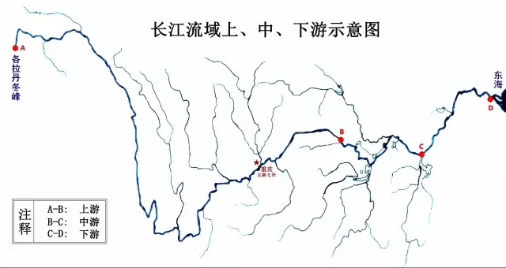
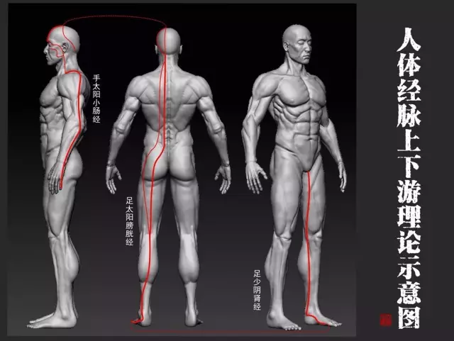
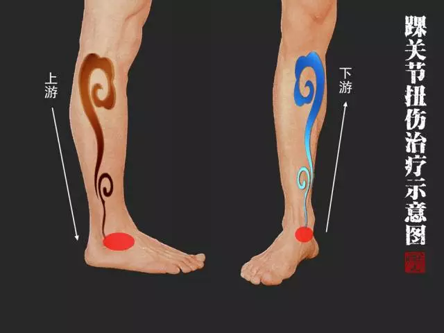

= 经脉“上下游理论”的运用
陈立新
2017-02-25

经脉“上下游理论”是我在研究《黄帝内经》过程中的一个收获，也是立新七针针灸疗法学
术体系的组成部分之一。

所谓“上下游”，源于内经将十二经脉比喻为十二经水的启发，《灵枢·经水》说：“**经
脉十二者，外合于十二经水，而内属于五脏六腑。夫十二经水者，其有大小、深浅、广狭、
远近各不同，五脏六腑之高下、小大，受谷之多少亦不等。**”十二经水，是中国古代的十
二条大河流，即：清水、渭水、海水、湖水、汝水、渑水、淮水、江水、河水、济水、漯水、
漳水。这些江河名是古代名称，有的现今仍在，有的已经模糊不明。这十二条河流分布全国
各地，其地貌、形态、气候、环境、水质、颜色等各不相同，具备自己特有的一些规律。内
经所谓“外合于十二经水”和“内属于五脏六腑”，意思是将十二经脉外与十二条大河相对
应，在内则与脏腑相对应，这是内经医学最常用的一种“援物比类”方法。

《灵枢·经水》说：“**足太阳外合清水，内属膀胱，而通水道焉。足少阳外合于渭水，内
属于胆。足阳明外合于海水，内属于胃。足太阴外合于湖水，内属于脾。足少阴外合于汝水，
内属于肾。足厥阴外合于渑水，内属于肝。手太阳外合于淮水，内属小肠，而水道出焉。手
少阳外合于漯水，内属于三焦。手阳明外合于江水，内属于大肠。手太阴外合于河水，内属
于肺。手少阴外合于济水，内属于心。手心主外合于漳水，内属于心包。凡此五脏六腑十二
经水者，外有源泉而内有所禀，此皆内外相贯，如环无端，人经亦然。**”中国的地理地势
是西北高东南低，所以大自然的河流从发源地开始，就是一路融入东南方向，最后流进大海，
也就是渤海、黄海、东海、南海这“四海”，因此在内经医学里人体也有“四海”之说。河
流在流向大海的沿途，总是外有山溪小河水的流入，内有地下暗河水的补充，因此不但永不
枯竭，还会越来越多，而且这个过程中还有天气下降、地气上升的过程，于是就形成了一个
永不停止的规律性循环。古人通过研究，认识到人体经脉的规律与某些河流的规律有类似的
地方，就清晰地将十二经脉与具有类似规律的河流各自对应起来。上古时期的古人没有小白
鼠实验室，也没有科研仪器设备，更没有专家教授和导师指路，他们只有一双眼睛和一颗大
脑，所以就“**仰则观象于天，俯则观法于地，观鸟兽之文与地之宜，近取诸身，远取诸物
**”。大自然就是古人的实验室，大自然就是古人的老师，古人是将人与自然相提并论，在
自然规律中去寻找人体生命的规律。单就这一点而言，古人的思维和智慧就是至简至上，也
是精妙绝伦的。通过援物比类所总结出来的那些理论，远比现代人坐在实验室里观察和试验
小白鼠得来的那些数据要自然和实用得多。自然规律早已经过上亿年的验证，根本无需质疑
和试验，直接拿来一用就有效，百试百灵。

有很多人都认为学医是不可能速成的，他们的理由是医学院校的学生经过数年的辛苦学习，
学出来尚且不能顺利治病，民间培训又怎可能短短十天半月就能学会医术？其实这是一种片
面的思维。要知道，真相是不可能复杂的，大家都知道“真传一句话假传万卷书”的道理，
既是真传又怎可能还需要数年十数年的学习摸索？我说的速成是指明理，明理是有捷径可走
的，也值得我们去走捷径。须知人生苦短，倘若世间所有道理都要靠自己通过读书或苦思冥
想来弄明白，根本就不现实。当然了，道理虽然通了，真正要成为一位名医，还需要具备若
干条件，比如天时、地利、平台、人脉、修养、教养、品德等等，这些也是名医成功的关键
因素，只不过这一切都要以明理为前提，否则不可能长久。事实上，学医最重要的就是学者
的悟性与思维方式，如果是属于“榆木疙瘩”类型的人，得真传也不可能速成，因为他根本
就无法理解和领会师父所说所做的一切，这样的人别说数年，就算终其一生学医，也只能庸
碌无为。

明理很重要，不明而为即是错。虽然《黄帝内经》距今已经两千多年，但内经是中国医学的
始源文化，我们应该也必须将始源文化弘扬光大，这是作为炎黄子孙的责任和义务。可是今
人与古人，在文化、意识、习性、语言等很多方面都有了很大的变化，两千多年后的今天，
我们难以明白两千多年前古人的思想，也是正常的。但并非不可能明白，因为这片神奇的土
地上，时空万变，但规律一直不变，所以我们今天要想读懂古人的思想，首先我们的思维方
式必须与古人同频，其次不能把自己关在校园或家里死记硬背古书，一定要融入自然社会和
生活当中去，切身感受自然规律与现象，才能够比较容易的理解古人所思所想。

我本人是在长江边长大的，小时候经常和小伙伴们在长江边玩耍，在离家不远处的山泉小溪
里捉鱼、戏水。小溪边上有一口永远取之不竭的老水井，是人们生活饮水的来源。长江水一
年四季会发生水量的变化，以及颜色的改变，如夏季洪水，水质浑浊，冬季枯水，水质清澈；
还有山谷小溪，平时是涓涓细流，遇到暴雨之后溪流会形成瀑布；小河也会因春夏秋冬季节
的不同，发生水量多少的变化…...这些自然现象与规律，在我很小的时候就已经司空见惯。
所以当我四十多岁开始解读《黄帝内经》，在读到“**经脉十二者，外合于十二经水，而内
属于五脏六腑，夫十二经水者，其有大小、深浅、广狭、远近各不同，五脏六腑之高下、小
大，受谷之多少亦不等，相应奈何**”这一段文字的时候，我脑子里立刻联想起小时候所观
察到古井、山泉、溪流、小河、长江……我熟悉它们的规律和现象。古人把经脉与经水相合，
江河有哪些规律和变化，我比较明白，那么经脉又有什么规律与变化呢？我只需以此类推也
就比较容易明白了。所以从自然的角度，我们就不难理解古人所说的经脉到底是怎么回事了。

或许是因为我比较善于抽象思维，也善于援物比类的观察总结，加上也积累了相对丰富的生
活和社会阅历，所以在解读《黄帝内经》的过程中，我时常能够清晰地理解古人的意思，这
也是我能够将内经九针加以整合运用并创建立新七针针灸疗法的主要原因。这些年我曾将立
新七针学术思想写了大量文章放在网上，也曾在国内多个城市做过近四十场学术讲座，加上
部分立新七针学员也将所学到的一些理论散发出去，所以实际上是有很多的医学同行与中医
爱好者受益，当然最后的受益者肯定就是广大患者了，因此我认为立新七针所作所为是一项
功德无量的事业。常有素不相识的网友通过QQ、微信、短信、电话等方式向我致谢，说立新
七针思想令他们受益匪浅，其中提到最多的就是感恩我提出的“经脉上下游理论”。

经脉上下游理论，受到《灵枢·周痹》这段文字的启发：“**痛从上下者，先刺其下以过之，
后刺其上以脱之；痛从下上者，先刺其上以过之，后刺其下以脱之。**”读罢这段文字，我
就很自然地联想到重庆夏季洪水季节，每当山洪暴发的时候，河流长江的水就会暴涨，而到
了冬季枯水季节的时候，山溪小河会干涸，长江水位也会远远低于平时，由此我想到了上下
游关系：当上游水势太猛或下游排泄不及的时候，中游水量就会明显增多，而当上游水源变
弱或下游需求太大的时候，中游的水量就会明显减少。

既然内经将经脉比喻为经水，那么经脉的循行是不是也会有河流类似的上下游关系呢？带着
这个疑问，我做了大量的试验和研究。总结发现，多数情况下，人体经脉循行都是与河流的
上下游规律相应的，但也有少数情况似乎并不符合上下游规律。这曾令我一度对内经所言自
然规律与人体规律相应的学说产生怀疑，继而我又做了进一步更深入的研究，最后还是确定
这个规律是通用的自然规律。之所以有少数患者身上运用这个规律无效或效果差，还是由于
医者的认知不够。上下游理论是活的，人体气血津液等的循行和濡养，涉及经脉、经络、经
筋、脏腑、四肢百骸等等各方面和多个层次，是一个全方位、多系统、多层次的立体结构，
所以真正要用好这个“经脉上下游”理论，必须把经脉、络脉、经筋、脏器等各系统以及相
互之间的关系等等都要弄清楚，才能明白上游亦下游，下游亦上游，上游非上游，下游非下
游，上游中游下游之中还有上中下游……这样一来似乎就非常复杂了，不善于抽象思维的人
立马就懵圈，善于抽象思维的人脑子里就会展现一个立体的画面，来龙去脉就一清二楚。所
以只要捅破了那层窗户纸，也就没有那些困惑了。然而要全面的讲解，那真的不是几句话或
一两篇文字能表达清楚的。所以在这里，我仅就经脉在横向循行方面的一些规律，做一些简
介。若是有心人，详细读明白本文之后，无论你是不是医生，都可以信手拈来，轻易地解决
很多以往看似需要“专业医生”才能解决的常见伤痛。

为了让读者能够更加清楚地明白这一原理，我画了两张示意图，一张是长江流域的上中下游
示意图，一张是人体十二经脉的手太阳小肠经（上游）、足太阳膀胱经（中游）、足少阴肾
经（下游），通过这两张图的对比，相信您对经脉上下游理论就会一目了然。今天我所讲的
这一层理论，虽然只是立新七针针灸疗法里最简单也是最基本的一点理论，但我相信已经足
够多数读者享用了。

具体怎么运用呢？我以最常见的踝扭伤为例来说明。很多人走路一不小心就把踝关节扭了，
伤了之后通常会有三种表现状态：一种是扭一下，有点痛，但甩两下脚腕，活动活动，休息
一会儿，很快就自愈了；一种是扭一下，立马就疼得走不了路，越活动越痛，持续的疼痛，
休息也不能自愈，但扭伤局部没有肿胀；还有一种是扭了一下，很痛，局部很快就肿胀起来，
而且越活动越肿，持续的肿痛着。第一种情况这里就不说了，至于踝关节为什么会扭伤，总
是有原因的，那是题外话，这里只说第二种和第三种情况的治疗。

先申明一下，立新七针虽然是穴位针刺疗法，但针具只是运用工具而已，我之所以首选针术，
是因为针术最简单、最便捷、最轻松、也最速效，而七针是一套可以随心所欲的组合工具，
所以成了我的最爱。读者们不必多虑，不要以为没有针不会用针就治不了病，你一定要明白，
如前所说，明理才是最重要的，只要明理，工具可以是针，可以是灸，也可以是药，也可以
是按摩，还可以是膏药等等等，方法不一而足，明理了就可以随心所欲，随遇而安。

继续讲踝关节扭伤，无论是只疼不肿还是又肿又痛，伤处又分为内踝扭伤和外踝扭伤以及内
外踝都伤三种情况，通常医生在治疗的时候有很多方法，诸如热敷、冰镇、针灸、按摩、拔
罐、外敷膏药等等，这些治疗方法有的需要专用工具，有的需要专业知识，有的需要药物，
都不是至简的方法，在这里，我是教读者用人人都可以掌握的简单手法，来快捷地自救踝关
节扭伤。

对于专业医生而言，这个道理明白了，你就可以变化发挥，灵活运用，既可以用于治疗扭挫
伤，也可以用于治疗颈腰椎病，还可以用于治疗脏腑杂症，如果用于皮肤病烧烫伤等等，效
果也是极好。当然了，那就需要掌握更多的内经医学知识。

在这里，为了便于读者能够更清晰地理解和运用这一方法，我制作了一张示意图：外踝和内
踝红色圆圈处，为扭伤局部，我们把它当做中游；外踝以上，也就是图上棕色祥云所在区域
为上游；内踝向上，也就是蓝色祥云所在部位是下游。

首先讲只疼不肿的踝关节扭伤，无论内踝疼还是外踝疼，或者是内外踝都疼痛，一定不要在
局部按摩。办法就在上游，即小腿外侧，棕色祥云区域进行治疗。最简单的办法就是用手掌
推，从膝关节外侧处开始，朝外踝方向，自上往下推，力度不要太小，但也不能太大，推动
过程不要推到肌肉，只需在皮肤上轻轻带动皮肤，推动皮肤即可。推的速度一定要慢，需要
注意的是方向一定不要反了，千万不要一上一下来回推，更不要搓揉，只需自膝关节外侧处
自上往下，一个方向慢慢往下推，推到外踝关节上方处即可，然后返回再从膝关节外侧处往
下推，就这样重复的推个十几下。然后，再在下游，即蓝色祥云处，从内踝关节处开始，朝
膝关节内侧方向，自下往上慢慢推，也推十几下。然后，你起身走走试试，就知道效果了。

如果是扭伤之后踝关节产生了肿胀疼痛，无论内踝还是外踝，或者是内外踝都肿了，也请千
万记住，不要在局部按摩，那只会让你更加肿得走不了路。办法就在下游，即小腿内侧蓝色
祥云区域，进行治疗。最简单的办法还是用手掌推，从内踝关节上方一点，从没有肿胀的地
方开始，朝膝关节内侧方向，自下往上刮推，速度要慢，力度也不要太大，不能推动肌肉，
只需轻轻带动皮肤，推动皮肤和肌肉之间这一层即可。需要注意的是方向一定不要反了，千
万不要一上一下的来回推，更不要在肌肉皮肤上大力的搓揉，只需自内踝关节上方处，往上
慢慢地推，推到膝关节内侧处即可，然后返回，再从内踝关节上一点慢慢地往上推。就这样
重复地推个二三十下，你就会眼见刚才还肿胀如拳的踝关节，已经变小了很多。然后，再在
上游，也就是棕色祥云处，如前一样，从膝关节外侧处开始，朝外踝方向，自上往下推，反
复地推，推十几下即可，然后你起身走走，就知道效果了。

只要你真正掌握了这方法，分分钟可以成为令人惊羡的“医生”，真相就是这样，一定是大
道至简的，任何人明白了道理，都可以做出疗效来，这就是内经医学的迷人之处。
