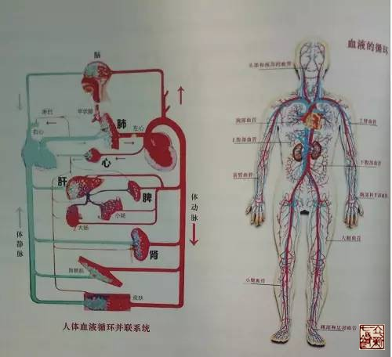
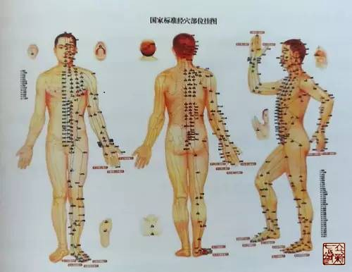
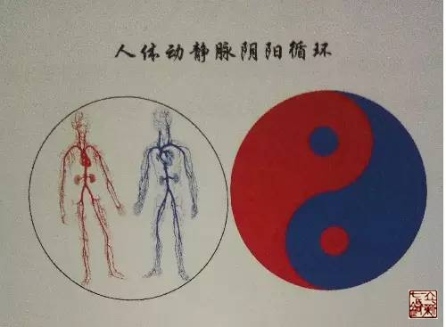

= 经脉——营气经脉
冰台
2017-3-1 15:40

经脉的框架有了，那么，经脉的功能和循行是怎样的呢？否则我们对经脉还是稀里糊涂的。
《灵枢·经脉》曰：“人始生，先成精，精成而脑髓生，骨为干，脉为营，筋为刚，肉为墙，
皮肤坚而毛发长，谷入于胃，脉道以通，血气乃行。”《灵枢·营气》曰：“行于经隧，常
营无已，终而复始，是谓天地之纪。”人来到这个世上，先天具备的主要有三大循环系统，
即呼吸系统、消化系统、血液循环系统。脉为营的意思，就是指经隧（血管）里的血液循环
系统，人体从出生开始就有的。

《灵枢·经脉》曰：”经脉十二者，伏行分肉之间，深而不见，其常见者，足太阴过于外踝
之上，无所隐故也，诸脉之浮而常见者，皆络脉也……常不可见也，其虚实也，以气口知
之。”经脉是分布在分肉之间的，没有显现在外，显现在外的是足外踝这些肉少的部位以及
皮肤上的络脉，这其实已经讲明了经脉是血管。气口就是指手腕桡侧处的动脉，中医通过探
知脉搏的强弱来分析气血的虚实，此说也证明经脉是血管。

《灵枢·营卫生会》曰：“营在脉中，卫在脉外，营周不休。”《素问·痹论》曰：“营者，
水谷之精气也，和调于五脏，洒陈于六腑，乃能入于脉也，故循脉上下，贯五脏，络六腑
也。”内经这些章节都指出营在脉里面，而且不停的循环。

营是什么意思？营的字义有循环、往复、建造、买卖、供养等等多种含义，可以理解为互通
有无的自然社会活动现象。《灵枢·经脉》曰：“谷入于胃，脉道以通，血气乃行”；再看
《灵枢·邪客》说：“营气者，泌其津液，注之于脉，化以为血，以荣四末，内注五脏六腑”；
《灵枢·营卫生会》说：“中焦亦并胃中，出上焦之后，此所受气者，泌糟粕，蒸津液，化
其精微，上注于肺脉，乃化而为血，以奉生身，莫贵于此，故独得行于经隧，命曰营气”。
这两段文字很清晰的指出：营气化为血，存在于脉里面。而且是“以荣四末，内注五脏六
腑”，从其功能来看，营脉应该是人体的血液循环系统。

我们再看《灵枢·营气》描述的营气循行：“故气从太阴出注手阳明，上行注足阳明，下行
至跗上，注大指间，与太阴合，上行抵髀。从脾注心中，循手少阴，出腋下臂，注小指，合
手太阳，上行乘腋，出䪼内，注目内眦，上巅下项，合足太阳，循脊，下尻，下行注小指之
端，循足心，注足少阴，上行注肾，从肾注心，外散于胸中。循心主脉，出腋下臂，出两筋
之间，入掌中，出中指之端，还注小指次指之端，合手少阳，上行注膻中，散于三焦，从三
焦注胆，出胁，注足少阳，下行至跗上，复从跗注大指间，合足厥阴，上行至肝，从肝上注
肺，上循喉咙，入頏颡之窍，究于畜门。其支别者，上额，循巅，下项中，循脊，入骶，是
督脉也，络阴器，上过毛中，入脐中，上循腹里，入缺盆，下注肺中，复出太阴。”
 
这个循行路线很熟悉对吧？营气的循行路线，是不是跟我们现在所常见的“国际经络路线”
一样的？现在我们才明白，多少年来，我们学到的中医针灸理论的经脉，原来是营气的经脉，
也就是血液循环系统。
 

《灵枢·经脉》曰：“经脉十二者，伏行分肉之间，深而不见；其常见者，足太阴过于外踝
之上，无所隐故也。诸脉之浮而常见者，皆络脉也。”《灵枢·营卫生会》曰：“人受气于
谷，谷入于胃，以传与肺，五脏六腑，皆以受气，其清者为营，浊者为卫，营在脉中，卫在
脉外，营周不休，五十度而复大会，阴阳相贯，如环无端。”这两段话里明确指出，十二经
脉是存在于分肉之间的。而且脉还有内外之分，脉内的是营气，脉外的是卫气。也就是说，
营气和卫气，都在“分肉之间”伏行着。

什么是卫气呢？

《灵枢·本藏》曰：“人之血气精神者，所以奉生而周于性命者也；经脉者，所以行血气而
营阴阳，濡筋骨，利关节者也；卫气者，所以温分肉，充皮肤，肥腠理，司开阖者也；志意
者，所以御精神，收魂魄，适寒温，和喜怒者也。是故血和则经脉流行，营复阴阳，筋骨劲
强，关节清利矣；卫气和则分肉解利，皮肤调柔，腠理致密矣；志意和则精神专直，魂魄不
散，悔怒不起，五脏不受邪矣；寒温和则六腑化谷，风痹不作，经脉通利，肢节得安矣，此
人之常平也。”
 
《灵枢·邪客》曰：“五谷入于胃也，其糟粕津液宗气，分为三隧。故宗气积于胸中，出于
喉咙，以贯心脉，而行呼吸焉。营气者，泌其津液，注之于脉，化以为血，以荣四末，内注
五脏六腑，以应刻数焉。卫气者，出其悍气之慓疾，而先行于四末分肉皮肤之间，而不休者
也，昼日行于阳，夜行于阴，常从足少阴之分间，行五脏六腑。”
 
从这两段话可以看出，营气卫气宗气同出于胃，而各有功用，经脉是指营气（血液循环系
统），营气的功能主要是濡养筋骨、滑利关节，保障四肢末端血液循环的。相比之下，卫气
的作用更重要，不但要温煦脏腑，充实肌肤，掌管功能运动，还要防御外邪入侵。
 
《素问·五藏生成》曰：“人有大谷十二分，小溪三百五十四名，少十二俞，此皆卫气所留
止，邪气之所客也，针石缘而去之。”

《灵枢·口问》曰:“卫气稽留，经脉虚空，血气不次，乃失其常。”
 
读通内经，就会明白，身体失常，虽然跟营血也有一些关系，其实主要还需调理卫气。《素
问·逆调论》曰：“营气虚则不仁，卫气虚则不用，营卫俱虚，则不仁且不用。”
