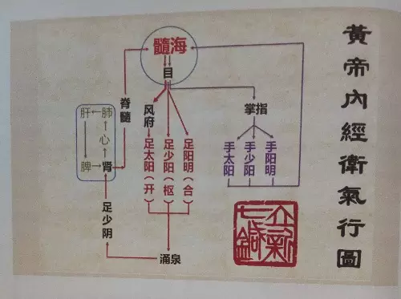

= 经脉——卫气经脉
冰台
2017-03-08

导读：中医“经脉”里的脉，其实包括了营卫之气。中医的经脉，包含了血液循环系统和十
二经脉循行系统，由“营气经脉”和“卫气经脉”组成，这两者都是阴阳相合，如环无端的。

说卫气经脉其实有点不妥，应该是卫气行才对，卫气全身无处不在，但主要的部分还是循行
在十二经脉路线上的，所以也可以当成经脉来看待。

《灵枢·邪客》说:“地有十二经水，人有十二经脉，地有泉脉，人有卫气。”这里是用了取
类比象的方法，用泉脉比喻卫气所出之处。前面我们在中国地图上用十二地支去对应，可知
长江黄河之水皆出于酉（足少阴肾），而《灵枢·根结》也说:“少阴根于涌泉”，涌泉正是
肾经的井穴，所出为井，以此推理可知，人体卫气出于肾。《灵枢·营卫生会》说:“营出中
焦，卫出下焦”，也指出卫气是出于下焦。

卫气运行规律是怎样的呢？难道也是跟营气一样从手太阴开始？这也曾经是我的一个困惑所
在，正是因为老师们和教科书都把营气循行路线当成了“处百病，调虚实”的十二经脉，所
以自然而然的都把手太阴当成了十二经脉的循行起始点。

当我明白了卫气才是九针治病的核心时，才突然发现以前传统的那个认知是有问题的，《灵
枢·营卫生会》说:“营在脉中，卫在脉外……故太阴主内，太阳主外”，营行于脉内，营属
阴，营气的运行是从手太阴肺经开始，所以叫“太阴主内”。卫气行于脉外，与营气相对而
言，卫气属阳，太阳主外，太阳指足太阳膀胱经，意思是说卫气的运行是从足太阳膀胱经开
始的。

《灵枢·卫气行》这样描述卫气的循行路线:“是故平旦阴尽，阳气出于目，目张则气上行于
头，循项下足太阳，循背下至小趾之端。其散者，别于目锐眦，下手太阳，下至手小指之端
外侧。其散者，别于目锐眦，下足少阳，注小趾次趾之间。以上循手少阳之分，下至小指次
指之间。别者以上至耳前，合于颔脉，注足阳明，以下行至跗上，入五趾之间。其散者，从
耳下下手阳明，入大指之间，入掌中。其至于足也，入足心，出内踝下行阴分，复合于目，
故为一周…… 阳尽于阴，阴受气矣。其始入于阴，常从足少阴注于肾，肾注于心，心注于
肺，肺注于肝，肝注于脾，脾复注于肾为一周。”天亮阴尽之时，阳气（卫气）出于目，目
张则气上行于头，循项下足太阳……循行一周之后又复合于目。天黑阳尽之时，（卫气）从
足少阴入注于肾……循行一周之后复注于肾。如上所述可以看出，卫气之行，无论昼夜起始
和终了，都与足少阴和足太阳密切相关。

从卫气篇和根结篇来看，四肢末端部位是卫气经脉的“根本”。头、面、胸、背位置则为经
脉的“标结”，标结也就是经脉归结之所。

足太阳的标结于命门，命门者，目也。

目有多重要？内经能把它叫做命门，那就不是简单的认知了。我们都知道，所有正常人都是
两只眼，《灵枢·邪客》里，黄帝请教伯高如何将人体肢节与天地相应，伯高说“天有日月，
人有双目”。太阳和月亮都是圆的，人的两眼也是圆的。天上因为有太阳和月亮，所以地球
上才有了光明。人因为有两只眼，所以才能看得见事物。从汉字的分解来看，日和月合起来
是明，人如果失去眼睛，就失明了。伯高把眼睛与日月的地位相对等来看待，可见内经对眼
睛的重视程度。天地之间日月的重要性我就不多说了，我只说一个大家都知道的自然规律：
太阳一出万物生长。大家立刻就能明白，为什么卫气的运行应该从足太阳膀胱经开始。

《灵枢·邪气脏腑病形》说：“诸阳之会，皆在于面。”又说：“十二经脉，三百六十五络，
其血气皆上于面而走空窍，其精阳气上走于目而为精。”血气皆上走面部，精阳气上走入于
目，两目之间是山根，面部环绕山根的地方，有六阳经在此分布，所以目这个地方，正是关
于卫气循行的总控之所。

我们再来看看《灵枢·营卫生会》对营卫之气所出的讲述：“营出中焦，卫出下焦。” “黄
帝曰：愿闻中焦之所出。岐伯答曰：中焦亦并胃中，此所受气者，泌糟粕，蒸津液，化其精
微，上注于肺脉乃化而为血，以奉生身，莫贵于此，故独得行于经隧，命曰营气。” “黄
帝曰：愿闻下焦之所出。岐伯答曰：下焦者，别回肠，注于膀胱，而渗入焉；故水谷者，常
并居于胃中，成糟粕，而俱下于大肠而成下焦，渗而俱下。济泌别汁，循下焦而渗入膀胱
焉。”卫气出于下焦，注于膀胱，也是说卫气的运行是从足太阳膀胱经开始的。

根据卫气行的描述，我画了这张卫气循行示意图：

从自然规律的角度去看问题，我们就能理解中医为什么说“气为血之帅，血为气之母”，因
为“气行则血行”，水气补充到哪里水就流到哪里，这是一种自然规律。在自然界里，水很
重要，但水的蒸发与下潜这一过程也很重要，否则水就成了死水一潭，自然界要有生气，这
二者都缺一不可。

现在我们就明白了，其实《黄帝内经》早已充分的揭示了现代医学不足的原因，西医从血液
循环（营）着手能取得一些疗效，而现代中医针灸从经脉循行（卫）着手也能治愈一些疾病，
中西医都是科学的，但皆存在许多不足。

为什么内经里讲古代针灸医术那么高超？因为在古人的眼里，经脉是包含了血液循环和经脉
循行这么两个方面的，缺一就不足。恰恰西医们对经脉循行系统一无所知，而中医通常会忽
视血液循环系统，可是很多中医所重视的经脉系统，早已经被他们误读和误解，其实所着手
的经脉，大多也是西医的血液循环系统，所以就出现了很多的中医西化局面，认为中西医理
论在大多数情况下是相通的。

《灵枢·禁服》曰:“凡刺之理，经脉为始，营其所行，知其度量，内刺五脏，外刺六腑，审
察卫气，为百病母，调其虚实，虚实乃止，泻其血络，血尽不殆矣。”这一段话，是黄帝要
求雷公斋戒三日，并且歃血为盟的前提之下，慎之又慎之，才告诉雷公的，可见其重要程度
是不会轻易示人的，那么黄帝这段话里一定有非常重要的内容，我们看到“审察卫气，为百
病母”这八个字赫然在目，其实就是告诉我们，“卫气经脉”才是治疗百病的核心。

《素问·痹论》说:“卫者，水谷之悍气也，其气慓疾滑利，不能入于脉也，故循皮肤之中，
分肉之间，熏于肓膜，散于胸腹。”慓是剽悍、强健之意。疾是快、迅速之意。自然界里，
水气比水的分散速度要快，散布范围也要广，营气主要受血管约束而循行，卫气则在脉管的
外面，所以卫气相比营气的范围相对要大很多，而且更强悍、迅速，善于游走串透之性。

《素问·痹论》说:“卫者，水谷之悍气也，其气慓疾滑利，不能入于脉也，故循皮肤之中，
分肉之间，熏于肓膜，散于胸腹，逆其气则病，从其气则愈。”这里也说明卫气行于脉外，
是“散于胸腹”，不像营气那样有局限的活动范围（血管内）。卫气是循于四肢远端，散于
肌肉皮肤之间，散于胸腹，散于脏腑，也就是说，卫气散布于全身，是一个立体的结构，无
处不有，对全身各处都起到温煦的作用。

“逆其气则病，从其气则愈”，卫气不能逆行或受阻，否则就会生病，生病之后要把卫气循
行调顺就好了。《素问·五脏生成》说:“人有大谷十二分，小溪三百五十四名，少十二俞，
此皆卫气之留止，邪气之所客也，针石缘而去之。”这里的大谷和小溪就是指人体的经脉和
穴位，是卫气散布循行的地方，卫气不足的地方就成为邪气的存留之地，就需要用九针或砭
石之类寻找病灶以消除症状。工欲善其事必先利其器，有上医治国的思想理念做指挥，加上
设计制作精良的工具在手，何愁不能长久地解决问题？

image::img/20170308-02.jpg[]

前面我讲过，河里没水也就无所谓成河，只是一条山谷而已。河流的水很多，但它离不开空
气的能量，如果没有空气，水的流动就会受到严重凝滞。如果河水没有上升到天和下降落地
这么一个循环过程，河流流着流着就失去了能量的补充，就归于寂静，成为死水。同理，人
体的血液虽然很好的存在着，但如果卫气循行系统出了问题，血液循环系统也会受到影响，
就会导致生病或死亡。从这个角度去理解生命，我们就知道，营卫二气都很重要，也就是血
液循环系统和卫气循行系统都要保障正常，这个人身体才会比较正常。

营气所在的血液循环系统如果出现问题，我们很难直接在血管上面做好文章。无论动脉血管
还是静脉血管，都是不适合直接用九针去“处百病，调虚实”。一方面在血管上做文章容易
产生伤害与危险，另一方面在血管上做文章是治标不治本，疗效并不会好。就如同自然界里
发生干旱或洪涝灾害，我们去直接面对干旱洪涝虽然也可以取得一些成就，但是很难得到长
久的改善，毕竟疏堵改道填补输送等等都不是解决问题的根本方法，唯有改善自然大环境，
令风调雨顺，才是一劳永逸的办法。

内经讲“未有逆而能治之也，夫惟顺而已矣”，顺就是顺从自然规律，顺从志意的前提下进
行调理。我国远在上古的时候就有大禹治水的神话传说，四川成都平原，在古代是一个水旱
灾害十分严重的地方，每当岷江洪水泛滥，成都就是一片汪洋，一遇旱灾，又是赤地千里，
颗粒无收。战国时期李冰以不破坏自然资源，充分利用自然资源为人类服务为前提，变害为
利，使人、地、水三者高度协合统一，创建了都江堰水利工程。至今已经两千多年过去了，
都江堰还一直发挥着防洪灌溉的作用，使成都平原成为水旱从人、沃野千里的天府之国。

常人通常是被眼睛所看到的事物现象而指挥行为，有智慧的人就懂得观察思考，寻求事物表
象背后的真相。在治理自然灾害的时候，只有通过平衡强弱、合理疏导、森林植被等等方法，
去改善大气的斡旋，从而间接的解决干旱或洪涝等灾害问题，这才是一劳永逸的方法。顺是
思想理念，工具就是方法手段了，九针就相当于人们在治理自然环境中需要使用的工具。

同理，我们通过用针术去调经络卫气的逆顺与虚实，就可以很大程度上改善营气血液循环系
统，达到治病养生的目的。这才应了《灵枢·九针十二原》开篇黄帝所说那句话:“欲以微针
通其经脉，调其血气，荣其逆顺出入之会。”只有明白了卫气经脉的输布范围和功能作用，
才能够真正明白九针在医学上的重要地位，否则九针确实拿来没什么作用，也就是只有被淘
汰或失传。
