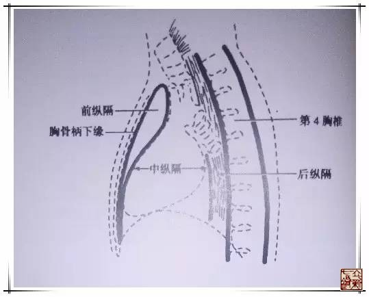

= 经脉——五输穴
冰台
2017-04-05

谈到根本的问题，就要涉及到原穴与五输穴的研究了。

《灵枢·九针十二原》曰：“五脏五腧，五五二十五腧，六腑六腧，六六三十六腧，经脉十
二，络脉十五，凡二十七气，以上下。所出为井，所溜为荥，所注为输，所行为经，所入为
合，二十七气所行，皆五腧也。”又说“五脏有六腑，六腑有十二原，十二原出于四关，四
关主治五脏。五脏有疾，当取之十二原。”《灵枢经》一开篇就很清晰的告诉我们，脏腑有
病主治五脏六腑十二原，经脉的问题主治五输和十五络。

十二脏腑原气输注、经过和留止于十二经脉的部位，称为原穴，又称“十二原”。“原”含
本原、原气之意，是人体生命活动的原动力，为十二经之根本。十二原穴多分布于腕踝关节
附近。

关于脏腑十二原穴，《灵枢·九针十二原》曰：“阳中之少阴，肺也，其原出于太渊，太渊
二。阳中之太阳，心也，其原出于大陵，大陵二。阴中之少阳，肝也，其原出于太冲，太冲
二。阴中之至阴，脾也，其原出于太白，太白二。阴中之太阴，肾也，其原出于太溪，太溪
二。膏之原出于鸠尾，鸠尾一。肓之原，出于脖胦，脖胦一。”这里讲的是五脏的原穴。左
右各一共计十个，加上膏和肓的原穴各一个，总共是十二个。六腑的十二原穴详见《灵枢·
本输篇》所述。五脏的原穴与五输穴中的腧穴同穴名，同部位，实为一穴。六腑的原穴位于
五输穴中的腧穴之后，单独另置一穴。

.五脏十二原穴
[cols="^.^h,7*^.^"]
|===
| 五脏 | 肺 | 心 | 脾 | 肝 | 肾 | 膏 | 肓
| 原穴 | 太渊 | 大陵 | 太白 | 太冲 | 太溪 | 鸠尾 | 脖胦
|===

.六腑十二原穴
[cols="^.^h,6*^.^"]
|===
| 六腑 | 大肠 | 小肠 | 胃 | 胆 | 膀胱 | 三焦
| 原穴 | 合谷 | 腕骨 | 冲阳 | 丘墟 | 京骨 | 阳池
|===

五脏十二原里，有膏之原和肓之原，这里有必要讲解一下。

* 《灵枢·九针十二原》：“膏之原，出于鸠尾。肓之原，出于脖胦。”
* 《素问·痹论篇》：“卫者水谷之悍气也。其气慓疾滑利，不能入于脉也。故循皮肤之中，
分肉之间，熏于肓膜，散于胸腹。”
* 《素问·举痛论篇》：“寒气客于肠胃之间，膜原之下，血不得散，小络急引故痛。”
* 《素问·腹中论篇》：“肓之原在脐下。”

由此可知，肓之原脖胦，实际上就是肚脐。

膏之原在鸠尾。膏：脂肪。心下膏，膏下肓，肓下鬲。

那么，膏之原的鸠尾，有什么意义？

* 《灵枢·经脉篇》：“心主手厥阴心包络之脉，起于胸中，出属心包络，下膈，历络三
焦。”膈，是指膈肌。
* 《灵枢·邪客篇》：“诸邪之在于心者，皆在于心之包络。”心包替心受邪，代心受过。心
主神明，主血脉，诸脉都属于心。所以《灵枢·经脉篇》说“主脉所生病”。
* 背上的厥阴俞：厥，通阙，阙乃古代宫殿的卫外围墙建筑，厥阴经气血为心血的气化之气。
厥阴俞名意指心包络是心室的外卫，心包中的干热之气由此外输膀胱经。
* 厥阴俞两侧是膏肓穴。

根据以上分析，我借用一幅解剖图来作为膏之原的解释：

十五络穴的“络”，有联络、散布之意。十二经脉的络穴位于四肢肘膝关节以下处各有一腧
穴，称之为络穴。十二经脉各有一络脉分出，故各有一络穴，加上任脉络穴鸠尾位于上腹部，
督脉络穴长强位于尾骶部，脾之大络大包穴位于胸胁部，合称“十五络穴”。

.十五络穴
[cols="^.^h,15*^.^"]
|===
| 经脉 | 肺 | 心 | 脾 | 肝 | 肾 | 心包 | 大肠 | 小肠 | 胃 | 胆 | 膀胱 | 三焦 | 任脉 | 督脉 | 脾大络
| 络穴 | 列缺 | 通里 | 公孙 | 蠡沟 | 大钟 | 内关 | 偏历 | 支正 | 丰隆 | 光明 | 飞扬 | 外关 | 鸠尾 | 长强 | 大包
|===

五输穴详见于《灵枢·本输》，是十二经脉中各经脉分布在肘、膝关节以下的五个特定腧穴，
即“井、荥、输、经、合”穴，从四肢末端向肘膝方向依次排列。

.五输穴
[cols="^.^h,12*^.^"]
|===
h| | 肺 | 大肠 | 胃 | 脾 | 心 | 小肠 | 膀胱 | 肾 | 心包 | 三焦 | 胆 | 肝
| 井 | 少商 | 商阳 | 厉兑 | 隐白 | 中冲 | 少泽 | 至阴 | 涌泉 | 中冲 | 关冲 | 窍阴 | 大敦
| 荥 | 鱼际 | 二间 | 内庭 | 大都 | 劳宫 | 前谷 | 通谷 | 然谷 | 劳宫 | 液门 | 侠溪 | 行间
| 输 | 太渊 | 三间 | 陷谷 | 太白 | 大陵 | 后溪 | 束骨 | 太溪 | 大陵 | 中渚 | 临泣 | 太冲
| 经 | 经渠 | 阳溪 | 解溪 | 商丘 | 间使 | 阳谷 | 昆仑 | 复溜 | 间使 | 支沟 | 阳辅 | 中封
| 合 | 尺泽 | 曲池 | 下陵 | 阴陵泉 | 曲泽 | 小海 | 委中 | 阴谷 | 曲泽 | 天井 | 阳陵泉 | 曲泉
|===

关于五输穴的循行方向，为何都从四肢末端向肘膝方向循行，手阴经和足阳经的五输穴的循
行方向为何与十二经脉是相逆的？这个问题的答案，一直是针灸界模糊的，众说纷纭，都有
理，又都经不起推敲。

如果我们对卫气足够认知和了解的话，就不会感到疑惑了。五输穴其实调理的是卫气，虽然
也在营气经脉的路线上，但是并非直接调理营气经脉本身，卫气“出其悍气之慓疾，而先行
于四末分肉皮肤之间”，卫气慓疾先跑到四肢末端，然后再与营气阴阳相合，从四肢末端往
肘膝方向循行。

* 《灵枢·终始》：“阴者主脏，阳者主腑，阳受气于四末，阴受气于五脏。”
* 《素问·疟论》：“疟之且发也，阴阳之且移也，必从四末始也。”
* 《灵枢·邪客》：“夫四末阴阳之会者，此气之大络也；四街者，气之径路也。故络绝则
径通，四末解则气从合，相输如环。”
* 《灵枢·邪客》：“卫气者，出其悍气之慓疾，而先行于四末，分肉皮肤之间，而不休者
也。营气者，泌其津液，注之于脉，化以为血，以荣四末，内注五脏六腑。”

营荣四末，卫行四末。五输穴分布在四肢末端，所以五输穴的循行，其实是卫气交合于营气
的主要方式。

《灵枢·九针十二原》曰：“所出为井，所溜为荥，所注为输，所行为经，所入为合。”古
人把经脉中运行的气血比作自然界之水流，认为具有由小到大、由浅入深的特点，所以将
“井、荥、输、经、合”这五种水流的形态，分别冠之于五个特定穴，是对五输穴经气流注
特点的概括。

* “井”，经气所出——如同泉眼，水的源头从地下涌出来，称为“井”，其脉气浅小，穴位
多位于四肢爪甲之端或内侧。
* “荥”，经气所溜——如同刚流出来的泉水，平滑微流，称为“荥”，脉气比较柔，如同
“溜过”，穴位在指（趾）掌（跖）部。
* “输”，经气所注——水流由浅入深，地势曲折落差，导致流速开始变快，称为“输”，脉
气较盛，穴多位于腕踝关节附近。
* “经”，经气所行——比喻水在通畅的河床中流过，形成河流或支流，线路比较平直，称为
“经”，穴多位于腕踝附近及臂胫部。
* “合”，经气充盈——支流汇合进入主流，称为“合”，百川最后汇合入海，经脉最终也是
回归脏腑，穴多位于肘膝关节部位。

五输穴又与五行相配，故又有“五行输”之称。

《难经·六十八难》:

* 井主心下满。
* 荥主身热。
* 输主体重节痛。
* 经主喘咳寒热。
* 合主逆气而泄。

《灵枢·顺气一日分为四时》:

* 病在藏者，取之井。
* 病变于色者，取之荥。
* 病时间时甚者，取之输。
* 病变于音者，取之经。
* 经满而血者，病在胃及以饮食不节得病者，取之于合。
