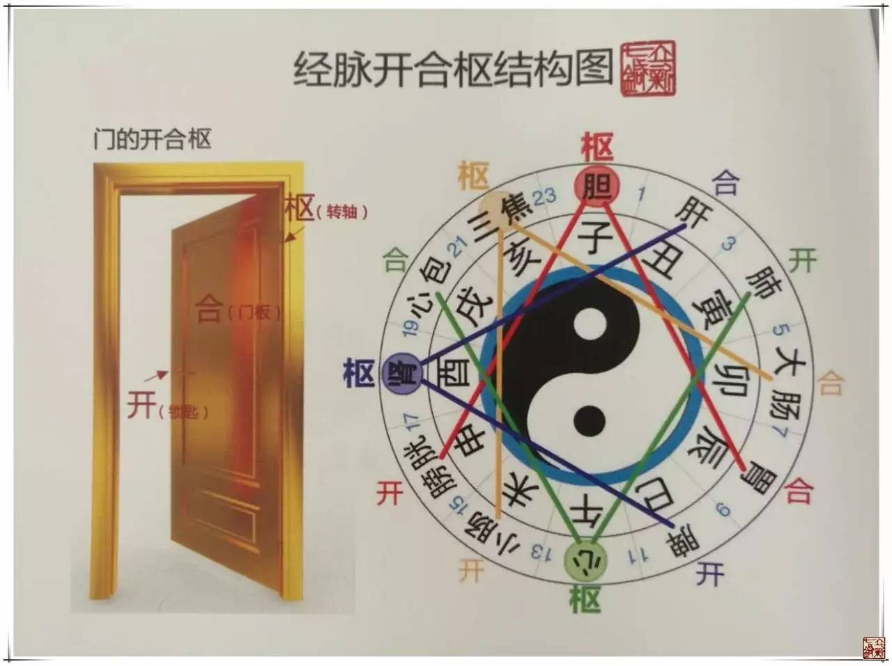
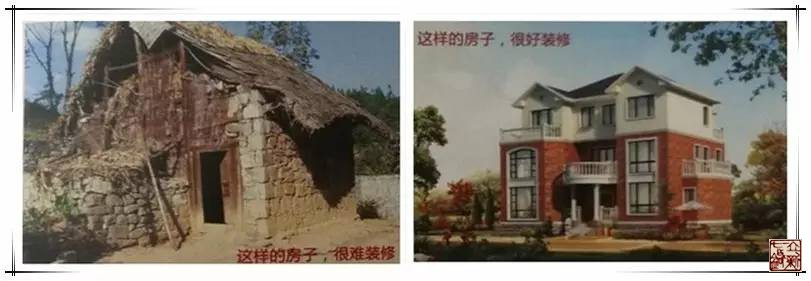

= 经脉——开合枢
冰台
2017-04-12

《灵枢·本脏》曰:“卫气者，所以温分肉，充皮肤，肥腠理，司开合者也。”《素问·针解
篇》曰:“虚实之要，九针最妙者，为其各有所宜也。补泻之时，以针为之者，与气开合相
合也。”九针治病的时候，补和泻都要与气的开合相合，可见开合很重要。开合就是关合启
闭的功能，就像一扇门，开就是开关，合就是门，枢就是门的转轴。门的功能是防盗贼御野
兽，避风雨挡寒冷，如果开关出了问题，门开不了关不上，会影响空气的进出。如果门板本
身出了问题，那就谈不上防御功能了，邪气将长驱直入。枢本意为转动之门轴，枢动则开合
自如，如果转轴出了问题，枢机不转，则开合不利，那么门就会摇晃不定，门的功能也减弱
了。人体的气机也是如同一扇门一样，有开有合，中间有枢轴。枢轴有个特点，能转动，它
是动的。门实际上本身并没动，只是轴在动，所以枢非常重要，我们日常生活所说枢纽、中
枢就是指关键的地方。

在人体里，诸如气血之流注，脑髓之盈虚，泪之下，涕之流，唾之聚，胃之泌，胆之汁，节
之液，肠之津，二便之行……均可聚可闭，可开可泻也。而管理这些开合功能的，就是卫气，
《素问·逆调论》曰:“营气虚则不仁，卫气虚则不用，营卫俱虚，则不仁且不用。”营气虚
会导致麻木产生，卫气虚会导致脏腑和肢体功能废用。如果营卫气都虚了，则人体就会麻痹
并且脏腑肢体功能丧失。不仁和不用，表面看只是麻木和废用，其实涵盖了非常多的症状在
内，调理卫气其实可以解决太多太多的疾病，这才是内经九针的迷人之处。

[quote,《灵枢·根结篇》]
____
太阳为开，阳明为合，少阳为枢。

开折则肉节渎而暴病起矣，故暴病者取之太阳，视有余不足。渎者皮肉宛膲而弱也。合折则
气无所止息而痿疾起矣，故痿疾者取之阳明，视有余不足。枢折即骨繇而不安于地，故骨繇
者取之少阳，视有余不足，骨繇者节缓而不收也，所谓骨繇者摇故也，当穷其本也。

太阴为开，厥阴为合，少阴为枢。

开折则仓廩无所输膈洞，膈洞者取之太阴（太阴主水谷），视有余不足，故开折者气不足而
生病也。合折即气绝而喜悲，悲者取之厥阴，视有余不足。枢折则脉有所结而不通，不通者
取之少阴，视有余不足，有结者皆取之不足。
____

在中国古代，“宅以门户为冠带”，门是主人富贵贫贱、盛衰荣枯的象征。一户人家的富裕
程度，从住宅的大门就可以看出来，越富，门就 越高大气派，越穷，门就越矮小寒酸。所
以内经用开合枢来比喻一个人的身体健康状态。

我们在临床的时候，可以根据患者的症状来反推是开合枢哪一方面出了问题，也可以根据开
合枢的问题预知该患者的病痛是否好治，比如开合枢各方面都有问题的患者，它的门就不可
能高大上，其人就像一座破败不堪的旧房子，门也破烂，墙壁也破烂，屋顶也破烂，这样的
房子，让你装修，是很难装修的。

