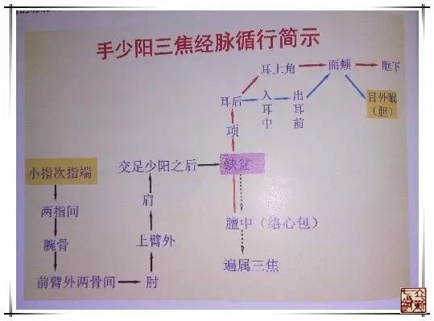
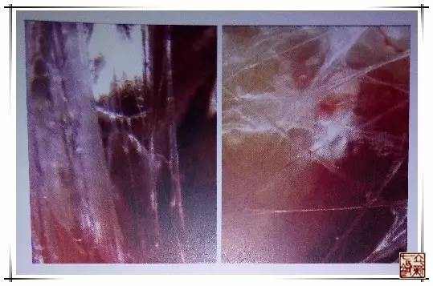

= 经脉——三焦
冰台
2017-05-17

《素问·举痛论》曰：“百病生于气也，怒则气上，喜则气缓，悲则气消，恐则气下，寒则
气收，炅则气泻，惊则气乱，劳则气耗，思则气结。”

中医理论离不开气，人体的机能运动，是气推动和激发的结果，人的感觉、思维、情志等精
神心理现象也是气活动的产物，人不断地从自然界中摄取“清气”，呼出“浊气”，从水谷
等饮食物中汲取“水谷精气”，以维持生命活动的需要。“邪气”泛指一切致病因素，“正
气”则代表着人的抗病能力。疾病发生、发展的过程，就是邪气与正气争斗的过程，而针灸
所能做的，就是调理气血。其实在内经医学理念里，气和血，都是气，《灵枢·营卫生会》
说：“黄帝曰：夫血之与气，异名同类，何谓也？岐伯答曰：营卫者，精气也，血者，神气
也，故血之与气，异名同类焉。”九针最擅长的就是调理经络之气和脏腑之气。

《灵枢·经脉篇》曰：“三焦主气所生病。”人体全身所有之气，包括了脏腑气、经络气、
呼吸气、营卫气等等。三焦主持诸气，是指三焦和各脏腑、经络、组织器官的生理活动都有
密切关系。三焦之所以能主气，主要是源于元气，但三焦并不是元气本身。元气根源于下焦，
发源于肾，由先天之精所化。但元气运行，只有借助于三焦之道路，方能布散、通达全身，
从而激发、推动各个脏腑组织器官的功能活动，因而三焦起到了主持诸气的作用。

现在医学界很多人将内经所说的三焦误认为实体器官在看待，这必然导致很多错误的医疗行
为发生。关于三焦，是有形还是无形，中医界历来都争议很大，有人根据《难经》所言“心
主与三焦为表里，俱有名而无形”，认为三焦“有名无形”，有人认为三焦是“胰腺”，有
人认为是“网油白膜”。

其实有形和无形两种观点都是对的，《素问·灵兰秘典论》曰：“三焦者，决渎之官，水道
出焉。”《素问·经脉别论》说：“饮入于胃，游溢精气，上输于脾，脾气散精，上归于肺，
通调水道，下输膀胱，水精四布，五经并行。”水道不能仅仅理解为身体上肉眼所见的那些
水液，如果是那样理解的话，内经理论就跟西医理论没有区别了。水液代谢虽由胃、脾、肺、
肾、肠、膀胱等脏腑共同协作而完成，但人体水液的升降出入，周身环流，则必须以三焦气
路作为通道才能实现，也就是靠气机来完成。三焦气路是在三焦实体分布的范围内，三焦的
“水道”就是气路，如果气路不通，则脾、肺、膀胱等脏腑调节水液的功能就会失常，导致
水液输布与排泄障碍，从而产生痰饮、水肿等病变。

《难经·六十六难》说：“三焦者，原气之别使也，主通行三气，经历五脏六腑。”明确指
出三焦是人体元气（原气）升降出入的道路，人体元气是通过三焦而到达五脏六腑和全身各
处的。《中藏经》说：“三焦者，人之三元之气也，号曰中清之府，总领五脏六腑、营卫、
经络、内外、左右、上下之气也。三焦通，则内外左右上下皆通也，其于周身灌体，和内调
外，营左养右，导上宣下，莫大于此也。”三焦通行元气于全身，是人体之气升降出入的通
道，也是气化的场所，故“三焦主气所生病”。如果元气虚弱，三焦通道运行不畅或衰退，
就会导致全身或某些部位的气虚现象。

如果从上医治国的角度来理解，我们可以把三焦理解成一个单位的办公室主任，他的职责就
是协调各部门之间的关系，并联络上下级之间的关系。如果没有这个角色，那么各部门各自
为政，上下级之间缺乏沟通，这个单位的事业工作都将很难发展。

三焦如此重要，我们先分析一下三焦，在《灵枢·营卫生会篇》里，前面一段讲的是营卫二
气的生成，以及昼行阳、夜行阴，阴阳相贯如环无端的运行状况，然后指出营卫二气是“卫
出上焦，营出中焦，皆出于胃之上口”的运行路线，并特别提到“血之与气，异名同类”，
继而讲明三焦具备疏通水道的功能“下焦者，别回肠，注于膀胱而渗入焉”，小肠的功能是
分清泌浊，三焦将小肠泌浊而来的无用浊液注于膀胱而排出体外，还是讲的三焦气的功能，
最后一句“上焦如雾，中焦如沤，下焦如渎，此之谓也。”其中的“如雾、如沤、如渎”讲
的都是三焦气的功能。

内经医学的五脏六腑，其实都是以功能在看待，与西医的器官解剖有本质上的区别。三焦其
实是讲的一种功能，因此三焦即属于有形，在运用九针调理的时候又被看做无形的气。

三焦是无形的，很多古代名医也是持这个观点，例如华佗在《中藏经》里说：“三焦者，人
之三元之气也……其有名而无形者也。”唐·孙思邈在《千金要方》中说：“夫三焦者，一
名三关也。上焦名三管反射，中焦名霍乱，下焦名走哺。合而为一，有名无形，主五脏六腑，
往还神道，周身贯体，可闻不可见。”元·滑寿在《难经本义》里说：“盖三焦则外有经而
内无形。”明·李梃在《医学入门》里说：“三焦，如雾、如沤、如渎，虽有名而无形；主
气、主食、主便，虽无形而有用。”这些名家都认为三焦是无形的。

无形的气，总归还要在有形的器官组织这个基础之上来发挥和运用，所以我们还应该了解三
焦的实体。

三焦的实体是什么呢？我比较倾向于清末著《中西医汇通医经精义》一书的四川人唐宗海的
观点，他认为西医长于“形迹”，中医长于“气化”，我们来看看他是怎么定义三焦的：
“三焦，古作膲，即人身上下内外相连之油膜也。唐宋人不知膲形，以为有名而无象，不知
《内经》明言焦理纵者，焦理横者，焦有纹理，岂得谓其无象？西洋医书，斥中国不知人有
连网，言人饮水入胃，即渗出走连网而下，以渗至膀胱，膀胱上口，即在连网中也。中国
《医林改错》一书，亦言水走网油而入膀胱，观剖牲畜，其网油中有水铃铛，正是水过其处，
而未入膀胱者也。此说近出力，斥旧说之谬，而不知唐宋后，古膲作焦，不知膜油，即是三
焦，是以致谬。然《内经》明言三焦者，决渎之官，水道出焉，与西洋医法，《医林改错》
正合，古之圣人，何尝不知连网膜膈也哉，按两肾中一条油膜，为命门，即是三焦之原，上
连肝气，及胸膈，而上入心，为包络，下连小肠大肠，前连膀胱，下焦夹室，即血室气海也，
循腔子为肉皮，透肉出外，为包裹周身之白膜，皆是三焦所司，白膜为腠理，三焦气行腠理，
故有寒热之证，命门相火布于三焦，火化而上行为气，火衰则元气虚，火逆则元气损，水化
而下行为溺，水溢则肿，结则淋，连肝胆之气，故多挟木火，与肾心包相通，故原委多在两
处，与膀胱一阴一阳，皆属肾之府也，其主病知矣。”

唐宗海认为：“三焦，即人身之膈膜，所以行水也。西医云，饮入于胃，胃之四面皆有微丝
血管，吸出所饮之水，散走膈膜，达于连网油膜中，而下入膀胱。西医所谓连网，即是膈膜，
及俗所谓网油，并周身之膜皆是也。网油连着膀胱，水因得从网油中渗入膀胱，即古所名
‘三焦者，决渎之官，水道出焉’是矣。”

按《灵枢·经脉》所介绍经脉的顺序，三焦介于手厥阴心包经和足少阳胆经之间。又按《灵
枢·本输》所讲:“三焦者，中渎之腑也，水道出焉，属膀胱，是孤之腑也，是六腑之所与合
者。”而“膀胱者，州郡之官，津液藏焉，气化则能出矣。”膀胱是储藏尿液的器官，尿液
需要气的推动，才能排出。跟三焦关系很密切的这三个脏器，手厥阴心包经主脉所生病，足
少阳胆经主骨所生病。足太阳膀胱经主筋所生病，由此可知，三焦所在应该是经脉、筋、骨
这几块之间的部位。综上所述，三焦实体我认为泛指人体腹腔中脏器之间的网膜（三焦气）
以及布满周身的筋膜、脂肪、分间（三焦经）等连缀组织。

三焦包括上、中、下三焦，关于三焦各自的功能描述，在《灵枢·营卫生会》有云:“上焦如
雾，中焦如沤，下焦如渎。”

雾：雾露弥漫，水蒸气。《灵枢·决气》曰：“上焦开发，宣五谷味，熏肤、充身、泽毛，
若雾露之溉，是谓气。”上焦如雾指上焦有宣发卫气，以雾露弥漫的状态营养于肌肤、毛发
及全身各脏腑组织的作用。故上焦的功能，实际体现为心肺的气化输布作用，关系到营卫气
血津液等营养物质的输布。故上焦功能的变异，也主要反映为心肺功能之异常，治则以调理
心肺为主。

沤：沤，是浸泡的意思，又指水中浮泡，其实是发酵的过程。《灵枢·决气》曰：“中焦受
气（通氣）取汁，变化而赤是谓血。”中焦的功能主要是指脾胃的生理功能，例如水谷的受
纳、消化，营养物质的吸收，体液的蒸化，化生精微为血液等。实际上中焦为气机升降之枢
纽，气血生化之源。所以，中焦的功能被形容为“如沤”。中焦功能的变异，主要反映为脾
胃功能的异常，治则以调理脾胃为主。

渎:《说文》渎，沟也。一中曰邑中沟。凡水所行之孔曰渎。《灵枢·营卫生会》曰：“下焦
者，别回肠，注于膀胱，而渗入焉，故水谷者，常并居于胃中，成糟粕，而俱下于大肠而成
下焦，渗而俱下，济泌别汁，循下焦而渗入膀胱焉。”所谓“如渎”，是形容下焦肾与膀胱
排泄水液作用，犹如疏通沟渠。使水浊不断外流的状态。即是肾与膀胱的生成和排泄小便的
作用。下焦主泌别清浊，排泄二便，这个过程实际上包括了肾、小肠、大肠、膀胱的功能。
故下焦功能的变异，主要反映为肾与膀胱功能的异常，治则以调理肾与膀胱为主。

三焦把全身器官的包膜（脑膜、胸膜、心膜、血管膜、肺膜、胃膜、肝膜、腹膜、肠膜、骨
膜、横膈膜、纵膈膜等）连为一个水道大系统（外水道、内水道），包括淋巴、血液系统。
通过肺的蒸腾、布散，肾、膀胱的气化，正常向身体运行水谷、气血。所以三焦是主管全身
水道畅通的官员（十二官都互相沟通、配合）。如果定位哪条水道不能正常通行，受阻或要
暗地里运行，就会造成水的泛滥，出现水滞或水肿。如：有人出行，不想与人沟通，怕泄露
消息，实际上是离开了正常水道，水就渗出血管，隐藏在皮下组织里形成水肿。三焦的功能
就失常了。

同时，气的运行受到阻碍，不能正常运动，跑到身体组织里，就形成了气肿。所以，三焦是
调控体内整个水液代谢，必须给予充分的重视。
