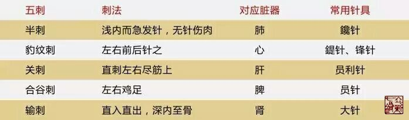

= 官针之妙
穆超
2016-4-26 00:00

**导读：**由此可见，我们临床当中所谓的“得气”不过就是充分调动和支配强大的卫气来
 达到去除疾患的目的！

凡刺之要，官针最妙。《灵枢•官针第七》开篇就讲刺法的关键就在于官针的应用。此处的
官针当有二层含义，一是指官方制定的标准，也就是九针，另一层含义则是指临床中九针的
实际运用和选择，也就是管理，负责的意思。每一种针都有对应的症状和疾患，如病痹气暴
发者，取以员利针，就像交警指挥交通，刑警负责治安一样，九针就像国之利器，分工明确
又相互合作，确保国之安定，人身之周全！

整本内经中处处体现古人天人合一的思想，并且法于阴阳和于术数，本篇也不例外！在《灵枢•官针第七》中初步展现了古人对于这一理念的推崇，因为有九针、十二经脉、天地人三才、五脏，便有了针法应用时的九刺、十二刺、三刺、五刺之分！ 

== 和于数术的刺法分类

== 法于阴阳的刺法分类

在《灵枢•寿夭刚柔第六》中有一段文字：“黄帝曰：余闻刺有三变，何谓三变？伯高答曰：
有刺营者，有刺卫者，有刺寒痹之留经者。黄帝曰：刺三变者奈何？伯高答曰：刺营者出血，
刺卫者出气，刺寒痹者内热。黄帝曰：营卫寒痹之为病奈何？……黄帝曰：刺寒痹内热奈何？
伯高答曰：刺布衣者，以火焠之；刺大人者，以药熨之。”

从这段文字我们知道，其实所有的刺法无外乎刺营刺卫之分，营行脉中，卫行脉外，两者互
为阴阳表里。

== 刺营出血法

前文所说刺寒痹内热针法只有九刺之淬刺，那么除了这五种刺法以外，其余的刺法都可以称
之为刺卫之法。由此可见，我们临床当中所谓的“得气”不过就是充分调动和支配强大的卫
气来达到去除疾患的目的！那么这些刺法的有效实施和我们正确的运用九针组合是分不开的，
正所谓“九针之宜，各有所为，长短大小，各有所施也，不得其用，病弗能移”，这正是官
针最大的妙处吧！
