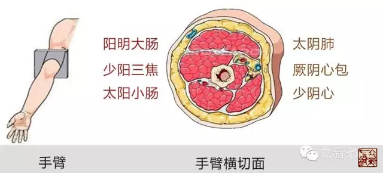

= 正经说
王非
2015-1-28 00:00

熟悉中医的朋友都知道经络的概念，经络可以说是中医最为伟大的发明。您可能会问怎么会
是发明的呢？应该是发现才对嘛！刘力红老师的《思考中医》里提到了经络是古代的中医通
过一定的功法修炼，进入到特定的状态下，“内视”看到自己身体上的经络走行并把它们记
录下来，是通过这种内证实验发现的哟。关于这个问题广东省中医院的胡延滨院长（《黄帝
密码》作者芃澜·腔调中医）提出了这样的疑问：《灵枢·经脉篇》里的经络走形的描述怎么
会如此工整？太过工整了!工整的有如人为安排一般。是这样吗？

下面我就为大家剖析一下古人是如何工整的安排十二经络的。

*即：阴经走形在人体属阴的部位；阳经走形在人体属阳的部位。*

阴阳是中医的根本概念，原本就是古人对自然的观察，最初认为“山的南面，河岸的北面”
这些阳光照射到的地方就为“阳”，反之照不到的地方就为“阴”，由此应用到人体分阴阳
就是：

* 上肢手背侧为阳；手掌侧为阴。（阳光照到的地方）
* 下肢外侧为阳；内侧为阴。（以裤线中缝为界，阳光照到的地方）
* 背部为阳；腹部为阴。（面朝黄土背朝天）

*即：距离上肢近的就走行在上肢，距离下肢近的就走行在下肢。*

我们都知道有的经络走行在手臂，有的经络走行在腿部，那么如何安排呢？中医的另一核心
理论是藏象，此处以五藏为主，使用的临近原则。

我们来看一下是不是这样：肺(上) ---心包（中）----心（下），这是胸腔的脏由上到下的
位置关系，他们都距离手比较近，所以都走行在上肢，叫做“手经”，脾（上）----肝
（中）----肾（下），这是腹腔的脏由上到下的位置关系，他们都距离足比较近，所以都走
行在下肢，都叫“足经”。

*即：互为表里的两经在四肢部分是相对应的*

中医的藏象是以五脏为核心的，六腑与之相配，互为表里，在经络循行的安排上也是这样。

*规则：阳刚刚升起时，阴最为盛大；当阳盛大时阴已经收藏了。*

* 太阴-----阳明；厥阴-----少阳；少阴-----太阳。
* 太阴：阴最大，太阳：阳最大。（太，大也《广雅·释诂一》。）
* 少阴：阴不多，少阳：阳不多。（少，不多也。《说文》。）    
* 阳明：太阳刚刚出来，天亮了指阳气初升。（明，照也。《说文》）  
* 厥阴：阴由多转少，象石块翻滚一样处于转换之中。（厥，发石也《说文》；短也《玉篇》。）

如果把我们的上肢横切一刀，看其横截面，整好就符合上图经络的规整的安排。黑的是手掌
一侧，白的是手背一侧，下肢同理。有兴趣的朋友可以自己试着画画看是不是如此。

好了我们总结一下，通过上述的四大规则，我们确实是看到了十二正经的分布是非常工整的，
而且与中医的阴阳理论、藏象理论都做到了无缝对接，难道这一切都是巧合吗？难道不是古
人的安排吗？给出你的答案，欢迎大家加入我们的讨论。

【跟我咬文嚼字学中医】

作业：根据上述的四大原则，翻译十二正经的名字。从此只要说出经络名字就应该知道其经络的大致走行。

例如：

* 手太阴肺经：走行在上肢掌侧最上边的阴最多的链接到肺的一条经。
* 手阳明大肠经：走行在上肢手背侧最上边的阳刚刚出来的与肺经对应的一条经。

