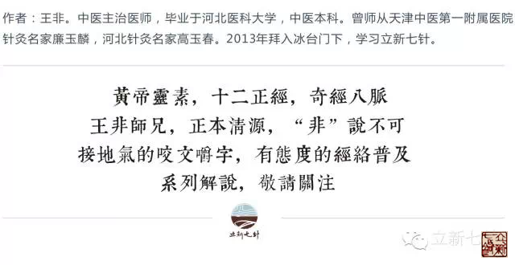
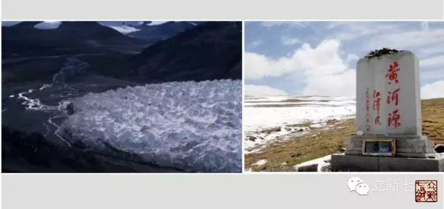
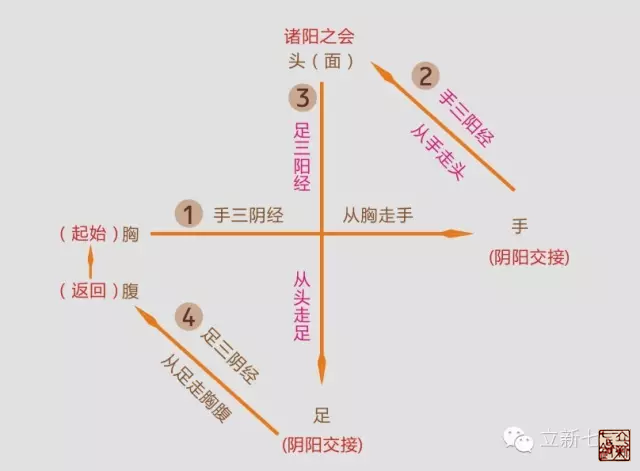
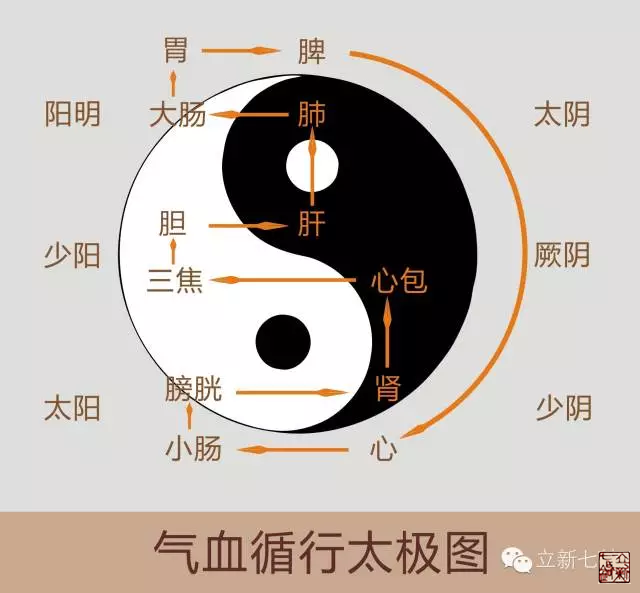
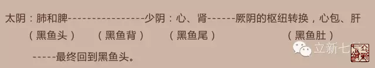
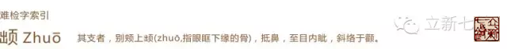

= 十二经是如此交接的
王非
2015-2-11 00:00

== 【经络的源头在哪里】

“经脉十二者，外合于十二经水，而内属于五脏六腑。”《灵枢·经水》古人把十二经脉比
作十二条河流，那么请问河流的源头在哪里？打开地图我们知道了长江的源头在青藏高原唐
古拉山，黄河的源头也是在青藏高原，不过是在东北部巴颜喀拉山。青藏高原我们都知道是
世界的屋脊，整个地球最高的地方，正好就是我们长江和黄河的源头。以此推论人体最高位
置就应该是所有经络的源头。事实是怎样的呢？

*人体最高脏腑就是——肺。十二经络的源头恰好就是-------肺经。*

古人的比喻是多么的精妙呀！

== 【十二正经中气血循环的规律】

我们知道的起始的经络是肺经了，那么人体的这十二条正经的气血又会按照怎样次序和方向
规律循环流转呢？

其宏观的规律、具体交接规则：

* *手足部：表里经相交接。*
+
例如：手太阴肺经——阳明大肠经（肺与大肠相表里）

* *头面部：同名经相交接。*    
+
例如：手阳明大肠经——足阳明胃经（同为阳明经）

* *胸腹部：藏藏相交，物极必反，厥阴为枢*
+
足太阴脾经——手少阴心经（脾对心；太阴对少阴，物极必反）
+
足少阴肾经——手厥阴心包经；足厥阴肝经——手太阴肺经
+
*（厥阴经为枢纽，使得气血从最下端的肾，返回到最上端的肺。就像是大海的水被太阳照
射后变成水蒸气，这时候风会把饱含水汽的云吹到高原，再落到雪山上，融化后再次成为河
流的源头。这个转运过程，这个“风”就是“厥阴”的枢纽作用。）*

. 我们看到太极这个大循环分上、中、下各有套着三个小循环：
* 上圆：肺----大肠----胃-----脾（胸---手----头----足---腹）
* 下圆：心----小肠----膀胱---肾（胸---手----头----足---腹）
* 中圆：心包---三焦----胆----肝（胸---手----头----足---腹）

. 五脏的循行顺序是：先从阴鱼鱼头开始，然后顺着阴鱼的脊背下来，在从阴鱼的鱼腹上去
返回。
+

了解了这些规律之后，我们看看气血如此循行会对人体产生哪些影响？

== 【头面为诸阳之会】

“诸阳之会，皆在于面。”《灵枢·邪气脏腑病形第四》。人体的阳经包括手足的三阳经和
督脉，都聚合在头面部。

=== 生理影响

人的头面部最为耐寒，比如在北方寒冷的冬天我们都要身着很厚的衣物以抵御寒冷，可是头
面部裸露于外一般我们都能承受。

再比如，当我们大量运动或进食热的食物的时候，身体会产生很多热量，此时头面部也是身
体温度最高的部位，同时也是最容易出汗的部位。

=== 病理影响

生活中如果我们把蜡烛点燃，再翻转使火苗一端向下，我们会看到火苗会跟着翻转依旧向上
燃烧。这小实验形象的说明中医五行中“火性炎上”特性。如果把人体比作燃烧的蜡烛的话，
我们的头面部就是那个“火苗”的部位。所以平日里老百姓经常说的“上火了”的症状也大
都表现在头面部。

最常见的有嗓子痛、面部长青春痘、眼睛红肿热痛、流鼻血、中耳炎等等，都是“火性炎
上”的表现。

=== 治疗策略

. 给火邪以出路：此法见效最快且便捷，可以在头面部的经络起止处或阳气聚集处（大椎、太阳等）刺络放血。

. 以水灭火：激发肾水上行灭火或直接用寒凉药物灭火。

=== 头面部的经络具体交接部位及相关穴位

* 大肠经交胃经：左右交叉，迎香交承泣，在鼻骨两侧部位交接。
+
原文：手阳明：其支者，从缺盆上颈贯颊，入下齿中，还出挟口，交人中，左之右，右之左，
上挟鼻孔。足阳明：起于鼻之交頞（è，鼻梁，鼻茎也《说文》）中，旁纳太阳之脉。

* 小肠经交膀胱经：目内眦（颧髎、睛明）内眼角部位交接。
+
原文：手太阳：其支者，从缺盆循颈上颊，至目锐眦，却入耳中；其支者，别颊上䪼
（“䪼”音zhuō，指眼眶下缘的骨），抵鼻，至目内眦，斜络于颧。足太阳：起于目内眦，
上额交巅。

* 三焦经交胆经：目锐眦（丝竹空、瞳子髎）外眼角部位交接。
+
原文：手少阳：其支者，从耳后入耳中，出走耳前，过客主人前，交颊，至目锐眦。足少阳：
起于目锐眦。

== 【阴阳交接之处-----手、足】

=== 生理影响

“阴平阳秘，精神乃治；阴阳离决，精气乃绝。”《素问·生气通天论》从中我们看到阴阳
的平衡及转换对人体是非常重要的，那么阴经阳经的交接转换之所就非常重要，它就在我们
的手和脚。

=== 病理影响

“凝于足者为厥。”——《素问·六节藏象论》。“凡厥者，阴阳气不相顺接，便为厥。厥者，
手足逆冷是也。”《伤寒论337条》。由于手足是阴阳经的交接之所，当阴阳气不相顺接时
就会出现手足逆冷的表现。比如高热的患者、昏厥的患者、休克的患者都会出现这一类的症
状表现。

=== 治疗策略

十二经井穴接经刺血。

按照十二正经气血流行的顺序，依次在其井穴刺血，就可使周身的阴阳气相顺接，相调和。
此法有退高热、开窍醒神、稳血压对抗休克等各种急救作用。

=== 手、足部具体交接情况

* 肺交大肠：手太阴，其支者，从腕后直出次指内廉，出其端。

* 胃交脾：足阳明，其支者，别跗上，入大指间，出其端。

* 心交小肠：手少阴，循小指之内出其端。

* 膀胱交肾：足太阳，者其支者，从髆内左右，别下，贯胛，挟脊内，过髀枢，循髀外，从
后廉，下合腘中，以下贯腨内，出外踝之后，循京骨，至小趾外侧。
+
足少阴：起于小指之下。

* 心包交三焦：手厥阴，其支者，别掌中，循小指次指出其端。

* 胆交肝：足少阳，其支者，别跗上，入大指之间，循大指歧骨内出其端，还贯爪甲，出三
毛。
+
足厥阴：起于大指丛毛之际。

